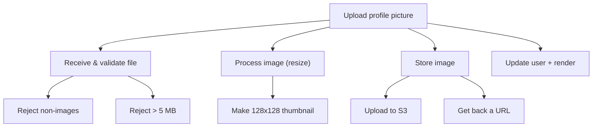

> **What?** Decomposition is breaking one big problem you can't hold in your head into smaller sub-problems you *can* — until each piece is small enough to solve, test, and name on its own.
> **How?** You ask "what are the parts?" before "how do I code it?", give each part a name, solve the parts one at a time, then reassemble them into the whole.

---

## 1. The problem with big problems

A junior is told: "Build a feature that lets users upload a profile picture." That's one sentence, but it is not one problem. Hidden inside it:

- Accept a file from the browser.
- Check it's actually an image and not too large.
- Resize it to a thumbnail.
- Store it somewhere (disk? S3?).
- Save the URL on the user record.
- Show the new picture on the profile page.

You cannot write "build profile picture upload" as a single function, because your brain can't hold all six concerns at once *and* the logic of each. The trick that makes you productive is not typing faster — it's **cutting the problem into pieces that each fit in your head**, solving them one at a time.

This is the first pillar of *computational thinking*: before you can pattern-match, abstract, or pick an algorithm, you have to **decompose**.

> The whole computational-thinking toolkit builds on this. See the section overview at [`../`](../) and the sibling skills it unlocks: [pattern recognition](../02-pattern-recognition/), [abstraction](../03-abstraction-and-generalization/), [algorithmic thinking](../04-algorithmic-thinking/).

---

## 2. "Until it fits in your head"

The stopping rule for decomposition is simple and physical: **keep cutting until each piece is small enough that you can fully understand it on its own** — write it, test it, and explain it in one sentence — without thinking about the others.



Each leaf in that tree is a thing you could write and test by itself. `rejectIfTooLarge(file)` is a five-line function with an obvious test. That's the goal: a tree of small, nameable pieces.

A good signal you've decomposed well: **you can name each piece with a clear verb phrase.** `validateImage`, `makeThumbnail`, `uploadToS3`, `saveAvatarURL`. If you can't name a piece, you don't yet understand what it does — cut differently.

---

## 3. Decomposition maps to functions

At the junior level, the most important thing decomposition gives you is **functions**. One sub-problem → one function. A function is the smallest unit where decomposition becomes real code.

```python
def set_profile_picture(user, uploaded_file):
    validate_image(uploaded_file)          # piece 1
    thumb = make_thumbnail(uploaded_file)  # piece 2
    url = upload_to_s3(thumb)              # piece 3
    save_avatar_url(user, url)            # piece 4
```

Notice the top-level function reads like the list of sub-problems. That's not a coincidence — that's what good decomposition looks like in code. The "how" of each piece is hidden inside its own function. When you read `set_profile_picture`, you understand the *shape* of the solution without drowning in detail.

Compare the un-decomposed version:

```python
def set_profile_picture(user, uploaded_file):
    if not uploaded_file.content_type.startswith("image/"):
        raise ValueError("not an image")
    if uploaded_file.size > 5_000_000:
        raise ValueError("too big")
    img = Image.open(uploaded_file)
    img.thumbnail((128, 128))
    buf = io.BytesIO()
    img.save(buf, format="PNG")
    buf.seek(0)
    key = f"avatars/{user.id}.png"
    s3.upload_fileobj(buf, BUCKET, key)
    url = f"https://cdn.example.com/{key}"
    user.avatar_url = url
    user.save()
```

Both work. But the second one is a wall of 14 lines where validation, image processing, storage, and persistence are tangled together. You can't test "is the resize correct?" without also dragging in S3. **The decomposition isn't cosmetic — it's what lets you test and change one concern without touching the others.**

---

## 4. Two ways to cut: by *task* and by *data*

There are two natural questions you can ask when deciding *where* to cut.

### 4.1 Functional decomposition — split by what it *does*

This is the one you'll use most. You break the problem along the **verbs** — the steps or actions. Our upload example is functional decomposition: validate → resize → store → save. Each piece is a *thing the system does*.

### 4.2 Data decomposition — split by the *data*

Sometimes the natural split is by the **data**, not the action. If you need to process a 10-million-row CSV, the steps are all the same — the split is "rows 0–1M go here, rows 1M–2M go there." Same operation, different chunks of data.

| | Functional | Data |
|---|---|---|
| Split along | What the system does (verbs) | What data it operates on (nouns) |
| Example | validate, resize, store | shard 1, shard 2, shard 3 |
| You'll meet it in | Most app code | Batch jobs, parallelism |

For now, default to functional decomposition — split by the steps. Just know data decomposition exists; you'll lean on it more later.

---

## 5. Top-down: start from the whole

There are two directions you can decompose from, and as a junior **top-down** is your friend.

- **Top-down**: Start with the big problem. Write the high-level function as if the helpers already exist. Then go fill in each helper. (We did exactly this above — `set_profile_picture` was written first, calling functions that didn't exist yet.)
- **Bottom-up**: Start by building small, useful pieces, then combine them into bigger things.

Top-down is great when you know the shape of the whole. You write the "table of contents" first, then fill in chapters. A practical version of this: **write the function body as a list of comments describing the steps, then turn each comment into a function call.**

```python
def checkout(cart, user):
    # 1. make sure everything is still in stock
    # 2. calculate the total with tax and shipping
    # 3. charge the card
    # 4. create the order record
    # 5. send a confirmation email
```

Each comment is a sub-problem. Now you have five small, named things to build instead of one terrifying `checkout`.

---

## 6. The reassembly matters too

Cutting is only half the job. The pieces have to **fit back together** — this is *recomposition*. If your pieces don't reassemble cleanly, you decomposed badly.

The most common junior mistake: pieces that need to know too much about each other. If `make_thumbnail` needs to know which S3 bucket you're using, you cut in the wrong place — image processing has nothing to do with storage. A clean cut means each piece has a **small, simple connection** to the others (you'll learn the words for this — *coupling* and *cohesion* — at the next level).

A quick test: **describe what one piece needs from another in one short sentence.** "`make_thumbnail` takes a file and gives back a smaller file." Short and clean. If the sentence gets long and full of "and also" — "it takes a file, and the bucket name, and the user ID, and whether we're in test mode" — the cut is wrong.

---

## 7. Decomposition is also how you debug

Here's a payoff you'll feel immediately. When something breaks across those four steps and you don't know *where*, you don't read all the code top to bottom. You **cut the problem in half**:

> "The avatar isn't showing. Is the bad data already in the database, or is it the rendering?"

Check the database. If the URL is wrong there, the bug is *upstream* — in validate/resize/store. If the URL is right, the bug is *downstream* — in rendering. One check eliminated half the code. Then you halve again. This is **binary search on the problem space**, and it's only possible *because* you decomposed the system into stages you can inspect between. A tangled 50-line function gives you nowhere to look.

---

## 8. Checklist for junior-level decomposition

- [ ] Can I list the parts as a set of verb phrases before I write any code?
- [ ] Does each part fit in my head — can I explain it in one sentence?
- [ ] Does each part become a clearly named function?
- [ ] Can each function be tested on its own?
- [ ] Is the connection between two parts describable in one short sentence?
- [ ] Does my top-level function read like the list of steps?

---

## 9. What's next

You now know *that* you should decompose and the basic mechanics (problem → parts → functions). The next levels sharpen the question that really matters: **where exactly do you cut, and how do you know a cut is good?**

- [middle.md](middle.md) — coupling, cohesion, and modules.
- [senior.md](senior.md) — cutting along natural seams, information hiding, services.
- [Problem-solving](../../02-problem-solving/) — decomposition is step one of a larger method.
- [Modeling a problem in code](../05-modeling-a-problem-in-code/) — turning the pieces into types and code.
