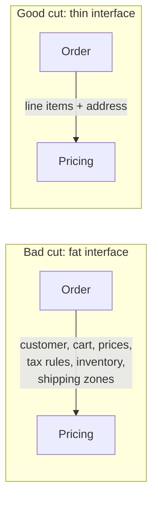

> **What?** Decomposition is choosing *where to cut* a problem so that each piece is internally focused (high cohesion) and barely connected to its neighbors (low coupling) — measured by the size and number of interfaces between the pieces.
> **How?** You evaluate a proposed split by the *seam* it creates: a good split minimizes what the pieces must know about each other, groups things that change together, and reassembles without friction. You learn to recognize over- and under-decomposition.

---

## 1. The question shifts from "what" to "where"

As a junior you learned *that* you should break a problem into named functions. At this level the interesting question is no longer "what are the parts?" — it's "**where do I draw the lines?**" Because the same problem can be cut in many ways, and the cuts are not equally good.

The quality of a decomposition is not "did I split it" but "**did I split it along the right boundaries**." And we have precise vocabulary for what "right" means: **coupling** and **cohesion**.

---

## 2. Coupling and cohesion: the quality test

These two terms come from Larry Constantine and Ed Yourdon's *Structured Design* (1970s), and they remain the sharpest test of a decomposition.

- **Cohesion** — how related the things *inside* one piece are. High cohesion: everything in the module is about one job. Low cohesion: a `Utils` class with `parseDate`, `sendEmail`, and `calculateTax` — three unrelated jobs sharing a box.
- **Coupling** — how much one piece depends on another. Low (loose) coupling: pieces talk through a small, stable interface. High (tight) coupling: piece A reaches into piece B's internals, knows its private fields, breaks when B changes.

> **The rule of thumb: maximize cohesion *within* pieces, minimize coupling *between* pieces.** A good decomposition is one where the pieces are individually focused and mutually independent.

### 2.1 Why the *interface size* is the real metric

Here's the mechanical version of the rule. Look at the **interface between two pieces** — the data and calls that cross the boundary. A good cut makes that interface **small**.



When the interface is fat (Pricing needs to know about inventory and shipping zones), the two pieces are entangled — changing one forces changes in the other. When it's thin (Pricing just takes line items and an address, returns a total), they're independent. **The width of the interface is the measurable proxy for how good your cut is.** Count what crosses the boundary; fewer is better.

---

## 3. Cohesion in practice: things that change together belong together

A practical heuristic for *where* to cut: **group the things that change for the same reason, separate the things that change for different reasons.** (This is the kernel of the Single Responsibility Principle, but you don't need the acronym to use it.)

Consider a report generator. One tempting decomposition:

- `DataModule` — fetches numbers from the DB
- `FormatModule` — turns numbers into a PDF

Now ask: *what changes independently?* The data source changes (new DB, new query) for reasons that have nothing to do with the PDF layout changing (new logo, new column). They change for different reasons → they belong in different pieces. Good cut.

Counter-example — splitting `Order` into `OrderPart1` and `OrderPart2` by *line count* rather than by responsibility. Both halves change whenever the order logic changes. They change for the same reason but live apart → you've created coupling for nothing. Bad cut.

| Cut along… | Cohesion | Coupling | Verdict |
|---|---|---|---|
| Responsibility (data vs format) | High | Low | Good |
| Arbitrary line count | Low | High | Bad |
| Layer (UI / logic / storage) | Usually high | Low if interfaces are clean | Often good |
| "Manager"/"Utils" grab-bag | Low | High | Bad |

---

## 4. Modules: decomposition above the function

At this level, decomposition isn't just functions anymore — it's **modules** (files, packages, classes). A module is a piece of the decomposition that:

1. Has a clear single responsibility (cohesion).
2. Exposes a small public interface and hides everything else (low coupling).

The thumbnail example from junior level, grown up:

```
avatar/
  validation.py   # validate_image  — knows nothing about S3 or DB
  imaging.py      # make_thumbnail   — knows nothing about S3 or DB
  storage.py      # upload, get_url  — knows nothing about images or DB
  service.py      # orchestrates the four; the only public entry point
```

Each module is independently understandable and testable. `imaging.py` doesn't import `storage.py`. The orchestration lives in one place (`service.py`). That's a clean decomposition: **the dependencies point one direction, and the leaves don't know about each other.**

---

## 5. Top-down vs bottom-up — and why you need both

You met these at junior level. Now use them deliberately:

- **Top-down** shines when you understand the whole and need to impose structure. You decompose the goal into sub-goals. Risk: you invent pieces that are clean on paper but don't match reality, and you can't validate them until everything's built.
- **Bottom-up** shines when the primitives are uncertain or reusable. You build solid small pieces (a retry helper, a date parser, a rate limiter), prove they work, then compose upward. Risk: you build pieces nobody needed, or they don't compose into the actual goal.

Real work is **both, meeting in the middle**. You sketch the top-down structure (the table of contents), and you build bottom-up the primitives you already trust. They meet when the high-level orchestration calls the low-level helpers. The skill is knowing which direction to lead with: top-down when the *shape* is clear, bottom-up when the *parts* are clear.

---

## 6. Over- and under-decomposition

More pieces is **not** better. Decomposition has a sweet spot.

### 6.1 Under-decomposition

A 400-line function, a "God class" that does everything, a service that owns half the system. Symptoms: you can't test one behavior without the whole machine; every change touches the same file; merge conflicts everywhere. The cure is obvious: cut.

### 6.2 Over-decomposition — the subtler, more expensive mistake

Splitting a 10-line function into five 2-line functions, each called exactly once. A `OneFieldDTO`. A `ThingFactoryProviderStrategy` where a function would do. Symptoms:

- You have to open eight files to understand one flow ("where's the *actual* logic?").
- The interfaces between the tiny pieces add up to more complexity than the logic itself.
- **Integration becomes the hard part** — you spend more effort wiring pieces together than solving the problem.

There's a real cost here, and it's the recomposition cost. Each cut you make adds an interface to maintain. **Past a point, the integration tax exceeds the benefit of smaller pieces.** A good engineer feels this and stops cutting.

> Litmus test: if a piece is only ever used by one caller, and naming it doesn't make the caller clearer, you probably over-decomposed. Inline it.

```
Under-decomposed         Just right            Over-decomposed
[████████████]      [███][███][███]      [█][█][█][█][█][█][█][█]
one giant blob      few focused pieces    integration hell
hard to change      easy to change        hard to even follow
```

---

## 7. Recursion and divide-and-conquer: decomposition as algorithm

Decomposition isn't only an architecture activity — it's an *algorithmic* one. **Divide-and-conquer** is decomposition applied to a single computation: split the input, solve each half, combine the results.

```python
def merge_sort(xs):
    if len(xs) <= 1:
        return xs
    mid = len(xs) // 2
    left = merge_sort(xs[:mid])   # decompose: solve half
    right = merge_sort(xs[mid:])  # decompose: solve other half
    return merge(left, right)     # recompose
```

This is *data decomposition* (split the array) plus *recomposition* (`merge`). The same three-step shape — divide, conquer, combine — appears in quicksort, binary search, FFT, and MapReduce. When you see a problem on a big input and think "could I solve this on half the input and stitch the answers together?", you're reaching for decomposition as an algorithmic tool. More on this in [algorithmic thinking](../04-algorithmic-thinking/).

---

## 8. Decomposition for debugging and estimation

Two everyday uses of decomposition that pay off immediately:

### 8.1 Debugging by bisection

A bug lives *somewhere* in a flow of N stages or M commits. Don't read all of it. **Halve the space.** Put a check at the midpoint: is the data correct here? Yes → bug is downstream. No → bug is upstream. Each check halves the search. With version history, `git bisect` automates exactly this over commits — it binary-searches the commit that introduced a regression in `log₂(N)` steps instead of N. This only works because the problem decomposes into independent stages/commits.

### 8.2 Estimating by breakdown

"How long will this feature take?" is unanswerable as one lump. Decompose it into tasks — validate, resize, store, render, write tests — estimate each (those *do* fit in your head), then sum. This is a **work breakdown structure**, and it's far more accurate than guessing the whole, because estimation error on small pieces tends to cancel out rather than compound. The same move underlies Fermi estimation: decompose an impossible quantity into knowable factors, multiply.

---

## 9. Mid-level checklist

- [ ] For each piece: is everything inside it about *one* job? (cohesion)
- [ ] For each boundary: how many things cross it? Can I make that smaller? (coupling)
- [ ] Do the things that change together live together?
- [ ] Did I split by responsibility, not by line count or convenience?
- [ ] Am I over-decomposing — pieces used once that don't earn their name?
- [ ] Do the pieces reassemble cleanly, or is integration the hard part?

---

## 10. What's next

You can now judge a decomposition by coupling and cohesion. The senior level digs into the deepest version of the question: **what is a "natural seam," why does information hiding (Parnas) beat structural splitting, and how do you cut a *system* into modules and services along domain boundaries?**

→ [senior.md](senior.md) · [Pattern recognition](../02-pattern-recognition/) · [First-principles thinking](../../05-first-principles-thinking/)
