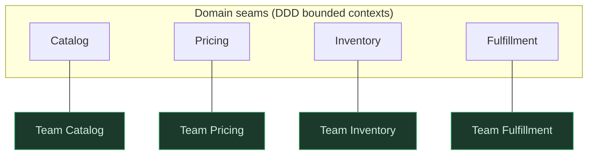

> **What?** At staff/principal scale, decomposition is the act of cutting a *system into services and an organization into teams*, and a *multi-quarter initiative into independently shippable increments* — done in full knowledge that the technical decomposition and the social decomposition (Conway's law) are the same decomposition viewed twice.
> **How?** You choose service and team boundaries so each owns a cohesive domain with a thin, stable contract; you align the org chart to the architecture you want; and you decompose roadmaps so every increment ships value and de-risks the next, never a big-bang integration at the end.

---

## 1. The decomposition *is* the org chart

Melvin Conway, 1968: *"Organizations which design systems are constrained to produce designs which are copies of the communication structures of these organizations."* This isn't a slogan; it's a forcing function. Two teams that don't talk will build two components with a clumsy interface between them, because the interface is negotiated through whatever thin channel the org provides. Two functions inside one team's head produce a clean, tightly-integrated module because the communication bandwidth is high.

The principal-level consequence: **when you decompose a system into services, you are also deciding the team structure — and vice versa.** You cannot pick one independently. If you draw a beautiful service boundary that requires two teams to coordinate on every change, Conway's law will quietly erode it: the teams will route around the boundary, share databases, add back-channels, until the architecture matches their *actual* communication structure, not your diagram.

So the real questions are coupled:

- *Architecturally:* where are the seams (Parnas, domain boundaries — see [senior.md](senior.md))?
- *Organizationally:* can a single team own each piece end-to-end with minimal cross-team coordination?

A good high-level decomposition makes both answers "yes" simultaneously. The seam is a place where both the *code* and the *teams* can be independent.

### 1.1 The Inverse Conway Maneuver

Because the org shapes the architecture, you can run it backward: **shape the org to get the architecture you want.** If you want three loosely-coupled services, create three teams with clear, separate ownership and a contract between them — and the services will follow. Team Topologies (Skelton & Pais) formalizes this: design "stream-aligned teams" around bounded contexts, keep their cognitive load bounded, and minimize the coordination interfaces between them. **The team boundary and the service boundary are the same decomposition.** Drawing one is drawing the other.



---

## 2. Sizing the pieces: cognitive load and ownership

At this scale, the stopping rule "until it fits in your head" becomes "**until it fits in one team's head.**" A service is right-sized when one team can hold its full mental model — domain, code, data, ops, on-call — without drowning. Too big: the team is overloaded, the service becomes a mini-monolith with internal silos. Too small: you've over-decomposed into nanoservices, and the team's day is consumed by integration glue between fragments they own — the recomposition tax (senior level) paid in standups and incident bridges.

Practical sizing signals for a service boundary:

| Signal | Wants to be *together* | Wants to be *split* |
|---|---|---|
| Change cadence | Always deploy together | Deploy independently, often |
| Data consistency | Share an invariant / transaction | Tolerate eventual consistency |
| Scaling profile | Same load shape | Wildly different (e.g. search vs billing) |
| Failure domain | Acceptable to fail together | Must isolate blast radius |
| Team ownership | One team can own both | Different teams, different expertise |
| Compliance | Same data classification | One side is PCI/PII, other isn't |

If *most* signals say "together," keep it one service even if it's large — a well-factored modular monolith beats a premature distributed system every time. **Split a service only when several of these axes genuinely diverge** *and* the seam carries no cross-service invariant. Otherwise you've manufactured distributed-systems complexity (network failure, partial deploys, distributed transactions) to solve an organizational problem that a module boundary would have solved for free.

> Principal heuristic: *modularize early, distribute late.* Get the boundaries right in-process where they're cheap to move, and promote a module to a service only when an axis above forces it. The boundary is the asset; the network is a cost you pay reluctantly.

---

## 3. The recomposition cost dominates at this scale

At the function level a bad cut costs minutes. At the service/team level a bad cut costs **quarters and reorgs**. The integration cost (senior level §5) is now the dominant term in the whole equation, because recomposing services means:

- **Network contracts** that must be versioned, backward-compatible, and observable.
- **Data ownership** disputes — who is the source of truth, who can write.
- **Distributed failure modes** — the cut created a place where the system can be half-up.
- **Cross-team coordination** — every change that crosses the seam needs two teams' calendars.

This is why the most expensive architectural mistakes are *premature or mis-placed high-level decompositions*: a service split through the middle of an invariant, forcing sagas and two-phase nightmares; or a team split that doesn't match the domain, forcing constant cross-team coupling. **You measure the quality of a high-level decomposition by how rarely teams have to coordinate to ship.** If two teams must sync on most features, the boundary between them is in the wrong place — full stop.

---

## 4. Decomposing initiatives, not just systems

The second half of principal-level decomposition is **temporal**: breaking a multi-quarter initiative into increments. A "replatform billing" or "migrate to event-driven" effort is exactly the same intimidating-big-problem from the junior page, scaled to twelve months and forty people. The skill is identical: cut it into pieces that fit, that reassemble, and that don't couple.

But the goal of a *roadmap* decomposition is different from a code decomposition. The criterion is:

> **Each increment must (a) ship value or learning on its own, and (b) reduce the risk of the next increment.** Never decompose an initiative such that integration happens only at the end.

### 4.1 The big-bang anti-pattern

The naive WBS decomposes by *component*: "Q1 build the new data model, Q2 build the new service, Q3 build the UI, Q4 integrate and launch." Every piece is technically a sub-problem — but nothing works until Q4, when all the recomposition risk lands at once, with no schedule left to absorb it. This is over-decomposition along the wrong axis (horizontal layers) and it is how big initiatives die.

### 4.2 Vertical slices

Decompose **vertically** instead — by thin end-to-end slices of user-visible value, each cutting through every layer:

```
Bad (horizontal layers):     Good (vertical slices):
[====== data model ======]   [slice 1: one product type, end to end]
[======= service ========]   [slice 2: add a second, prove the model]
[========= UI ===========]   [slice 3: migrate live traffic for it]
[==== integrate (Q4) ====]   [slice 4: the long tail]
        risk → Q4                 risk amortized each slice
```

Each vertical slice integrates immediately, so the recomposition cost is paid continuously in small amounts instead of catastrophically at the end. The strangler-fig migration pattern is this principle applied to legacy replacement: route one slice of traffic at a time to the new system, keep the old one serving the rest, until nothing's left. You never have a big-bang cutover because **you decomposed the migration into independently shippable, independently reversible increments.**

### 4.3 Decompose to estimate, decompose to de-risk

The same breakdown serves three jobs at once. (1) **Estimation** — a quarter-long lump is unestimable; ten slices each *do* fit in a lead's head, and the errors partly cancel (work-breakdown / Fermi logic from middle level, now at portfolio scale). (2) **De-risking** — order the slices so the scariest unknown is proven first; if it's going to fail, fail it in week three, not month nine. (3) **Optionality** — independently shippable slices mean you can stop after slice 6 if priorities change and still keep the value of 1–6. A big-bang plan has zero salvage value if cancelled.

---

## 5. Worked example: decomposing "move checkout to a dedicated service + team"

A principal is asked to extract checkout from the monolith into its own service and stand up a team to own it.

**Find the seam (architecture).** Checkout's secret (Parnas): orchestrating cart → pricing → payment → order, under a strict invariant ("never charge without creating an order; never create an order without reserving inventory"). Trace the invariant: it straddles *payment* and *inventory*. That's the danger — if the service boundary cuts between them, you've bought a distributed transaction. So the boundary must keep the charge-and-order invariant *inside* checkout, talking to inventory and payments through idempotent, compensable operations (reserve/confirm/release) rather than a shared transaction. The seam is now invariant-safe.

**Find the team (Conway).** One stream-aligned team owns checkout end-to-end: domain, service, data, on-call. Its coordination interface to Pricing and Inventory teams is the published contract (reserve/confirm/release, price quote). If shipping a checkout change routinely requires Pricing or Inventory engineers, the boundary is wrong — revisit it. The Inverse Conway move: by creating this team with exactly this ownership, you *cause* the service to stay decoupled.

**Decompose the migration (temporal).** Not "build new checkout (Q1–Q3), switch over (Q4)." Instead vertical slices: (1) extract read-only order history behind the new service, no risk; (2) route 1% of one low-value checkout flow through it, prove the payment-and-order invariant under real traffic; (3) ramp that flow to 100%; (4) migrate flows by value, scariest payment path last; (5) delete the monolith's checkout. Each slice ships, each is reversible, recomposition risk is amortized, and you can pause after any slice with value banked.

---

## 6. Principal checklist

- [ ] Does every service boundary coincide with a team that can own it end-to-end? (Conway)
- [ ] Could I shape the org to *produce* the architecture I want? (Inverse Conway)
- [ ] Does each piece fit in one team's head — neither overloaded nor a fragment? (cognitive load)
- [ ] Do several change/scale/consistency/ownership axes actually diverge, or am I distributing for distribution's sake?
- [ ] Does any invariant straddle a service seam? (If yes, the seam is wrong — move it before you pay in sagas.)
- [ ] How often must two teams coordinate to ship? (Often = boundary in the wrong place.)
- [ ] Is the initiative decomposed into vertical, independently shippable slices — not horizontal layers integrating at the end?
- [ ] Is the riskiest unknown proven by an *early* slice?
- [ ] Does the plan retain value if cancelled after any slice?

---

## 7. Connections

Decomposition at this level reaches into the rest of the thinking toolkit: it presumes [systems thinking](../../03-systems-thinking/) (you're cutting a system whose parts interact), [first-principles thinking](../../05-first-principles-thinking/) (to find real seams, not inherited ones), and [abstraction](../03-abstraction-and-generalization/) (each module's interface *is* an abstraction). It is the opening move of [problem-solving](../../02-problem-solving/) at every scale.

→ Back to [junior](junior.md) · [middle](middle.md) · [senior](senior.md) · [interview](interview.md) · [tasks](tasks.md) · [section index](../) · [roadmap home](../../README.md)
