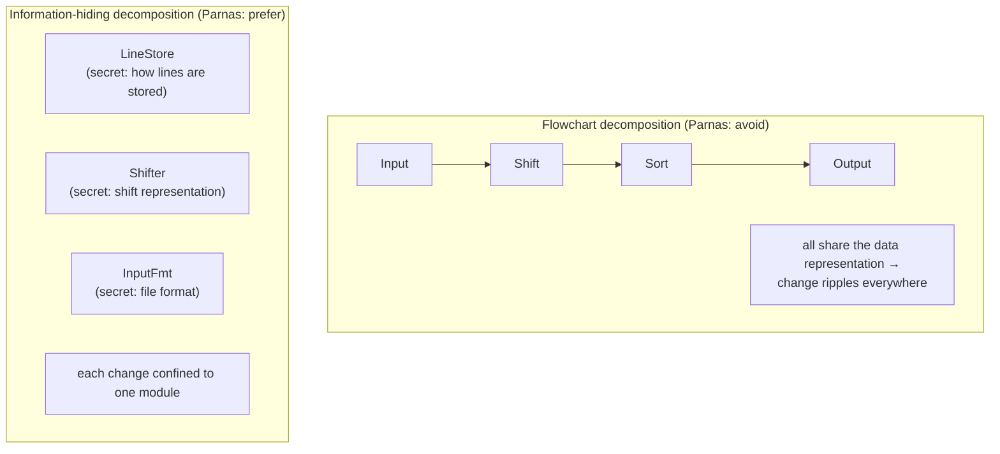
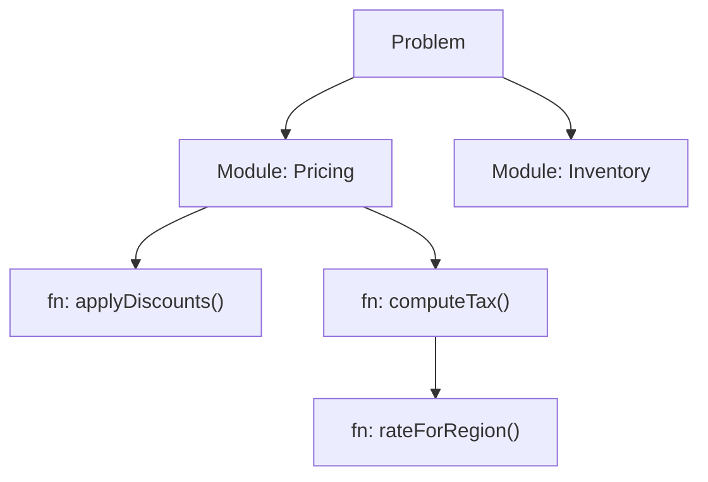

> **What?** Decomposition is finding the *natural seams* in a problem — the boundaries where the system already wants to come apart — and cutting along them, so that each module hides a decision likely to change (information hiding, Parnas) rather than mirroring the steps of execution.
> **How?** You decompose by *what's hard and likely to change*, not by flowchart steps. You cut along domain boundaries, design modules so their secrets are hidden behind stable interfaces, and you treat the integration cost of a bad cut as a first-class design risk.

---

## 1. The seam: where you cut matters more than that you cut

A carpenter splitting wood doesn't choose a line and hack across the grain. They find where the wood *wants* to split — the natural joint — and apply force there. Decomposing a system is the same. There are seams already present in the problem; your job is to find them, not invent arbitrary ones.

A **seam** is a boundary where the two sides have a genuinely thin, stable relationship — where one side can change without disturbing the other. Cut along a seam and the pieces fall apart cleanly. Cut across the grain and you create a fat, brittle interface that leaks every time either side changes.

The junior question was "what are the parts?" The middle question was "where do I cut for low coupling?" The senior question is sharper: **what are the seams that already exist in this problem, and am I cutting along them or across them?**

---

## 2. Parnas: hide the decisions that are likely to change

The single most important paper on decomposition is David Parnas, *On the Criteria To Be Used in Decomposing Systems into Modules* (1972). It is short, and it overturns the obvious approach.

The obvious approach is **functional decomposition by flowchart**: list the steps the program executes, make each step a module. Parnas shows this is usually *wrong*. He takes a small example (a KWIC index) and decomposes it two ways:

1. **By processing step** — input module, circular-shift module, alphabetize module, output module. Each module is a stage in the pipeline.
2. **By design decision** — each module hides one thing that might change: how lines are stored, how shifts are represented, what the input format is.

Both produce working programs. But when a requirement changes — say, the input format, or storing lines in memory vs. on disk — decomposition (1) ripples across *every* module, because they all share knowledge of the data representation. Decomposition (2) confines the change to *one* module, because that knowledge was hidden inside it.

> **Parnas's criterion:** don't decompose by the order of execution. Decompose so that **each module hides a design decision that is likely to change**, behind an interface that is unlikely to change. The module's interface reveals *what* it does; its body hides *how* — and "how" is precisely the part you'll want to revise later.

This is **information hiding**, and it is the deepest principle in decomposition. Low coupling and high cohesion (middle level) are *consequences* of it. A module that hides a volatile decision automatically has a small interface (you only expose the stable part) and high cohesion (everything inside serves that one secret).

### 2.1 The practical move

For each candidate module, ask: **"What does this module *know* that the rest of the system shouldn't have to?"** — the storage format, the wire protocol, the third-party API's quirks, the tax rules. That secret *is* the module. If a module has no secret — if everything about it is visible and stable — it's probably not a real boundary; it's a flowchart step masquerading as one.

---

## 3. Cutting along domain boundaries

In application systems, the most powerful seams are **domain boundaries**. Eric Evans (*Domain-Driven Design*, 2003) calls a coherent region of the domain with its own model and language a **bounded context**. These are the natural joints of a business system.

Consider e-commerce. A naive functional decomposition might split by technical layer (controllers, services, repositories). But the *domain* seams are: **Catalog**, **Cart**, **Pricing**, **Inventory**, **Fulfillment**, **Payments**. Each has its own vocabulary and its own notion of even shared words — a "product" in Catalog (description, images, SEO) is a different object from a "product" in Inventory (SKU, warehouse location, quantity) or Pricing (base price, discounts, tax category).

Cutting along these domain seams gives you modules that:

- Change for one business reason (a Pricing change doesn't touch Fulfillment).
- Have a shared, subset-able language internally and translate at the edges.
- Map onto how the business itself is organized — which, as we'll see, matters.

Cutting *across* them — a single `Product` class shared by every context, a `services/` folder grouped by technical role — produces the classic distributed-monolith mess: every feature touches every module, because the boundaries don't follow the grain of the problem.

> A reliable seam-finder: **watch where the language changes.** When the same word means different things to different people, you've found a boundary between two contexts. Cut there.

---

## 4. Functional vs data vs domain decomposition, decided deliberately

You now have three lenses for *where* to cut. A senior chooses among them on purpose:

| Lens | Cut by | Best when | Failure mode |
|---|---|---|---|
| **Functional** | What the system *does* (steps) | Pipelines, transforms, ETL stages | Parnas's trap: flowchart modules that share representations |
| **Data** | The *data* it operates on | Parallelism, sharding, batch over huge inputs | Splitting data that's actually entangled (cross-shard joins) |
| **Domain** | Business concepts / bounded contexts | Application & service architecture | Cutting across contexts; anemic shared models |

These compose. A service is usually carved by **domain** (Pricing), implemented internally with **functional** stages (parse → apply rules → compute), and may use **data** decomposition for scale (shard pricing by region). The mistake is using one lens reflexively — most often, decomposing a domain problem functionally because the flowchart is the first thing you see.

---

## 5. Recomposition is a design constraint, not an afterthought

Every cut creates an interface, and every interface must be **recomposed** — the pieces have to talk, agree on data shapes, handle each other's failures, be deployed and versioned together. **The integration cost of a decomposition is real and is often where bad decompositions reveal themselves.**

A decomposition that looks elegant on a whiteboard can be catastrophic in integration:

- **Chatty boundaries.** Module A makes 50 calls to module B to do one job. The seam was drawn in the middle of a tight interaction that should have been on one side. (In services, this becomes 50 network round-trips — the N+1 problem promoted to architecture.)
- **Shared mutable state across the seam.** Two "independent" modules both write the same table. They're not actually decomposed; they're coupled through the data, invisibly.
- **Distributed transactions.** A single business operation spans three services and must be atomic. The cut went straight through an invariant that wanted to stay together. Now you need sagas, compensations, eventual consistency — enormous accidental complexity created purely by a bad seam.

> **Senior rule: design the recomposition before you commit to the decomposition.** For each proposed boundary, trace one real end-to-end operation across it. Count the round-trips. Ask: does any *invariant* (must-be-atomic, must-be-consistent) straddle this line? If so, you're about to cut across the grain — move the boundary so the invariant stays inside one piece.

This is why "could we split this into microservices?" is the wrong first question. The right one is "where are the seams such that each invariant lives entirely on one side?" The answer tells you both your modules *and*, later, your services.

---

## 6. The same skill at three scales

What's striking about decomposition is that it's **scale-invariant** — the same criterion (hide volatile decisions, cut along seams, minimize the interface) applies whether you're splitting a function, a module, or a service.

- **Function level** — split a 40-line function when it has two responsibilities; hide the messy detail behind a name.
- **Module level** — split a package when two design decisions inside it change for different reasons.
- **Service level** — split a service when two domain contexts have different scaling, consistency, ownership, or release cadence needs — *and* the seam between them carries no invariant.

The criterion doesn't change; only the **cost of getting it wrong** changes. A bad function split is a 10-minute refactor. A bad service split is a six-month migration. This is why seniors are conservative about high-level cuts: **the higher the level, the more expensive the recomposition, the more sure you must be the seam is real.** Premature service decomposition is over-decomposition with a catastrophic integration tax.

---

## 7. Worked example: decomposing a "notifications" feature

Requirement: "Send users notifications — email, SMS, push — for events like order shipped, password reset, promo."

**Flowchart cut (Parnas-bad):** `EmailSender`, `SMSSender`, `PushSender`, each with its own copy of "decide whether to send, render the message, log it." Adding a new event type means touching all three. Adding a new channel means re-implementing the shared logic.

**Information-hiding cut (good):** find the decisions likely to change and hide each:

- **Channel** — secret: how to actually deliver via SES / Twilio / APNs. Interface: `send(recipient, payload)`. New provider = one module changes.
- **Template/rendering** — secret: how an event becomes a human message in each locale. Interface: `render(event, channel) -> payload`. New copy = templates change, nothing else.
- **Policy** — secret: who gets what, quiet hours, dedupe, user preferences. Interface: `shouldSend(user, event) -> [channels]`. New rule = one module.
- **Dispatch** — orchestrates: policy → render → channel, plus retries.

Now "add WhatsApp" touches one module (Channel). "Add a new event" touches one (Template). "Stop spamming users at 3 AM" touches one (Policy). The seams follow the *axes of change*, which is exactly Parnas's criterion. And critically: no invariant straddles a boundary, so each piece can be tested, deployed, and even split into a separate service later with no recomposition surprise.

---

## 8. Senior checklist

- [ ] For each module: what *secret* does it hide? (No secret → probably a fake boundary.)
- [ ] Am I cutting along seams (axes of change, domain boundaries) or across the grain (flowchart steps)?
- [ ] Does any invariant or atomic operation straddle a boundary? (If yes, move the cut.)
- [ ] Have I traced one real end-to-end operation across each seam and counted the round-trips?
- [ ] Does each word in the model mean *one* thing inside its piece? (Language change = context boundary.)
- [ ] Is the interface stable while the body is free to change? (Parnas: stable interface, volatile body.)
- [ ] Is the recomposition cost proportionate to the level of the cut?

---

## 9. What's next

The professional level takes decomposition to its largest scale: cutting a **system into services and teams** (Conway's law — the decomposition *is* the org chart), and decomposing a **multi-quarter initiative** into independently shippable increments.

→ [professional.md](professional.md) · [Abstraction & generalization](../03-abstraction-and-generalization/) · [Systems thinking is in the section index](../) · [Roadmap home](../../README.md)
