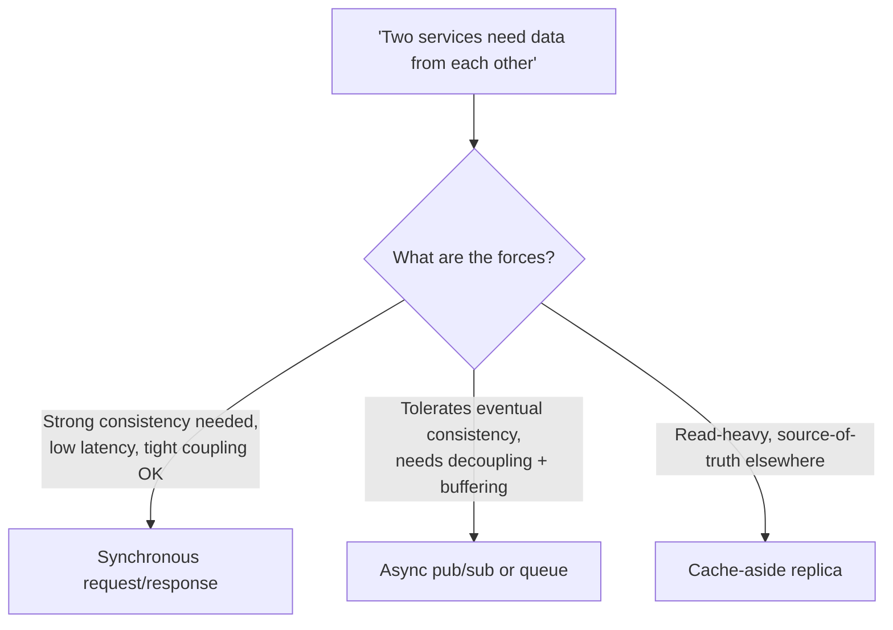
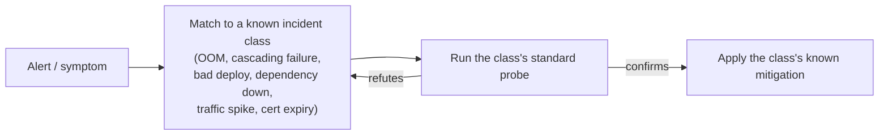

> **What?** At the senior level, pattern recognition is the ability to **rapidly classify ambiguous problems across the whole stack** — code, data, system, and incident — into known classes *and* to know the **boundaries** of each pattern: where its assumptions break, where two patterns compete, and when an apparent match is a trap. It's recognition *plus* calibrated skepticism about your own matches.
>
> **How?** You carry a deep, layered pattern library and apply it under uncertainty: triaging incidents by symptom signature, choosing among competing architectural patterns by checking which one's *forces* match the situation, and actively resisting the patterns you're most fluent in when they don't fit. You also make the recognition *transferable* — naming patterns so your team can match them too.

---

## 1. Recognition under ambiguity: the senior's actual job

Junior problems come pre-shaped; senior problems are *underspecified.* "The system gets slow sometimes" is not a problem statement — it's a search. Your value is collapsing that search quickly by hypothesizing a pattern class and testing it:

1. **Gather the signature** — what exactly is the symptom, when, under what load, for whom?
2. **Hypothesize the class** — "this signature usually means X" (a contention pattern, a tail-latency pattern, a retry-storm).
3. **Test the cheapest distinguishing prediction** — if it's X, then metric M should look like this. Check M.
4. **Confirm or re-match.**

This is the scientific loop ([scientific and hypothesis-driven thinking](../../09-scientific-and-hypothesis-driven/)) running on a *library of priors*. The library is what makes step 2 fast; the discipline of step 3 is what keeps you honest. Juniors often skip straight from symptom to fix because the first matched pattern feels certain. Seniors treat the first match as a hypothesis.

## 2. Performance & systems: signatures you should know cold

Most production problems are instances of a small set of well-worn classes. Recognition here saves hours.

| Signature | Likely pattern | Cheap distinguishing check |
|---|---|---|
| p50 fine, p99 terrible | **tail latency** (GC pause, lock contention, a slow shard) | look at the *distribution*, not the mean; per-shard/per-host breakdown |
| Latency rises with concurrency, throughput plateaus | **contention** (lock, connection pool, DB row) | does adding load *reduce* throughput? → contention, not capacity |
| Errors spike, then a flood of retries makes it worse | **retry storm / metastable failure** | are retries un-jittered and uncapped? |
| Memory climbs monotonically until OOM | **leak** (unbounded cache, listener accumulation) | heap profile slope; is it bounded? |
| First request slow, rest fast | **cold start / cache warm-up** | is it per-process or per-deploy? |
| Throughput fine until a threshold, then collapse | **thundering herd / cache stampede** | did many keys expire at once? |
| One node hot, others idle | **skew** (bad shard key, hot partition) | per-key/per-partition request counts |

Note how several signatures *look the same* at first ("it's slow") and only the **distinguishing check** separates them. The senior skill isn't just having the table — it's knowing the one cheap measurement that tells `contention` from `capacity`, because the fixes are opposite (capacity → add machines; contention → adding machines makes it *worse*).

## 3. Competing patterns: when two shapes both seem to fit

Mid-level recognition asks "which pattern is this?" Senior recognition often confronts "**which of these valid patterns should win here?**" Real problems frequently match more than one, and the patterns prescribe *different* solutions. Resolution comes from the **forces** — the competing pressures each pattern is designed to balance.

The pattern you pick is the one whose **assumptions match the situation's forces**, not the one you used last time. Examples of force-driven choices:

- **Orchestration vs. choreography** for a multi-step workflow: central control & visibility (orchestration) vs. loose coupling & autonomy (choreography). Same problem shape; opposite trade-offs.
- **Cache-aside vs. write-through**: tolerate staleness for simplicity, or pay write cost for freshness.
- **Pessimistic lock vs. optimistic concurrency**: high contention (lock) vs. low contention with rare conflicts (optimistic/CAS).

A senior names the *forces* out loud, because that's the part that determines correctness and the part juniors skip.

## 4. Knowing the boundary: where a pattern's assumptions break

Every pattern has a **context of validity** — the conditions under which it pays off. The senior skill is recognizing when you've stepped *outside* that context, where the pattern silently becomes a liability.

| Pattern | Quietly breaks when… |
|---|---|
| Caching | the working set stops fitting → thrash; or staleness window crosses a correctness line (e.g., permissions, prices) |
| Retry with backoff | the failure is *not* transient → you turn a fast failure into a slow, amplified one |
| Sharding by key | the key develops a hotspot → one shard carries the load, defeating the point |
| Microservices | a "service boundary" sits inside a tight transactional invariant → you've built a distributed transaction you can't honor |
| Eventual consistency | a downstream reader actually needs read-your-writes → user sees their own update vanish |

This is the difference between a pattern and a **rule.** A junior learns "cache reads." A senior knows the cache is correct *only while* the staleness window stays under the correctness line — and watches for the day the requirements move that line. Recognizing the pattern includes recognizing its **expiry conditions**.

## 5. Resisting your own fluency

The more senior you are, the *stronger* your golden-hammer pull, because your favorite patterns have a long track record of success — which is exactly what makes them tempting to over-apply. Maslow's law of the instrument doesn't weaken with experience; the hammer just gets shinier.

Concrete counter-discipline:

- **State the signal before the solution.** In design docs, write the *forces* and *assumptions* before naming a pattern. If you can't articulate the signal, you're matching on habit.
- **Argue the null pattern.** For any pattern you propose, force the question "what if we *don't* use it — what does the boring, direct version cost?" Often the boring version wins and you've avoided accidental complexity.
- **Watch for the tell:** if the same person's designs always converge on the same tool regardless of problem, that's the hammer. (It might be you.)
- **Separate "I've seen this" from "this is that."** Familiarity is a *prompt* to check the match, not the conclusion. Surface similarity is exactly how analogies mislead — see [analogical thinking](../../07-creative-and-lateral-thinking/03-analogical-thinking/): the value of an analogy is in the *deep structure* matching, not the surface.

## 6. Debugging and incident response as pattern matching

In an incident, you don't have time to reason from first principles about everything — you triage by **recognizing the class**, then confirm. Effective on-call is largely a fast, well-stocked pattern library plus the discipline to verify before acting.

Examples of incident signatures → class → first move:

| Signature | Class | First move |
|---|---|---|
| Errors start exactly at a deploy timestamp | **bad deploy** | roll back first, diagnose after |
| Errors fan out from one dependency, then everywhere | **cascading failure** | shed load / open circuit breakers |
| Memory + restart loop across pods | **OOM** | check recent allocation change, bump limits to stabilize, then fix |
| TLS errors at a round number date | **cert expiry** | rotate cert |
| Latency spike correlated with a marketing event | **traffic surge** | autoscale / rate-limit |

The post-incident move is to **harvest the signature** into the runbook so the *next* responder recognizes it in seconds. Post-mortems are a pattern-library factory — read them across the org, not just your own.

## 7. Building (and deliberately maintaining) a senior pattern library

A senior library is broad, *cross-domain*, and kept current:

- **Read post-mortems and incident reviews** — the densest source of "symptom → root-cause class" mappings, including the rare ones you won't hit personally for years.
- **Read code across the org**, not just yours — you absorb other teams' patterns (and anti-patterns).
- **Study catalogs** — [GoF design patterns](../../../code-craft/design-patterns/), the *AntiPatterns* book (Brown et al., 1998), Hohpe & Woolf's enterprise-integration patterns, distributed-systems failure modes. Catalogs give you *shared names*, which is the next section's point.
- **Refactor the library when context changes.** A pattern that was right in 2015 (monolith-first) may be the golden hammer in 2025, and vice versa. Patterns have shelf lives; a stale library matches the wrong things confidently.

---

## Key takeaways

- Senior recognition operates **under ambiguity**: turn a vague symptom into a hypothesized *class*, then run the cheapest distinguishing check before acting.
- Know **systems signatures cold** (tail latency, contention, retry storm, leak, skew, stampede) — and the one cheap measurement that separates look-alikes whose fixes are opposite.
- Real problems often match **competing patterns**; choose by which one's **forces and assumptions** fit, and name those forces explicitly.
- Every pattern has a **context of validity**; recognizing the pattern includes recognizing where its assumptions **break** and when its context has **expired**.
- Your fluency makes the **golden hammer** stronger, not weaker — state the signal before the solution and argue the null pattern.
- **Incident response is triage by recognized class**; harvest each incident's signature into the runbook so the next responder matches faster.
- Build the library from **post-mortems, cross-org code, and catalogs**, and refactor it as the world changes.
