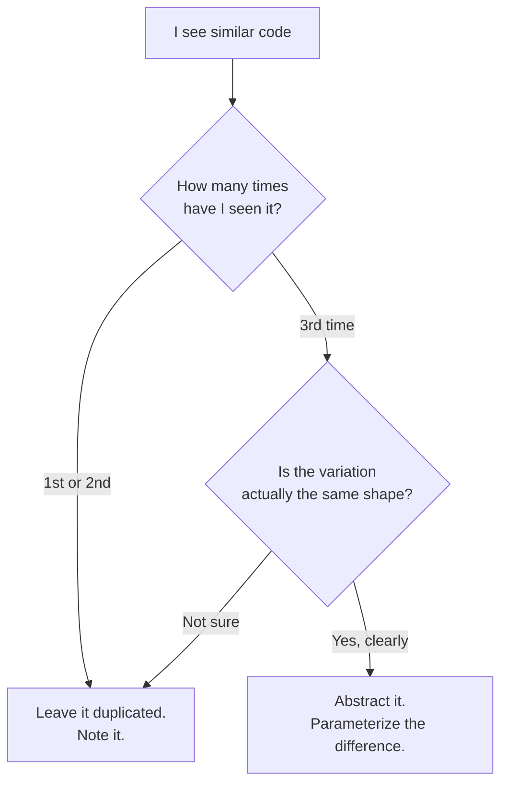

> **What?** Abstraction is deciding what to *ignore*. You strip away the detail that doesn't matter for the problem at hand and keep only the essence — the part that's *left* after you remove the irrelevant. Generalization is taking one specific solution and stretching it to cover a whole class of similar cases.
>
> **How?** As a junior you mostly *consume* abstractions (a `Date` class, an HTTP client, a `sort()` function) and write small ones (a function with a clear name that hides three lines of logic). The skill to build now: name things by *what they do*, not *how*; and resist the urge to generalize code you've only seen once.

---

## 1. Abstraction is subtraction, not addition

The common beginner mistake is to think abstraction means "add layers" or "make it fancy." It's the opposite. Abstraction is **removal**. You look at a messy concrete thing and ask: *what can I throw away and still solve my problem?*

A street map is an abstraction of a city. It throws away the color of the buildings, the smell of the bakery, the height of the trees — none of that helps you get from A to B. What's *left* — the roads and their connections — is the essence for the task "navigate." A different task ("find shade in summer") would keep the trees and throw away the road names. **The essence is relative to the problem.**

Edsger Dijkstra put it sharply:

> "The purpose of abstraction is not to be vague, but to create a new semantic level in which one can be absolutely precise."

So abstraction is not hand-waving. A good abstraction lets you be *more* precise, because you're now talking at the right level. "Send the email" is precise at the application level; you don't want to be saying "open a TCP socket to port 25" in the middle of your signup flow.

### A first example

```js
// Concrete, detail-heavy. The "what" is buried in "how".
const total = items.reduce((s, i) => s + i.price * i.qty, 0)
              * (1 + 0.08)            // tax
              - (coupon ? 5 : 0);     // discount

// Abstracted. The essence ("compute the cart total") is named.
// The how (tax rate, coupon math) is hidden inside.
const total = cartTotal(items, { taxRate: 0.08, coupon });
```

The second version *removed* the arithmetic from view. A reader who only cares "what does this line do?" gets the answer immediately. That's the whole point.

## 2. A function is your first abstraction

The smallest, most useful abstraction you have is the named function. When you write:

```python
def is_weekend(day):
    return day in ("Saturday", "Sunday")
```

you've created a tiny new "word" in your program's vocabulary. Callers say `is_weekend(today)` and never think about the tuple. If the rule changes (some country counts Friday), you fix it in one place.

A function abstracts well when its **name fully describes its effect** and you don't need to read the body to use it correctly.

### Good name vs bad name

| Bad | Why | Better |
|-----|-----|--------|
| `process(x)` | "Process" how? Into what? | `normalizeEmail(x)` |
| `data2()` | Numbered = no meaning | `parsedConfig` |
| `handle(req)` | Handle = do anything | `rejectExpiredToken(req)` |
| `flag` | Flag for what? | `isRetryable` |

A name *is* an abstraction. A vague name leaks the fact that you didn't decide what the thing actually is.

## 3. Don't make callers care *how*

The contract of an abstraction is: "use me by my interface, don't peek at my insides." When you call `arr.sort()`, you don't know (or care) whether it's quicksort or merge sort. That freedom — to swap the inside without breaking callers — is the payoff of a clean abstraction. This idea is called **information hiding** (David Parnas, 1972): a module should hide the decisions that are likely to change.

```python
# Leaks "how": caller must know the storage is a dict keyed by id.
user = db["users"][user_id]

# Hides "how": caller asks for what it wants; storage can change later.
user = users.get(user_id)
```

If you later move users to a database, the first version breaks every caller. The second version breaks only the inside of `get`. You bought yourself room to change your mind.

## 4. Generalization: from one case to many

Generalization is the second half of this topic. You have a function that works for *one* thing, and you make it work for *N* things by **parameterizing the variation** — turning the part that differs into an argument.

```python
# Specific: only greets in English.
def greet_en(name):
    return f"Hello, {name}!"

# Generalized: the language is now a parameter.
def greet(name, lang="en"):
    templates = {"en": "Hello, {}!", "es": "¡Hola, {}!", "fr": "Bonjour, {} !"}
    return templates[lang].format(name)
```

The trick is always the same: **find what changes, make it a parameter; keep what stays the same as the body.**

## 5. The biggest junior trap: generalizing too early

Here is the rule that will save you the most pain:

> **Don't generalize code until you've seen the third occurrence.** (The "rule of three," from Martin Fowler's *Refactoring*.)

When you've written something *once*, it's specific — fine. When you copy-paste it a *second* time, note the duplication but **resist**. Only on the *third* time do you actually know the shape of the thing that varies. Generalize before that and you'll guess wrong, build the wrong abstraction, and then everyone has to bend their case to fit your bad guess.

There's an even blunter slogan, from Sandi Metz: **"duplication is far cheaper than the wrong abstraction."** A little copy-paste is annoying but local. A wrong shared abstraction infects every caller and is painful to remove.

```python
# Two callers, slightly different. DON'T abstract yet — you'd be guessing.
def send_welcome(user):  send(user.email, "Welcome!", welcome_body(user))
def send_reset(user):    send(user.email, "Reset",    reset_body(user, token))
# Wait for a third. Then you'll see what truly varies (subject? body? recipient?).
```

## 6. A quick decision checklist



## 7. When concrete is the right answer

Abstraction is a tool, not a virtue. Sometimes the plain, concrete version is *better*:

- **It's used once.** A helper that has exactly one caller usually just adds a jump for the reader. Inline it.
- **The detail *is* the point.** In a hot loop or a tricky bit of math, hiding the mechanics can make bugs harder to see.
- **You'd be guessing the future.** Building "flexibility" for requirements that don't exist yet is speculation, not abstraction.

A good instinct: prefer the simplest thing that reads clearly *today*. Abstraction earns its keep when it removes real, repeated detail — not when it adds imaginary flexibility.

## 8. What to practice now

1. **Name things well.** Every time you write a function, ask: does the name tell the caller what happens without reading the body?
2. **Hide one decision.** Wrap a raw data structure (`dict["users"]`) behind a function (`get_user`). Notice how callers stop caring about the shape.
3. **Count to three.** When you feel the urge to "make this reusable," check how many real uses exist. Fewer than three? Wait.
4. **Read what you depend on.** Skim the docs of one library you use (`fetch`, `requests`, a date library) and notice *what it hides* and *what it forces you to know*.

---

### Related

- Decomposition — abstraction's sibling: see [`../01-decomposition/`](../01-decomposition/).
- Spotting repetition worth abstracting: [`../02-pattern-recognition/`](../02-pattern-recognition/).
- Turning an abstraction into running steps: [`../04-algorithmic-thinking/`](../04-algorithmic-thinking/).
- Section overview: [`../`](../) · Roadmap home: [`../../README.md`](../../README.md).
