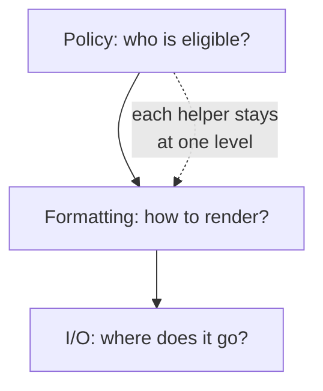

> **What?** Abstraction is the deliberate choice of *what to ignore* so that a new, precise semantic level appears — and the discipline of not mixing levels in one place. Generalization is moving a working solution from one case to a class of cases by parameterizing the variation, while actively guarding against the dominant failure mode: building the *wrong* abstraction too soon.
>
> **How?** At mid level you design the abstractions other people in your module will use: function and module boundaries, interfaces/contracts, the names that become your team's vocabulary. You own the trade-off between duplication and abstraction, you recognize leaky abstractions, and you apply the rule of three with judgment rather than as dogma.

---

## 1. Levels of abstraction, and the sin of mixing them

A unit of code should operate at **one level of abstraction**. The classic smell is a function that does high-level orchestration *and* low-level byte-twiddling in the same body:

```python
def export_report(users):
    rows = []
    for u in users:
        if u.active and u.last_login > cutoff:        # business rule (high)
            name = u.name.encode("utf-8").decode("latin-1", "replace")  # encoding (low)
            csv_cell = '"' + name.replace('"', '""') + '"'             # CSV quoting (low)
            rows.append(csv_cell + "," + str(u.score))
    upload_to_s3(BUCKET, "/reports/x.csv", "\n".join(rows))           # I/O (mid)
```

Reading this, your eye keeps changing altitude — policy, then character encoding, then CSV escaping, then network I/O. Each is a different *kind* of decision. Separate them:

```python
def export_report(users):
    eligible = [u for u in users if is_eligible(u)]      # policy
    csv = render_csv(eligible, columns=["name", "score"]) # formatting
    storage.put("/reports/x.csv", csv)                    # I/O
```

Now `export_report` reads as a *story*: select, format, store. Each helper lives at its own level. The "Single Level of Abstraction Principle" (popularized by Robert Martin's *Clean Code*) is really just: don't make the reader change altitude every line.



## 2. An abstraction is a contract, not just a function

When you publish a function, type, or module, you are publishing a **contract**: a promise about behavior, plus a hidden implementation you reserve the right to change. Parnas's information hiding rule says: **hide the decisions most likely to change** behind the interface, so a change ripples through one module instead of the whole codebase.

A contract has two halves:

| Half | Question | Example |
|------|----------|---------|
| **Interface** | What can callers rely on? | `charge(amount, card) -> Receipt \| Declined` |
| **Hidden body** | What am I free to change? | Which gateway, retries, idempotency keys |

The test of a good abstraction: **can you rewrite the body without telling any caller?** If swapping the payment provider forces every caller to change, the abstraction leaked the provider — it wasn't really hiding it.

### Make the contract enforce itself

Names and types are how the contract is stated. Prefer making illegal states unrepresentable over documenting "don't do this":

```python
# Weak contract: returns a magic value; caller must remember to check.
def find_user(id) -> User:   # returns None sometimes... surprise!

# Strong contract: the type tells the caller a miss is possible.
def find_user(id) -> Optional[User]:
```

## 3. Leaky abstractions: the thing you hid bleeds through

Joel Spolsky's **Law of Leaky Abstractions**: *"All non-trivial abstractions, to some degree, are leaky."* The abstraction hides complexity right up until it doesn't, and then the hidden detail leaks back and bites you.

Concrete leaks you'll meet:

- **An ORM** hides SQL — until a query does an N+1 and you must understand the SQL it generated.
- **TCP** hides the unreliable network — until packet loss spikes latency and you must reason about retransmits.
- **A file path** hides the disk — until the network drive disconnects and `read()` blocks for 30 seconds.
- **`==` on floats** hides binary representation — until `0.1 + 0.2 != 0.3`.

You can't eliminate leaks; you can choose *good* leaks. A good abstraction leaks **predictably and rarely**, and gives you a hatch to drop down a level when needed (e.g., an ORM that lets you run raw SQL for the 1% case). The danger sign is an abstraction that hides something you *frequently* need to control — that's not hiding complexity, it's hiding the steering wheel.

## 4. Generalization: parameterize the variation — carefully

Generalizing is mechanical once you can name the variation. The discipline is knowing *when*.

```python
# Three concrete validators that crept in over time:
def validate_age(v):   return 0 <= v <= 120
def validate_score(v): return 0 <= v <= 100
def validate_pct(v):   return 0 <= v <= 100

# The variation is the bounds. Parameterize it.
def in_range(lo, hi):
    return lambda v: lo <= v <= hi

validate_age = in_range(0, 120)
```

But notice: only *after* the third occurrence did the true shape (a `[lo, hi]` range) become obvious. Generalizing after the first `validate_age` would have tempted you to invent a config-driven "rule engine" that none of the real cases needed.

### The wrong abstraction is worse than duplication

Sandi Metz's rule is the most important sentence in this whole topic:

> **"Duplication is far cheaper than the wrong abstraction."**

The failure mechanism is specific. You DRY up two *similar-looking* things into one shared function with a `flag` parameter. Then requirements diverge. So you add another flag. Then a third. Soon the shared function is a tangle of `if isPremium`, `if legacyMode`, `if region == 'EU'` — and every caller is coupled to every other caller's special case. Untangling it is far harder than if you'd left two honest duplicates.

```python
# The rot starts innocently:
def send_notification(user, kind, urgent=False, digest=False, locale=None, legacy=False):
    if legacy: ...        # ← each new requirement adds a branch
    if digest and urgent: # ← combinations explode
        ...
```

This is why **AHA** ("Avoid Hasty Abstractions," Kent C. Dodds) and "prefer duplication over the wrong abstraction" are the working-engineer's correction to a naive reading of DRY. DRY is about not duplicating *knowledge/decisions*, not about deleting code that merely *looks* alike. (More on this tension in [`../../../code-craft/design-principles/`](../../../code-craft/design-principles/).)

### How to know it's the *right* abstraction

The cases collapse cleanly when:

1. They share the *same reason to change* (Parnas), not just the same shape today.
2. The variation is a small, named set of parameters — not an open-ended pile of flags.
3. Removing the duplication makes each call site *simpler*, not just shorter.

If you're adding a boolean flag to make two cases share code, that's usually a signal you have **two functions**, not one.

## 5. The cost of indirection: don't add layers for free

Butler Lampson's adage: *"All problems in computer science can be solved by another level of indirection — except for the problem of too many levels of indirection."*

Every abstraction layer has a tax:

- **Cognitive tax** — a reader chasing a bug now jumps through five files instead of reading one.
- **Performance tax** — virtual calls, allocations, copies at each boundary.
- **Coupling tax** — a wrapper that exists only to forward calls couples you to the wrapped thing *and* adds its own surface.

A layer earns its tax only if it *hides a real decision* or *removes real, repeated detail*. A `UserServiceImpl` behind a `UserService` interface that has exactly one implementation and one caller is pure tax — it hides nothing and helps no one. Add the interface when you actually have a second implementation or a real test seam (see [`../05-modeling-a-problem-in-code/`](../05-modeling-a-problem-in-code/)).

## 6. Choosing the right level for your audience

The "right" abstraction depends on *who reads the boundary*. The same operation gets framed differently for different callers:

| Audience | The right level |
|----------|-----------------|
| App developer | `payments.charge(order)` |
| Library author | `gateway.authorize(token, cents, currency)` |
| Kernel/driver author | raw bytes, registers, interrupts |

Designing for the wrong audience is a real defect: an API that forces app developers to assemble idempotency keys and currency minor-units is leaking library-author concerns upward. Match the abstraction's vocabulary to the caller's mental model.

## 7. Practical heuristics

1. **One level per function.** If the names in a function span "encrypt the payload" and "increment a byte," split it.
2. **Rule of three, with judgment.** Three real (not hypothetical) occurrences before you abstract — and confirm they share a *reason to change*, not just a shape.
3. **Flags are a smell.** Adding a boolean to share code? You probably have two functions.
4. **Prefer deletable duplication.** Honest copy-paste you can later merge beats a premature merge you can't later split.
5. **Give a trapdoor.** When you hide a layer, expose an escape hatch for the case the abstraction can't cover.

---

### Related

- Finding the repetition worth abstracting: [`../02-pattern-recognition/`](../02-pattern-recognition/).
- Breaking a problem into parts (decomposition is abstraction's partner): [`../01-decomposition/`](../01-decomposition/).
- Turning abstractions into running code: [`../05-modeling-a-problem-in-code/`](../05-modeling-a-problem-in-code/).
- DRY and design principles: [`../../../code-craft/design-principles/`](../../../code-craft/design-principles/) · Refactoring toward/away from abstractions: [`../../../code-craft/refactoring/`](../../../code-craft/refactoring/).
- Section overview: [`../`](../) · Roadmap home: [`../../README.md`](../../README.md).
