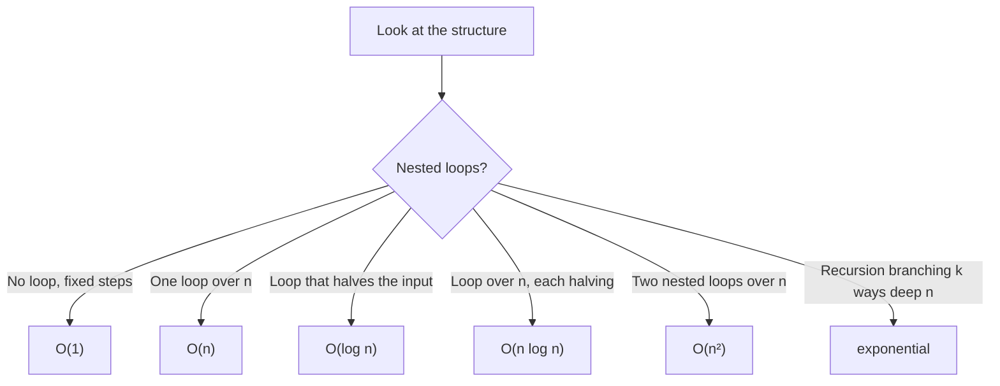

> **What?** At this level, algorithmic thinking is the ability to reason about a procedure's **correctness and cost on paper** — via invariants, termination arguments, and order-of-growth intuition — and to choose between algorithmic *strategies* by recognising the shape of a problem before reaching for an implementation.
>
> **How?** You make preconditions/postconditions explicit, state and check a loop invariant, prove the loop terminates, estimate big-O by inspection, and pick a strategy (brute force → divide & conquer, greedy, DP, backtracking) using a decision lens — then justify the time/space trade-off you accepted.

---

The junior level was about *recognising* an algorithm and specifying it. The middle level is about *arguing that it's right* and *knowing what it costs* without running it. This is the difference between "it passed my tests" and "I can tell you why it's correct."

## 1. Invariants: the load-bearing idea of correctness

A **loop invariant** is a statement that is true *before the loop starts, after every iteration, and therefore after the loop ends*. It is the most practical formal tool a working engineer has, and it comes straight from the Dijkstra/Gries tradition of reasoning about programs.

The three-part discipline (this mirrors mathematical induction):

1. **Initialisation** — the invariant holds before the first iteration.
2. **Maintenance** — if it holds before an iteration, it still holds after.
3. **Termination** — when the loop ends, the invariant *plus the exit condition* gives you the postcondition you wanted.

### Worked example: `max_of`

```
biggest <- list[0]
i <- 1
WHILE i < length(list):
    IF list[i] > biggest: biggest <- list[i]
    i <- i + 1
RETURN biggest
```

**Invariant:** *`biggest` equals the maximum of `list[0..i-1]`.*

- **Init:** before the loop, `i = 1`, so `list[0..0]` is just `list[0]`, and `biggest = list[0]`. Holds.
- **Maintenance:** assume `biggest` is the max of `list[0..i-1]`. The `IF` updates `biggest` to be at least `list[i]`, so afterwards it's the max of `list[0..i]`. Then `i` increments, restoring "max of `list[0..i-1]`". Holds.
- **Termination:** the loop ends when `i = length`, so the invariant says `biggest` is the max of `list[0..length-1]` — the whole list. That's our postcondition.

You just *proved* the algorithm correct without a debugger. When a junior says "I think it works," a mid-level engineer says "here's the invariant that makes it work."

## 2. Termination as a measure that strictly decreases

Pair every loop with a **variant** (or *ranking function*): a non-negative integer quantity that *strictly decreases* every iteration. If it can't decrease forever (it's bounded below by 0), the loop must stop.

| Loop | Variant | Why it terminates |
| --- | --- | --- |
| `while i < n: i++` | `n - i` | Decreases by 1 each pass, ≥ 0. |
| Binary search on `[lo, hi]` | `hi - lo` | Halves each pass, ≥ 0. |
| Euclid's GCD `gcd(a,b)` | `b` | `b` strictly shrinks each recursion, ≥ 0. |

When you *can't* name a strictly-decreasing variant, that is a red flag your loop may not terminate. For recursion, the same idea applies to the argument size: each recursive call must operate on a *strictly smaller* problem, and there must be a base case for the smallest one.

## 3. Order-of-growth as a reflex, not a formula

Big-O is taught as algebra. Treat it instead as a *reflex*: glance at the structure and read off the dominant cost. The DSA roadmap has the rigour; here is the working intuition.



Practical reading rules:

- **Sequential** steps add; you keep the biggest. `O(n) + O(n) = O(n)`.
- **Nested** loops multiply. A loop of `n` inside a loop of `n` is `O(n²)`.
- **Halving** the search space each step is `O(log n)` — doubling the input adds *one* step, not double the work.
- **Constants and lower-order terms vanish** for scaling questions. `3n + 50` is `O(n)`.

The reflex you want: when you see two nested loops over the input, a small voice should ask *"is `n²` acceptable for the real input size?"* For `n = 1000`, `n²` is a million — fine. For `n = 1,000,000`, `n²` is a trillion — a non-starter. Same code, different verdict, because **cost is only meaningful relative to the actual input size.**

## 4. Space is a budget too

Time gets the attention; space decides whether your program runs at all. Ask the same 10× question about *memory*:

- Does the algorithm build a copy of the input? (extra `O(n)`)
- Does recursion stack up? (recursion depth `d` costs `O(d)` stack)
- Can you process a stream **in place**, keeping only a running summary, for `O(1)` space?

The classic trade is **time vs space**: a hash set lets you answer "have I seen this before?" in `O(1)` time but costs `O(n)` memory; re-scanning the list each time is `O(1)` memory but `O(n)` time per query. Neither is "better" — it depends on whether you're short on time or short on memory. Naming the trade-off *is* the skill.

## 5. Choosing a strategy: the decision lens

When brute force is too slow, you reach for a *strategy*. You are not memorising implementations — you are pattern-matching the **shape** of the problem to a family of approaches. (Each family has a full section in the DSA roadmap.)

| If the problem... | The strategy is likely... | The tell-tale sign |
| --- | --- | --- |
| splits into independent same-shape subproblems | **Divide & conquer** | "solve halves, then combine" |
| lets a locally-best choice stay globally best | **Greedy** | "pick the best-looking option now, never reconsider" |
| has overlapping subproblems + optimal substructure | **Dynamic programming** | "the same sub-question recurs; cache it" |
| explores configurations, abandoning dead ends | **Backtracking** | "build partial solutions, prune when invalid" |

### How to actually use the lens

1. **Always write brute force first.** It's your correctness oracle and it clarifies the problem.
2. **Find the bottleneck.** Where is the repeated or wasted work?
3. **Match the waste to a strategy.** Recomputing the same subresult? → DP. Re-searching sorted data? → divide & conquer (binary search). Trying every combination but most are invalid early? → backtracking with pruning.
4. **Verify the strategy's *precondition* holds.** Greedy is seductive and *often wrong* — it only works when you can prove the local choice is safe. DP needs genuine optimal substructure. Don't apply a strategy because it's fashionable; apply it because the problem's shape licenses it.

### A concrete decision

> "Make change for an amount using the fewest coins."

The greedy idea — "always take the biggest coin that fits" — works for US coin denominations but **fails** for arbitrary ones (e.g. coins `{1, 3, 4}`, amount `6`: greedy gives `4+1+1 = 3 coins`, but `3+3 = 2 coins` is better). The *shape* (optimal substructure, overlapping subproblems) actually calls for DP. Recognising that greedy's precondition doesn't hold here — *before* shipping it — is exactly the algorithmic-thinking move.

## 6. Trade-offs you'll consciously make

Real algorithmic decisions are rarely "fastest wins." You weigh:

| Axis | One side | Other side | When to lean which way |
| --- | --- | --- | --- |
| Time vs space | recompute (slow, lean) | cache (fast, fat) | memory-bound vs latency-bound |
| Simple vs fast | `O(n²)` you can read | `O(n log n)` that's subtle | small `n`, or correctness-critical code → simple |
| Exact vs approximate | true answer | "good enough" fast | when exact is intractable or unneeded |

A mid-level engineer states the trade-off out loud in a code review: *"I chose the `O(n²)` version because `n < 50` here and it's obviously correct; the `O(n log n)` version saves nothing at this scale and is easy to get wrong."* That sentence demonstrates judgment, not just knowledge.

## 7. Bringing it together: a sharpened example

**Problem:** detect if an array of `n` integers contains a duplicate.

**Brute force (correctness oracle):** compare all pairs. `O(n²)` time, `O(1)` space.

```
FOR i in 0..n-1:
    FOR j in i+1..n-1:
        IF a[i] == a[j]: RETURN true
RETURN false
```

**Optimise via the lens.** The waste is re-scanning for "have I seen this value?" That's a *membership* question → a hash set answers it in `O(1)`.

```
seen <- empty set
FOR x in a:
    IF x in seen: RETURN true     # invariant: seen = all values strictly before x
    add x to seen
RETURN false
```

- **Invariant:** before processing `x`, `seen` holds exactly the values seen so far. A repeat is caught the moment it reappears.
- **Cost:** `O(n)` time, `O(n)` space.
- **Trade-off named:** we spent `O(n)` memory to cut time from `O(n²)` to `O(n)`. If memory were the constraint (and the array were sortable in place), sorting first gives `O(n log n)` time and `O(1)` extra space — a *different* point on the curve, chosen deliberately.

---

## Where to go next

- Apply the reasoning in [tasks.md](tasks.md) — invariant-writing and strategy-selection drills.
- Go deeper on system-level algorithmic reasoning in [senior.md](senior.md).
- The strategies above each have a full treatment in the **Data Structures & Algorithms** roadmap: [../../../../Data/datastructures-and-algorithms/](../../../../Data/datastructures-and-algorithms/).
- Related pillars: [decomposition](../01-decomposition/) (breaking the problem down) and [pattern recognition](../02-pattern-recognition/) (spotting the strategy's tell-tale sign).
