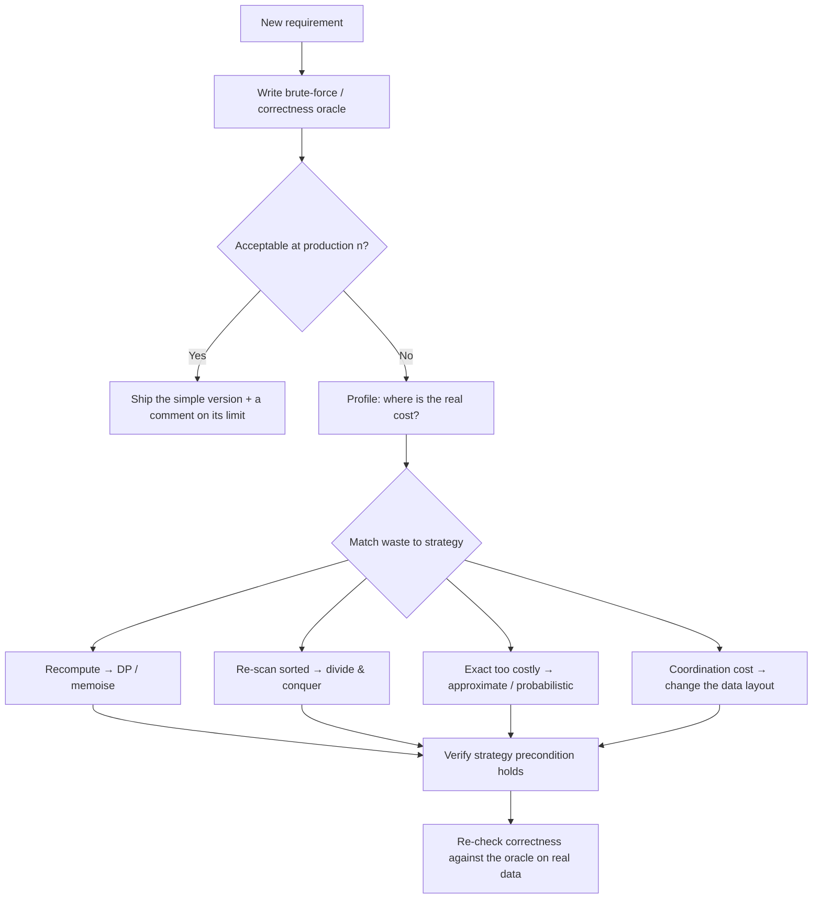

> **What?** At the senior level, algorithmic thinking is the discipline of treating *any* non-trivial procedure — a request handler, a retry loop, a cache-eviction policy, a batch job — as an algorithm with a stated contract, invariants, termination/progress guarantee, and a cost model that holds under production load and adversarial input.
>
> **How?** You design from contracts and invariants rather than from code; you pick the right *kind* of correctness (exact vs probabilistic, worst-case vs amortised); you anticipate the input distribution your code will actually face; and you make algorithmic trade-offs explicit so the team can review the *reasoning*, not just the diff.

---

By now you can prove a loop correct and read off its big-O. The senior shift is realising that *the most consequential algorithms in your codebase don't look like textbook algorithms* — they're scattered across handlers, schedulers, and data-pipeline stages, and nobody wrote down their contracts. Your job is to bring algorithmic rigour to *those*.

## 1. Everything is an algorithm — including your business logic

A retry policy is an algorithm. A rate limiter is an algorithm. A "deduplicate incoming events" step is an algorithm. Each has inputs, outputs, preconditions, postconditions, a termination/progress guarantee, and a cost — whether or not anyone specified them.

Consider a retry loop most teams write without thinking:

```
attempt <- 0
WHILE attempt < MAX:
    result <- call_service()
    IF result.ok: RETURN result
    attempt <- attempt + 1
    sleep(backoff(attempt))
RAISE error
```

Apply the algorithmic lens and the questions write themselves:

- **Termination:** bounded by `MAX` — good. But is `backoff` bounded? Unbounded exponential backoff with no cap is a *correctness* bug at scale.
- **Precondition:** is `call_service` *idempotent*? If not, retrying a partially-applied write violates the postcondition (you charged the card twice). The retry algorithm is only correct under a precondition the code never states.
- **Cost under load:** if every client retries on the same failure, you get a *synchronised thundering herd*. The fix — jitter — is an algorithmic change to the backoff function, justified by reasoning about the *aggregate* behaviour, not the single client.

Seniors find the unstated algorithm and give it a contract. "This handler is just glue" is usually wrong; the glue has invariants.

## 2. Correctness under the input distribution you'll actually see

Mid-level correctness asks "is it right for all valid inputs?" Senior correctness adds: "what inputs will *production* actually send, and does my cost model survive them?"

Worst case, average case, and the case your traffic generates are three different things:

- **Hash maps** are `O(1)` average but `O(n)` worst case under collisions. Fine — until an attacker crafts colliding keys (algorithmic-complexity DoS). The mitigation (randomised hashing) is an algorithmic decision driven by adversarial input.
- **Quicksort** is `O(n log n)` average, `O(n²)` worst case on already-sorted input — which is *exactly* the input a "re-sort the already-sorted list" code path produces. Knowing your data is often near-sorted should change your algorithm choice (insertion sort / Timsort-style adaptivity).
- A regex with catastrophic backtracking is `O(n)` on normal input and exponential on a crafted one (ReDoS). Same code, weaponised input.

The senior reflex: **"what is the adversarial or pathological input for this procedure, and what does it cost me?"** This is the four-ugly-inputs habit from junior level, grown up and pointed at a hostile internet.

## 3. Amortised and probabilistic correctness

Two notions of "right" that seniors must wield fluently because they unlock real efficiency.

### Amortised analysis

Some operations are occasionally expensive but *cheap on average over a sequence*. A dynamic array doubling its capacity is `O(n)` on the resize but `O(1)` amortised per append — because resizes are rare and pay for themselves. Reasoning amortised lets you accept a worst-case spike when the *aggregate* is what matters. The caution: amortised is the wrong lens when **tail latency** matters — a 99.9th-percentile request that hits the rare `O(n)` resize is a real user waiting, even if the average is fine.

### Probabilistic / approximate algorithms

At scale, exact often becomes unaffordable, and "provably close, with tiny error probability" is the right kind of correct:

| Need | Exact cost | Probabilistic alternative | The trade |
| --- | --- | --- | --- |
| "Is this item in the set?" | `O(n)` memory | **Bloom filter** | no false negatives, tunable false positives, tiny memory |
| "How many distinct users?" | store every ID | **HyperLogLog** | ~2% error, kilobytes instead of gigabytes |
| "Top-K frequent items in a stream" | count everything | **Count-Min Sketch** | bounded overestimate, fixed memory |
| "Median latency over a firehose" | sort all samples | **t-digest / reservoir sampling** | approximate quantiles, streaming |

Choosing one of these is *algorithmic thinking applied to a budget*: you trade a provable, bounded amount of accuracy for orders of magnitude less memory. The senior skill is stating the error bound explicitly ("HLL gives us count-distinct within 2%, which is well inside what the dashboard needs") so the approximation is a *decision*, not a bug waiting to be discovered.

## 4. Designing the strategy, not just applying it

The mid-level lens (D&C, greedy, DP, backtracking) still applies, but seniors operate it under more pressure:



The non-obvious additions seniors make:

- **"Ship the simple version with a comment on its limit"** is a first-class outcome. `O(n²)` over a list that is provably `< 100` is correct, readable, and cheaper to maintain than a clever version. Premature optimisation is a real cost.
- **Sometimes the fix isn't a better algorithm — it's a better *data layout*.** Adding an index, denormalising, or precomputing a lookup turns an `O(n)` scan into `O(1)`. The algorithm didn't change; the access pattern did.
- **The correctness oracle stays useful forever.** Keep the brute-force version as a test oracle: run the fast path and the slow path on random inputs and assert they agree (this is property-based / differential testing).

## 5. Reasoning about concurrent and stateful procedures

Single-threaded invariants are easy; the senior leap is reasoning about invariants that must hold *across interleavings*. A loop invariant assumes nobody else touches the state. Under concurrency, that assumption is false.

```
# Looks fine. Is it correct under two threads?
IF balance >= amount:
    balance <- balance - amount    # two threads can both pass the IF first
```

The invariant "`balance` never goes negative" holds in isolation and *breaks* under interleaving — the classic check-then-act race. Senior algorithmic thinking explicitly asks: **which invariants must hold across concurrent access, and what makes them hold?** (atomicity, a lock, a compare-and-swap, or a redesign to a single-writer queue). The procedure isn't fully specified until you've stated its concurrency contract.

The same applies to retries, idempotency keys, and exactly-once illusions: these are all *algorithmic* answers to "what invariant must survive a partial failure or a duplicate delivery?" Concrete distributed protocols are in the system-design and DSA roadmaps; the *thinking* is what you bring.

## 6. Trade-offs at the system seam

Senior trade-offs leave the function and enter the system:

| Trade | Cheap side | Expensive side | Decision driver |
| --- | --- | --- | --- |
| Precompute vs compute-on-read | fast reads, stale-risk, storage | always-fresh, slow reads | read/write ratio, freshness SLA |
| Exact vs approximate | true answer, costly | bounded error, cheap | does the consumer need exact? |
| Worst-case vs amortised | bursty, great average | predictable, slower average | tail-latency SLA |
| In-memory vs streaming | simple, bounded `n` only | handles unbounded, more complex | data volume vs machine size |

The deliverable of senior algorithmic thinking is rarely "the cleverest algorithm." It's a **written argument**: here's the contract, here's the invariant, here's the cost model under our real input, here's the trade-off I accepted and why. That argument is what makes the choice reviewable and the system trustworthy.

## 7. Leading through invariants

When you design a subsystem, the most durable artifact you can leave is its **invariants**, written down. "Every event in the queue is processed exactly once; the dedupe key guarantees it; here's why it survives a crash mid-batch." A teammate can extend code that has stated invariants; they can only guess at code that doesn't. Polya's *How to Solve It* gives the personal method (understand → plan → execute → look back); invariants are how you make that method *legible to a team* — the "look back" step turned into a contract everyone can check.

---

## Where to go next

- The hardest exercises — distributed/concurrent procedures and approximate-vs-exact choices — are in [tasks.md](tasks.md) and [interview.md](interview.md).
- The staff/principal view (protocol-level reasoning, leading design through invariants) continues in [professional.md](professional.md).
- Concrete algorithms, probabilistic data structures, and complexity classes: the **Data Structures & Algorithms** roadmap at [../../../../Data/datastructures-and-algorithms/](../../../../Data/datastructures-and-algorithms/).
- Related: [abstraction and generalisation](../03-abstraction-and-generalization/) (finding the reusable procedure) and [problem-solving](../../02-problem-solving/).
