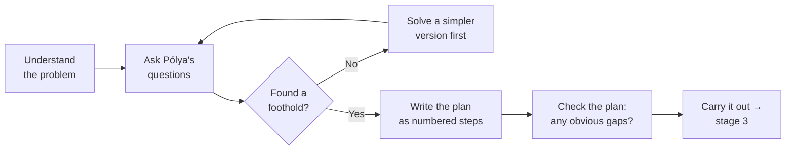

> **What?** Devising a plan is Pólya's second stage: after you understand the problem, you find a *path* from the data you have to the result you want — a strategy you can describe in words *before* you write a line of code.
> **How?** You ask a small set of questions ("Have I solved something like this before? Can I solve a smaller version first?"), sketch a sequence of steps, and write that sequence down so you can check it. The plan is a guess about how to get there — you'll test it when you actually build.

---

This page is the second of four stages in [George Pólya's *How to Solve It*](../). Stage 1 — [Understanding the Problem](../01-understanding-the-problem/) — is about knowing *where you are* and *where you want to be*. Stage 2, here, is about finding the *route between them*. Stage 3 — [Carrying Out the Plan](../03-carrying-out-the-plan/) — is the build. Stage 4 — [Looking Back](../04-looking-back-and-reflecting/) — is the review.

The single biggest mistake juniors make is skipping straight from "I understand the task" to typing code. You open the editor, start a function, and discover the plan *while* coding. Sometimes that works. Often you get 80 lines in, hit a wall, and realize the whole approach was wrong. Devising a plan first — even a 90-second plan — is how you avoid that.

## 1. The gap between data and goal

Every problem is a gap:

```
[ what you have ]  ───── ??? ─────▶  [ what you want ]
   the data                            the unknown
```

"Devising a plan" is filling in the `???` — the arrow. You're not building yet. You're answering: *what steps, in what order, get me across?*

A concrete example. Task: "Given a list of orders, print the total revenue per customer."

- **Data:** a list of orders, each with a `customer_id` and an `amount`.
- **Goal:** one total per customer.
- **Plan (the arrow):** group orders by `customer_id`, sum `amount` in each group, then print each group's total.

That three-step sentence *is* the plan. Notice it's in plain English, not code. You can read it to a teammate and they'll nod. That's the test of a good junior-level plan: **say it out loud in one or two sentences.**

## 2. Pólya's questions for finding a plan

Pólya's whole book is a list of questions you ask yourself when you're stuck. For finding a plan, these are the ones to memorize:

| Question | What it gets you |
|---|---|
| **Have I seen this before?** | A solution you can reuse or adapt. |
| **Do I know a *related* problem?** | A pattern to borrow from. |
| **Can I solve a *simpler* version first?** | A foothold; build up from there. |
| **Can I solve *part* of it?** | Progress, even if not the whole thing. |
| **Can I restate the problem?** | A new angle that makes the path obvious. |

You don't ask all five every time. You ask until one of them gives you a foothold, then you start sketching.

### "Have I seen this before?"

This is the most powerful question and the one juniors forget. The orders example above is just **group-by-and-sum** — you've seen it in SQL (`GROUP BY customer_id`), in spreadsheets (pivot table), in every reporting feature ever. The moment you recognize *"this is a group-by"*, the plan writes itself. Recognizing that a new task is an instance of a known class is [pattern recognition](../../01-computational-thinking/02-pattern-recognition/) — and it's the fastest route to a plan.

So before inventing anything, ask: *what does this remind me of?*

## 3. Solve a simpler version first

When you *can't* see the path, shrink the problem until you can.

> Task: "Find the two numbers in this array that add up to a target."
> You stare at it. No idea.
> Simpler version: "Find the two numbers in an array **of size 2**." Trivial — just check if they sum to the target.
> Next: "size 3." Check all pairs.
> Next: "any size." Check all pairs — a double loop.

Now you have *a* plan (check all pairs). It might be slow, but it works. Slow-but-correct is a real plan; "I'm stuck" is not. Getting *something* working and improving it later is the **brute-force-then-optimize** strategy — covered more at the [middle](./middle.md) level. The point for now: **a smaller problem you *can* solve is a ladder up to the one you can't.**

```python
# Step 1: solve the brute-force version (the plan you can see).
def two_sum_bruteforce(nums, target):
    for i in range(len(nums)):
        for j in range(i + 1, len(nums)):
            if nums[i] + nums[j] == target:
                return (i, j)
    return None
# It works. Ship it. Speed it up only if the data is big.
```

## 4. Work forward vs. work backward

Two directions to fill in the arrow:

- **Forward** — start from the data and ask "what can I compute next?" Keep going until you reach the goal. (You have orders → you can group them → you can sum each group → that's the answer.)
- **Backward** — start from the goal and ask "what would I need *just before* this?" (I want per-customer totals → I'd need orders grouped by customer → I have orders → done.)

Most everyday tasks yield to forward thinking. But when the goal is specific and the data is vague, **work backward**:

> "I want a chart showing daily signups." Work backward: a chart needs `(date, count)` pairs → counts come from grouping signups by day → signups come from the `users` table with a `created_at` column. Now you know exactly what query to write.

Pólya stresses working backward for problems where the *end state* is clear but the *starting move* isn't. Try both directions; whichever fills in the arrow faster wins.

## 5. Write the plan down — concrete, but not code

A plan you can't check is wishful thinking. So write it as a short numbered list:

```
PLAN: revenue per customer
1. Read all orders.
2. Group them by customer_id (a dict: customer_id -> running total).
3. For each order, add amount to that customer's total.
4. Print each customer_id and its total.
```

This is the sweet spot. It's **concrete enough to check** — you can read step 2 and ask "wait, what if a customer has zero orders?" *before* coding. But it's **not code in disguise** — you haven't decided variable names or syntax, so you stay flexible.

A bad junior plan is too vague: *"loop through and add stuff up."* You can't check that — what's "stuff"? A bad plan in the other direction is just code with line numbers, which means you've started building without thinking. Aim for the middle: real steps, plain words.



## 6. When NOT to plan

Planning has a cost. For a **tiny, reversible** change — fixing a typo, renaming a variable, bumping a version number — writing a plan is slower than just doing it. If you can undo the change in five seconds (it's in version control, it's one line, nothing depends on it), **just try it.** The plan-first rule is for changes where being wrong is *expensive* — where you'd write a lot of code before discovering the approach was wrong.

Rule of thumb: *the bigger the thing you'd have to throw away if you're wrong, the more the plan is worth.*

## 7. The plan is a guess

Your plan is your best current guess at the route — and like any guess, it can be wrong. You'll find out when you build (stage 3). When step 2 turns out to be impossible, you come *back* here and re-plan. That's normal. A senior engineer doesn't make perfect plans; they make *checkable* plans and update them fast.

## Try it yourself

For your next task, before coding, write three or four numbered steps in plain English and read them out loud. If a step is vague ("handle the data"), you've found a gap — fix it now, while it's cheap.

## Where this fits

- Comes after **[Understanding the Problem](../01-understanding-the-problem/)** — you can't plan a route until you know the destination.
- Feeds into **[Carrying Out the Plan](../03-carrying-out-the-plan/)** — where the plan gets tested against reality.
- When *no* plan comes, see **[Techniques When You Are Stuck](../06-techniques-when-you-are-stuck/)**.
- Recognizing "I've seen this class of problem" is **[pattern recognition](../../01-computational-thinking/02-pattern-recognition/)**.
- Back to the **[roadmap root](../../README.md)**.
