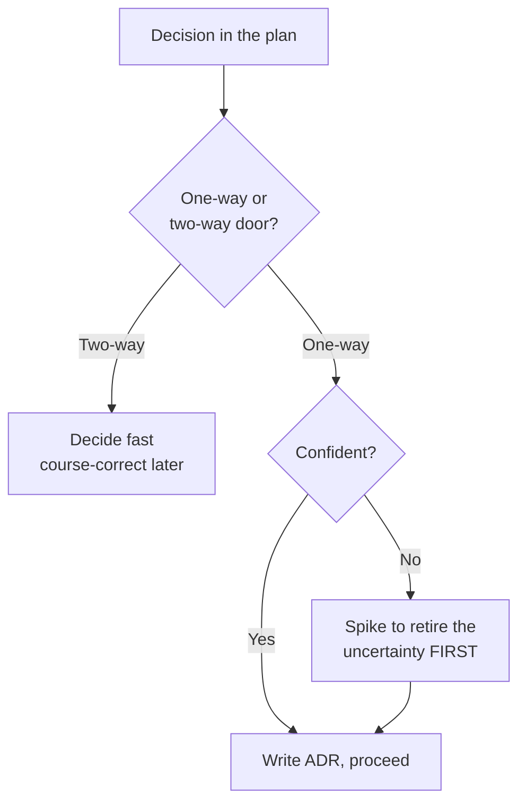

> **What?** At the senior level, devising a plan is *technical strategy under uncertainty*: selecting among architectural approaches, sequencing work to retire the biggest unknowns first, and producing a plan robust enough to survive contact with reality — all framed as [Pólya's](../) second stage but applied to systems, not toy problems.
> **How?** You make the *space* of approaches explicit, evaluate them with means-ends analysis and reduction-to-known-problems, sequence by risk and reversibility (one-way vs. two-way doors), encode the plan as a falsifiable hypothesis with named kill-criteria, and design feedback loops so the plan corrects itself as you execute.

---

The senior difference is not "bigger plans." It's *judgment about which uncertainties dominate* and the discipline to attack those first, cheaply, before the cost of being wrong compounds. A junior plans the steps; a senior plans the **order of learning**.

## 1. Means-ends analysis: the formal version of "work backward"

Pólya's "work backward" has a precise cognitive-science formalization: **means-ends analysis (MEA)**, from Newell & Simon's *Human Problem Solving* (1972) and the GPS solver. The loop:

1. Compute the **difference** between the current state and the goal state.
2. Find an **operator** that reduces that difference.
3. If the operator can't apply yet (its preconditions aren't met), **set up a sub-goal** to satisfy the preconditions, and recurse.

This is exactly how a senior plans a non-trivial migration:

> Goal: serve reads from a new sharded store. Current: single Postgres.
> Difference: data isn't in the new store; app code reads from old store.
> Operator: switch read path. Precondition: data is migrated *and* verified consistent.
> Sub-goal: build the migration + verification. Precondition of *that*: a dual-write path so the new store stays current. Sub-goal: dual-write. …

MEA generates the *dependency order* of the plan automatically — and notice it generates it **backward from the goal**, which is why senior plans so often read as a chain of preconditions. The forward version (start from data, see what you can build) is fine for additive features; MEA's backward chaining shines when the goal is fixed and the path is the hard part.

## 2. Make the approach space explicit

Mediocre senior plans present *one* design as if it were inevitable. Strong ones make the **option space** visible and argue the choice. This is the divergent-then-convergent discipline ([divergent vs. convergent](../../07-creative-and-lateral-thinking/01-divergent-vs-convergent/)) scaled to architecture: enumerate genuinely different approaches, then converge with stated criteria.

> Problem: process 50k events/sec, currently dropping during spikes.

| Approach | Reduces to | Key risk | Reversibility |
|---|---|---|---|
| A. Bigger consumers + autoscale | Horizontal scaling | Cost; downstream DB becomes the bottleneck | High |
| B. Buffer in Kafka, consume at steady rate | Producer/consumer decoupling | Latency budget; operational complexity | Medium |
| C. Batch + micro-batch processing | Throughput-over-latency tradeoff | Changes the latency contract with consumers | Low (contract change) |
| D. Backpressure + shed load | Flow control | Dropping events deliberately — needs product sign-off | High |

Each row names the **known problem it reduces to** — that's how you inherit prior art and known failure modes instead of re-deriving them. The table itself is the plan's reasoning made auditable. A reviewer can attack a *cell*, not just vibe-disagree with the conclusion.

## 3. One-way doors vs. two-way doors

Senior sequencing turns on reversibility. Borrowing the framing: some decisions are **two-way doors** (cheap to reverse — try it, learn, walk back) and some are **one-way doors** (irreversible or very expensive — choosing a database, a public API contract, a data model that millions of rows will encode).

The strategy:

- **Two-way doors:** decide fast, move on, course-correct from data. Over-planning these is waste.
- **One-way doors:** slow down. Spike. Write the decision down (an ADR). Get review. These deserve the deep planning; everything else does not.

A senior's plan *allocates planning effort by door type*. The migration above is a one-way door (the new shard key is hard to change once 40M rows use it) — so the plan front-loads a spike that *validates the shard key against real query patterns* before a single row moves. The skeleton loader in the dashboard is a two-way door — no plan needed, ship it.



## 4. Sequence to retire risk, not to make progress

The defining senior move: **order the work by how much uncertainty each step removes per unit of cost**, not by what's easiest or most visible.

Concretely, for any plan, rank the open questions by `(probability it's a problem) × (cost if it is)` — an expected-cost ranking — and schedule the top item *first*, in the cheapest form that can answer it (a spike, a load test, a proof-of-concept query, a conversation with the team that owns the downstream system).

> Migration plan, risk-ordered:
> 1. **Spike: validate shard key** against a week of real query logs. (Highest unknown × highest cost-if-wrong. One day of work answers a one-way-door question.)
> 2. **Spike: measure dual-write overhead** under peak load. (Could kill Approach B.)
> 3. Build dual-write. 4. Backfill in batches. 5. Verify consistency. 6. Flip reads. 7. Decommission old store.

Steps 1–2 produce *no shippable feature*. They produce **information** — and that information is what makes steps 3–7 safe. A junior's plan starts at step 3 because that's where "building" begins. The senior knows steps 1–2 are where the project is actually won or lost.

## 5. The plan as a falsifiable hypothesis

Encode the plan so it can be *proven wrong cheaply*. Every risky step states its **kill-criterion** — the observation that would invalidate the approach — borrowing directly from [hypothesis-driven / spike practice](../../09-scientific-and-hypothesis-driven/04-spikes-and-prototypes/).

```
HYPOTHESIS: sharding on customer_id lets us hit 50k events/sec at <50ms p99.
STEP 1 (kill-criterion): if >5% of production queries are cross-shard
        scatter-gather, the shard key is wrong → STOP, re-evaluate Approach C.
STEP 2 (kill-criterion): if dual-write adds >15ms p99 to the hot path,
        Approach B is too expensive → STOP, consider async outbox.
DEFINITION OF DONE: reads served from shards, p99 < 50ms, zero data-loss
        verified by row-count + checksum reconciliation.
```

A plan without kill-criteria is faith. A plan *with* them is an experiment — and experiments are cheap to be wrong in, because you've pre-decided when to bail. This is what "the plan survives contact with reality" actually means: not that it's never wrong, but that it *detects* its own wrongness fast and has a defined off-ramp.

## 6. The right altitude: strategy, not coding-in-disguise

A senior plan sits at the **altitude of decisions and sequence**, deliberately *above* implementation. It names: the approach, the order, the kill-criteria, the interfaces between parts, the rollback. It does *not* name: function signatures, variable names, the exact SQL.

Two failure modes:

- **Too high** ("we'll modernize the data layer") — uncheckable, unfalsifiable, no one can disagree because it says nothing.
- **Too low** (pseudo-code for every function) — you've begun building under the label of planning, locked in choices prematurely, and the "plan" is now as brittle as code without any of code's testability.

The check: *Can a peer read this plan and (a) tell me which step they think will fail, and (b) suggest a different approach?* If the plan is too high, they can't find a step to attack. If it's too low, they're reviewing code, not strategy. The middle altitude invites exactly the disagreement that makes the plan better *before* it's expensive to change.

## 7. Design the feedback loop into the plan

Reality will diverge from the plan. Seniors don't fight this; they instrument for it. Build the **observation points** into the plan itself: after the spike, after the first batch, after 10% rollout — explicit checkpoints where you compare actual to expected and decide *continue / adjust / abort*.

```
ROLLOUT CHECKPOINTS:
  1% traffic  → check p99, error rate, cross-shard %. Hold 1h.
  10% traffic → re-check + downstream DB load. Hold 1 day.
  50% / 100%  → only after the above are green.
ROLLBACK: feature flag flips reads back to old store in <1 min, any checkpoint.
```

The plan is now self-correcting: it has built-in moments to apply [Looking Back](../04-looking-back-and-reflecting/) *mid-flight* rather than only at the end. This is the difference between a plan you *execute* and a plan you *steer*.

## Where this fits

- Formalizes the "work backward" heuristic from **[Understanding the Problem](../01-understanding-the-problem/)** as means-ends analysis.
- Feeds **[Carrying Out the Plan](../03-carrying-out-the-plan/)** with risk-ordered, kill-criteria-bearing steps.
- Builds checkpoints that invoke **[Looking Back](../04-looking-back-and-reflecting/)** continuously, not just at the end.
- Approach generation is **[divergent vs. convergent thinking](../../07-creative-and-lateral-thinking/01-divergent-vs-convergent/)** at architecture scale.
- Risk-retiring spikes: **[Spikes and Prototypes](../../09-scientific-and-hypothesis-driven/04-spikes-and-prototypes/)**.
- Back to the **[roadmap root](../../README.md)**.
