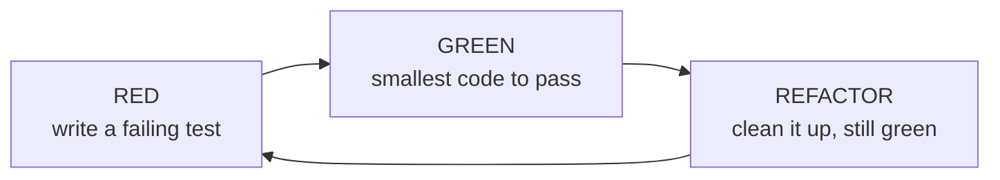
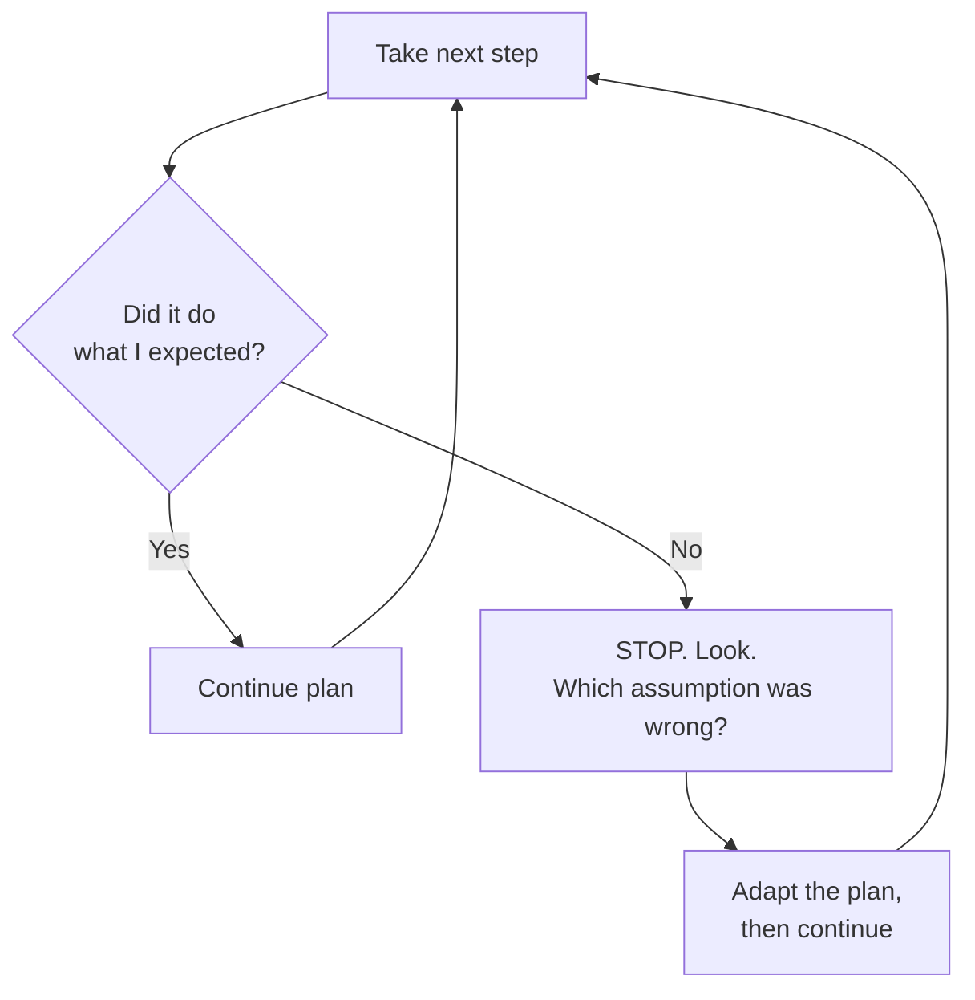

> **What?** Pólya's third stage: actually executing the plan you devised — and checking each step *as you do it* instead of writing everything and hoping it works at the end. The plan tells you *where* to go; carrying it out is the disciplined walk, one verified step at a time.
>
> **How?** Make one small change, confirm it does what you expect (run it, test it, print it, eyeball the output), and only then take the next step. When a step surprises you, stop and look — don't pile more code on top of a broken foundation.

---

## 1. The core demand: check each step

George Pólya, in *How to Solve It* (1945), splits problem-solving into four stages: understand the problem, devise a plan, **carry out the plan**, and look back. Most people think the third stage is the easy one — "you already have the plan, just type it in." Pólya disagrees. His instruction for this stage is short and uncomfortable:

> *"Carrying out your plan of the solution, **check each step**. Can you see clearly that the step is correct? Can you prove that it is correct?"*

That's the whole discipline in two questions. For every step you take:

1. **Can you see clearly that it's correct?** — Do you actually understand why this line, this function call, this query does what you think?
2. **Can you prove it?** — Could you show someone — by running it, by a test, by a trace — that it works, rather than just believing it does?

Junior engineers usually skip both. They write fifty lines, run the program once at the very end, get a stack trace, and have no idea which of the fifty lines is wrong. They built a tower in the dark and only switched the light on at the top.

## 2. Barreling ahead vs. checking as you go

There are two ways to execute a plan. Watch the difference.

**Barreling ahead (the trap):**

```
write parse()      # didn't run it
write validate()   # didn't run it
write transform()  # didn't run it
write save()       # didn't run it
run the whole thing → CRASH somewhere
```

Now the bug could be anywhere across four functions, and the functions interact, so the failure point is not the cause point. You're debugging four unknowns at once.

**Checking as you go (the discipline):**

```
write parse()      → run on one input → output looks right ✓
write validate()   → feed it a bad input → it rejects ✓
write transform()  → check one row by hand ✓
write save()       → check the row landed in the DB ✓
```

Each step is confirmed before the next one rests on it. If something breaks at `transform()`, you *know* `parse()` and `validate()` were already good — the bug is in the last thing you touched. This is the single most valuable habit you can build early: **shrink the distance between "I changed something" and "I know whether it worked."**

## 3. Small, verifiable increments

The unit of work is not "the feature." It's "the smallest change I can verify." Kent Beck's Test-Driven Development formalizes this as the **red-green-refactor** loop:



- **Red** — write a tiny test for the next bit of behavior. It fails (proving the test actually tests something).
- **Green** — write the *least* code to make it pass. Run it. It's green.
- **Refactor** — tidy the code while the test keeps you honest.

You don't have to do strict TDD to use the idea. The principle is: **every increment ends in a known-good state you confirmed.** Even without tests, you can do this manually — change one thing, run it, look at the result.

| Increment size | What you can conclude when it breaks |
|---|---|
| Whole feature, run once | "Something, somewhere, is wrong." Useless. |
| One function at a time | "The function I just wrote is wrong." Useful. |
| One line / one assertion | "That line is wrong." Surgical. |

## 4. Keep a working state — don't break everything at once

A close cousin of small steps: **never let the whole thing be broken at the same time.** If your code compiled and ran five minutes ago and now it doesn't, the cause is in those five minutes — *if* you didn't change ten things at once.

Practical rules at the junior level:

- **Commit small and often.** A commit is a save point you can return to. If your next experiment makes things worse, `git stash` or reset back to the last good commit and you've lost minutes, not hours. (More on this in [Devising a Plan](../02-devising-a-plan/) — small steps are easier to plan when you trust you can undo them.)
- **Keep the build green.** If you can run the program / tests at any moment and they pass, you have a floor to stand on. Don't make a change that leaves the project unbuildable for an hour while you "finish."
- **Make it work, then make it right.** Beck's order is *make it work, make it right, make it fast.* Get a working version first — even ugly — then improve it. A working ugly thing is verifiable; a half-finished elegant thing is not.

## 5. Leave a trail

When you carry out a plan, you're also creating a record. Future-you (or a teammate) will want to know what you tried. Cheap ways to leave a trail:

- **Commit messages** that say *why*, not just *what* ("revert to polling — websocket dropped under load" beats "fix bug").
- **A scratch note** — even a text file — listing what you tried and what happened. "Tried index on `user_id`, query still slow → it's the JOIN, not the lookup."
- **Comments on surprising steps** — not on the obvious, but on the *why is this weird line here* moments.

The trail is what lets you **backtrack**. If step 4 fails, a trail tells you exactly what state step 3 left things in, so you can step back instead of starting over.

## 6. The plan is a hypothesis — adapt when a step fails

You devised a plan based on what you *believed* about the problem. Reality is the referee. When a step fails, it's often because an assumption in the plan was wrong — not because you executed badly.



The wrong reactions:
- **Force it.** Keep hammering the same approach harder, ignoring that reality just told you it won't work.
- **Panic-abandon.** Throw out the whole plan at the first obstacle and start fresh, losing all the verified steps that *were* fine.

The right reaction: a failing step is **information**. Stop, figure out which expectation was violated, update *that part* of the plan, and keep the rest. You don't abandon a road trip because of one closed road — you reroute around it.

> When you can't even tell why a step failed, you've crossed into debugging — see [Debugging as Problem-Solving](../05-debugging-as-problem-solving/). When you're truly stuck and out of moves, see [Techniques When You're Stuck](../06-techniques-when-you-are-stuck/).

## 7. A worked example

Plan: "Add an endpoint that returns a user's orders, newest first."

```
Step 1: hardcode the route, return []        → curl it → 200 + [] ✓
Step 2: query orders for a fixed user id     → curl → real rows ✓
Step 3: take user id from the URL param      → curl /users/7/orders → user 7's rows ✓
Step 4: sort newest-first                     → curl → check dates descending ✓
Step 5: handle "user not found"               → curl /users/999/orders → 404 ✓
```

Five verified steps. At every point the endpoint *ran*. If step 4's dates came out ascending, you'd know instantly the sort is wrong and steps 1–3 are fine. Compare that to writing all five steps blind and getting one mysterious 500.

## 8. Common junior pitfalls

| Pitfall | What it looks like | Fix |
|---|---|---|
| Big-bang coding | 200 lines, then run | One verifiable step at a time |
| Hope-driven dev | "It should work" | "I confirmed it works" |
| Changing many things | Editing 5 files before running | Change one, run, then the next |
| No save points | Hours of work, no commits | Commit at each green step |
| Forcing a dead step | Hammering the same broken idea | Treat failure as info; adapt |
| Silent surprises | Output looks odd, keep going | Stop the moment it surprises you |

## 9. Practice

1. Take your next small task and write down the steps *before* coding. After each step, write how you'll confirm it (run command, expected output). Then execute, checking each.
2. For one session, commit after every passing step. Notice how often a working save point would have saved you.
3. Next time a step surprises you, *stop immediately* and find out why before writing anything else. Time how long the investigation takes — it's almost always shorter than the debugging you'd have done otherwise.

> Continue to [Looking Back and Reflecting](../04-looking-back-and-reflecting/) once it works — checking each step is execution; reviewing the whole solution is its own stage. Back to the [Problem-Solving section](../) or the [Engineering Thinking roadmap](../../README.md).
