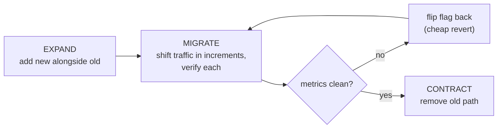
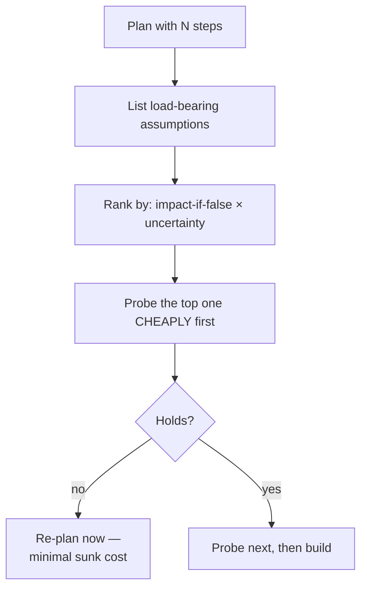
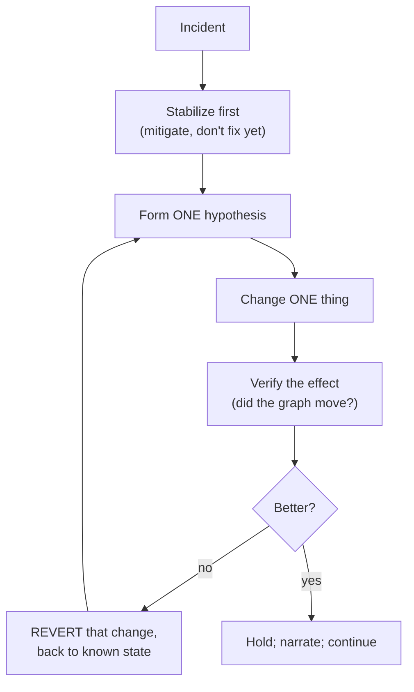

> **What?** Execution as a managed activity across a complex change: maintaining a shippable system while a large plan is in flight, instrumenting the plan so each step is *provably* correct against production reality, treating the plan as a falsifiable hypothesis you actively try to break, and making the adapt/persist/kill call with rigor rather than emotion — including under the time pressure of an incident.
>
> **How?** Decompose the plan into independently shippable, reversible increments behind flags. Define the verification *before* each step (what observable proves it worked). Front-load assumption-killing probes. Keep a decision log. When reality contradicts the plan, run a deliberate triage; when you're commanding an incident, follow the plan, narrate, and don't flail.

---

## 1. The senior reframe: execution is risk management

Pólya's *check each step — can you prove it's correct?* is, at senior scale, a question of **how do I make each step provable, cheaply, against a real production system, while never leaving that system broken.** A senior doesn't just verify steps; they *design the execution so that verification is built in and the cost of a wrong step is bounded.*

The mental model shift: a plan is not a script to type out, it's a **sequence of hypotheses you are trying to falsify as early and cheaply as possible.** Good execution maximizes the rate at which you learn the plan is wrong (when it is) while minimizing the blast radius of being wrong. Everything below serves that.

## 2. Decompose for shippability and reversibility

A large plan that can only be verified or shipped as a whole is a liability. The senior unit of execution is the **independently shippable, reversible increment**. Three properties:

| Property | Why it matters | Mechanism |
|---|---|---|
| Independently shippable | Each step delivers/verifies value alone; you never carry a half-done broken change for days | Feature flags, expand/contract |
| Reversible | A wrong step costs a flag flip, not a rollback war | Dark launches, flags, additive migrations |
| Observable | "Done" means an observable proves it, not "I think so" | Metrics, traces, assertions, canaries |

For schema and contract changes, **expand/contract (parallel change)** is non-negotiable: add the new path, migrate readers/writers incrementally with verification at each, remove the old path last. The system is shippable and reversible at *every* phase.



The flag is the key. It turns "deploy and pray" into "ramp and observe." A wrong step at 5% traffic is a graph wobble you flip off, not a 3am page.

## 3. Define verification *before* the step

Juniors check a step by looking at it afterward. Seniors decide *what observable would prove this step correct* **before** taking it — because if you can't state in advance how you'll know it worked, you don't understand the step well enough to take it. This is the same falsifiability discipline as [Scientific and Hypothesis-Driven Thinking](../../09-scientific-and-hypothesis-driven/), applied to your own changes.

For each step, write the predicate:

```
Step: route 10% of reads to the new cache.
Pass predicate:  cache hit-rate > 90% AND read p99 not worse AND
                 zero correctness mismatches in the shadow-compare.
Fail predicate:  any mismatch, OR p99 regresses > 5%.
Action on fail:  flag to 0%, the new cache returns stale/wrong data — investigate.
```

Now the step is *provable*. You're not asking "does it feel okay" — you have a number that says go or stop. This also defeats confirmation bias: a pre-committed fail predicate stops you from rationalizing a bad result as acceptable.

## 4. Front-load the assumption-killers

Every large plan rests on a few load-bearing assumptions. The execution sin is discovering the false one after you've built everything on top of it. Senior execution **identifies the load-bearing assumptions and kills them first** with the cheapest possible probe — a spike, a one-day dark launch, a back-of-envelope load test.



The dollar logic: a probe that takes a day and might invalidate a three-week plan is one of the highest-leverage hours you'll spend. Resist the pull to "start making visible progress" on the easy, low-risk steps — visible progress on a plan that's about to die is the most expensive kind of work.

## 5. Adapt, persist, or kill — with rigor

The plan is a hypothesis; production is the experiment. When results contradict the plan, the senior runs a deliberate triage instead of an emotional reaction.

| Signal | Likely call | Discipline required |
|---|---|---|
| A tactical assumption was wrong, goal intact | **Adapt** — reroute, keep verified work | Update *only* the broken part; don't throw out the good |
| Obstacle is real but the plan is still the best path | **Persist** | Verify you're not persisting on sunk cost |
| A core assumption is now proven false | **Kill** | Don't let prior investment hold the plan hostage |

The decisive test, applied honestly: **"Knowing what I know now, would I choose this plan from scratch today?"** If no, the only thing keeping you on it is sunk cost — a documented cognitive bias, covered in [Cognitive Biases in Code Decisions](../../04-critical-thinking/03-cognitive-biases-in-code-decisions/). Seniors are also expected to spot the *opposite* error in the team: thrash — abandoning plans at the first bump, never accumulating verified progress. Both are failures of execution temperament.

A **decision log** keeps this honest. One line per pivot: *what we believed, what reality showed, what we decided, why.* It defeats sunk cost (the cost is written down, not felt), enables backtracking (you know the state each decision left), and is the raw material for [Looking Back and Reflecting](../04-looking-back-and-reflecting/).

## 6. Leave a trail others can follow

At senior scale you're rarely the only one touching the system, and the trail is for the team and for future-you:

- **Commits that explain *why*** the change, not just what — the reasoning is the expensive part to reconstruct.
- **A running decision log** for the plan's pivots (§5).
- **Runbook updates** as you learn operational facts ("the worker needs the SMTP rule open in `us-east`").
- **A reversible breadcrumb at each risky step** — the flag name, the canary, the rollback command — so anyone, not just you, can back it out at 3am.

If only you can revert your change, your change is a single point of failure. Execution that can't be safely continued or reverted by a teammate is incomplete.

## 7. Execution hygiene under pressure: the incident

An incident is execution with the time-pressure dial at maximum — and it's exactly when discipline collapses into flailing: many people change many things at once, nobody verifies, and the system gets *less* understood as more changes pile on. Pólya's stage three is the antidote. The incident-command stance:



The disciplines, all of which are §1–§6 under stress:

- **One change at a time, verified.** Ten simultaneous changes mean you can never attribute the effect — you've destroyed your ability to learn. This is *check each step*, non-negotiable, when it's hardest.
- **Mitigate before you diagnose.** Stop the bleeding (roll back the deploy, shed load, flip the flag) before you chase root cause. The plan during an incident is "restore service," not "understand everything."
- **Narrate continuously.** A running channel log — "I'm rolling back deploy X, expect error rate to drop in 2 min" — keeps the team coordinated, prevents two people undoing each other, and is the post-mortem timeline for free.
- **Don't flail.** If you don't have a hypothesis, you're not executing a plan, you're gambling. Stop, state what you believe, then act. A calm "I don't know yet, let me check the deploy timeline" beats a frantic three random restarts.
- **Always have a revert.** Every change you make during an incident should be backable-out. You're already in a degraded state; never make a change you can't undo.

The senior who runs an incident *exactly like* a normal plan — small verified steps, one hypothesis, a trail, a revert ready — is the one who stays calm, because the method doesn't change just because the stakes did.

## 8. Senior execution checklist

- [ ] Is the plan decomposed into independently shippable, reversible, observable increments?
- [ ] For each step, did I define the pass/fail predicate *before* taking it?
- [ ] Are the load-bearing assumptions probed first, cheaply?
- [ ] Is every risky step behind a flag / canary I can flip off?
- [ ] Is there a decision log capturing pivots and their reasons?
- [ ] Could a teammate revert any step of mine without me?
- [ ] In an incident: one change at a time, mitigate-first, narrate, always a revert?

## 9. Practice

1. For your current in-flight change, write the pass/fail predicate for each remaining step *before* doing it. Notice any step where you can't — that's a step you don't understand yet.
2. List your plan's load-bearing assumptions, rank by impact×uncertainty, and design the cheapest probe to kill the top one. Run it this week.
3. After your next incident, check the channel log: was it one-change-at-a-time and narrated, or a flail? Write the one habit you'll change.

> Next: [Looking Back and Reflecting](../04-looking-back-and-reflecting/) — turning a finished execution into durable lessons. Related: [Debugging as Problem-Solving](../05-debugging-as-problem-solving/), [Techniques When You're Stuck](../06-techniques-when-you-are-stuck/). Back to the [Problem-Solving section](../) or the [Engineering Thinking roadmap](../../README.md).
