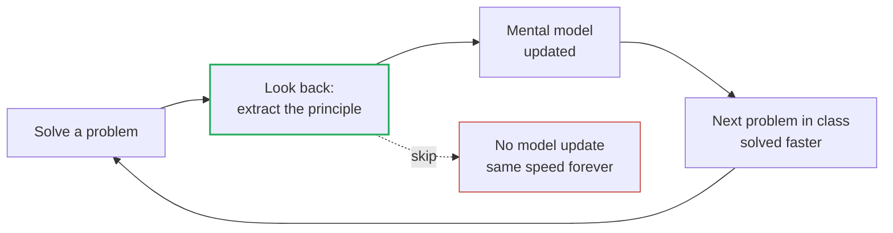

> **What?** At senior level, *looking back* is a deliberate-practice engine and a team discipline. It is how you convert solved problems into transferable expertise (pattern recognition), how you run **blameless postmortems** that find systemic causes instead of culprits, and how you make reflection a default — including reflection on your own *reasoning*, not just your code.
>
> **How?** You run looking-back at three altitudes: on your own solutions (extract the principle, not the fix), on incidents (blameless postmortem → action items that ship), and on your own thinking (where was my reasoning wrong, not just my output?). You build it into the team's workflow so it happens under pressure, and you measure whether the reflection actually changed behavior.

---

By now verifying the result and refactoring under green are reflexes. The senior shift is twofold: looking back becomes the mechanism by which you *get better*, and you start running it for the team, not just yourself.

## 1. Reflection is the deliberate-practice loop

Anders Ericsson's research on expertise (*Peak*, 2016) is unambiguous: time-on-task does not produce expertise — *deliberate practice* does, and its defining feature is **immediate, specific feedback that you act on**. For an engineer, looking back *is* that feedback step. Skip it and you get the thing everyone warns about:

> *Twenty years of experience, or one year repeated twenty times.*

The difference between those two careers is entirely whether you reflect after each solved problem. The mechanism:



### Extract the principle, not the fix

The junior records *"I used `.get()` to avoid the KeyError."* The senior records the *principle*: *"Any external map/lookup can miss; design for absence at the boundary — fail soft, default explicitly, or validate at ingress."* The first is a fact about one bug. The second transfers to config loading, API responses, cache misses, and feature flags. **Generalize the lesson to the level where it applies broadly but is still actionable.**

This is how pattern recognition gets built. Chess masters don't calculate more moves than novices; they *recognize* more positions because they reflected on thousands of games. You build the same chunked library by abstracting each solved problem into a reusable pattern — see [deliberate practice](../../10-metacognition-and-learning/03-deliberate-practice/).

## 2. Looking back at incidents: the blameless postmortem

When something breaks in production, the looking-back artifact is a **postmortem**. The single most important property is that it is **blameless** — a term popularized by John Allspaw at Etsy (*"Blameless PostMortems and a Just Culture,"* 2012) and codified in Google's *SRE Book*.

Blameless does **not** mean "no accountability." It means: assume every engineer acted reasonably given what they knew, and treat the question *"why did this make sense to them at the time?"* as the path to the real cause. The instant people fear punishment, they hide information — and you lose the data you need to actually fix the system.

### Structure of a postmortem

| Section | Question it answers |
| --- | --- |
| **Summary** | What broke, for whom, how long, what impact? |
| **Timeline** | What happened, minute by minute, including detection and recovery? |
| **Root cause(s)** | *Why* did it happen — the systemic chain, via 5 Whys / causal analysis? |
| **What went well** | What limited the blast radius? (Reinforce these.) |
| **What went poorly** | Where did detection/response/design fail? |
| **Action items** | Specific, owned, dated changes that prevent recurrence. |

### Blameless framing in practice

```text
❌ Blameful:   "Priya pushed a bad config and took down checkout."
✅ Blameless:  "A config change passed review and CI, then failed in prod
               because no environment had the prod traffic shape. The system
               let an unvalidated-at-scale change reach 100% of users."

The blameful version stops at a person; nothing changes; it recurs.
The blameless version names a SYSTEM gap: no canary, no prod-shaped test.
That produces an action item. That prevents the next outage.
```

The test of a good postmortem: **the same incident could not be caused by a different person.** If your fix is "tell Priya to be careful," you found a scapegoat, not a cause. If your fix is "add canary deploys + config schema validation," you found the system.

## 3. 5 Whys, applied honestly

The 5-Whys technique (Toyota Production System) drives from symptom to systemic cause — but only if you keep the answers blameless and follow more than one branch.

```text
Outage: checkout returned 500 for 20 minutes.
Why? A config change set the DB pool to 5 connections.
Why? The default in the new config schema was 5, not 50.
Why? The schema was copied from a low-traffic service.
Why? We have no per-service capacity defaults or validation.
Why? Capacity config isn't treated as a reviewed, tested artifact.
→ Action: capacity config gets schema + load-test gate, like code.
```

Notice each "why" stays on the *system*. The moment an answer becomes "because someone forgot," push again: *why did the system rely on someone remembering?* Humans will always forget; the fix is to remove the reliance.

## 4. Action items that actually get done

The most common postmortem failure mode is the document that's written, filed, and never acted on. A finding without an owner and a date is a wish. Make action items real:

| Bad action item | Good action item |
| --- | --- |
| "Improve deploy safety." | "Add canary stage to checkout deploy pipeline. Owner: @sam. Due: 2 weeks. Tracked: JIRA-4821." |
| "Be more careful with config." | "Add JSON-schema validation to config CI, blocking merge on invalid. Owner: @lee. Due: sprint 14." |

Track them like any other work, with the same prioritization. A useful senior habit: **review open postmortem action items in the team's regular planning** — unactioned items are how the same outage happens twice.

## 5. Look back at your reasoning, not just your output

The deepest level of looking back examines *how you thought*, not just what you produced. The bug is fixed — but *why did you not see it for three hours?* What false assumption sent you down the wrong path?

```text
Output-level look-back:  "The null check was missing; added it."
Reasoning-level:         "I assumed the upstream API never returns null
                          because it 'never had.' I trusted a pattern over
                          the contract. I should verify contracts, not habits."
```

That second note prevents a whole *class* of future bugs, not one. This is [debugging your own reasoning](../../10-metacognition-and-learning/02-debugging-your-own-reasoning/) — auditing your assumptions, biases, and dead-ends. The senior who does this routinely stops repeating their *thinking* mistakes, which is a far bigger lever than stopping any single code mistake.

## 6. Making reflection survive pressure

Reflection dies first under deadline. The senior's job is to make it cheap and automatic enough that it survives:

- **Bake it into Definition of Done.** "Verified against original ticket + edge cases re-run + one refactor pass" is a checklist item, not optional virtue.
- **Time-box it.** A 10-minute look-back is infinitely better than the zero-minute one you skip because "it'll take too long."
- **Make the artifact lightweight.** A three-line `lessons.md` entry beats a polished doc nobody writes.
- **Reduce the incentive to skip.** If the team punishes incidents, postmortems become defensive theater. Blameless culture is what keeps reflection honest under pressure.

## 7. A senior look-back in full

A latency spike took p99 from 80ms to 4s for 40 minutes.

1. **Verify the fix** solves the *original* problem: p99 back under 100ms, sustained over 24h, confirmed on the real traffic pattern — not just a synthetic load.
2. **Blameless postmortem.** Timeline reconstructed from traces. Root cause via 5 Whys: an N+1 query shipped because the ORM lazy-loads and no test asserted query count under realistic data volume.
3. **Generalize.** This isn't "fix this one N+1." The class is "ORM lazy-loading + no query-count assertion = latent N+1." Action item: add a query-count test helper and a CI check that flags >N queries per request.
4. **Reasoning audit.** *Why* did review miss it? Reviewers read the diff, which looked clean — the cost was invisible at the source level. Lesson: code review can't catch behavior that only emerges at scale; we need a *mechanical* check, not more careful humans.
5. **Capture.** Postmortem published, action items owned and tracked, runbook updated with the detection signal so next time it's caught in 4 minutes, not 40.

The outage produced a permanent improvement to the *system* and to *how the team thinks about ORM performance*. That is looking back operating at senior altitude.

---

**Key takeaways**

- Looking back *is* the deliberate-practice feedback loop — skip it and you get "one year of experience, twenty times."
- Extract the **principle**, not the fix, and generalize to the level where it transfers across a whole class.
- Run **blameless** postmortems: assume reasonable actors, hunt the *systemic* cause, and verify your fix couldn't be defeated by swapping the person.
- Action items need an owner, a date, and a tracker — and review the open ones in planning, or the outage repeats.
- Audit your **reasoning**, not just your output: the wrong assumption that cost you three hours is the real bug to fix.

Next: [professional](./professional.md) — institutionalizing reflection across an organization. Back to the [problem-solving section](../) · [engineering thinking roadmap](../../README.md).
