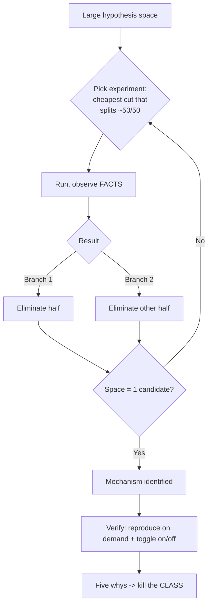

> **What?** Debugging is root-cause inquiry under uncertainty: you treat a defect as a falsifiable scientific question, build a model of the system precise enough to predict its behavior, and converge on the mechanism — not just the symptom — fast enough to matter.
> **How?** You design experiments that maximize information per unit cost, bisect across whichever dimension is cheapest (time, input, layer, environment, traffic), distinguish the symptom from the cause with the five whys, and refuse to close until you can reproduce-on-demand and toggle the bug — then you kill the *class*, not the instance.

---

## 1. Debugging as information theory

A bug starts as a large hypothesis space — every line, every dependency, every config value that *could* be the cause. Each experiment you run partitions that space. A senior debugger's edge is choosing experiments that **maximize information per minute spent**.

The best test is the one whose two possible outcomes are *both* informative and roughly *equiprobable* — a clean bisection. A test that almost certainly confirms what you already believe yields ~0 bits; you learned nothing. So before running anything, ask:

1. **What does this test rule out if it passes? If it fails?** If one branch teaches you nothing, find a better test.
2. **What's the cost?** A log line is seconds; reproducing a prod incident in staging might be hours. Prefer the cheapest test that still *discriminates*.

This reframes "where do I look next" as an optimization problem: pick the cut that halves the space at the lowest cost. It's [decomposition](../../01-computational-thinking/01-decomposition/) plus [measure-before-optimize](../../09-scientific-and-hypothesis-driven/03-measure-before-optimize/) — instrument the real system, let data partition the space, never argue with a measurement.

---

## 2. Build the model before you experiment

Agans' Rule 1 — *Understand the system* — is the senior's first move, and it's where time invested pays the most. You cannot form a sharp hypothesis about a system you can't predict. Before touching the bug, get crisp on:

- **The data flow.** Where does this value originate, what transforms it, where does it land? The bug is somewhere on that path.
- **The boundaries.** Process, network, serialization, thread, cache, clock. Bugs cluster at boundaries — that's where assumptions silently differ (string vs. number, UTC vs. local, `[]` vs. `nil`, your retry vs. their idempotency).
- **The invariants.** What must *always* be true (balance ≥ 0, ids unique, list sorted)? A bug is a violated invariant; naming the invariants tells you what to assert.

A senior often finds the bug *during this modeling step*, before running a single experiment — because the act of stating precisely what the system should do exposes the place where it can't.

---

## 3. Symptom vs. cause — the five whys

The cardinal sin at this level is fixing the symptom: the crash stops, the ticket closes, and the disease metastasizes into a worse incident. Drive past the proximate failure with the **five whys** (Toyota Production System) until you reach a cause you can actually remove.

> **Symptom:** Checkout returns 500 for some users.
> 1. *Why?* `tax` is `NaN`. →
> 2. *Why?* `rate` came back `undefined` from the tax service. →
> 3. *Why?* The service returns `undefined` for regions not in its table. →
> 4. *Why?* A new region launched but its tax row was never seeded. →
> 5. *Why?* Region onboarding has no checklist step for tax data, and no schema constraint enforces a row per region.

Each "why" moves the fix one layer deeper and one order-of-magnitude more durable:

| Fix at layer | What it does | Half-life |
|---|---|---|
| `if (isNaN(tax)) tax = 0` | hides the symptom; ships wrong totals silently | days |
| Validate `rate` at the boundary, fail loud | stops the corruption spreading | weeks |
| Seed the missing tax row | fixes *this* region | until the next launch |
| NOT NULL constraint + onboarding checklist | makes the whole class impossible | permanent |

Stop at the layer where the fix is durable *and* proportionate to the risk — but always know how deep the rabbit hole goes before you choose where to stop.

---

## 4. The hard bugs — heisenbugs, races, corruption

These are the bugs that separate seniors. They resist reproduction, which is exactly why method beats cleverness.

### Heisenbugs

Observation changes the outcome — adding a log or attaching a debugger makes the bug vanish because it perturbs timing or suppresses a compiler optimization. **The disappearance is itself a clue**: it tells you the bug is timing- or optimization-sensitive, i.e. a race, an uninitialized read, or undefined behavior the optimizer is exploiting. Switch to *low-perturbation* observation: ring-buffer logging, hardware/data breakpoints, post-hoc tracing, core dumps. Reason from the constraint the disappearance reveals, not from the (now-hidden) symptom.

### Races and concurrency

You can't bisect timing by hand. Use the tooling that *forces* the schedules:

- **Race/thread sanitizers** (`-race`, TSan) detect unsynchronized access without you reproducing the exact interleaving.
- **Stress + jitter:** run the suspect section thousands of times, inject random delays/`yield` to widen the bad window; a 1-in-10⁶ race becomes routine.
- **Shrink the window deliberately:** insert a `sleep` at the suspected interleaving point. If the failure rate spikes, you've both confirmed *and* localized the race.

### Corruption and emergent bugs

A value is wrong but no single line is obviously at fault — memory corruption, an aliased buffer, a cache that drifts out of sync with its source. The move is **assertion bisection**: place invariant checks at successive points along the data path until one fires. The first failing assert brackets the corruption between two known-good/known-bad points — then bisect *between* them. Tools like ASan/Valgrind, watchpoints on the corrupted address, and `git bisect` on the introducing commit collapse the space that pure reading never will.

---

## 5. Debugging across boundaries you don't own

In a real system, the cause often lives in someone else's code, a third-party API, or the platform. The discipline holds — *"select isn't broken"* (The Pragmatic Programmer): suspect your own code first, because it's true >95% of the time. But when evidence points outward, prove it with a **minimal reproduction outside your code**: a `curl` against the API, a 20-line program hitting the library, a query straight to the DB. That minimal repro is both your proof and your bug report; it removes "works on my machine" from the conversation and gives the owning team something they can't argue with.

This is where "check the plug" (Rule 7) earns its keep: before blaming the library, confirm you're on the version you think, the config you think, the environment you think. A staggering share of "their bug" is a stale dependency or a wrong env var on your side.

---

## 6. The fix isn't done at the fix

Closing a bug well includes three things juniors skip:

1. **Toggle proof.** Reproduce on demand, apply fix → gone, revert → returns, reapply → gone. Only now do you *know* the mechanism (Rule 9). Anything less is "it works now and I don't know why" — which is not fixed, it's hidden.
2. **A regression test that fails without the fix.** Encode the reproduction so the bug can't silently return. The test *is* the proof that you understood it; if you can't write a failing test, you don't yet understand the bug.
3. **Class elimination.** From [looking-back](../04-looking-back-and-reflecting/): if this bug was possible, how many siblings exist? A null here implies nulls everywhere that path is shared; a missing await here implies others. Grep for the pattern, add the lint rule or type, fix the family.

---

## 7. A worked corruption hunt

**Symptom:** A reporting job occasionally emits a negative account balance; not reproducible on demand, ~1 run in 50, only in production.

1. **Model + invariant.** Balance must be ≥ 0; it's computed by summing a ledger. Invariant: `running_total` is monotonic over a sorted-by-time ledger. State it explicitly.
2. **Make it fail.** Pull the exact prod dataset for a failing run into staging; it reproduces ~1 in 50. Loop the job 500× — now it fails ~10× per batch. Reproducible enough.
3. **Heisenbug check.** Adding verbose logging *reduced* the failure rate → timing-sensitive → suspect concurrency in the aggregation.
4. **Assertion bisection.** Add `assert ledger.is_sorted_by(time)` before the fold. It fires. The space collapses: the bug is *upstream* of the fold, in how the ledger is assembled.
5. **Bisect the assembly.** The ledger is built by N parallel fetchers appending to a shared slice without synchronization → a lost/reordered append under contention.
6. **Hypothesis + cheap test.** "Concurrent appends race the slice." Run under the race detector: it flags the exact append. Confirmed.
7. **Fix the cause, not the symptom.** Not "sort the ledger again after the fact" (symptom) — make each fetcher return its own slice and merge deterministically (cause). Add `assert is_sorted` permanently as a tripwire.
8. **Five whys → class.** Why unsynchronized? The shared-slice pattern was copied into three other jobs. Fix all three; add a lint rule against appending to a captured slice from goroutines.
9. **Verify.** 5,000 looped runs, zero negatives; revert the fix → races return under `-race`. Toggle proven, regression test added.

← Back to [Problem-Solving](../) · [Understanding the problem](../01-understanding-the-problem/) · [Looking back](../04-looking-back-and-reflecting/) · [Engineering Thinking root](../../README.md)

---

## Key takeaways

- Treat debugging as maximizing information per unit cost: pick the cheapest experiment that splits the hypothesis space ~50/50.
- **Understand the system first** — model data flow, boundaries, and invariants; you often find the bug there before running anything.
- Use the **five whys** to drive past symptom to a removable cause; choose the fix layer by durability, not by what makes the ticket close.
- Hard bugs (heisenbugs, races, corruption) yield to *method*, not cleverness: low-perturbation observation, sanitizers, assertion bisection, loop-to-amplify.
- When the cause is across a boundary, prove it with a minimal external reproduction — but suspect your own code first.
- Done = reproduce-on-demand + toggle on/off + a regression test that fails without the fix + the bug *class* eliminated.
