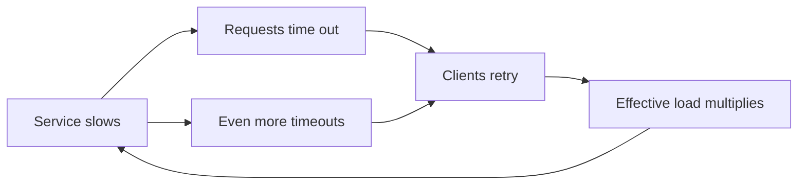
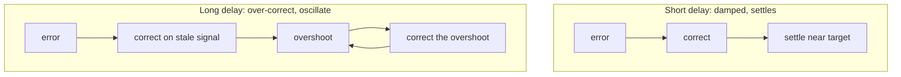

> **What?** Feedback loops are the *engine* of system dynamics: structures where state drives action that changes state. The behavior you see over time — steady, oscillating, exploding, collapsing — is determined by the loops present, their **gain** (how strongly output affects input), their **delay** (lag between signal and correction), and which loop currently **dominates**.
>
> **How?** As a mid-level engineer you stop just spotting loops and start *reasoning about their dynamics*: you predict oscillation from delay, you recognize when a balancing loop will flip into a reinforcing death spiral under load, and you reach for the standard dampers — backoff, jitter, circuit breakers, backpressure — knowing *which loop parameter* each one changes.

---

## 1. The vocabulary of dynamics: gain, delay, dominance

Three parameters decide what a loop *does*, and you should be able to name all three for any loop you analyze.

- **Gain** — how strongly a change in output translates into a change in input. High gain = aggressive correction. A retry policy that fires 5 retries has higher gain than one that fires 1.
- **Delay** — how long between the output changing and the correction landing. Instance boot time, metric scrape interval, review turnaround, propagation lag.
- **Dominance** — at any moment, multiple loops are active; the one currently controlling behavior is *dominant*. Systems shift regimes when dominance shifts (more on this in §6).

These map directly to control theory. A balancing loop with high gain and long delay is a textbook recipe for oscillation — the same math behind a wobbling PID controller and a thrashing autoscaler.

## 2. Balancing loops as controllers

A balancing loop is a controller: measure → compare to setpoint → act on the error. The richest engineering example is the **PID controller**, and it's worth understanding because its three terms map onto failure modes you'll see in production systems.

| Term | What it responds to | Too much causes | Engineering analogue |
|------|---------------------|-----------------|----------------------|
| **P** (proportional) | Current error | Oscillation, never quite reaches target | Autoscaler scaling proportional to CPU overshoot |
| **I** (integral) | Accumulated past error | Sluggish, "windup" overshoot | Catch-up after a long backlog |
| **D** (derivative) | Rate of change of error | Jumpy, noise-sensitive | Reacting to the *slope* of latency, not its level |

You rarely write a literal PID controller, but the lesson generalizes: **pure proportional reaction with delay oscillates**; you damp it by reacting to trends and by smoothing. Autoscalers that scale on a moving average instead of instantaneous CPU are borrowing the same idea.

### TCP congestion control: a balancing loop you rely on constantly

TCP's **AIMD** (Additive Increase, Multiplicative Decrease) is a beautifully tuned balancing loop. The signal is packet loss ("the link is congested"). The correction:

- **Additive increase:** when things are fine, grow the congestion window slowly (+1 per RTT). Gentle probing upward.
- **Multiplicative decrease:** when loss happens, cut the window in half. Aggressive backoff downward.

The asymmetry (slow up, fast down) is deliberate: it keeps many flows sharing a link from oscillating in lockstep and from collectively overrunning the bottleneck. This is the gold standard for "how to design a balancing loop that's stable under contention" — and it's the exact intuition behind exponential backoff in your retry logic.

## 3. Reinforcing loops and the death spiral

A reinforcing loop has gain that compounds. The dangerous ones in distributed systems share a shape: **a degradation causes behavior that worsens the degradation.**

The **retry death spiral** is the archetype:

Walk the numbers. Say each client retries up to 3× on timeout. Under normal load the service handles 10k req/s. It slows; now requests time out, and the *effective* load becomes up to 30k req/s — three times the original — precisely when capacity is lowest. The loop's gain is ~3×, and it compounds every cycle. The service cannot recover on its own because **the recovery action (retry) is the thing keeping it down.** This is a *metastable failure*: the trigger is long gone, but the system stays wedged in the bad state because a reinforcing loop sustains it.

Other members of the family:

- **Cache stampede:** a hot key expires → N concurrent misses → all hit the origin → origin slows → more requests queue → more misses.
- **Thundering herd:** capacity returns → all clients reconnect simultaneously → capacity dies again.
- **GC death spiral:** memory pressure → more GC → less CPU for work → requests queue → more allocation → more pressure.

## 4. Delay turns balancing loops into oscillators

This is the single most important dynamic insight at this level: **delay is what makes a corrective loop unstable.**

A balancing loop *wants* to settle at its target. But if the correction arrives late, it's correcting based on stale information, so it overshoots — then overshoots the other way correcting *that*. The result is oscillation, and longer delay means bigger, slower swings.

### The bullwhip effect

The classic illustration from supply-chain systems (Lee, Padmanabhan & Whang, *Sloan Management Review*, 1997): small fluctuations in retail demand cause progressively larger swings upstream in orders to wholesalers, then manufacturers, then raw materials. Each link reacts to delayed, smoothed information about the link downstream, and the delays compound the amplitude.

The software version is everywhere:

- **Autoscaler thrash:** scale-up takes 3 minutes to boot; by the time capacity arrives the spike is over, so it scales down; then the next spike hits unprepared. The loop chases a moving target it can never catch.
- **Queue-length-based scaling** on a slow signal: you scale on a 1-minute-old queue depth and oscillate around the right answer.

**Mitigations all attack delay or gain:** shorten the delay (pre-warmed pools, faster boots, fresher metrics) *or* reduce the gain (cooldown windows, rate-limited scaling, hysteresis bands so you don't react to every wiggle).

## 5. The standard dampers — and which parameter each one changes

The reason senior engineers reach for the same four tools is that each one modifies a specific loop parameter. Knowing *which* keeps you from cargo-culting them.

| Damper | What it does | Loop parameter it changes |
|--------|--------------|---------------------------|
| **Exponential backoff** | Each retry waits longer (1s, 2s, 4s…) | Lowers gain of the retry loop over time |
| **Jitter** | Randomize wait so clients don't sync | Breaks the *synchronization* that turns many small loops into one big spike |
| **Circuit breaker** | Stop calling a failing dependency | *Cuts* the reinforcing loop entirely |
| **Backpressure** | Push "slow down" back to the sender | Converts an uncontrolled reinforcing loop into a balancing one |
| **Load shedding** | Drop excess work to stay under capacity | A balancing loop that protects the setpoint (capacity) |

### Why jitter specifically

Backoff alone is not enough. If 10,000 clients all fail at the same instant and all back off "2 seconds," they retry *together* 2 seconds later — you've just rescheduled the thundering herd. **Jitter de-correlates them.** The AWS Architecture Blog's "Exponential Backoff And Jitter" is the canonical reference: full jitter (`sleep = random(0, base * 2^attempt)`) flattens the retry spike into a smooth trickle. Backoff lowers the loop's gain; jitter destroys the lockstep that gives a reinforcing loop its punch.

### Circuit breakers as loop cutters

A circuit breaker is the clean way to *break* a reinforcing loop: after enough failures it "opens" and fails fast without calling the dependency, removing the load that's keeping the dependency down. After a cooldown it lets a trickle through ("half-open") to test recovery. It's a balancing loop wrapped around a reinforcing one, and it ties directly to managing [risk and failure probabilities](../../06-probabilistic-thinking/03-risk-and-failure-probabilities/).

## 6. Loop dominance: systems shift regimes

A system rarely has one loop. It has several, and **which one dominates determines the regime you're in.** Trouble comes when dominance shifts unexpectedly.

A service under normal load is dominated by its *balancing* loops (autoscaler, load balancer spreading traffic). Push past a threshold and a *reinforcing* loop (retries, queue growth) takes over and the same system that was self-correcting now self-destructs. The system didn't change — the *dominant loop* did.

Recognizing the threshold is the skill. Signs you're near a dominance flip:

- Latency that was linear in load suddenly goes super-linear (queues forming).
- Retry rate climbing (the reinforcing loop warming up).
- Error budget burning faster than traffic grew.

Designing for this means making sure your *balancing* loops are stronger than your *reinforcing* ones near the limit — that's literally what load shedding and circuit breakers buy you: they guarantee a balancing loop wins before the reinforcing one runs away.

## 7. Feedback loops in *your* process

The same dynamics govern teams, not just servers:

- **Deploy frequency** is the gain of your delivery loop. Deploying daily means small corrections; deploying quarterly means giant, delayed, oscillation-prone ones — the bullwhip effect applied to releases.
- **Code review latency** is a delay in the quality loop. A 2-day review delay means your branch drifts and rework compounds.
- **MTTR** (mean time to recovery) is the delay in your incident loop — see [DORA metrics](../04-mental-models-of-systems/) framing.

Shortening these loops is the same move as shortening an autoscaler's delay: it makes the whole system more stable and faster to correct.

## 8. The mid-level discipline

For any system, produce this analysis:

1. **Enumerate the loops** — balancing and reinforcing.
2. **For each: gain and delay.** High-gain long-delay balancing loops oscillate; high-gain reinforcing loops run away.
3. **Find the dominance threshold** — at what load does a reinforcing loop take over?
4. **Place a damper at the right parameter** — backoff/jitter for retry gain, circuit breaker to cut, backpressure to convert, cooldown to reduce reactivity.

This is the bridge to thinking in tradeoffs: every damper costs something (latency, dropped work, complexity). See [Thinking in tradeoffs](../05-thinking-in-tradeoffs/) and [Leverage points and bottlenecks](../06-leverage-points-and-bottlenecks/) — changing a loop's gain or delay is one of the highest-leverage moves available.

**Keep this:** the behavior is in the structure. Read the loops — their sign, gain, delay, and which one dominates — and you can predict whether a system settles, swings, or dies.
