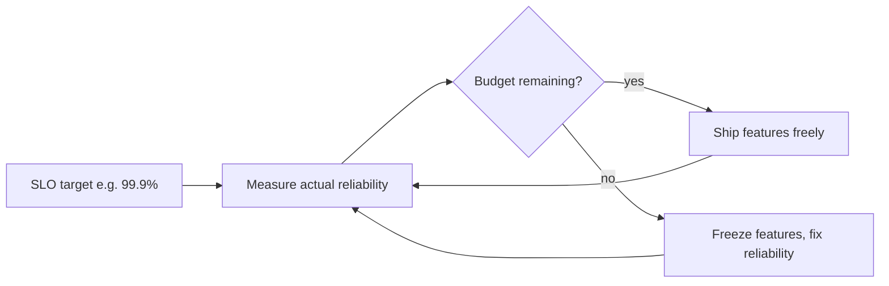

> **What?** At staff/principal level, feedback loops are an organizing lens for *systems of systems* — architecture, delivery, operations, and the organization itself. You design org-scale feedback machinery (SLO/error-budget loops, deploy/incident loops, the DORA loop), you spot destructive reinforcing loops in *process and structure* before they run away, and you set loop parameters (gain, delay) as a deliberate part of how the whole socio-technical system behaves.
>
> **How?** You institute the loops that make an organization self-correcting — error budgets that throttle risk, incident reviews that feed structural fixes, fast delivery that shortens the consequence-to-correction gap — and you intervene at the highest-leverage parameter (usually a delay) across both the machines and the people running them.

---

## 1. The unit of design is now the loop, not the service

A principal engineer rarely tunes one autoscaler. The leverage is in the loops that span the whole system: how fast the org learns it broke something, how fast a bad decision self-corrects, whether a degrading subsystem triggers behavior elsewhere that worsens it. The same four parameters apply at every scale — **sign, gain, delay, dominance** — but now the "system" includes pipelines, on-call rotations, planning cadences, and incentive structures.

The master frame remains Meadows' *Thinking in Systems*: behavior over time is produced by feedback structure, and the leverage is in changing that structure. At org scale the structure is made of people, process, *and* code — but it's still loops, and they still oscillate, run away, and stabilize for the same reasons.

## 2. The error-budget loop: a balancing controller for an organization

The SLO/error-budget mechanism (Google SRE) is the cleanest example of deliberately engineered organizational feedback. It is a balancing loop whose setpoint is a *reliability target* and whose actuator is *the right to ship*.

Read it as a controller:

- **Setpoint:** the SLO. **Signal:** actual SLI over the window. **Error:** budget burned.
- **Actuator:** feature velocity. Spend the budget → slow down and harden. Budget healthy → go fast.
- **Gain and delay matter as always.** A monthly budget window is a long delay — you can burn the whole budget on day 2 and not feel the brake until you compute it. *Burn-rate alerts* (multi-window, multi-burn-rate) shorten that delay: they fire when you're burning budget fast *now*, not at month-end. That's a delay reduction on an organizational loop, and it's why mature SRE uses them.

The deep point for staff engineers: this loop **aligns incentives automatically** instead of by argument. It converts "should we prioritize reliability or features?" from a recurring political fight into a measured balancing loop. That's the highest form of leverage — changing the structure so the right behavior emerges without anyone arbitrating it. (See [Parts, whole, and emergence](../01-parts-whole-and-emergence/).)

## 3. The delivery loop: deploy frequency is a gain, lead time is a delay

DORA's four metrics are not a scorecard; they are the **parameters of your delivery feedback loop**, and reading them that way tells you what to fix.

| DORA metric | Loop role | What it controls |
|-------------|-----------|------------------|
| Deployment frequency | **Gain / batch size** | How small each correction is |
| Lead time for changes | **Delay** | How long from decision to consequence-visible |
| Change failure rate | Loop *quality* (overshoot) | How often a correction makes things worse |
| Time to restore (MTTR) | **Delay of the recovery loop** | How fast you exit a bad state |

The dynamics insight: **infrequent, large deploys are the bullwhip effect applied to software.** Big batches mean big, delayed corrections — more overshoot, harder rollbacks, longer time to find which change caused a regression. Frequent small deploys shrink both the gain (small batch) and the delay (fast feedback), which is *why* high-DORA orgs are both faster and more stable, not despite each other. You're not trading speed for safety; you're shortening a loop, and a shorter loop is better on both axes.

Principal move: when an org is slow *and* unstable, don't add process (which lengthens the delay). Shorten the loop — trunk-based development, CI, automated rollback, feature flags — and stability improves *because* the loop got faster.

## 4. The incident loop: from event to structural fix

Incident response is a nested set of loops, and a principal engineer is responsible for the *outer* one — the loop that turns incidents into structural improvements, not just restored service.

- **Inner loop (minutes):** detect → page → mitigate → restore. Its delay is MTTA + diagnosis + mitigation. If a reinforcing failure (retry storm, metastable wedge) can run away faster than this loop closes, **humans cannot be in the loop** — you must pre-place automation (auto-shed, breakers, rollback). A staff engineer audits which failures are too fast for humans and ensures those are automated.
- **Outer loop (days–weeks):** blameless review → identify the *loop structure* that amplified a trigger → fund the fix → verify it removed a class of failures. The delay here is "time from incident to landed structural fix." If that delay is long, the org keeps re-paying for the same loop. A common dysfunction: action items that fix the *trigger* ("add a retry on this call") while leaving the *amplifying loop* intact — sometimes even strengthening it.

The principal discipline in a review: **always name the loop, not just the trigger.** "The deploy was the trigger; the outage was a retry storm with unbounded gain. The fix is a retry budget, which removes the loop for *every* future trigger." That reframing is what makes incident reviews compound instead of repeat.

## 5. Destructive reinforcing loops in process and structure

The loops that hurt orgs most are not in the code — they're in how the org works, and they're reinforcing, so they compound silently until they're a crisis.

| Vicious organizational loop | The reinforcing mechanism | The damper (changes gain or delay) |
|------------------------------|---------------------------|-------------------------------------|
| **Alert fatigue spiral** | Noisy alerts → ignored → real ones missed → more incidents → more alerts added | Cut alert gain: page only on symptoms/SLO burn; route the rest to dashboards |
| **Tech-debt death spiral** | Debt slows delivery → pressure to ship → more shortcuts → more debt | Error-budget-style debt budget; reserve fixed capacity (balancing loop) |
| **Review-latency spiral** | Slow reviews → big batched PRs → slower reviews → drift/rework | Shrink the loop: small PRs, review SLAs, reduce WIP |
| **On-call burnout spiral** | Burnout → attrition → fewer responders → more load → more burnout | Cap the gain: toil budgets, load-based rotation, fix the noisy loops feeding it |
| **Flaky-test spiral** | Flaky tests → engineers ignore red → real failures merged → more incidents | Quarantine + balancing loop that blocks merge on flake rate |

Each is a reinforcing loop with no built-in brake. The staff-engineer job is to **spot them while the gain is still small** — the curve is gentle early and brutal late — and install a balancing guard *before* the runaway. The signal is usually a leading indicator trending the wrong way (review latency creeping up, alert volume climbing, escaped-defect rate rising), not a crisis yet.

## 6. Loop dominance at org scale: regime shifts

Organizations, like services, shift regimes when loop dominance shifts — and the shifts are often invisible until they've happened.

- A team dominated by a *delivery* loop (shipping, learning, correcting fast) can flip into a *firefighting* loop (every cycle consumed by incidents, no time to fix causes, so more incidents) once incident load crosses a threshold. Same team, different dominant loop, opposite trajectory.
- A healthy *growth* reinforcing loop (more users → more revenue → more investment → better product → more users) can be overtaken by a *scaling-pain* reinforcing loop (more users → more incidents/complexity → slower delivery → worse reliability → churn).

The principal responsibility: **monitor for the dominance flip and strengthen the good loop before the bad one takes over.** Reserve capacity for cause-fixing *before* firefighting consumes the team; invest in platform/scalability *before* scaling pain dominates. By the time the flip is obvious, the reinforcing loop has compounded and the climb back is steep.

## 7. Setting loop parameters as policy

At this level you set defaults that become the gain and delay of thousands of loops you'll never see individually:

- **Platform-default retry budgets, backoff+jitter, and circuit breakers** in the standard client library — so every service inherits bounded retry gain and de-synchronized retries by default. This single decision immunizes the whole fleet against retry storms without any team thinking about it.
- **Default SLOs and burn-rate alerts** so every service has a balancing reliability loop with a fast-enough delay.
- **CI/CD and rollback as paved road** so the delivery loop is short by default.
- **Backpressure and bounded queues** as the default integration pattern, so reinforcing queue-runaway can't occur fleet-wide.

The leverage of a default is enormous: you're setting a loop parameter once and it applies everywhere, forever, until changed. This connects to [Thinking in tradeoffs](../05-thinking-in-tradeoffs/) — a default that's too conservative wastes capacity; too loose invites runaway — and to [Leverage points and bottlenecks](../06-leverage-points-and-bottlenecks/), where changing system-wide parameters and adding/removing loops are the highest-ranked interventions.

## 8. The highest leverage is almost always a delay

Across machines and organizations, the move that pays the most is usually **shortening a delay**, because it stabilizes every loop downstream of that signal:

- Shorten *deploy lead time* → the whole org corrects mistakes faster (DORA delay).
- Shorten *incident detection* → reinforcing failures are caught before they compound (and more can stay automated).
- Shorten *budget-burn feedback* → reliability self-corrects mid-month, not at month-end.
- Shorten *decision-to-consequence* feedback → strategy itself becomes a faster, more stable loop.

Meadows ranks loop parameters and feedback structure high among leverage points precisely because of this. The principal habit: when asked to fix a slow, unstable system — technical or organizational — **find the dominant delay and cut it**, before adding any process (which usually adds delay and makes it worse).

## 9. The principal mindset

- Design the loops, not just the components: error-budget, delivery, and incident loops are the machinery that makes an org self-correcting.
- Read DORA/SLOs as loop parameters (gain, delay), not scorecards — they tell you *what to shorten*.
- Hunt reinforcing loops in *process and structure* (alert fatigue, debt, firefighting, burnout) early, while the gain is still gentle, and install a balancing guard before the runaway.
- Watch for dominance flips — delivery → firefighting, growth → scaling-pain — and reinforce the good loop before the bad one wins.
- Set loop parameters as platform defaults so the whole fleet inherits bounded gain and short delays.
- When in doubt, shorten a delay.

**Keep this:** an organization is a system of feedback loops. Make the corrective loops fast and the amplifying loops bounded, watch which one dominates near the limit, and the whole socio-technical system becomes self-stabilizing instead of self-destructing.
