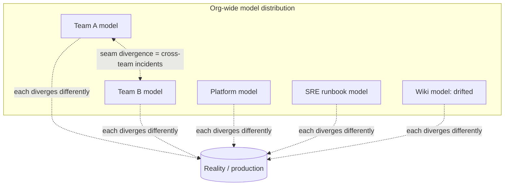

> **What?** At staff/principal level, the object of concern is no longer your own mental model but the **distribution of mental models across the organization** — what dozens of engineers across many teams believe about the system, how accurate those beliefs are, how aligned they are with each other, and how they drift. Divergent mental models between teams are an architectural and organizational risk with a measurable cost, and cultivating accurate *shared* models is a core part of the job.
>
> **How?** You design the system's *legibility* — the diagrams, docs, vocabulary, and self-describing telemetry that transfer accurate models at scale. You detect org-wide model drift before it causes coordinated failures, you treat onboarding and architecture review as model-transfer processes, and you quantify the cost of divergence to justify investment in alignment.

---

## 1. The unit of concern is the organization's model distribution

A junior worries about their own model. A senior worries about their team's shared model and a few neighbors'. A principal worries about a *probability distribution of models* spread across the whole engineering org — and the fact that the system's real behavior under stress is determined by **whichever model the person on call is holding**, multiplied across every team.

> Conway's Law has a mental-model corollary: each team's model of the system is shaped by the slice of it they own, and the *seams* between those models are exactly where cross-team incidents live.

The hard truth: there is no canonical model of a large system. There are Team A's model, Team B's model, the platform team's model, the SRE runbook's model, and the architecture wiki's (frozen, drifted) model. These differ, and the *differences are invisible* until an incident forces two of them to interact. The principal's job is to manage this distribution: raise its accuracy, reduce its variance (divergence), and slow its drift.



## 2. The cost of divergent mental models

Divergence is not a soft "communication" problem; it has concrete, often large, costs. Naming them lets you justify investment in alignment.

| Symptom of divergence | Concrete cost |
|---|---|
| Two teams assume the *other* owns retries on a shared call | Duplicate retries → retry-amplification outage |
| Producer and consumer disagree on a message's delivery guarantee | Silent data loss or duplicate processing in production |
| Platform team's model of "safe" config ≠ app team's usage | Misconfiguration that passes review and breaks at scale |
| API owner thinks an endpoint is idempotent; callers don't | Double-charges, double-sends during a partial failure |
| Each team's capacity model is local | No one owns the *global* L=λW ceiling → coordinated saturation |

Each row is a real outage class, and each traces back to **two accurate-but-incompatible models that never met**. The principal's leverage is to find these seams *before* production does — in design review, in shared-interface contracts, in game-days that deliberately cross team boundaries.

## 3. Designing for legibility: model-transfer at scale

You cannot personally transfer your model to 200 engineers. So you build *artifacts and mechanisms* that transfer accurate models without you in the loop. This is a design responsibility, not a documentation chore.

### 3.1 Diagrams and docs as the canonical model

- **C4 / layered architecture diagrams** that match the real system at the right zoom level — a context diagram for execs, container/component diagrams for engineers. A diagram is the highest-bandwidth model-transfer tool that exists; a good one beats a week of code reading.
- **Architecture Decision Records (ADRs)** capture *why*, which is the part of the model that erodes fastest and that no code or diagram preserves. "We chose eventual consistency here because…" prevents a future team from reasoning off a model that's missing the constraint.
- **A shared vocabulary** ("the ingest pipeline," "the hot path," "the control plane") so that when two staff engineers say the same words they're pointing at the same boxes. Divergent vocabulary is divergent models wearing the same costume.

### 3.2 Self-describing systems beat hand-drawn maps

The most durable model-transfer artifacts are the ones the system *generates about itself*, because they can't drift:

- **Service maps from distributed traces** — the topology is observed, not remembered.
- **Generated dependency graphs** from build metadata.
- **RED/USE dashboards** that encode the diagnostic model directly into the operational surface (Brendan Gregg's USE for resources; RED for services), so every on-call inherits the model by reading the dashboard.

> Hand-maintained maps drift; observed maps don't. A principal invests in making the system *legible by construction* rather than by discipline, because discipline doesn't scale and drift is relentless.

## 4. Detecting org-wide model drift

At small scale, drift shows up as a stale runbook. At org scale, drift is systemic and needs *instrumentation*, not vigilance.

```text
Org-drift detectors a principal installs:
  - Incident postmortems tagged "surprised us" → mine for the model gap that recurs
  - Onboarding feedback: which doc was wrong/confusing? (fresh eyes find drift fastest)
  - Diagram-vs-trace diff: does the wiki topology match the observed service map?
  - "Knowledge bus factor" audits: which subsystem's accurate model lives in exactly one head?
  - Recurring misuse of an interface across teams → the published model is wrong or missing
```

The principal insight: **a new hire's confusion is a drift sensor.** Fresh eyes hit the gap between the documented model and reality before anyone with calluses notices it. Systematically harvesting onboarding friction is one of the cheapest org-wide drift detectors available — and it doubles as an onboarding-quality metric.

### 4.1 Postmortems as model audits

Reframe every postmortem to ask explicitly: *whose model was wrong, and was it an individual gap or a shared/documented one?* If the on-call's model was wrong because the runbook drifted, that's an artifact fix that protects *everyone* next time. If two teams' models were incompatible, the action item is a contract or a seam owner, not "be more careful." This turns incidents into systematic model-correction across the org.

## 5. Onboarding and review as model-transfer processes

Two recurring organizational processes are, at their core, model transfer — and a principal designs them as such.

- **Onboarding is model transfer, deliberately structured.** The deliverable isn't "read these docs" — it's: here's the context diagram, now trace one real request end to end, now here's the failure table for the top three dependencies, now shadow an incident. A new engineer is productive exactly when their model becomes accurate enough to predict, and the org's onboarding design controls how fast that happens.
- **Architecture review is model reconciliation.** The real value of a design review is not approval — it's *surfacing where the proposer's model and the reviewers' models diverge* before code exists. A principal runs reviews to make implicit models explicit: "draw the failure path," "where does idempotency live?", "what's the L=λW ceiling here?" Questions that force the model out of heads and onto the whiteboard, where divergence is cheap to fix.

Peter Senge's *The Fifth Discipline* names "mental models" and "shared vision" as core disciplines of a learning organization precisely because surfacing and aligning models is *organizational* work. A principal operationalizes that: the org should continuously surface, test, and align the models its people hold.

## 6. The map-is-not-the-territory discipline, organizationally

At principal scale, the Korzybski humility scales up: *no document is the system, and no single person holds the territory.* The failure modes:

- **Worshipping the diagram**: an org that mistakes its architecture wiki for the system makes decisions on a drifted map and is blindsided in production.
- **Abandoning maps entirely**: an org with no shared model is a collection of local optima that collide at the seams; every cross-team change is a renegotiation from scratch.

The principal navigates between these by maintaining *living, validated, explicitly-incomplete* models: maps good enough to coordinate on, honest about their gaps, and wired to reality so they self-correct. The same calibrated confidence a senior applies to their own model, a principal applies to the org's documentation: trust it to coordinate, verify it at the load-bearing seams, and *measure* its drift.

## 7. Reusable models become org standards

A principal doesn't just carry the portable models (Little's Law, stocks & flows per Meadows, CAP/PACELC, USE/RED, the end-to-end argument, the memory/latency hierarchy from Jeff Dean) — they *standardize the vocabulary* so the whole org reasons in the same frame:

- Capacity is *always* discussed as `L = λW` and stocks/flows ([second-order effects](../03-second-order-effects/) and [feedback loops](../02-feedback-loops/) included), so cross-team capacity conversations compose.
- Reliability guarantees are *always* located via the end-to-end argument (Saltzer, Reed & Clark), so two teams never both assume the other handles it.
- Dashboards are *always* RED/USE, so any on-call can read any service.

Standardizing the lenses reduces model variance across the org for free: when everyone thinks in the same primitives, their models diverge less and compose better. This is the organizational analog of [parts, whole & emergence](../01-parts-whole-and-emergence/) — aligned local models produce coherent global understanding. Every org-level tradeoff ([thinking in tradeoffs](../05-thinking-in-tradeoffs/)) and every leverage decision ([leverage points & bottlenecks](../06-leverage-points-and-bottlenecks/)) is computed inside these shared models; if the org's shared model is wrong, the org is confidently, expensively wrong together. From the [systems-thinking root](../) and the [roadmap root](../../README.md), this is the apex skill: cultivating an organization that reasons from accurate, shared, self-correcting models.

## Key takeaways

- The principal's object of concern is the **org-wide distribution of mental models** — its accuracy, variance (divergence), and drift.
- Divergent models between teams have **concrete outage costs** (retry amplification, ownership gaps, idempotency mismatches); seams between team models are where cross-team incidents live.
- Design for **legibility**: canonical diagrams, ADRs (the *why*), shared vocabulary, and self-describing telemetry (trace-derived service maps, RED/USE dashboards) that transfer accurate models at scale and resist drift.
- Detect org drift with instruments: **onboarding friction as a drift sensor**, postmortems as model audits, diagram-vs-trace diffs, bus-factor checks.
- **Onboarding is model transfer; architecture review is model reconciliation** — design both to surface and align implicit models.
- **Standardize the reusable lenses** (L=λW, stocks/flows, end-to-end argument, RED/USE) so models across teams diverge less and compose.
