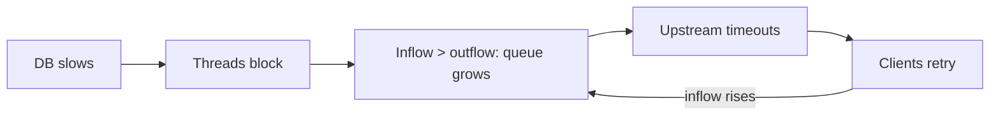
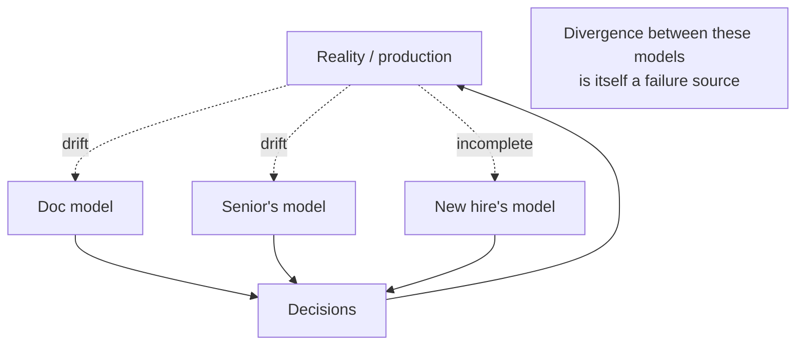

> **What?** For a senior engineer, a mental model is a *load-bearing instrument*: you reason about systems you can't fully observe, design changes before writing code, and predict failure modes in production by querying a model accurate enough to trust under pressure. You also recognize that *the team runs on a collection of models* — yours, your teammates', the on-call's — and that the divergence between them is itself a source of incidents.
>
> **How?** You build models that include dynamics and failure, validate them with experiments rather than trust, and keep them honest against drift. You design model-transfer artifacts (diagrams, ADRs, runbooks) so your understanding survives outside your head, and you actively reconcile the team's competing models before they collide in production.

---

## 1. The senior shift: from "how it works" to "how it breaks and changes"

Junior models answer *what calls what*. Mid-level models add *how things flow and saturate*. Senior models add two harder dimensions:

1. **Failure topology** — not just the happy path, but the full lattice of partial failures, degradations, and cascades, with the dynamics that drive them.
2. **Temporal accuracy** — the model is a *moving target*; you build it knowing it will drift and you design for that.

The senior superpower is **predicting system behavior you have never directly observed**. You haven't seen this exact partition before, but your model of CAP, of the replication topology, and of the client retry behavior lets you say "if the primary's network drops, writes will fail fast but stale reads will succeed from replicas for ~30s, then the cache TTL expires and read latency spikes." That prediction — made before the incident — is the entire value of a good model.

## 2. Modeling failure as a first-class structure

A senior's model of a system is, to a large degree, a model of its *failure modes*. For each dependency you carry not one arrow but a small table:

```text
Dependency: payment-gateway (external HTTP)
  Normal:     p50 80ms, p99 300ms
  Slow:       p99 5s   → our thread blocks → pool saturates at ~λ·W (Little's Law)
  Timeout:    we cut at 2s → retry? idempotent? retry storm risk → circuit breaker
  Down (5xx): fail fast → degrade to "pending" state → reconcile async
  Wrong data: schema drift → validate at boundary (end-to-end argument)
```

This is where the **end-to-end argument** (Saltzer, Reed & Clark, 1984) earns its place as a mental model: correctness and reliability properties must be enforced *at the endpoints that care*, because intermediate layers can't guarantee them. You don't trust the network to deliver exactly-once; you make the receiver idempotent. A senior carries this principle as a reflex — it tells you *where* in the system a given guarantee must live.

### 2.1 Cascades and feedback in the model

The failure model must include *dynamics*, because the worst outages are loops, not point failures:



That reinforcing loop — retries adding inflow exactly when outflow collapsed — is invisible to a static model and obvious to a senior who thinks in [feedback loops](../02-feedback-loops/) and [second-order effects](../03-second-order-effects/). The fix (load shedding, circuit breakers, backpressure) is a *leverage point* in the loop, not a patch on the symptom — see [leverage points & bottlenecks](../06-leverage-points-and-bottlenecks/).

## 3. Validating the model: experiments over trust

A senior does not *trust* their model; they *test* it. The discipline is identical to scientific method ([hypothesis & falsifiability](../../09-scientific-and-hypothesis-driven/01-hypothesis-and-falsifiability/)): a model makes a prediction, you design the cheapest experiment that could *falsify* it, and you run it.

| Question about the model | Experiment |
|---|---|
| "Does the circuit breaker actually open?" | Inject latency in staging; watch the breaker state |
| "Is this call really on the hot path?" | Add a span; read a real trace |
| "Can the pool handle 500 req/s?" | Load test to the L=λW ceiling; observe saturation |
| "Does a replica lag break this read?" | Chaos: pause replication; send the read |

This is the core of **chaos engineering**: it's not about breaking things for fun — it's about *validating the failure model* before production validates it for you. A model that has survived deliberate falsification is one you can reason from during a real incident.

> The unit of senior debugging is the **falsified prediction**. "I expected X, got Y" is not a frustration; it's the single most informative event available, because it points exactly at where your model is wrong.

## 4. Map is not the territory — and you act anyway

Senior judgment lives in the tension between two truths:

1. **The map is never the territory.** Your diagram omits, simplifies, and lags reality. Korzybski's phrase is a permanent caveat.
2. **You must act on the map anyway**, because you can never hold the full territory.

The resolution is *calibrated confidence*: hold the model firmly enough to make decisions quickly, but loosely enough to abandon it the instant evidence contradicts it. The failure mode at both extremes is real:

- **Over-trusting the map**: you keep "fixing" the wrong component because your model insists that's where the bug must be. (The junior who blames the database.)
- **Under-trusting the map**: paralysis — you re-verify everything from scratch every time and never make a decision.

The senior move is to *know which parts of your model are well-validated and which are assumptions*, and to spend verification effort exactly on the load-bearing assumptions. You don't re-derive that TCP works; you do double-check the unfamiliar caching layer.

## 5. Model drift at the senior scale

Drift is no longer just your problem — it's a property of the whole system's documentation and the team's collective understanding.

```text
Drift sources a senior watches for:
  - Architecture diagram last updated 2 reorgs ago
  - Runbook step references a deleted service
  - "Well-known" performance numbers from old hardware/old traffic
  - A config tuned for a load profile that no longer exists
  - Tribal knowledge that left with the engineer who quit
```

Drift is insidious because the model *keeps giving confident answers* — they're just wrong now. The defense is to wire **reality-checks into the system itself**:

- Architecture diagrams generated from code/infra (service maps from traces) rather than hand-drawn — self-updating maps drift less.
- Runbooks that are *executed* (or at least tested) periodically, so a broken step is caught in a game-day, not at 3 a.m.
- Treating every incident postmortem as a **drift audit**: "what did our model say would happen vs what happened?" The delta is documented drift, and the fix updates the *artifact*.

## 6. The team runs on a *collection* of models

This is the senior-scale realization: there is no single model of the system. There is *your* model, the on-call's model, the new hire's half-formed model, and the doc's frozen model. The system's effective behavior under stress depends on which model the person *currently making decisions* is holding.

> The most dangerous failure mode is **silent model divergence**: two engineers "agree" in a design review while picturing two different systems. The disagreement is real; it's just hidden until the code meets production.

Senior responsibilities follow directly:

- **Make models explicit and shared.** A diagram on the wall, a vocabulary everyone uses ("the hot path," "the ingest pipeline"), an ADR that records *why*. These are model-transfer tools. Peter Senge (*The Fifth Discipline*) frames "mental models" and "shared vision" as core disciplines of a learning organization for exactly this reason — surfacing and aligning models is organizational work, not just personal.
- **Onboarding = model transfer.** A senior who can hand a new hire an accurate model in a week has multiplied the team. The artifact (diagram + traced request + failure table) is the deliverable, not a vague "ask me anything."
- **Reconcile before the incident.** When you hear two people describe the system differently, that's a leak in the shared model. Surface it, draw it, agree on it — *now*, cheaply, instead of during an outage when it's expensive.



## 7. Reusable models, applied with judgment

The senior difference isn't *knowing* CAP or USE/RED — it's knowing *when each lens applies and where it lies*:

- **CAP** is a coarse model; you reason in terms of the more precise PACELC and the *actual* consistency guarantees your store offers, using CAP only as the entry-level frame.
- **USE/RED** tell you *where* to look but not *why*; you pair them with a request trace to localize.
- **Little's Law** gives steady-state ceilings; you know it lies during transients and you don't quote it mid-spike.
- **Latency numbers** (Jeff Dean) are orders of magnitude, re-floored by [first principles](../../05-first-principles-thinking/01-reasoning-from-fundamentals/) — speed of light sets a hard minimum cross-region RTT no engineering removes.

Holding a model *and its limits* is what separates senior reasoning from cargo-cult application. Every tradeoff you weigh ([thinking in tradeoffs](../05-thinking-in-tradeoffs/)) is computed *inside* a model; if the model is wrong, the tradeoff analysis is confidently wrong too. This is why model accuracy is upstream of nearly every other engineering skill — start from the [systems-thinking root](../) and the [roadmap root](../../README.md).

## Key takeaways

- A senior model is load-bearing: it predicts behavior — especially **failure** — that you have never directly observed.
- Model failure as a first-class structure (a table per dependency) and include **dynamics** (cascades, retry loops), not just point failures.
- **Don't trust your model — test it.** Chaos and load experiments validate the failure model before production does.
- Hold the map with **calibrated confidence**: firm enough to act, loose enough to drop on contradicting evidence; spend verification on load-bearing assumptions.
- Fight drift by wiring reality-checks into the system (generated diagrams, tested runbooks, postmortem drift audits).
- The team runs on a **collection of models**; silent divergence is the dangerous failure mode — surface, share, and reconcile them as explicit artifacts.
