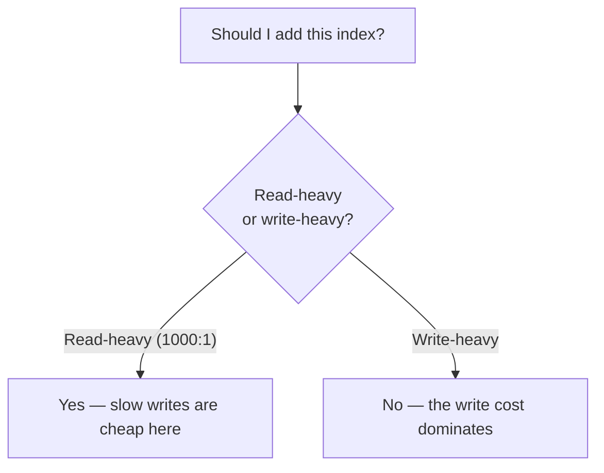

> **What?** A **tradeoff** is what you get when improving one property of a system forces another property to get worse. In a real system you almost never just "make it better" — you *exchange* one good thing (speed, simplicity, cost, safety) for another. "It depends" is not a dodge; it is the honest first sentence of any real engineering answer.
> **How?** When you read a "best practice" or pick a tool, ask one question before anything else: *what is this trading away, and is that a price I'm happy to pay here?* If you can't name the cost, you haven't understood the choice yet.

---

## 1. There is no free lunch

The most useful sentence in engineering is: **there is no free lunch.** The phrase comes from optimization theory (the "No Free Lunch" theorems, Wolpert & Macready, 1997), but you'll feel it on day one of real work: every gain is paid for somewhere.

- You add a **cache** → reads get fast, but now you have a *staleness* problem and a *cache-invalidation* problem.
- You add a **retry** → transient failures heal themselves, but a slow backend now gets *more* load exactly when it's struggling.
- You add an **index** to a database → that query gets fast, but every `INSERT`/`UPDATE` gets slower and the table takes more disk.
- You **compress** data → you save bandwidth and storage, but you spend CPU on every read and write.

None of these are "free improvements." Each one is a *trade*: you moved difficulty from one place to another. A junior engineer sees "cache = faster = good." A better engineer sees "cache = faster reads, traded for staleness + memory + a new failure mode."

> **Rule of thumb:** if a change looks like a pure win with no downside, you haven't found the downside *yet*. Keep looking. It's there.

This is sometimes called **conservation of difficulty** — difficulty doesn't vanish when you make a choice, it moves. Your job is to decide *where* you want the difficulty to live.

---

## 2. The canonical tradeoffs you'll meet first

You will run into the same handful of tradeoffs over and over, in different costumes. Learn to recognize them by name.

| Tradeoff | What you gain | What you pay | Example |
|---|---|---|---|
| **Space vs time** | Faster lookups | More memory | A hash map / cache instead of recomputing |
| **Time vs space** | Less memory | Slower | Recompute on demand instead of storing |
| **Latency vs throughput** | Lower per-request delay | Fewer requests/sec total | Smaller batches = snappier but less efficient |
| **Read-optimized vs write-optimized** | Fast reads | Slow writes (or vice versa) | Indexes, denormalized tables |
| **Simplicity vs flexibility** | Easy to understand | Hard to extend | A hardcoded value vs a config system |
| **Fast to build vs cheap to run** | Ship sooner | Costs more to operate | A quick script vs a tuned service |
| **Security vs usability** | Safer | More friction for users | 2FA, short session timeouts |

Notice none of the right-hand columns are "bugs." They are **prices**. Caching isn't wrong because it can be stale; staleness is the price of speed, and sometimes it's worth paying.

---

## 3. "It depends" is the start of analysis, not a cop-out

New engineers hate "it depends" because it sounds like the senior is dodging. It's the opposite. "It depends" means: *the right answer is determined by the context, and I'm about to tell you which part of the context decides it.*

A real answer has this shape:

> "It depends on **whether reads or writes dominate**. If this table is read 1000× more than it's written, add the index — slower writes barely matter. If it's write-heavy, the index will hurt."

That's not vague. It names the *axis* the decision turns on. The skill you're building is: **finish the "it depends."** Don't stop at the phrase — say what it depends *on*.

### A worked "it depends"

A teammate asks: "Should we store the user's full name, or compute it from `first` + `last` every time?"

- "It depends on **how often it's read vs written, and whether the parts change.**"
- Storing it (the `space` side) means a name change must update two places — risk of them drifting out of sync.
- Computing it (the `time` side) means a tiny bit of work on every read, but one source of truth.
- If names are read constantly and almost never change → store it. If they change often and reads are cheap → compute it.

See how the answer *named the axis* (read/write frequency + change rate) and then let that axis decide? That's the move. The wrong answer is "just store it, it's faster" — faster at *what*, paid for with *what*?

---

## 4. Latency vs throughput — your first concrete pair

These two get confused constantly, so nail them now.

- **Latency** = how long *one* request takes. (A single order ships in 1 hour.)
- **Throughput** = how *many* requests you handle per unit time. (The warehouse ships 10,000 orders/hour.)

They trade against each other because **batching** improves throughput but hurts latency:

| Strategy | Latency (one request) | Throughput (total) |
|---|---|---|
| Process each request immediately | Low (good) — 5 ms | Lower — lots of per-request overhead |
| Batch 100 requests, then process | High (bad) — wait up to 50 ms | Higher — overhead amortized over 100 |

A real example: writing to a database one row at a time gives the lowest latency per write but terrible total throughput; batching 1,000 rows into one transaction gives huge throughput but each individual row "waits" for the batch. **You cannot maximize both at once** — you pick where on the line you want to sit. (See [feedback loops](../02-feedback-loops/) for how queues and batches build up.)

---

## 5. A "best practice" is a tradeoff with a hidden assumption

This is the single most freeing idea for a junior: **best practices are not laws. They are tradeoffs that were already decided for a typical context — and that context might not be yours.**

- "Always normalize your database" assumes writes and consistency matter more than read speed. For an analytics dashboard read millions of times, the opposite (denormalize) is often right.
- "Microservices are the best practice" assumes a large team that needs to deploy independently. For a 3-person startup, a single service (a "monolith") is usually faster and cheaper.
- "Never use `goto`" assumes you're not writing tight kernel cleanup code where it's the clearest option.

So when someone says "X is best practice," translate it in your head to: *"X is the winning tradeoff **when the context is Y**."* Then check whether your context actually is Y. (Much more on this at [middle](./middle.md) and [senior](./senior.md).)

---

## 6. Make the tradeoff explicit

The cheapest senior habit you can copy today: **say the tradeoff out loud.** In a pull request, a design doc, or a Slack message, write one sentence:

> "I'm caching user profiles for 5 minutes. Tradeoff: profile edits take up to 5 min to show. I think that's fine because profiles rarely change. If it's not, we lower the TTL."

This does three things:
1. It proves you understood the cost, not just the benefit.
2. It lets a reviewer disagree with the *price*, not just the code.
3. It leaves a record so the next person knows the choice was deliberate, not an accident.

An **implicit** tradeoff is one nobody noticed they made — those become the bugs and outages of next quarter. An **explicit** tradeoff is a decision. Always prefer the second.

---

## 7. What to practice now

- For every change you make, write the **cost** next to the **benefit**. Force yourself to find one downside.
- When you hear "it depends," ask "depends on *what*?" — collect the axis.
- When you hear "best practice," ask "best for *which context*?"
- Learn the canonical pairs in §2 by heart; you'll see them everywhere.

The decision *process* — how to weigh tradeoffs objectively with matrices and reversibility tests — is its own skill, covered in [critical thinking → evaluating tradeoffs objectively](../../04-critical-thinking/04-evaluating-tradeoffs-objectively/). This topic is about *seeing* that the tradeoff is there at all. You can't weigh a cost you never noticed.

---

### Takeaways

- Every improvement is paid for somewhere — **there is no free lunch**.
- The canonical pairs (space/time, latency/throughput, read/write-optimized, simplicity/flexibility, security/usability) show up constantly.
- "It depends" is correct — finish the sentence by naming the axis it depends on.
- A best practice is a tradeoff with a hidden assumed context; check if that context is yours.
- Make tradeoffs **explicit** in writing — an unspoken tradeoff is a future bug.

**Next:** [middle.md](./middle.md) — Pareto frontiers, the dominant constraint, and how tradeoffs flip with scale.
