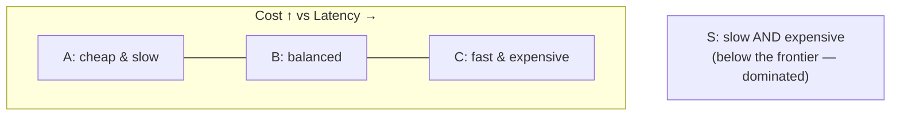
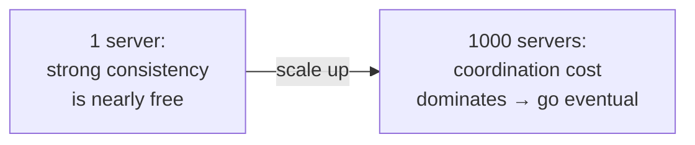

> **What?** A tradeoff is not just "A vs B" — it is a *position on a frontier*. The set of all the best achievable combinations of two competing properties is the **Pareto frontier**. On the frontier you can only improve one property by sacrificing another; off the frontier you have *slack* and can improve everything at once. Most real decisions also have one axis — the **dominant constraint** — that actually decides the outcome, while the others are noise.
> **How?** Before optimizing, ask three questions: (1) *Am I even on the frontier, or is there slack I can claim for free?* (2) *Which single axis dominates this decision?* (3) *Will this tradeoff still hold at 10× the scale?* Answering these saves you from "optimizing" a property that doesn't matter while ignoring the one that does.

---

## 1. Tradeoffs live on a frontier, not a seesaw

Junior framing: "more of A means less of B." That's only true on the **Pareto frontier** — the curve of the best combinations you can actually reach. Named after economist Vilfredo Pareto, a point is *Pareto-optimal* if you can't improve any property without making another worse.

Imagine plotting **cost** (vertical) against **latency** (horizontal). Points A, B, C sit on the frontier: each is the cheapest way to get its latency. Point S is *dominated* — it's slower **and** more expensive than B, so it's strictly worse. Nobody should ever choose S.

The practical lesson:

- If you're **on** the frontier, optimization means *moving along it* — picking a different tradeoff (A vs B vs C). You give up cost to get latency. That's a real decision.
- If you're **below** the frontier (a dominated point like S), you can improve **everything at once**. There's slack. **Find the slack first** before you "trade" anything.

> **The slack test:** If you believe you can make something faster *and* cheaper *and* simpler with no downside, you were not on the frontier — you had a dominated design. That's great news: claim the free improvement. But once you're *on* the frontier, that free lunch is gone, and further gains cost something.

This is why "we made it 10× faster with no downside" is usually true exactly *once* — you removed obvious waste (an N+1 query, a missing index, a debug log in a hot loop). After that, you're on the frontier and every further gain has a price.

---

## 2. Find the dominant constraint

Most decisions have **one axis that actually matters** and several that don't. The senior skill is finding it fast.

Consider choosing a data store for a feature:

| Candidate axis | Does it dominate here? |
|---|---|
| Write throughput | **YES** — we ingest 50k events/sec |
| Query flexibility | No — we only ever read by one key |
| Strong consistency | No — analytics, eventual is fine |
| Operational familiarity | Minor — team knows Postgres |

Once you see that **write throughput dominates**, the decision almost makes itself: you bias toward a write-optimized store (e.g., an LSM-tree-based system like Cassandra or a log) and accept the worse query flexibility, because flexibility isn't the binding constraint. Arguing about query syntax here is **bikeshedding** — optimizing a non-dominant axis.

> Theory of Constraints (Goldratt): a system is limited by exactly one bottleneck at a time. Improving anything that isn't the bottleneck produces *zero* end-to-end improvement. The same logic applies to tradeoff axes — improving a non-dominant property is wasted effort. (See [leverage points & bottlenecks](../06-leverage-points-and-bottlenecks/).)

How to find the dominant axis: ask **"what breaks first as we grow / what does the customer actually feel?"** If the answer is "we run out of write capacity," writes dominate. If it's "users abandon at 3 seconds," tail latency dominates. The dominant axis is the one whose failure ends the conversation.

---

## 3. The canonical tradeoffs, with numbers

Knowing the *names* (from junior) isn't enough at this level — know the *shape* and rough magnitudes.

### 3.1 Read-optimized vs write-optimized storage

| | B-tree (read-optimized) | LSM-tree (write-optimized) |
|---|---|---|
| Reads | Fast, predictable (Postgres, MySQL) | Slower — may touch multiple SSTables |
| Writes | Slower — in-place updates, random I/O | Fast — sequential appends, batched |
| Space | Compact | Write amplification + compaction overhead |
| Picks this | OLTP, read-heavy | High write volume (Cassandra, RocksDB) |

You **cannot** be optimal at both reads and writes with the same structure — the data layout that makes one fast makes the other slower. You choose based on your read:write ratio.

### 3.2 Coupling vs duplication

| | Share one copy (DRY, coupled) | Duplicate (decoupled) |
|---|---|---|
| Change once | Fix in one place | Fix in N places — risk of drift |
| Independence | Teams block each other | Teams move independently |
| Right when | The logic is *truly* one rule | The "shared" code is a coincidence |

The classic mistake: aggressively de-duplicating two things that *look* alike but are different *concepts*, creating a wrong abstraction that couples them forever. "A little copying is better than a little dependency" (Go proverb, Rob Pike). The tradeoff is **maintenance cost of duplication vs the rigidity of coupling.**

### 3.3 Latency vs throughput (revisited with numbers)

Batching DB writes:

| Batch size | Throughput | p99 latency for one row |
|---|---|---|
| 1 | ~5k rows/sec | ~2 ms (best) |
| 100 | ~80k rows/sec | up to ~25 ms (waits for batch) |
| 10,000 | ~300k rows/sec | up to ~500 ms (terrible) |

Throughput keeps climbing; per-row latency keeps degrading. There's no "correct" batch size — there's the size that fits your **latency budget**. Define the budget, then take as much throughput as the budget allows.

---

## 4. Tradeoffs flip with scale

**What is true at 1 server is false at 1,000.** A tradeoff isn't a constant — it's a function of scale, and at some threshold it inverts.

| Decision | Right at small scale | Flips at large scale |
|---|---|---|
| Architecture | **Monolith** — simple, one deploy | **Services** — independent deploys, isolated failure |
| Data | **Single Postgres** — joins are free | **Sharded / partitioned** — joins now cross network |
| Coordination | **Strong consistency** — cheap, one node | **Eventual** — coordination cost explodes |
| Caching | Skip it — DB is fast enough | Essential — DB is the bottleneck |
| Config | Hardcode it — one place to change | Externalize — too many instances to redeploy |

A `O(n²)` algorithm with `n = 100` runs in microseconds — ship it. The same algorithm at `n = 1,000,000` is `10^12` operations — it never finishes. **The tradeoff between "simple n² code" and "complex but fast n log n code" flipped at a scale threshold.** Don't pre-optimize for a scale you don't have; *do* know the threshold where your current choice breaks.

---

## 5. Push the tradeoff vs accept it

When a tradeoff hurts, you have two moves:

1. **Accept it** — pick the best point on the *current* frontier. Cheapest, fastest, no new complexity.
2. **Push the frontier** — spend money, hardware, or complexity to reach a *better* frontier where the tradeoff is less painful.

Examples of *pushing* the frontier:

- The space/time tradeoff says "fast lookups cost memory." You **push** it by buying a server with more RAM — now you get the speed without the memory pressure *on your old budget*. You paid money to move the whole curve.
- The latency/throughput tradeoff in a single thread is brutal. You **push** it by adding more cores / machines — parallelism buys throughput without sacrificing per-request latency. You paid hardware + coordination complexity.
- A CDN **pushes** the latency frontier for global users — you pay a vendor to put bytes physically closer.

> Pushing the frontier is itself a tradeoff: you traded **money or complexity** for a better position on the *original* axes. There is still no free lunch — you just moved the cost to the budget line or the ops team. Whether to accept or push is a judgment call; make it explicitly.

---

## 6. Make tradeoffs explicit *and reversible*

At this level, "explicit" graduates into "explicit **and** reversible where possible." A reversible tradeoff is one you can undo cheaply if you guessed wrong about the dominant axis or the scale.

- A cache TTL is a **reversible** tradeoff — change a number, redeploy.
- Choosing a database is a **harder-to-reverse** tradeoff — migrating later is expensive.
- A public API contract is **nearly irreversible** — other people depend on it.

For reversible tradeoffs, decide fast and adjust later. For irreversible ones, slow down and gather more evidence. The full decision framework — reversibility, one-way vs two-way doors, weighted matrices — lives in [evaluating tradeoffs objectively](../../04-critical-thinking/04-evaluating-tradeoffs-objectively/). Here, the systems-thinking point is just: *know which of your tradeoffs are reversible, because that changes how much care each one deserves.*

---

### Takeaways

- A tradeoff is a position on a **Pareto frontier**, not a seesaw. Below the frontier there's slack — claim it free *first*.
- Most decisions have **one dominant constraint**; optimizing the others is wasted effort (Theory of Constraints).
- Know the canonical tradeoffs with rough numbers: read vs write-optimized, coupling vs duplication, latency vs throughput.
- Tradeoffs **flip with scale** — know the threshold where your current choice breaks.
- You can **accept** a tradeoff or **push the frontier** by spending money/complexity — pushing is itself a trade.
- Make tradeoffs explicit; note which are **reversible**, since that sets how much care they deserve.

**Next:** [senior.md](./senior.md) — CAP/PACELC, generality vs performance, and reasoning about tradeoffs across a whole system.
