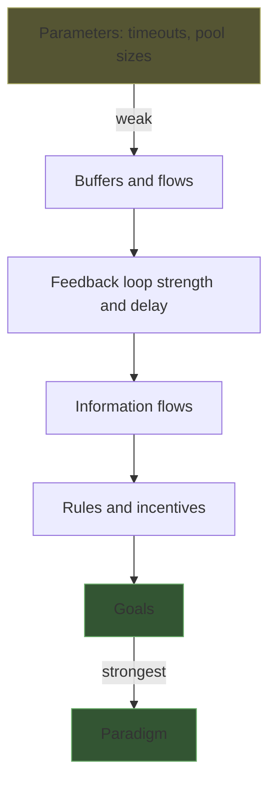

> **What?** Leverage points and bottlenecks formalized into method. A system has one governing constraint (Goldratt's Theory of Constraints); throughput is set by that constraint and nothing else. Donella Meadows ranks *where* you can intervene, from weak (parameters) to strong (goals, paradigms). Amdahl's law is the quantitative proof that improving the non-dominant part is bounded and usually wasteful.
>
> **How?** Run the five focusing steps — identify, exploit, subordinate, elevate, repeat — to locate and break the real constraint, then watch it move. Use Amdahl's law to compute the ceiling on any optimization *before* you do it.

---

## 1. Theory of Constraints: every system has one governing constraint

Eliyahu Goldratt's *The Goal* (1984) argues that any system aimed at a goal has, at any moment, exactly **one** constraint that limits its throughput — like the weakest link in a chain, or the narrowest section of a pipe. Strengthening any other link doesn't make the chain stronger. The whole methodology follows from this.

The five focusing steps:

| Step | Name | What you do |
|---|---|---|
| 1 | **Identify** the constraint | Measure; find the single part that limits throughput. |
| 2 | **Exploit** the constraint | Get maximum output from it *as-is* — no idle time, no waste, no junk work flowing through it. |
| 3 | **Subordinate** everything else | Make every other part serve the constraint. Slow them down if needed; never starve or flood it. |
| 4 | **Elevate** the constraint | Now spend money/effort to actually increase its capacity (add hardware, rewrite the query, parallelize). |
| 5 | **Repeat** | The constraint has moved. Go to step 1. Don't let inertia keep you optimizing the old constraint. |

The ordering is the insight. **Exploit before you elevate.** Most engineers jump straight to step 4 — "the DB is slow, let's buy a bigger DB" — and skip step 2, where you'd discover the DB is only slow because you're running an unindexed query and sending it 10× the data it needs. Exploiting (free) often recovers more than elevating (expensive).

### Worked example

A batch job processes 1M records/night across four stages, and it's missing its window.

```
Extract:    handles 50k/min
Transform:  handles 12k/min   ← constraint
Validate:   handles 40k/min
Load:       handles 30k/min
```

The whole job runs at **12k/min** → 1M records take ~83 minutes.

- **Exploit** (free): Transform sits idle 20% of the time waiting on a single-threaded queue. Fix the feed → effective 15k/min. Now 1M records take ~67 min. *No new resources.*
- **Subordinate**: Extract is racing ahead at 50k/min and ballooning a buffer to OOM. Throttle Extract to 15k/min — match the constraint. The system is calmer and uses less memory, with the *same* throughput. Running non-constraints flat-out is a classic mistake: it just builds inventory in front of the constraint.
- **Elevate**: Now spend the effort — parallelize Transform across 4 workers → 60k/min.
- **Repeat**: New constraint is **Load at 30k/min**. The job now runs at 30k/min. You'd never have known to touch Load if you'd kept staring at Transform.

## 2. Amdahl's law: the quantitative cousin

Theory of Constraints tells you *which* part to fix. Amdahl's law tells you *how much* fixing it can possibly help — and proves that fixing the wrong part is bounded to near-nothing.

If a fraction `p` of the work can be sped up by a factor `s`, the overall speedup is:

```
              1
speedup = ───────────────
          (1 - p) + p/s
```

The killer corollary: take `s → ∞` (make that part infinitely fast). The max speedup is `1 / (1 - p)`. So if a part is only 10% of the runtime (`p = 0.1`), the absolute best you can do — even with infinite effort — is `1 / 0.9 ≈ 1.11×`. **11%, and that's the ceiling.**

| Part you optimize (`p`) | Best possible speedup (s→∞) |
|---|---|
| 5% of runtime | 1.05× (5%) |
| 10% | 1.11× |
| 25% | 1.33× |
| 50% | 2× |
| 80% | 5× |
| 90% | 10× |

> Read this table as: *the size of the part you optimize is a hard cap on your reward.* Optimizing a 10% part is capped at 11% no matter how brilliant the optimization. This is why "measure first" is not a nicety — it tells you `p`, and `p` decides whether the work is even worth starting.

This is the math under [measure before you optimize](../../09-scientific-and-hypothesis-driven/03-measure-before-optimize/). The profiler gives you `p` for each part; Amdahl's law turns `p` into a go/no-go decision.

## 3. Donella Meadows' leverage points

Goldratt is about *throughput* constraints. Donella Meadows' essay *"Leverage Points: Places to Intervene in a System"* (1999) is broader: it ranks the *kinds* of changes you can make to any system, from weakest to strongest. Her 12 points, condensed into tiers:

| Tier | Leverage point | Strength | Engineering analogue |
|---|---|---|---|
| Weakest | Constants, parameters, numbers | Low | Bump a timeout, a pool size, a retry count |
| ↓ | Buffer sizes, stocks | Low | Queue depth, cache size |
| ↓ | Material flows & structure | Low–med | Add a server, reroute traffic |
| ↓ | Length of delays / feedback delay | Medium | Shorten the deploy-to-feedback loop |
| ↓ | Strength of feedback loops | Medium | Add monitoring/alerting that actually closes the loop |
| ↓ | Information flows (who knows what) | Med–high | Give the team the metric they were missing |
| ↓ | Rules (incentives, constraints) | High | Change what CI blocks; change what's rewarded |
| ↓ | Self-organization | High | Let teams own their deploy pipeline |
| ↓ | **Goals** of the system | Very high | Change the target: from "ship fast" to "ship safe" |
| Strongest | **Paradigm** (the mindset the goals arise from) | Highest | "We are a product company" vs "an infra company" |

Meadows' most quoted observation, and the reason this topic exists:

> *People know intuitively where leverage points are. ... But they tend to push them in the wrong direction.*

Everyone *can* find the leverage point — and then turns the knob backwards. Classic engineering version: latency is up, so the team *increases* the retry count (a low-leverage parameter), which multiplies load on the already-struggling service and makes latency worse. They found a leverage point (retries) and pushed it the wrong way. The high-leverage move was the opposite — *back off* and shed load.



The trap: most engineering effort goes into the *top* of this diagram (twiddling parameters) because it's easy and safe. The real leverage is at the *bottom* (rules, goals) — but it's political, slow, and scary, so it gets avoided. Recognizing this mismatch is the whole skill.

## 4. Finding the real bottleneck — and watching it move

Two disciplines:

**(a) Don't guess — profile.** The bottleneck is almost never where you'd bet. A function you *feel* is slow may be 1% of runtime; the real cost is a serialization step or a lock you forgot exists. Use a profiler, distributed tracing, `EXPLAIN ANALYZE`, flame graphs. The number you need is `p` from Amdahl's law for the candidate fix.

**(b) The bottleneck moves.** This is a [second-order effect](../03-second-order-effects/): fixing one constraint promotes the next-slowest part to constraint. Plan for it. After every fix, **re-measure** — don't assume the part you just fixed is still the problem, and don't assume it isn't.

```
Round 1: DB query is 80% of latency  → add index → query drops 40×
Round 2: now JSON serialization is 60% → stream instead of buffer
Round 3: now network egress is 50%    → compress payloads
```

Each round, the dominant `p` is a different part. Stop when the cost of the next fix exceeds its value (the constraint may now be "good enough").

## 5. High-leverage engineering moves

Mapping Meadows + Goldratt onto day-to-day work:

| Low leverage | High leverage | Why |
|---|---|---|
| Optimize a non-bottleneck stage | Optimize the constraint stage | Amdahl: bounded reward vs full reward |
| Add retries to a struggling service | Fix the abstraction it leaks through | Treats cause, not symptom |
| Speed up one slow test among many | Fix the *one flaky test gating all of CI* | It blocks every merge — it's the constraint on shipping |
| Tune a parameter | Shorten the feedback loop (deploy→signal) | Meadows: loop > parameter |
| Hand-optimize code in a tight loop | Fix the build/deploy pipeline | Pipeline gates *every* change, not one path |

The pattern: high-leverage moves touch the thing **everything else routes through or waits on** — the constraint, the gate, the shared abstraction, the feedback loop. Low-leverage moves touch one thing in isolation.

## 6. The one question

The discipline reduces to a single recurring question:

> **What is the ONE constraint right now — and am I actually working on it?**

If you can't name the constraint, you're guessing (go measure). If you can name it but you're working on something else, you're doing low-leverage busywork no matter how hard you work.

## Where this connects

- [Senior](./senior.md) goes deeper on diagnosing the *real* constraint vs the symptom, and the math of stacked Amdahl rounds.
- [Feedback loops](../02-feedback-loops/) — loop *strength* and *delay* are mid-tier Meadows leverage points, higher than any parameter.
- [Thinking in trade-offs](../05-thinking-in-tradeoffs/) — elevating a constraint always costs something; pick the cost deliberately.
- [Reasoning from fundamentals](../../05-first-principles-thinking/01-reasoning-from-fundamentals/) — Amdahl's law is a first-principles bound you can derive, not memorize.
