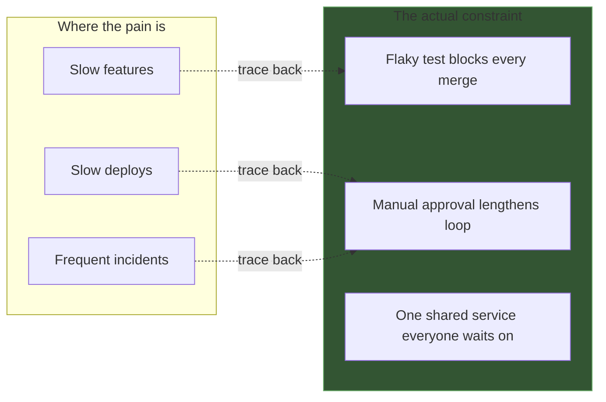

> **What?** The senior reading of leverage: the constraint is rarely where the pain is felt, the highest-leverage points are structural not numeric, and the reward of any optimization is capped by Amdahl before you start. Theory of Constraints, Meadows' hierarchy, and Amdahl's law become one toolkit for deciding *where engineering effort goes* — across code, systems, and the delivery pipeline.
>
> **How?** Trace every symptom back to its governing constraint instead of treating the symptom. Compute the Amdahl ceiling before committing effort. Climb Meadows' hierarchy deliberately — prefer fixing a feedback loop or a rule over twiddling a parameter, even when the parameter is easier.

---

## 1. The constraint is rarely where the pain is felt

The most expensive error a senior engineer prevents is the team optimizing the *symptom's location* instead of the *cause's location*. These are usually different places, often in different services owned by different people.

**Case: "the API is slow."** Pain felt: API p99 latency is 2s. Reflex: optimize the API handler. Measurement:

```
API handler CPU:        15ms
Waiting on auth service: 30ms
Waiting on DB:           1850ms   ← but the DB is idle 95% of the time
```

The DB *wait* is huge but the DB *isn't busy*. The real constraint isn't the DB at all — it's the **connection pool** (size 10) saturating under load, so requests queue for a connection. The pain is in the API, the apparent cause is the DB, the actual constraint is a pool parameter three layers away. Optimizing the handler or the DB does nothing. Raising the pool size fixes it — but only if you correctly identified that the pool, not the DB, is the constraint.

> A symptom points to *where it hurts*. The constraint is found by *measurement that follows the wait/queue back to its source*. Treat the symptom and you'll be back next week.

This is why "add an index," "buy a bigger box," and "add a cache" so often fail to help: they elevate a part that wasn't the constraint. The constraint is wherever work *waits* — and waiting accumulates upstream of the slow resource, not at it.

## 2. Stacked Amdahl: the diminishing-returns spiral

Amdahl's law isn't a one-shot calculation; it governs a *sequence* of optimizations, and it's why optimization projects hit a wall.

Start: 100s total. Three parts: A=50s, B=30s, C=20s.

| Round | Target | `p` | Action | New total | Realized speedup |
|---|---|---|---|---|---|
| 1 | A (50%) | 0.50 | 5× faster: 50→10s | 60s | 1.67× |
| 2 | B (now 30/60=50%) | 0.50 | 3× faster: 30→10s | 40s | 1.5× (cumulative 2.5×) |
| 3 | C (now 20/40=50%) | 0.50 | 2× faster: 20→10s | 30s | 1.33× (cumulative 3.33×) |
| 4 | A again (10/30=33%) | 0.33 | already optimized; ceiling 1.5× | — | not worth it |

Two senior lessons:

1. **As you remove the dominant part, every remaining part's relative `p` grows** — so the *next* bottleneck is always worth re-evaluating, and parts you dismissed early ("only 20%") can become the constraint.
2. **The marginal reward shrinks each round.** By round 4, the biggest remaining part is only 33% and already partly optimized. This is the signal to *stop* — the constraint has become "the system is fast enough," which is a legitimate place for the constraint to live. Continuing is low-leverage busywork dressed as performance work.

The serial-fraction trap: if part of the work is fundamentally serial (can't be sped up or parallelized — a lock, a dependency, a legal sign-off), that fraction `(1-p)` is your permanent floor. No amount of effort beats `1/(1-p)`. Identifying the irreducible serial fraction early prevents quarters of wasted optimization aimed at an impossible target.

## 3. Meadows for engineers: stop twiddling parameters

Seniors are paid partly to *recognize which tier of Meadows' hierarchy a problem actually lives in* — and to resist the gravitational pull toward the easy, low-leverage top of the list.

| You're tempted to... (low) | The high-leverage move is... | Meadows tier jump |
|---|---|---|
| Raise the timeout from 5s→30s | Find why the call takes >5s; fix the slow dependency | parameter → structure |
| Add a retry | Add a circuit breaker + backoff (change the *loop*) | parameter → feedback loop |
| Increase cache TTL | Fix the cache *invalidation* (the information flow) | parameter → information flow |
| Add "please test more" to the PR template | Make CI *block* on coverage (change the *rule*) | exhortation → rule |
| Ask people to deploy more often | Make deploy a one-click 5-min action (remove the constraint on the *goal*) | nagging → structure/goal |

The recurring failure mode Meadows names: **finding the leverage point and pushing it backwards.** Engineering examples:

- Latency up → **increase** retries → more load → worse latency. (Right point, wrong direction; correct move is *shed load*.)
- Flaky CI → **increase** the retry-the-test count → masks the flake, which now fails in prod. (Correct move: fix or quarantine the flaky test — it's the constraint on every merge.)
- Too many incidents → **add** an approval gate → slower deploys → bigger, riskier batches → *more* incidents. (Correct move: smaller, more frequent deploys — the gate made the loop *longer*, the opposite of leverage.)

> The danger of low-leverage moves isn't just that they're weak — it's that they *feel* like progress and consume the attention that the real constraint needed.

## 4. Process and org constraints

By senior level, the constraint is often not in the code at all — it's in the *flow of work*. Apply Goldratt to delivery, not just to a request path.

**The one flaky test gating CI.** If one test fails 1-in-5 runs and the whole pipeline blocks on green, that test is the constraint on the *entire team's throughput*. Every engineer re-runs, waits, context-switches. The math: 8 engineers × 3 merges/day × 20% flake rate × 12 min re-run ≈ **~10 engineer-hours/day** lost. Fixing one test returns more than a sprint of feature work. Yet it's nobody's job, so it festers — a textbook high-leverage move hiding behind "it's just a flaky test."

**The approval gate.** A manual sign-off that adds 4 hours to every deploy doesn't just cost 4 hours. It pushes teams to *batch* changes to "make the sign-off worth it" → bigger deploys → more risk → more rollbacks → more sign-offs. The gate is a [feedback loop](../02-feedback-loops/) with a long delay, and Meadows ranks *shortening delays* as high leverage. Removing or automating the gate is structural; arguing about the gate's checklist is parameter-tier.

**The meeting.** A weekly 1-hour sync for 10 people that gates a decision is a constraint on decision throughput. The leverage move isn't "make the meeting shorter" (parameter) — it's "make this decision async / push it to the team that owns it" (self-organization, a far higher Meadows tier).



## 5. Deciding where engineering effort goes

The senior version of the central question scales from a request path to a roadmap:

> **What is the ONE constraint on the outcome we care about — and is our effort actually on it?**

A practical allocation discipline:

1. **Name the goal in throughput terms.** "Ship features faster" → throughput = features/week. "Handle more load" → throughput = req/s. You can't find a constraint without a defined flow.
2. **Measure to find the constraint** — profile the request path *or* map the value stream (idea → design → review → deploy → feedback) and find the longest wait. Don't guess; intuition is wrong often enough to be dangerous.
3. **Exploit before elevate.** Recover free capacity (kill idle time, junk work, oversized payloads) before spending money/headcount.
4. **Compute the Amdahl ceiling.** If the constraint is 20% of the flow, the best case is 1.25× — decide if that's worth a quarter.
5. **Subordinate.** Stop over-investing in non-constraints. A faster non-bottleneck just makes prettier graphs.
6. **Re-measure after the fix.** The constraint moved. Re-decide. Stop when "good enough" becomes the constraint.

The hardest senior judgment is step 6's *stop*: recognizing that the constraint has moved to a place where the next fix isn't worth its cost, and redirecting the team off a performance project that's now low-leverage. Knowing when to *stop* optimizing is itself a high-leverage skill.

## Where this connects

- [Professional](./professional.md) takes this to portfolio/org scale: the constraint on a department's throughput, and why goals/paradigms are the highest leverage points of all.
- [Second-order effects](../03-second-order-effects/) — the moving bottleneck and the backward-pushed leverage point are both second-order consequences.
- [Mental models of systems](../04-mental-models-of-systems/) — "constraint," "flow," and "leverage hierarchy" are the models you reach for here.
- [Measure before you optimize](../../09-scientific-and-hypothesis-driven/03-measure-before-optimize/) — supplies the `p` that every Amdahl and ToC decision needs.
