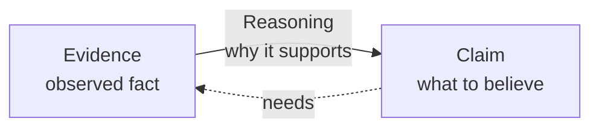

> **What?** A *claim* is a statement you want others to accept ("this query is slow"). *Evidence* is the observed fact you offer to support it ("the p99 is 1.8 s"). *Reasoning* is the bridge that explains why the evidence supports the claim ("1.8 s exceeds our 200 ms budget, so it's slow"). Most weak engineering arguments are missing one of the three — usually the evidence.
>
> **How?** Before you assert anything in a PR, an incident channel, or a design doc, split your sentence into those three parts out loud. If you can't name the evidence, you have an opinion, not a finding. If you can't name the reasoning, you have a coincidence.

---

## 1. The three parts of any argument

Every technical statement you make is really a small argument with three movable parts. Confusing them is the single most common reason engineering discussions go in circles.

| Part | Question it answers | Example |
|------|--------------------|---------|
| **Claim** | What do you want me to believe or do? | "We should add an index on `orders.user_id`." |
| **Evidence** | What did you actually observe? | "`EXPLAIN ANALYZE` shows a sequential scan over 4.2M rows taking 620 ms." |
| **Reasoning** | Why does that observation support the claim? | "A B-tree index turns that scan into a logarithmic lookup; the query filters on `user_id`, so the index is usable." |

The claim is what gets argued about. The evidence is what *ends* the argument. The reasoning is what makes the evidence relevant — and it's the part juniors most often skip, because it feels obvious to them.

A quick test: take any sentence from your last review comment and ask "is this a *claim*, a *fact*, or the *link* between them?" If you only have a claim, your comment is an assertion. Senior engineers don't trust assertions; they trust evidence with visible reasoning.



## 2. Not all evidence is equal

"I have evidence" is a meaningless phrase until you say *what kind*. There is a hierarchy, and where your evidence sits on it should set how loudly you're allowed to talk.

### Engineering evidence, weakest to strongest

| Tier | Type | Example | Why it ranks here |
|------|------|---------|-------------------|
| 0 | **Assertion** | "This is slow." | No observation at all. |
| 1 | **Appeal to authority** | "The staff engineer said it's fine." | The person could be wrong or out of date. |
| 2 | **Feeling / impression** | "It *feels* sluggish in the UI." | Real signal, but unquantified and easily biased. |
| 3 | **Anecdote** | "It timed out for me once yesterday." | A single uncontrolled data point. |
| 4 | **Microbenchmark** | "`BenchmarkParse` is 30% faster." | Measured, but isolated from real load, caches, and data shapes. |
| 5 | **Benchmark / load test** | "Under 500 RPS the new path holds p99 at 90 ms vs 140 ms." | Realistic conditions, controlled and repeated. |
| 6 | **Production measurement / profiler trace** | "A CPU profile shows 38% of time in JSON decoding on the live service." | The actual system, the actual workload. |

A profiler trace from production beats a microbenchmark, which beats "it feels slow," which beats "so-and-so said so." When you bring tier-2 evidence, phrase your claim at tier-2 confidence: "*I think* the UI feels slow — can someone pull a trace?" not "The UI is slow."

> **Hitchens's razor:** "What can be asserted without evidence can be dismissed without evidence." If a teammate makes a tier-0 claim, you are allowed to set it aside until they bring something measurable — politely.

## 3. Anecdote vs. measurement vs. proof

These three words get used interchangeably and they should not be.

- **Anecdote** — "I saw it fail once." One observation, no control over conditions. Useful as a *trigger* to investigate, useless as a *conclusion*.
- **Measurement** — "Over 10,000 requests, 0.3% returned 500s." A counted, repeatable observation. This is what most engineering claims should rest on.
- **Proof** — "By the type system, this branch is unreachable" or "the loop terminates because `n` strictly decreases." A logical guarantee, independent of any single run.

You rarely get proof in everyday backend work, and you rarely need it. But knowing the difference stops you from treating one lucky test run (anecdote) as if it were a guarantee (proof).

```text
"It worked on my machine"      -> anecdote  (n = 1, uncontrolled)
"It passed 200 CI runs"        -> measurement (n = 200, controlled)
"The state machine can't reach
 that state by construction"   -> proof
```

## 4. How to ask for evidence without being a jerk

Demanding evidence can feel like an attack. It isn't, if you do it right. The goal is to make the *idea* defend itself, not to make the *person* defensive.

**Bad:** "Source? This is just your opinion."
**Good:** "I want to agree — what did you measure that points to the cache being the bottleneck? If we have a trace I'll happily sign off."

Three phrases that keep it collaborative:

1. **"What would change your mind?"** — turns a standoff into a shared experiment. If neither side can name evidence that would flip their view, you're arguing about taste, not facts.
2. **"Help me see the data."** — frames you as wanting to be convinced, not wanting to win.
3. **"What's the strongest version of your claim?"** — invites them to give you their best evidence before you respond.

The same standard applies to *your own* claims. Before you hit "Request changes," ask yourself what evidence you'd accept that would make your objection wrong. If you can't answer, you might be defending a preference.

## 5. Extraordinary claims

> **Sagan's standard:** "Extraordinary claims require extraordinary evidence."

The *size* of the evidence you owe scales with how surprising the claim is.

| Claim | How surprising | Evidence needed |
|-------|---------------|-----------------|
| "Adding a missing index sped up that query." | Mundane — matches how databases work | One `EXPLAIN ANALYZE` before/after is plenty. |
| "The standard library's `sort` has a bug." | Extraordinary — used by millions, heavily tested | A minimal reproducible test case, ideally on a clean checkout, before anyone believes you. |
| "Our 40% latency drop came from changing a log level." | Suspicious — effect too large for the cause | Repeat it, rule out a concurrent deploy, isolate the variable. |

When you make a routine claim, light evidence suffices. When you claim something rare — a compiler bug, a kernel bug, a 10× win from a one-line change — expect to bring far more, and don't take the pushback personally. The bar is high *because* the claim is unusual.

## 6. A worked example

A teammate writes in the channel: *"We need to switch from JSON to Protobuf, JSON is killing our performance."*

Decompose it:

- **Claim:** Switch serialization formats to Protobuf.
- **Evidence offered:** None — "killing our performance" is a feeling (tier 2).
- **Reasoning offered:** Implicit assumption that serialization is the bottleneck.

A good, non-jerk response:

> "Could be! Before we take on a format migration — do we have a profile showing how much time we actually spend in JSON encoding? If it's, say, 25% of request time, this is a clear win. If it's 2%, we'd be paying a big migration cost for nothing. Happy to help pull a trace."

This reply accepts the claim *might* be true, names the missing evidence, and supplies the reasoning (the win only matters if serialization is a meaningful share of the time). That's the whole discipline in one paragraph.

## 7. Practice habits

- **Label your confidence.** "I'm fairly sure" vs. "I measured this" are different sentences. Say which one you mean.
- **Bring the artifact.** Paste the trace, the query plan, the graph — not your summary of it. Let people see the evidence.
- **Separate the trigger from the conclusion.** An anecdote ("it failed once") is a fine reason to *look*; it's a bad reason to *act* on its own.
- **Steelman first.** Before disagreeing, restate the other view in its strongest form. If they nod, you've earned the right to push back. (More on this in [Evaluating Tradeoffs Objectively](../04-evaluating-tradeoffs-objectively/).)

---

### Where this connects

- [Logical Fallacies in Engineering](../02-logical-fallacies-in-engineering/) — the broken-reasoning patterns that this discipline trains you to spot.
- [Cognitive Biases in Code Decisions](../03-cognitive-biases-in-code-decisions/) — why your "feeling" is often unreliable evidence.
- [Scientific and Hypothesis-Driven Thinking](../../09-scientific-and-hypothesis-driven/) — turning a claim into a testable prediction.
- Back to [Critical Thinking](../) · [Engineering Thinking](../../README.md).
