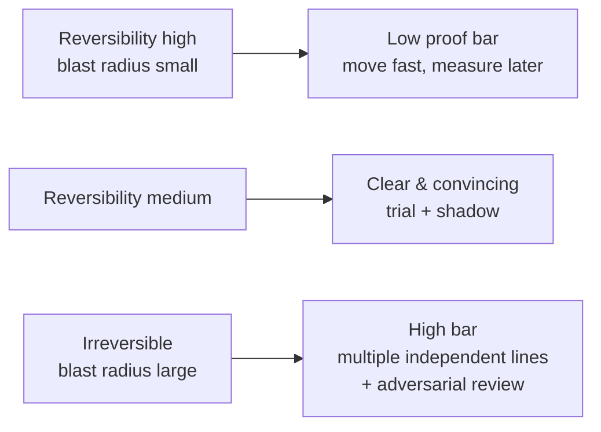

> **What?** At staff/principal scale, claims-evidence-reasoning stops being a personal skill and becomes **organizational epistemics**: the design of decision processes, document templates, incident reviews, and review cultures so that the org reliably converts the *strongest available evidence* into decisions — and so that thin evidence produces explicit, reversible bets rather than confident mistakes. You own the *standard of proof* the organization applies to different classes of decisions, and the systems that make claims checkable in the first place.
>
> **How?** You set evidence bars proportional to decision blast radius; you build the observability and experiment infrastructure that makes claims cheap to verify; you institutionalize warrant-surfacing, calibration, and steelmanning in templates and rituals; you adjudicate cross-team disputes by reasoning about evidence quality rather than seniority; and you protect the org from authority-driven and politically-driven claims by holding everyone — including yourself and executives — to the same standard.

---

## 1. Standard of proof is a design parameter, not a constant

Courts use different standards — "preponderance of evidence," "clear and convincing," "beyond reasonable doubt" — depending on the stakes. Engineering organizations should too, explicitly. A principal's job is to set the standard of proof *per decision class* so the org neither over-investigates trivia nor under-investigates catastrophe.

| Decision class | Blast radius | Reversibility | Required standard | Example evidence |
|----------------|-------------|---------------|-------------------|------------------|
| Tune a config flag | One service | Instant | Preponderance — a plausible measurement | One canary metric |
| Adopt a library | A few teams | Weeks | Clear & convincing — a real trial | Spike + prod shadow + maintenance assessment |
| Re-platform datastore | Whole org | Months–years | Beyond reasonable doubt — multiple independent lines | Load tests + production shadow + cost model + failure-mode analysis + reference customers |
| One-way door (delete data, public API contract) | External, permanent | None | Highest — adversarial review | All of the above + a written "why we believe the evidence" + a named dissent |

This is Bezos's one-way/two-way door framing made rigorous: **the standard of proof should scale with irreversibility.** The expensive organizational pathology is uniform standards — demanding a research project to change a log level (slows everything) or shipping a schema migration on a microbenchmark (catastrophe). Calibrating the bar to the blast radius is a principal-level lever that compounds across every decision the org makes.



## 2. Make claims cheap to check, or the bar will be ignored

A high evidence standard the org *can't afford to meet* gets routed around. The principal-level move is to make verification cheap enough that meeting the bar is the default path. This is largely an *infrastructure* responsibility disguised as a thinking responsibility.

- **Continuous profiling in production** turns "is X the bottleneck?" from a multi-day investigation into a dashboard query. The evidence tier (production trace) becomes the *default*, not a heroic effort.
- **A maintained load-test / canary harness** turns "would this regress?" into a one-command experiment. When experiments are cheap, people run them instead of arguing.
- **Feature flags + cohort analytics** make controlled interventions routine, upgrading correlational claims to causal ones as a matter of course.
- **Standardized A/B infrastructure** with pre-registered metrics prevents the "we'll find a metric that moved" post-hoc fishing that produces false causal claims.

The strategic insight: **the org's epistemic quality is bounded by the cost of evidence.** If a production profile takes a week to obtain, decisions will be made on feelings, and no amount of "we value data" exhortation fixes it. Lowering the cost of evidence is how you actually raise the standard of proof. Budget for it the way you budget for CI.

## 3. Institutionalize the warrant, the qualifier, and the rebuttal

Individual senior engineers surface warrants in conversation. Principals encode the practice into the artifacts so it survives turnover and scales past the people who can do it instinctively.

### Decision-document template (the load-bearing four fields)

```
DECISION:   <the claim — what we will do>
EVIDENCE:   <grounds, with provenance + tier; link the artifacts, not summaries>
WARRANT:    <the general rule that makes the evidence support the decision>
CONFIDENCE: <calibrated %; what we know vs. what we're betting>
REBUTTAL:   <what would make this wrong; the kill-criteria>
REVERSAL:   <how we undo this and at what cost; the escape hatch>
```

The `WARRANT` and `REBUTTAL` fields are the ones that change behavior. A reviewer can now attack the *reasoning* ("your warrant assumes the workload is read-heavy; it's 60% writes") instead of bikeshedding the conclusion. And a decision with an empty `REBUTTAL` field — *nothing would make this wrong* — is flagged as un-falsifiable before it ships, not after it fails.

This is the organizational analog of Amazon's six-pager and ADRs (Architecture Decision Records), with the epistemics made explicit. The value isn't the document; it's that the *format forces the reasoning to be inspectable.*

## 4. Adjudicating cross-team disputes by evidence, not rank

The defining principal moment: two strong teams disagree, both have evidence, and the org looks to you to break the tie. The failure mode — and the most corrosive thing a senior leader can do to org epistemics — is to **resolve it by authority** ("I think we should go with X"). That teaches the org that the way to win arguments is to lobby the principal, not to gather evidence.

The correct protocol:

1. **Establish the agreed grounds.** Write down what *both* sides accept as fact. Usually larger than people expect.
2. **Surface the two warrants.** The disagreement is almost always here. Name both rules explicitly.
3. **Find the differentiating experiment.** What single piece of evidence would distinguish the warrants? Often it doesn't exist yet — and obtaining it is cheaper than the meeting cost of arguing.
4. **Pre-commit to the decision rule.** "If the shadow test shows >15% improvement at equal error rate, we go with X; otherwise Y." Both sides agree *before* the data arrives, which removes the post-hoc motivated reasoning.
5. **If no differentiating evidence is obtainable in time,** declare it a *judgment call under uncertainty*, make the bet explicit with confidence and reversal cost, and own it as a bet — not disguise it as a proven conclusion.

The meta-message you're sending: *in this org, evidence outranks tenure.* That single norm, consistently enforced from the top, is worth more to decision quality than any process.

## 5. Defending against authority, politics, and confident wrongness

At scale, the most dangerous claims aren't the under-evidenced ones from juniors — those get caught in review. They're the **confident claims from high-status sources** that bypass scrutiny: a VP's "our customers want X," a famous-company blog post's architecture, a vendor's benchmark.

| Source of unwarranted authority | The dodge | The discipline |
|--------------------------------|-----------|----------------|
| Executive intuition | "Leadership has decided" | Translate to a falsifiable claim: "We believe X will raise retention 5% — here's how we'll know in 30 days." |
| "Google/Netflix does it this way" | Argument from prestige | Ask: *same constraints?* Their scale, team, and failure tolerances may make their warrant inapplicable to you. |
| Vendor benchmark | Cherry-picked provenance | Reproduce on your workload, your data shapes, your hardware. Vendor numbers are an upper bound, never a prediction. |
| Loudest engineer | Confidence mistaken for correctness | Apply the *same* evidence bar publicly. Calibration must be enforced symmetrically or it's just politics. |

> **Brandolini's law** ("the energy to refute bullshit is an order of magnitude greater than to produce it") is an organizational threat at scale: a single confident wrong claim can consume weeks of refutation. The principal-level defense is *upstream* — raise the bar for *making* high-blast-radius claims (require the warrant, require the rebuttal) so the asymmetry never gets a foothold. You cannot win the refutation arms race; you can make confident-but-unsupported claims socially expensive to *assert*.

> **Hitchens's razor** is your sharpest tool here, applied without fear of rank: a claim asserted without evidence may be dismissed without evidence — and that has to be true for the CTO as much as the intern, or the standard is theater.

## 6. Incident epistemics: institutional memory of cause vs. correlation

Postmortems are where an org's worst reasoning errors get *enshrined* as official root causes and then taught to everyone. A principal owns the discipline that keeps them honest.

- **Mandate the observation/inference split.** Section 1: timestamped facts, graphs, logs — no interpretation. Section 2: inferred causes, each with a confidence and the evidence supporting it. This single structural rule prevents the most common postmortem failure: a plausible story written *as if* it were established fact.
- **Require counterfactual reasoning for each root cause.** "If this cause were removed, the incident does not happen" — and the evidence that the removal actually prevents it. Many "root causes" fail this test; they're correlates.
- **Track the confidence on action items.** "We *believe* this prevents recurrence (70%)" is more honest and more useful than a confident fix that addresses a co-occurring symptom. The 30% becomes the watch-list.
- **Audit closed incidents for recurrence.** If a "fixed" class of incident recurs, the original root cause was a correlation. That feedback loop is the only thing that calibrates the org's causal reasoning over time.

## 7. The principal's own calibration is the ceiling

The org will calibrate to the leader's example. If you state confident conclusions on thin evidence, that becomes the norm, and your reach amplifies the error across every team that defers to you.

- **Publish your confidence and your misses.** Saying "I was 80% sure and wrong" in a visible forum gives the whole org permission to be calibrated rather than performatively certain.
- **Steelman publicly before you decide.** When you adjudicate, restate the side you'll rule *against* in its strongest form first. It models the norm and makes your decision trustworthy.
- **Pre-register your own predictions** on big bets, and review them. A leader who keeps a scoreboard of "what I predicted vs. what happened" is the strongest possible signal that this org runs on evidence.
- **Reward disconfirmation upward.** Make it career-safe — career-*rewarded* — to bring you the evidence that kills your favored idea. The moment people stop telling the principal uncomfortable evidence, the org's epistemics are dead and you won't know it.

The end state you're building: an organization where the strongest evidence wins regardless of who holds it, where confidence is stated and calibrated, where decisions carry their own kill-criteria, and where the cost of being honestly uncertain is lower than the cost of being confidently wrong. That culture is a more durable competitive advantage than any specific architecture.

---

### Where this connects

- [Logical Fallacies in Engineering](../02-logical-fallacies-in-engineering/) — the fallacy patterns that high-status claims exploit.
- [Cognitive Biases in Code Decisions](../03-cognitive-biases-in-code-decisions/) — authority bias, sunk cost, and groupthink at org scale.
- [Evaluating Tradeoffs Objectively](../04-evaluating-tradeoffs-objectively/) — decision frameworks that consume calibrated claims.
- [First-Principles Thinking](../../05-first-principles-thinking/) — when to reject borrowed warrants ("Netflix does it") and re-derive.
- [Scientific and Hypothesis-Driven Thinking](../../09-scientific-and-hypothesis-driven/) — pre-registration and controlled experiments as org infrastructure.
- Back to [Critical Thinking](../) · [Engineering Thinking](../../README.md).
