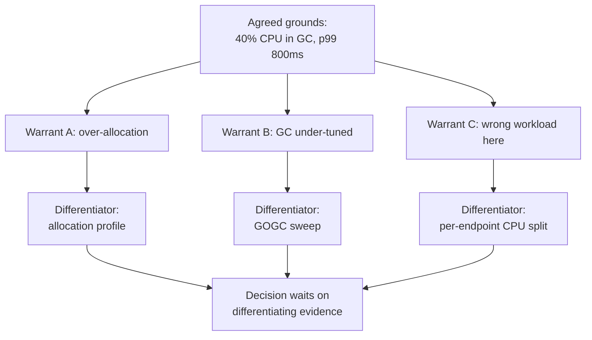

> **What?** At senior level, claims-evidence-reasoning becomes an *operating discipline for technical disputes*: you reason about the **quality and provenance** of evidence, the **hidden warrants** that drive disagreement, the **confounders** that masquerade as causes in production, and how to run reviews so that the strongest evidence wins instead of the loudest voice. You also own *epistemic hygiene* for a team — steelmanning, calibration, and "what would change your mind?" as norms, not personal habits.
>
> **How?** You design the evidence before you need it (you build the observability that makes claims checkable), you separate "what we measured" from "what we infer," you isolate variables in production through controlled rollouts, and you adjudicate disagreements by surfacing the warrant and the rebuttal rather than the claim. You also know when *no* available evidence justifies a decision, and you make the bet explicitly instead of pretending it's proven.

---

## 1. Provenance: where evidence came from changes what it means

Junior thinking ranks evidence by *type* (profile > benchmark > anecdote). Senior thinking adds a second axis: **provenance** — the conditions under which the evidence was produced, which determines what it can be generalized to.

A flame graph is tier-A evidence. But a flame graph captured:

- on a developer laptop, with `GOMAXPROCS=1`, against a 1,000-row test fixture,

is *not* generalizable to a 64-core production node serving 50M rows under contention. Same evidence *type*, wildly different *provenance*, different valid conclusions. The questions a senior asks of any artifact:

| Provenance question | Why it can invalidate the conclusion |
|---------------------|--------------------------------------|
| What workload produced it? | Synthetic uniform input hides skew, hot keys, tail behavior. |
| What hardware / topology? | Cache sizes, NUMA, core counts, network distance change the bottleneck. |
| Warm or cold? | A cold-cache benchmark measures a state production almost never sees. |
| What concurrency level? | Single-threaded numbers hide lock contention that *is* the real problem. |
| When was it captured? | Last quarter's profile predates three deploys and a data-volume change. |
| Who selected the sample? | A "representative" trace cherry-picked from 10,000 may be the convenient one. |

The senior failure to avoid: accepting tier-A evidence at face value because it's tier-A, without interrogating provenance. A microbenchmark with honest provenance ("isolated, synthetic, single-threaded — treat as an upper bound") can be *more* trustworthy than a production trace with hidden provenance ("captured during the one window the incident wasn't happening").

## 2. The warrant is where senior disputes actually live

Two staff-track engineers rarely disagree about the *grounds*. They've both seen the dashboard. They disagree because they hold **different warrants** — different general rules about what the grounds imply — and unless someone names the warrants, the meeting becomes a volley of claims.

### Worked dispute

**Grounds (agreed):** A service's p99 is 800 ms; a flame graph shows 40% of CPU in GC.

- Engineer A's warrant: *"High GC fraction means we allocate too much; reduce allocations."* → Claim: pool buffers, reuse slices.
- Engineer B's warrant: *"High GC fraction at this heap size means the GC is under-provisioned; tune `GOGC`."* → Claim: change the GC target.
- Engineer C's warrant: *"40% in GC is a symptom of a workload that shouldn't be in this process at all."* → Claim: move the batch path to a separate service.

All three accept the same evidence. The argument is *entirely* about warrants. A senior facilitator's job is to **make the warrants explicit and then test them**: "We each have a rule. What evidence distinguishes them? An allocation profile tells us if it's A. A `GOGC` sweep tells us if it's B. Traffic decomposition tells us if it's C. Let's get the differentiating evidence before we pick." That converts a values argument into an experiment.

## 3. Confounders in production: isolate, don't correlate

Production is the world's worst laboratory: nothing holds still. Traffic, data volume, neighboring services, deploys, and cron jobs all move at once. A senior's edge is treating every "A caused B" as guilty until a confounder is ruled out.

### The standard confounders and how to defeat them

| Confounder | Symptom | Control |
|-----------|---------|---------|
| **Concurrent deploy** | Two changes shipped in the same window | Bisect: stagger or revert one at a time. |
| **Traffic correlation** | "Errors rose after the change" — but so did load | Normalize per-request; check error *rate*, not count. |
| **Survivorship** | "Fast path is fine" — because slow requests time out and vanish from the histogram | Count timeouts/drops explicitly; look at the requests that *didn't* finish. |
| **Selection / cherry-pick** | One trace "shows" the problem | Sample at random; aggregate. |
| **Simpson's paradox** | Overall metric improves while every segment worsens (mix shift) | Always slice by cohort before concluding. |
| **Regression to the mean** | A metric spiked, you "fixed" it, it dropped | It might have dropped anyway; check the baseline distribution. |

The decisive technique is **the controlled rollout**. A canary or A/B split holds everything else constant and varies the one thing you're testing across statistically comparable populations. "p99 is 12% lower in the canary cohort than the control cohort, same traffic, same hour" is *causal* evidence in a way that "p99 dropped after we shipped" never is. When you can't run a clean experiment, say so and downgrade the claim accordingly.

> Bradford Hill's **experiment** criterion is the only one that reliably upgrades correlation to causation. Everything else (strength, temporality, plausibility) raises or lowers your prior; intervention settles it.

## 4. Steelman before you refute

Refuting a weak version of someone's argument (a straw man) wins the meeting and loses the truth. The senior norm is the opposite: **state the other position in its strongest form, get agreement that you've got it right, then engage.**

The steelman protocol in a design review:

1. **Restate:** "Your strongest case is: the monolith's deploy coupling is causing 30% of our rollbacks, and a split would let teams ship independently — that's a real cost we're paying today."
2. **Confirm:** "Did I get the strongest version? Anything I left out?"
3. **Then engage the strong version,** not the weak one: "Granting all of that — the differentiator is whether the coupling is in *deploy* or in *data*. A split fixes deploy coupling but if the data is shared we just trade one coupling for a worse one."

Steelmanning is not politeness theater. It's an *evidence-quality* practice: it forces you to find the best evidence *for* the position you oppose, which is exactly the evidence most likely to change your own mind if it exists. If after steelmanning you still disagree, your disagreement is now trustworthy.

## 5. "What would change your mind?" as a forcing function

The single most powerful question in a technical dispute. Asked of *both* sides, it does three things:

1. **Detects un-falsifiable positions.** If someone's answer is "nothing," they're defending an identity or a preference, not a claim. Name it: "It sounds like this is a values call, not an evidence call — let's treat it as one."
2. **Defines the experiment.** The union of "what would change my mind" across the room *is the test plan*. If A would be convinced by an allocation profile and B by a `GOGC` sweep, run both.
3. **Surfaces asymmetry of stakes.** Sometimes one side requires a mountain of evidence to move and the other a pebble — usually because of who owns the consequences. Worth making visible.

Apply it to yourself most ruthlessly. Before you defend your own design, write down the evidence that would make you abandon it. If you can't, you're not reasoning; you're rationalizing.

## 6. Calibrated conclusions and decisions under thin evidence

Senior work routinely demands decisions where the evidence is genuinely insufficient. The discipline is not to manufacture false certainty but to **make the bet explicit and reversible**.

### A calibration ledger for a real decision

> **Claim:** Migrate the session store from Postgres to Redis.
> **Evidence:** p99 of session reads is 18 ms (tier B, load test); sessions are 96% reads; Redis read latency in our other service is ~0.4 ms (tier A, but *different workload* — provenance caveat).
> **Warrant:** A read-dominated, latency-sensitive, ephemeral-data workload fits an in-memory store.
> **Confidence:** ~70%. Unknown: durability requirements during failover, and whether 18 ms is the store or the surrounding code.
> **Rebuttal:** If a profile shows the 18 ms is in our serialization, not Postgres, the migration buys nothing.
> **Decision:** Run a shadow read against Redis for 1 week behind a flag; decide on real numbers. Reversible. No data migration until confidence > 90%.

This is what senior reasoning under uncertainty looks like: the confidence is *stated* (70%, not "obviously"), the missing evidence is *named*, the warrant is *separable from the data*, and the decision is *staged to be reversible* so a wrong bet is cheap. Contrast with the anti-pattern — "Redis is faster, let's migrate" — which is a tier-A claim on tier-C reasoning with no escape hatch.

## 7. Building the team's epistemic hygiene

As a senior you don't just reason well; you make good reasoning the path of least resistance for others.

- **Require the warrant in design docs.** Add a "Why does the evidence support this?" line to the template. Empty warrants get caught at review time, not in production.
- **Normalize confidence qualifiers.** Make "I'm ~70% on this" a respected sentence, not a weakness. It's more useful than false certainty and it makes people *more* willing to surface doubt.
- **Reward the disconfirming experiment.** Praise the engineer who ran the test that *killed their own* proposal. That's the behavior that keeps the team honest.
- **Separate evidence from inference in incident reviews.** Two explicit sections: "What we observed" (facts, timestamps, graphs) and "What we infer" (causes, with confidence). Mixing them is how a correlation gets enshrined as the official root cause.
- **Watch for Brandolini's law.** Bullshit is asymmetric: it's cheaper to produce a confident wrong claim than to refute it. Don't let the cost of debunking exhaust the team — fix it at the source by raising the evidence bar for *making* claims, not just for challenging them.

---

### Where this connects

- [Logical Fallacies in Engineering](../02-logical-fallacies-in-engineering/) — straw man, false cause, and the fallacies a steelman defends against.
- [Cognitive Biases in Code Decisions](../03-cognitive-biases-in-code-decisions/) — confirmation bias, anchoring, and why provenance interrogation is necessary.
- [Evaluating Tradeoffs Objectively](../04-evaluating-tradeoffs-objectively/) — turning a surviving claim into a weighted decision.
- [First-Principles Thinking](../../05-first-principles-thinking/) — deriving warrants from mechanism rather than analogy.
- [Scientific and Hypothesis-Driven Thinking](../../09-scientific-and-hypothesis-driven/) — the controlled-experiment loop that upgrades correlation to cause.
- Back to [Critical Thinking](../) · [Engineering Thinking](../../README.md).
