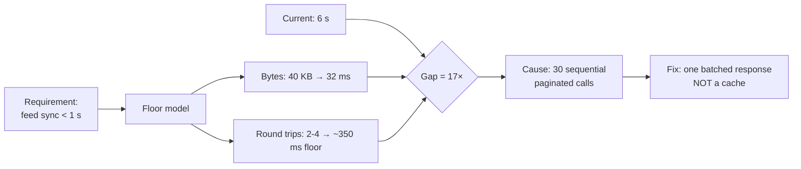

# Reasoning from Fundamentals — Senior

> **What?** The disciplined practice of decomposing a system to its irreducible constraints — conservation laws, information-theoretic limits, the speed of light, and the genuine business contract — then deriving an architecture that provably cannot do better, so you know exactly how far from optimal you are.
> **How?** You build a *floor model* (an analytical lower bound on each resource), measure the system against it, and treat the gap as a quantity to be explained — by a real requirement, an implementation defect, or a deliberate trade-off you can name and defend.

---

## 1. Why seniors must own this, not juniors

A junior who reasons from fundamentals makes better local decisions. A senior who does it changes what the *organization* believes is possible. The leverage is in **bounding the problem**: once you can state "the floor is 8 ms and we are at 400 ms," you have converted an open-ended optimization ("make it faster") into a closed gap-analysis ("explain the 50× factor"). That reframing is the senior's primary product.

The failure mode of senior engineers is the opposite of juniors': not too little analogy, but *too much accumulated pattern-library*. After ten years you have a reflex for every situation, and reflexes are analogies. The discipline is to notice when a reflex is firing and deliberately re-derive — especially when the context has shifted under the old pattern (new hardware, new scale, new latency budget).

---

## 2. The floor model as an engineering artifact

A floor model is a small, explicit calculation of the minimum resources a workload *must* consume given only laws and hard requirements. It's worth writing down — in the design doc, next to the SLO — because it's falsifiable and it survives reorgs.

Build it per resource:

| Resource | Floor is set by | Cannot be beaten because |
| --- | --- | --- |
| Latency | Speed of light × distance × round trips | Causality (Einstein, not negotiable) |
| Bandwidth | Payload bytes × request rate | Bytes are conserved |
| Storage | Information content (entropy) after compression | Shannon's source coding theorem |
| CPU | Algorithmic work × constant factor | The problem's intrinsic complexity |
| Coordination | Number of nodes that must agree | FLP / CAP — consensus needs round trips |

Each row gives a *number*. The architecture is then judged not against "fast enough" but against "how many ×s above the floor, and is each × justified?"

### The information-theoretic floor

Two limits seniors should wield explicitly:

- **Shannon source coding:** you cannot losslessly compress data below its entropy *H*. If your "events" carry 12 bits of real information each, no schema, no Protobuf, no clever trick stores them in fewer than 12 bits average. This caps storage *and* it caps how small a sync payload can be.
- **Landauer / causality for coordination:** any agreement among *N* geographically separated nodes costs at least one WAN round trip per consensus decision (Paxos/Raft need a majority to acknowledge). If you need 10,000 globally-linearizable writes/sec across three continents with ~150 ms inter-region RTT, the floor says: *you cannot*, because each write needs a cross-region round trip and you can't pipeline a single key past its dependency chain. The fundamentals tell you to change the *requirement* (relax to causal consistency, partition by region) rather than tune the implementation.

---

## 3. A full worked derivation — designing a feed sync

Requirement as handed down: "Mobile clients must show an up-to-date activity feed; the current sync takes 6 seconds on a fresh app open and product wants <1 s."

Reasoning by analogy would reach for: "add a CDN, add a cache, paginate harder." Let's derive instead.

**Step 1 — What is fundamental?**

- A fresh client has *nothing*; it must receive its current feed state once. That transfer is irreducible.
- Feed state per user: ~500 items, each ~80 bytes of *actual information* (id delta, type, timestamp, target ref) ≈ **40 KB** after tight encoding.
- Client is on LTE: ~10 Mbps realistic, ~80 ms RTT.

**Step 2 — Floor computation.**

- Transfer 40 KB at 10 Mbps = 40,000 × 8 / 10,000,000 = **32 ms** on the wire.
- TCP slow-start: 40 KB at ~14 KB initial congestion window needs ~2 RTT to ramp = ~160 ms.
- TLS 1.3 + request: ~2 RTT ≈ 160 ms.
- **Floor ≈ 350 ms.** Sub-second is *physically achievable*; product's target is reasonable.

**Step 3 — Find the 6 s gap.** Tracing reveals the client makes **30 sequential paginated calls of 20 items each**, each a full HTTPS round trip on a fresh-ish connection. 30 × ~180 ms = **5.4 s**. The gap is not bytes (40 KB is nothing) and not CPU — it is **round trips created by pagination that the problem never required.**

**Step 4 — Derived fix.** Collapse to a *single* response (or a streamed one): one request returns the whole 40 KB. The cache/CDN the analogy suggested would have cached 30 wrong-shaped responses. The floor model told us the enemy was round trips, so the fix targets round trips. Result: ~400 ms, near the floor.



---

## 4. The cost decomposition at architecture scale

The Musk battery move generalizes to *make-or-buy*, *build-vs-vendor*, and *re-platform* decisions. The question is always: **what is the commodity floor, and what fraction of our bill is above it?**

Worked: a vendor charges $0.000005 per "search event." At 2B events/month that's **$10k/month**. Should you build in-house? Decompose the floor:

- Each search is an index lookup over ~50M docs. With an inverted index that's a few ms of CPU and a few KB of I/O. Fundamental compute cost: fractions of a cent per *thousand* queries.
- 2B queries/month ≈ 770 QPS average, maybe 5k peak. That's a handful of well-provisioned nodes — call it $2k/month all-in including an on-call rotation amortized.

So the floor is ~$2k and the vendor charges ~$10k. **But** the decomposition must include the cost the floor hides: building and *operating* search relevance, which is the vendor's real product. The fundamentals here tell you the *infrastructure* is cheap to replicate but the *relevance engineering* is the actual commodity you're buying. That's the senior insight — first-principles analysis tells you *which part* of a price is genuinely irreducible value vs. margin.

---

## 5. Classifying assumptions — the senior's taxonomy

When you decompose, every assumption lands in one of four bins. Mislabeling is the most expensive error in the whole method.

| Bin | Definition | Can you move it? | Example |
| --- | --- | --- | --- |
| **Law** | Physics / math / information theory | Never | "WAN RTT ≥ distance / c" |
| **Hard requirement** | Genuine, externally-imposed contract | Only by renegotiating with the business | "Payments must be exactly-once" |
| **Soft requirement** | Stated preference, actually flexible | Yes, with a conversation | "Must use Postgres" |
| **Convention** | Inherited habit, never validated | Freely | "We paginate at 50" |

The classic, costly mistake: treating a *soft requirement* as a *law*. "We must be strongly consistent globally" sounds like a law; almost always it's a soft requirement that, when examined, the business will trade for 100× throughput once you show them the CAP-theorem floor it implies. Conversely, treating a *law* as a *soft requirement* — "we'll just make cross-region writes fast" — wastes a quarter fighting physics.

---

## 6. The algorithmic floor and Amdahl's ceiling

Two floors that catch seniors who only think about I/O.

**The algorithmic floor.** Some problems have an intrinsic complexity the implementation cannot beat. Comparison sorting is Ω(n log n); you cannot sort 10⁹ arbitrary keys in linear time by being clever — only by changing the problem (radix sort exploits the key structure, sidestepping the comparison model). When a team proposes "we'll make this O(n²) join fast with more cores," the floor reminds you that parallelism buys a constant factor, not a complexity class. Doubling cores on an n² algorithm at 10× the data is still 50× slower.

**Amdahl's ceiling.** Hennessy & Patterson teach Amdahl's Law as a *planning* tool, not a footnote. If a fraction *s* of the work is serial, no amount of parallelism gets you past a speedup of 1/*s*. If 5% of your pipeline is inherently serial (a single global sequence number, say), your maximum speedup is 20× — *forever*, regardless of fleet size. The first-principles move is to compute this ceiling *before* funding a parallelization effort, so you don't spend a quarter chasing a 100× that physics caps at 20×.

```text
Amdahl: speedup(N) = 1 / ( (1 - p) + p/N )
p = parallelizable fraction = 0.95, N → ∞  ⇒  max speedup = 1/0.05 = 20×
Conclusion: the serial 5% is the entire game. Attack THAT, not core count.
```

This is the senior's defense against "just add machines": the floor tells you which 5% to attack, and whether the project is worth starting at all.

---

## 7. Communicating a floor so it changes minds

A floor model that lives in your head wins no arguments. The senior skill is *delivery*. Three rules:

1. **Lead with the gap, not the model.** "We are 50× above the physical floor" lands; "let me walk you through my latency analysis" loses the room. State the multiple first, then justify it.
2. **Name the binding resource in one word.** "It's round trips," "it's cardinality," "it's the serial section." A floor model that doesn't reduce to a single binding constraint isn't finished.
3. **Convert physics into a choice for the business.** Never end with "physics says no." End with a priced menu: option A costs X and gives Y; option B relaxes requirement Z for 100× headroom. You hand the trade-off back to the people who own the requirement.

The deliverable of senior first-principles work is rarely code. It's a one-paragraph artifact: *target, binding resource, floor, current, gap, the one lever.* That paragraph, attached to the design doc, outlives the debate that produced it.

---

## 8. The cost of the method, and when to spend it

First-principles analysis is not free, and a senior who applies it to every decision is as broken as one who never does. Spend it when:

- **The decision is expensive to reverse** (data model, consistency model, public API, sharding key). Reversibility is the single best predictor of whether to derive.
- **The numbers don't reconcile** — measured cost is far from any reasonable floor.
- **An analogy is being used to close debate** rather than inform it ("Netflix does it this way" applied to a 50-user internal tool).
- **You're at a scale or constraint the inherited pattern was never designed for.**

Default to analogy for reversible, well-trodden, low-stakes choices. The senior skill is calibrating the *spend* — a five-minute envelope calculation for a sprint task, a written floor model with peer review for a platform decision. The decision of *what to even question* is its own discipline, covered in [questioning assumptions](../02-questioning-assumptions/); when the floor analysis shows the inherited design is structurally wrong, you move to [rebuilding from scratch](../03-rebuilding-solutions-from-scratch/). And because a floor model is only as good as its understanding of the whole, it sits on top of [systems thinking](../../03-systems-thinking/) and the bias-checks of [critical thinking](../../04-critical-thinking/).

---

## 7. Anti-patterns specific to seniors

- **False precision.** A floor model built on guessed constants is worse than none, because it *looks* rigorous. State your assumptions and their uncertainty.
- **Floor without measurement.** The model predicts 8 ms; you must still measure the real 400 ms. The method is *floor vs. observation*, never floor alone.
- **Deriving what's already solved.** Re-deriving consensus, congestion control, or B-trees from scratch is usually ego, not engineering. Use the floor to *understand* the existing solution's optimality, then adopt it.
- **Ignoring the human floor.** Some constraints are organizational (Conway's law) and just as real as physics. A design that beats the latency floor but can't be operated by the team has hit a different wall.
