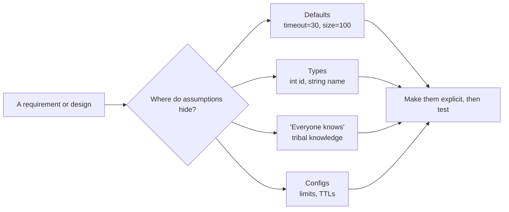

# Questioning Assumptions — Junior

> **What?** An *assumption* is a thing you treat as true without having checked it. *Questioning assumptions* is the habit of noticing those hidden "I'm pretty sure that's fine" beliefs inside a design, a bug report, or a requirement — and asking whether they're actually true before you build on top of them.
> **How?** When you read a ticket, write code, or hear "we can't do that," pause and ask out loud: *what is this assuming? What would have to be true for this to work?* Then check the cheapest assumption first, before you've written 500 lines that depend on it.

---

## 1. Assumptions are everywhere, and most are invisible

Every line of code rests on beliefs you never typed out. Look at this innocent function:

```python
def greet(user):
    first, last = user["name"].split(" ")
    return f"Hello, {first}!"
```

In four lines, you have assumed:

- `user` is a dict.
- It has a `"name"` key.
- `name` is a string.
- The name contains *exactly one* space.
- A name has a "first" and a "last" part.
- The first part is the one a person wants to be greeted by.

None of that is written down. It's all *implicit*. The code runs fine on `"Ada Lovelace"` and explodes on `"Cher"`, `"Mary Jane Watson"`, `"  "`, or `"李雷"` — names with no space, three parts, only whitespace, or a culture where the family name comes first.

The bug isn't the `split`. The bug is that you made six claims about reality and checked zero of them.

### Explicit vs. implicit

| | Explicit assumption | Implicit assumption |
|---|---|---|
| Where it lives | Written in a comment, doc, or `assert` | In your head, in a default, in the type |
| Visibility | Reviewers can see and challenge it | Nobody notices until it breaks |
| Example | `# assumes list is pre-sorted` | Calling `binary_search` on an unsorted list |

The job of this skill is to **drag implicit assumptions into the explicit column** so they can be examined.

---

## 2. Where assumptions hide

They don't announce themselves. They hide in ordinary places:

**In defaults.** A timeout of `30` — seconds? milliseconds? You assumed one. A page size of `100`. A retry count of `3`. Each is a bet about what's "normal."

**In types.** `int userId` assumes IDs fit in 32 bits. `String phone` assumes a phone number is text, that there's one of it, and that you'll never need to do math on it.

**In "everyone knows."** Tribal knowledge: "Oh, that service is always up," "the file is always small," "nobody ever passes a negative quantity." Nobody wrote it down because *everyone knows*. New people don't know, and reality eventually doesn't either.

**In configs and constants.**

```python
MAX_UPLOAD_MB = 10   # assumes no user ever needs to upload more
CACHE_TTL = 3600     # assumes data is stale-tolerant for an hour
```



---

## 3. The simplest tool: "What would have to be true?"

When someone hands you a plan or a claim, ask: **what would have to be true for this to work?** Then list those things. Each item is an assumption you can now check.

> "We'll just load all the orders into memory and sort them."

What would have to be true?

1. The order list fits in memory.
2. It will *keep* fitting as the business grows.
3. Loading them all is faster than letting the database sort.

Now you have three checkable claims instead of one vague plan. Number 1 might be true today (10,000 orders) and false in a year (10,000,000). You found the time-bomb before writing it.

---

## 4. The Five Whys (borrowed from a factory)

The **Five Whys** comes from Taiichi Ohno at Toyota. When something breaks, ask "why?" about five times in a row. Each answer exposes an assumption underneath the last.

> The page is slow.
> — *Why?* The query takes 4 seconds.
> — *Why?* It scans the whole `orders` table.
> — *Why?* There's no index on `customer_id`.
> — *Why?* We assumed nobody would filter by customer.
> — *Why?* The original spec only mentioned filtering by date.

The root isn't "slow query." It's an **unexamined assumption in the original spec**: that customer-filtering would never be needed. Five Whys walks you from the symptom down to the buried belief.

---

## 5. Some assumptions matter more than others

Not every assumption is dangerous. Two categories:

- **Load-bearing:** if this is wrong, the whole design collapses. ("The order list fits in memory.")
- **Incidental:** if this is wrong, you patch it in five minutes. ("Names are at most 40 characters" — annoying, not fatal.)

You don't have time to verify everything. So spend your energy on the **load-bearing** ones. The test is simple: *if this turned out false, would I have to redesign, or just tweak?* Redesign → load-bearing → check it now.

| Assumption | If wrong... | Load-bearing? |
|---|---|---|
| "The whole dataset fits in RAM" | Rewrite to stream/paginate | **Yes** |
| "Username max length is 30" | Change one constant | No |
| "The clock always moves forward" | Subtle, scattered bugs | **Yes** |
| "Error messages are in English" | Add translations later | No |

---

## 6. Check it cheaply, before you bet on it

The whole point of questioning an assumption is to *test* it before it's expensive. Junior-level cheap checks:

- **Run a query.** "Will it fit in memory?" → `SELECT COUNT(*), MAX(LENGTH(body)) FROM orders;`. Two seconds, real answer.
- **Print the actual data.** Don't assume the API returns what the docs say — log one real response and look.
- **Write a five-line spike.** Throwaway code that proves the risky bit works, before you build the real thing around it.
- **Ask the person.** "Does 'recent' mean today, this week, or this month?" One Slack message beats a wrong guess.

The cost asymmetry is brutal: checking takes minutes; an unexamined assumption that's false in production takes a debugging night, a rollback, and a postmortem.

```
Cost to check now:        ~5 minutes
Cost when it breaks in prod: hours of debugging + an incident + lost trust
```

---

## 7. A worked example

Ticket: *"Add a feature to email users a daily summary at 9am."*

List the assumptions hiding in that one sentence:

1. 9am in **whose** timezone? (Yours? The user's? UTC?)
2. Every user **has** an email.
3. Every user **wants** a daily email.
4. "Daily" means once per 24h — even on the day they sign up?
5. The job that sends emails **finishes** before the next day's run.
6. Sending to *all* users at 9am won't overwhelm the mail service.

Assumption 1 is load-bearing: get the timezone wrong and every user gets the email at the wrong time — a visible, embarrassing failure. So you check it first: "Do we store each user's timezone?" If the answer is "no, we only have UTC," you've just discovered a missing requirement *before* writing the feature, not after launch.

---

## 8. Assumptions in everyday data

The bugs you'll hit most often as a junior come from assuming data is "nice." It rarely is. Here is a starter list of beliefs that *feel* obviously true and bite people constantly:

| You assumed | Reality |
|---|---|
| A name has a first and last part | "Cher", "Mary Jane Watson", names where family-name comes first |
| Every user has an email | Phone-only signups, deleted accounts, placeholder addresses |
| A list is never empty | The "average of an empty list" → divide-by-zero |
| Two timestamps are in order | Clocks drift and jump; the second event can have an *earlier* time |
| An ID fits in a 32-bit int | A growing table will eventually overflow it |
| Text is ASCII | Emoji, accents, right-to-left scripts, names in other alphabets |
| The file is small | Until someone uploads a 2 GB CSV and your "read it all" crashes |

You don't need to defend against all of these all the time. You need to *recognize* that a "simple" field — a name, a date, an ID — is exactly where the hidden assumptions cluster. When you touch one, slow down for ten seconds.

There's a whole genre of these lists called **"Falsehoods programmers believe about X"** (names, time, addresses, phone numbers). They exist because every entry is a real bug someone shipped. You'll meet them again at the middle level.

---

## 9. Common traps

- **"It worked on my machine."** That's an assumption that your machine equals production. It usually doesn't.
- **Trusting the docs over reality.** Docs drift. The running system is the source of truth — go look at it.
- **Inheriting assumptions silently.** When you copy code, you copy its hidden assumptions too. The `split(" ")` you pasted carries the same name bug.
- **Confusing "I assumed" with "I decided."** A decision is a choice you made on purpose and can defend. An assumption is a belief you absorbed without noticing.
- **Checking the easy assumption to feel productive.** It's tempting to validate the comforting, cheap belief and quietly skip the scary one. The scary one is the one that hurts.

---

## 10. A tiny checklist you can run on any ticket

When you pick up work, run this in your head (or in the ticket comments):

1. **Restate it in your own words.** If you can't, you're assuming you understood it. Ask.
2. **What data does this touch?** Names, dates, IDs, money, files — flag the "simple" ones.
3. **What does "always" / "never" / "all" hide?** "All users" assumes the list is bounded and fits one pass. "Never negative" assumes someone validated the input.
4. **What is the default I didn't choose?** Timeout, page size, retry count, timezone — each is a bet.
5. **What happens at zero, one, and a million?** Empty input, single item, huge input. Assumptions break at the extremes.

You won't catch everything. The point is to convert "I'll just build it" into "here are five things I'm betting on" — and then check the one that would hurt most.

---

## 11. The one habit to build

Before you start coding from a ticket, spend two minutes writing a short list titled **"This assumes:"**. Three to six bullets. Then ask of each: *load-bearing? Can I check it in under five minutes?* If yes and yes, check it.

That two-minute list is the single highest-leverage habit in this whole topic. Everything else — Five Whys, pre-mortems, inversion — is a more powerful version of the same move. The senior engineers you admire aren't smarter about every detail; they've just made "what is this assuming?" an automatic reflex instead of an afterthought.

---

## Where to go next

- The discipline this rests on: [reasoning from fundamentals](../01-reasoning-from-fundamentals/).
- Once you've torn an assumption down, you often [rebuild the solution from scratch](../03-rebuilding-solutions-from-scratch/).
- The broader skill of doubting claims: [critical thinking](../../04-critical-thinking/).
- Back to the [first-principles-thinking section](../) or the [roadmap root](../../README.md).
