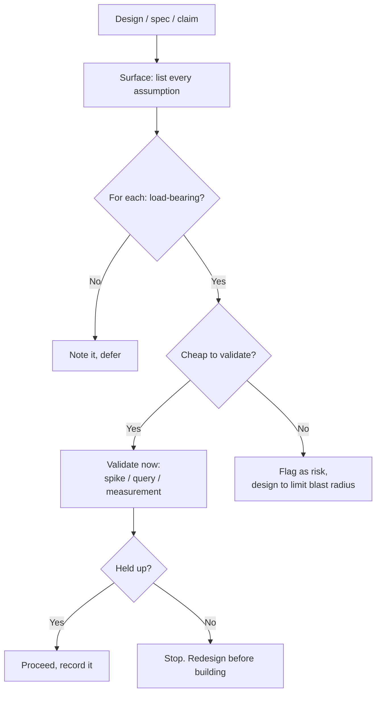

# Questioning Assumptions — Middle

> **What?** A *systematic* practice of extracting the assumptions embedded in a design, requirement, estimate, or "we can't do that," classifying which ones are load-bearing, and validating those cheaply *before* committing the architecture to them.
> **How?** You make assumption-surfacing a routine step — before estimating, before designing, during incident review. You learn the named techniques (inversion, pre-mortem, "what would have to be true"), you know the famous false-assumption catalogs (names, time, addresses), and you can tell the difference between an assumption you should verify and one you can safely defer.

---

## 1. From "I noticed an assumption" to a repeatable process

At junior level you spot assumptions reactively. At mid level you run them through a pipeline:



The two decisions that matter — *load-bearing?* and *cheap to validate?* — sort every assumption into one of four boxes. Only one box ("load-bearing AND cheap") is an immediate action. That's how you stay fast without being reckless.

---

## 2. Techniques to surface assumptions

You need more than one tool, because assumptions hide differently in different situations.

### Five Whys (root-cause direction)
Walk *downward* from a symptom. Best for incidents and bugs. Each "why" peels a layer; the buried assumption is usually 3–5 layers down (see junior level for the mechanics). Caveat: Five Whys is linear and can miss the multiple contributing causes a real incident has — treat it as a probe, not a complete RCA method.

### "What would have to be true?" (forward direction)
Walk *upward* from a plan to its preconditions. Best for designs and proposals. Turns one fuzzy claim into a checklist of testable preconditions.

### Inversion (negate the claim)
Don't ask "will this work?" Ask **"what would make this fail?"** Inverting flips your brain from confirmation to falsification. "The cache makes us fast" → "when does the cache make us *slow* or *wrong*?" → stampedes, stale reads, cold starts. You find failure modes you'd never reach by asking the positive question.

### Pre-mortem (Gary Klein)
Before a project starts, gather the team and say: *"It's six months from now. This project failed catastrophically. Write down why."* People who would never voice a doubt in a "go/no-go" meeting will happily explain a failure that already (hypothetically) happened. The pre-mortem surfaces the assumptions the team is collectively afraid to question. It's the single best group technique here.

### Assumption-listing before estimation
Before you give a number, list what the estimate assumes. "Two days — *assuming* the third-party API supports batch calls, *assuming* I can reuse the existing auth, *assuming* the data is already clean." Half of all blown estimates are a load-bearing assumption that turned out false. Listing them turns "2 days" into "2 days if X, Y, Z; otherwise 2 weeks."

---

## 3. The "Falsehoods programmers believe" catalogs

There's a whole genre of lists documenting assumptions that *feel* obviously true and are routinely wrong. They're worth internalizing because they're battle-tested.

**Falsehoods about names** (Patrick McKenzie's classic): names have a first/last part; names fit in ASCII; names don't change; a person has exactly one name; names are case-insensitive; names don't contain numbers. Every one of these has shipped a bug.

**Falsehoods about time:** a day has 86,400 seconds (leap seconds say no); the clock only moves forward (NTP corrections, DST, VM pauses say no); two consecutive timestamps are ordered (not with wall-clock time); a year has 365 days; timezones are whole-hour offsets (India is +5:30, Nepal +5:45).

**Falsehoods about addresses:** every address has a postal code; street addresses have a number; countries don't merge or split; the country list never changes.

The lesson isn't "memorize the lists." It's that **categories you think are simple — a name, a moment, a place — are the ones hiding the most false assumptions.** When you touch one of these, reach for the catalog.

---

## 4. Time is the deepest trap — two concrete ones

### Monotonic vs. wall-clock
You measure elapsed time like this:

```python
start = time.time()           # wall clock — DON'T use for durations
do_work()
elapsed = time.time() - start # can be NEGATIVE if NTP steps the clock back
```

The assumption — *the wall clock only moves forward* — is false. NTP can step it backward; a leap second can repeat a second; a laptop suspend can jump it hours. The fix is to use a **monotonic clock** for durations:

```python
start = time.monotonic()      # guaranteed non-decreasing
elapsed = time.monotonic() - start  # always >= 0
```

A negative `elapsed` has caused timeouts to fire instantly, retry loops to spin, and rate-limiters to let everything through.

### The 2038 problem
A signed 32-bit Unix timestamp overflows on **2038-01-19 03:14:07 UTC**. Any system storing time in a 32-bit `int` (still common in embedded gear, old databases, file formats) carries the assumption "this code won't run past 2038." For long-lived systems that's already false — a 30-year mortgage signed today matures after the rollover. Same family as the Y2K bug: an assumption about representation that quietly expires.

---

## 5. Validating cheaply — pick the right probe

The skill is matching the cheapest probe to the assumption:

| Assumption | Cheapest probe | Cost |
|---|---|---|
| "This fits in memory / table is small" | `SELECT COUNT(*), pg_total_relation_size(...)` against prod | seconds |
| "The new library is fast enough" | A throwaway benchmark spike on representative data | ~1 hour |
| "Users rarely hit this path" | Query logs / add a counter and wait a day | minutes + a day |
| "The third-party API supports batching" | Read their docs, then one real test call | ~30 min |
| "Our IDs fit in int32" | `SELECT MAX(id) FROM ...` and the growth rate | seconds |

The anti-pattern is **validating by building**: spending a sprint on the real implementation to discover the assumption was false. A spike is throwaway *on purpose* — it answers one question and gets deleted. If you find yourself polishing the spike, you've stopped validating and started building on an unverified bet.

---

## 6. Hyrum's Law: your users assume things you never promised

> *"With a sufficient number of users of an API, it does not matter what you promise in the contract: all observable behaviors of your system will be depended on by somebody."* — Hyrum Wright

This is the assumption problem from the *other* side. You assumed your API contract is "what I documented." Reality: users have built on the *actual observable behavior* — the iteration order of a map you never promised was ordered, the exact text of an error message, the fact that a list happened to come back sorted. Change any of it and something breaks.

Every undocumented-but-observable behavior is an implicit interface you didn't know you had. Before you "just change the internal sort order," ask: *who is assuming the old behavior?* The answer, per Hyrum, is "someone."

---

## 7. Worked example: an estimate, dissected

Ticket: *"Migrate user avatars from local disk to S3. Estimate?"*

Naive: "Two days." Now list assumptions:

1. The number of avatars is small enough to migrate in one pass. — *checkable: `SELECT COUNT(*) FROM users WHERE avatar IS NOT NULL`*. Result: 14 million. **Assumption false.** One pass would run for hours and may fail halfway.
2. All avatar paths in the DB actually point to files that exist. — *checkable on a sample*. Result: ~3% are dangling. Need a skip-and-log path.
3. We can rewrite the serving URLs everywhere at once. — Mobile clients cache old URLs; can't. Need a redirect/fallback.
4. S3 write throughput is fine. — Need batching + backoff; default per-object PUT for 14M objects is slow.

The honest estimate isn't "two days." It's "two days *only if* there are a few thousand clean avatars served by web clients only" — and surfacing the assumptions just revealed none of that is true. The list converted a wrong number into a real plan.

---

## 8. A four-box decision, made concrete

The two questions — *load-bearing?* and *cheap to validate?* — give four boxes. Knowing the box tells you the action:

| | Cheap to validate | Expensive to validate |
|---|---|---|
| **Load-bearing** | **Validate now.** A query, a spike. No excuse to skip. | **Make reversible.** Hide behind an interface, canary it, alert on it. (Senior-level move.) |
| **Incidental** | Validate if it's free; otherwise note it. | **Defer.** Write it down, move on. Don't burn budget here. |

Most engineers spend their time in the bottom row (easy, comforting) and avoid the top-right (expensive, scary) — which is exactly where the incidents come from. Discipline is forcing your attention to the top row, especially top-right.

A worked sort, for a "search autocomplete" feature:

- "The query index fits in RAM on one box." → load-bearing, cheap (estimate index size from row count × avg term length) → **validate now**.
- "Users type at most 50 characters." → incidental, cheap → glance and move on.
- "Latency under 50ms at p99 under real load." → load-bearing, expensive (needs prod traffic) → **make reversible**: ship behind a flag, measure on 1% of users, alert if p99 breaches.
- "Result ranking is good enough." → load-bearing-ish, expensive → **canary + measure** click-through, don't guess.

---

## 9. Surfacing assumptions in someone else's design

When you review a colleague's design doc, you're not checking syntax — you're hunting their hidden bets. A reusable set of probes:

- **"What's the largest realistic input?"** — flushes out uniformity/scale assumptions.
- **"What happens when this dependency is down or slow?"** — flushes out availability assumptions.
- **"How does this behave at zero and at a million?"** — extremes break assumptions.
- **"What did you measure vs. what did you assume?"** — separates evidence from hope.
- **"If you're wrong about X, how bad is it and how do we find out?"** — forces the load-bearing/cost judgment into the open.

The phrasing matters: ask about the *design*, never the *designer*. "What does this assume about ordering?" surfaces the bet without making it a personal challenge. That framing is what lets people answer honestly instead of defensively — and it's the seed of the cultural work you'll do later as a senior.

---

## 10. Anti-patterns at this level

- **Assumption theater.** Listing assumptions and then never validating the load-bearing ones. The list is worthless if the scary item stays unchecked.
- **Validating the easy ones.** People naturally check the assumptions that are *cheap and comforting* and skip the *expensive and scary* ones — exactly backward. Sort by risk, not by ease.
- **One-and-done.** An assumption verified in January (table is small) can be false by June. Load-bearing assumptions about *growth* need a monitor, not a one-time check.
- **Treating Five Whys as the whole answer.** It finds *a* root cause along one chain; real incidents are multi-causal.
- **Validating on toy data.** A spike on 1,000 clean rows does not validate "works on 14M dirty rows." Use *representative* data, including the ugly tail, or you've validated nothing.
- **Mistaking confidence for verification.** "I'm sure the API supports batching" is still an assumption until you've made one real call. Certainty is not evidence.

---

## 11. Keeping a record

When you do validate an assumption, write down the result *where the next person will see it* — in the design doc, in a comment next to the constant, in the PR description. An unrecorded validation decays: six months later nobody remembers whether "fits in memory" was checked or just hoped, so someone re-checks it (waste) or trusts it blindly (risk).

The cheapest form is an inline note that turns the implicit assumption explicit and timestamps the evidence:

```python
PAGE_SIZE = 500
# Validated 2026-06: p99 user has 4.2k events (query in #1234),
# so 500/page keeps us under 10 pages for nearly everyone.
# If max(event_count) grows past ~50k, revisit pagination.
```

That comment does three jobs: it states the assumption, cites the evidence, and names the threshold at which the assumption flips. The last line is the seed of an alert — which is exactly how senior and staff engineers turn a one-time check into a standing monitor.

---

## Where to go next

- The reasoning foundation underneath: [reasoning from fundamentals](../01-reasoning-from-fundamentals/).
- After demolishing a load-bearing assumption, [rebuild from scratch](../03-rebuilding-solutions-from-scratch/).
- Sibling discipline of evaluating claims and evidence: [critical thinking](../../04-critical-thinking/).
- Where assumption-surfacing plugs into solving problems: [problem-solving](../../02-problem-solving/).
