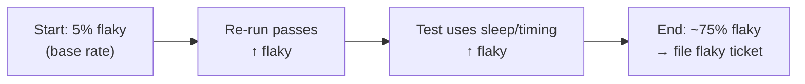

> **What?** Reasoning under uncertainty means treating your beliefs as *probabilities* (degrees of confidence) instead of flipping a coin between "definitely true" and "definitely false" — and updating those probabilities when new evidence shows up.
>
> **How?** When you don't have full information (which is almost always), you estimate how likely something is, say that number out loud, and revise it as you learn more — instead of guessing one answer and defending it.

---

## 1. The core idea: you almost never *know*

As a junior engineer, you are constantly forced to answer questions you cannot fully verify:

- "Is this test failing because of my change, or is it flaky?"
- "Will this PR break production?"
- "Is this bug in our code or in the library?"

The beginner instinct is to pick **one** answer and commit to it: *"It's flaky, ignore it."* The senior instinct is to hold a **probability**: *"There's maybe a 70% chance it's flaky, 30% chance my change broke it — so I'll re-run it twice and skim my diff before deciding."*

That shift — from a single guess to a *degree of belief* — is the whole topic.

> A probability is just a number from 0 to 1 (or 0% to 100%) that says how confident you are. 0 = "impossible," 1 = "certain," 0.5 = "I genuinely have no idea."

You will be wrong sometimes. That is fine. The goal is not to be certain; it's to be *roughly right about how confident you should be*.

---

## 2. Two ways to read a probability

There are two common meanings, and mixing them up confuses people.

| View | "There's a 70% chance" means… | Example |
|------|------------------------------|---------|
| **Frequency** | If this happened 100 times, ~70 would go this way | "70% of deploys on Fridays cause an incident" (counted from history) |
| **Belief** (Bayesian) | I am 70% confident in *this one specific* claim | "I'm 70% sure *this* test is flaky" |

The **belief** view is the one you'll use most, because most engineering questions are about *this specific case right now*, which has never happened before and never will again. You can't run it 100 times. So the number is your honest confidence, informed by whatever data you do have.

---

## 3. Evidence should move the number

The single most important habit: **when you get new information, your probability should change.**

```text
Before evidence:  "I'm 50/50 on whether my change broke the test."
New evidence:      The test also fails on the main branch, without my change.
After evidence:   "Now I'm ~90% sure it's NOT my change."
```

If a new piece of evidence does *not* change your confidence at all, then either (a) it wasn't real evidence, or (b) you're ignoring it because you've already decided. Both are bugs in your thinking.

This is the intuition behind **Bayes' theorem** (covered properly in [middle.md](middle.md) and the sibling topic [base rates and expected value](../02-base-rates-and-expected-value/)). For now, just internalize the slogan:

> **Strong evidence → big update. Weak evidence → small update. No evidence → no update.**

---

## 4. "It works on my machine" is a probability statement in disguise

When you say *"it works on my machine,"* what you actually know is:

- It worked **once**, **here**, with **your** config, **your** data.

That is one data point. It does not mean it works *in general* — it nudges your confidence up a little, not all the way to 100%. Treating "it ran once" as "it definitely works" is the most common uncertainty mistake juniors make.

The fix is to *say the real confidence*: "It passed locally, so I'm fairly confident — but I haven't tested it with production-sized data or under load, so I'd put it at maybe 75%."

---

## 5. Say the number — calibration in one sentence

A small but powerful habit: attach a confidence to your claims.

| Vague | Calibrated |
|-------|-----------|
| "This should work." | "I'm ~80% sure this works; the risky part is the date-parsing." |
| "It's definitely a backend bug." | "I'd say 60% backend, 40% our frontend — I haven't checked the network tab yet." |
| "We'll be done tomorrow." | "Probably tomorrow, but there's a real chance it's Thursday if the migration is messy." |

When you say "70%," the long-run goal is that claims you call "70%" turn out true about 70% of the time. That is **calibration**, and good engineers train it the same way they train any skill — by predicting, then checking. (More in [senior.md](senior.md).)

You don't need to be precise. "Pretty sure," "maybe," and "almost certainly" already carry rough probabilities. Just *don't collapse everything to "yes" or "no."*

---

## 6. A tiny worked example: is this test flaky?

Suppose a test fails in CI. You want to know: **is it flaky, or did I break it?**

What you know from experience on this codebase:
- About **1 in 20** test failures historically turn out to be flakiness (5%).
- The other **19 in 20** are real (95%).

So *before looking at anything else*, the odds your failure is "just flaky" are low — only ~5%. This starting number is called the **base rate**, and beginners ignore it constantly (the famous trap, explained fully in [middle.md](middle.md)).

Now you gather evidence:
- You re-run the test → it **passes**. Flaky tests often pass on re-run; real failures usually don't.
- The failure is in a test that touches *timing*/`sleep`, which is a classic flakiness source.

Each clue pushes your "it's flaky" probability *up* from that low 5% start. After both clues you might land at, say, 75% — enough to file a "flaky test" ticket rather than revert your change. But notice: you started **skeptical** because the base rate was low, and let evidence move you. That's the whole game.



---

## 7. Decisions don't wait for certainty

Here's the part that feels uncomfortable at first: **you have to act before you're sure.**

You will merge code you're 85% confident in. You'll deploy on Friday knowing there's a 10% chance of a rough weekend. Waiting for 100% certainty means shipping nothing, ever, because 100% doesn't exist.

So the real skill isn't "be certain" — it's:

1. Estimate the probability honestly.
2. Estimate what happens if you're wrong (small inconvenience? outage?).
3. Decide based on **both**.

A 5% chance of a typo is fine. A 5% chance of deleting the production database is not — same probability, wildly different decision, because the *cost of being wrong* differs. That weighing of probability × cost is **expected value**, and it's the heart of the next topic, [base rates and expected value](../02-base-rates-and-expected-value/).

---

## 8. Practical habits for right now

- **Replace "yes/no" with "X% / Y%."** Train yourself to give two-sided answers.
- **State your confidence in PRs and standups.** "I'm fairly confident but the migration is untested" is far more useful than "looks good."
- **Treat one success as one data point**, not proof.
- **When surprised, update — don't rationalize.** Surprise is evidence that your model was wrong.
- **Ask "what's the base rate?"** before reacting to a single signal (one failing test, one slow request, one user complaint).

---

## 9. Where this goes next

| Next step | Topic |
|-----------|-------|
| The actual math of updating beliefs | [middle.md](middle.md) |
| Calibration, risk vs uncertainty, point estimates that lie | [senior.md](senior.md) |
| Communicating uncertainty to leadership, probabilistic SLOs | [professional.md](professional.md) |
| Practice problems | [tasks.md](tasks.md) |
| Sibling: weighing probability against cost | [base rates and expected value](../02-base-rates-and-expected-value/) |
| Sibling: how likely is this to fail? | [risk and failure probabilities](../03-risk-and-failure-probabilities/) |
| Related bias: how our brains break under uncertainty | [cognitive biases in code decisions](../../04-critical-thinking/03-cognitive-biases-in-code-decisions/) |
| Back to the section overview | [Probabilistic Thinking](../) |
| Roadmap home | [Engineering Thinking](../../README.md) |

**The one takeaway:** Stop forcing every uncertain question into a yes/no answer. Hold a probability, say it out loud, and let evidence move it.
