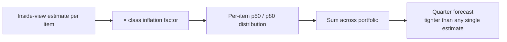
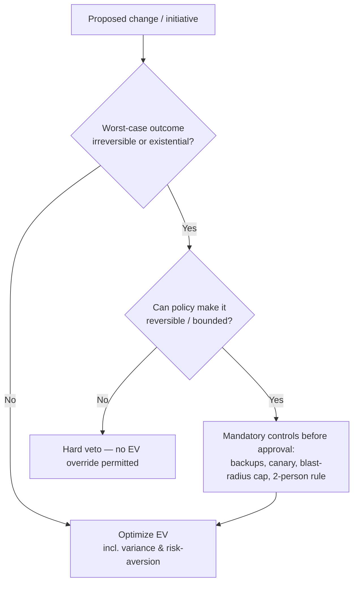

> **What?** At staff/principal level, base rates and EV are organizational instruments: priors become governance, reference-class forecasting becomes estimation policy, and EV becomes the lens for portfolio-level prioritization — all clamped by a firm-wide *no-ruin* constraint that protects the company from tail and irreversible risk.
>
> **How?** You design the decision *systems*: the data pipeline that maintains base rates, the estimation governance that forces the outside view, the EV-ranked portfolio of bets across a roadmap, and the explicit ruin/blast-radius policy that vetoes +EV decisions which threaten survival at org scale.

---

## 1. From personal heuristic to organizational instrument

Staff impact is not making better individual EV calls — it's ensuring **the org makes consistently sound probabilistic decisions without you in the room**. Three systems:

| System | What it institutionalizes | Failure it prevents |
|---|---|---|
| **Base-rate data pipeline** | Measured priors per decision type | Each team relearning by accident; representativeness bias |
| **Estimation governance** | Outside-view defaults, p50/p80 commitments | Org-wide planning fallacy and serial overruns |
| **EV portfolio + ruin policy** | Ranked bets under an explicit survival constraint | Chasing local +EV into a tail catastrophe |

The throughline: convert cognitive corrections (which don't scale) into **process and data** (which do). Tversky & Kahneman showed individuals can't reliably debias themselves; the staff answer is structural.

---

## 2. Base rates as a governed data product

### 2.1 Maintain priors as a measured pipeline

Priors that aren't measured rot into folklore. Treat them as a small data product, refreshed on a cadence:

```
deploy_caused_incident_rate   = incidents_from_recent_change / total_incidents          (per quarter)
estimate_inflation_by_class   = median(actual / first_estimate) grouped by work_class
change_failure_rate           = failed_changes / total_changes        (a DORA metric)
incident_recurrence_rate      = repeat_root_causes / total_incidents
```

These priors do double duty: they anchor decisions **and** they're org-health KPIs. A rising `change_failure_rate` is a base rate *and* a signal your delivery system is degrading — it feeds directly into the EV of "invest in CI/CD hardening this quarter."

### 2.2 Govern against base-rate neglect at scale

At org scale, base-rate neglect shows up as **whole programs chasing vivid-but-rare scenarios**: a re-architecture justified by an outage class that's 2% of incidents, while the 70% (config/deploy) goes unaddressed. The staff control is a standing question in planning and incident review: *"What fraction of real events does this work actually address?"* It forces representativeness back into frequency.

---

## 3. Reference-class forecasting as estimation governance

### 3.1 Policy, not suggestion

Flyvbjerg's reference-class forecasting is now mandated for certain public megaprojects precisely because the inside view is *predictably* optimistic and the bias is expensive. The staff translation for an engineering org:

- **Every estimate above a threshold must cite a reference class** and apply the class inflation factor.
- **Commitments use p80; capacity planning uses p50.** The gap is the explicit risk buffer.
- **"This one is different" requires evidence that beats the class data** — the burden of proof sits on optimism, structurally.

### 3.2 Portfolio-level forecasting

Individual estimates are noisy; portfolios are not. Across 30 roadmap items, the *sum* of p50s with reference-class inflation is a far better quarter forecast than any single estimate, because individual over/under-runs partially cancel while the systematic inflation does not. This is why staff engineers forecast **roadmaps**, not tickets: the law of large numbers makes the aggregate honest even when each line is uncertain.



---

## 4. EV as a portfolio lens

### 4.1 Rank the roadmap by risk-adjusted EV

A staff engineer prioritizes a *portfolio* of bets, each with its own probability of success and payoff. The score per initiative:

```
EV(initiative)  =  P(success) × value_if_success  −  P(failure) × cost_if_failure  −  build_cost
```

| Initiative | P(success) | Value | P(fail) | Fail cost | Build cost | EV |
|---|---|---|---|---|---|---|
| Multi-region active-active | 0.6 | 5.0M | 0.4 | 0.8M | 1.2M | **1.48M** |
| New ML ranking model | 0.4 | 6.0M | 0.6 | 0.3M | 0.9M | **1.32M** |
| Internal platform rewrite | 0.5 | 2.0M | 0.5 | 1.0M | 1.5M | **−1.0M** |
| Self-serve onboarding | 0.7 | 2.5M | 0.3 | 0.2M | 0.4M | **1.29M** |

EV(active-active) = 0.6×5.0 − 0.4×0.8 − 1.2 = **+1.48M**. The platform rewrite is **−1.0M EV** and should not run as framed — a classic staff veto backed by arithmetic instead of opinion.

### 4.2 Portfolio thinking: diversify across uncorrelated bets

Two truths sit together: **most novel bets fail** (a base rate), and **you can't tell in advance which one wins**. The portfolio response — straight from finance — is to fund several *uncorrelated*, capped-downside, high-upside bets rather than one big correlated wager. Each may be individually likely to fail; the portfolio's EV is positive because one outsized winner dominates. The constraints that make this safe:

- **Cap the downside of each bet** (bounded build cost, reversible, time-boxed). This caps the loss term so failures are survivable.
- **Keep bets uncorrelated** so they don't all fail for the same reason — correlation is what turns a diversified portfolio back into a single fat-tailed wager.

This is asymmetric-payoff (Taleb's "optionality") thinking: many cheap experiments with bounded loss and unbounded upside beat one expensive all-in.

---

## 5. The org-scale ruin constraint

### 5.1 EV is subordinate to survival — always

The single most important staff-level principle: **EV maximization is valid only within the survivable region, and at org scale the survivable region must be defined as policy.** Non-ergodicity (Peters; Taleb) is the formal reason — the company is *one* player walking a *single* path through time, not an ensemble that gets to average over parallel universes. A +EV strategy with a small per-period chance of ruin converges to ruin with probability approaching 1 as periods accumulate.

```
P(survive one period)   = 1 − p
P(survive N periods)    = (1 − p)^N → 0   as N grows, for any p > 0
```

So the staff job is to **drive the irreversible-catastrophe probability to structurally zero**, not to "price it into the EV."

### 5.2 What "ruin" means at company scale

| Ruin category | Example | Required posture |
|---|---|---|
| Data | Irreversible loss/corruption of customer data | Verified backups, reversible migrations, expand/contract |
| Security | Breach exposing the whole user base | Defense in depth, blast-radius isolation, least privilege |
| Financial | A single bet that can bankrupt the firm | Cap exposure; never a +EV bet you can't survive losing |
| Regulatory/reputational | An action that ends the license to operate | Hard policy veto, independent of EV |
| Correlated infra | Single dependency whose failure takes down everything | Remove the single point; isolate blast radius |

### 5.3 Encode it as policy

The constraint must be **mechanical**, not a judgment call made under deadline pressure:



Required controls (backup verification, progressive delivery, blast-radius caps, change-approval for high-risk classes) are the *mechanism* that moves an item from the ruin branch into the EV branch. Canarying, again, is an EV-reduction tool: it shrinks the blast-radius term so the same failure probability produces far less expected loss.

---

## 6. EV in SRE and reliability economics at scale

### 6.1 Error budgets as a portfolio-level EV market

Across many services, error budgets become a **pricing system for risk**. Teams "spend" budget on velocity; the org sets the SLO (hence the budget) where the *marginal expected cost of an extra nine* equals its *marginal value*. Over-buying reliability is negative-EV (you paid for nines users don't notice); under-buying is negative-EV (churn, trust). Staff engineers set SLOs at the EV-optimal point, not the maximum.

### 6.2 Risk = probability × blast radius, governed

```
service_risk  =  P(incident) × blast_radius
org_risk      =  Σ service_risk  +  Σ (ruin items, handled separately at probability → 0)
```

Ruin items are **never summed into the EV** — they're driven to structural impossibility and tracked apart. Everything else is ranked by EV-risk and mitigated in ROI order. This is the clean separation principals enforce: *average* risks get optimized; *catastrophic/irreversible* risks get eliminated.

---

## 7. Principal anti-patterns

- **Pricing ruin into EV.** Any model that "accepts" a small probability of existential loss because the average looks good is structurally wrong. Eliminate, don't average.
- **One big correlated bet instead of a diversified portfolio.** Concentration plus fat tails is how orgs die; diversify uncorrelated, capped-downside bets.
- **Unmeasured priors as policy.** Generic base rates ("70% deploys") presented as fact without your own data; measure and refresh.
- **Point estimates at the portfolio level.** Forecast distributions and commit to p80; the portfolio sum is your honest number.
- **Maximizing reliability instead of optimizing it.** More nines than users value is negative-EV; SLOs belong at the EV-optimal point.
- **Treating EVI as free.** Spikes and PoCs that can't change the decision are zero-information cost centers.

---

## References & further reading

- Tversky & Kahneman (1974); Kahneman, *Thinking, Fast and Slow* (2011) — base-rate neglect, inside/outside view.
- Flyvbjerg, B. — reference-class forecasting; megaproject optimism bias and its policy mandates.
- Bernoulli, D. (1738) — St. Petersburg paradox; expected utility.
- Peters, O. (2019) — ergodicity economics; Taleb, N. N. — *The Black Swan*, *Antifragile*, *Skin in the Game* — ruin, optionality, fat tails, non-ergodicity.
- Beyer et al. (eds.) — *Site Reliability Engineering* and *The SRE Workbook* (Google) — error budgets, SLO economics, risk = probability × impact.
- Forsgren, Humble, Kim — *Accelerate* (DORA: change failure rate as a measured base rate).
- Related: [reasoning under uncertainty](../01-reasoning-under-uncertainty/) · [risk and failure probabilities](../03-risk-and-failure-probabilities/) · [estimation under uncertainty](../04-estimation-under-uncertainty/) · [cognitive biases in code decisions](../../04-critical-thinking/03-cognitive-biases-in-code-decisions/) · [evaluating tradeoffs objectively](../../04-critical-thinking/04-evaluating-tradeoffs-objectively/) · [probabilistic thinking](../) · [engineering thinking](../../README.md).
