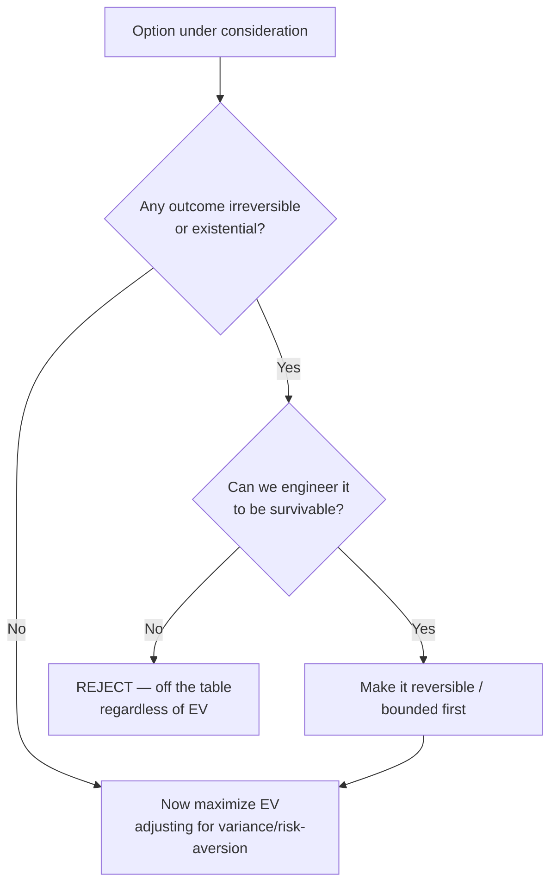

> **What?** At senior level, base rates and EV stop being one-off calculations and become *defaults baked into how your team decides*: priors enforced by runbooks and review checklists, reference classes maintained as estimation data, and EV used to rank work — bounded everywhere by an explicit ruin constraint and tail awareness.
>
> **How?** You install base rates as the first hypothesis in incident response, run estimation off a reference-class dataset rather than gut feel, prioritize bugs and reliability work by P(occurrence)×cost, decide spikes by expected value of information, and apply a hard "no-ruin" filter on top of EV for anything with irreversible downside.

---

## 1. Base rates as institutional defaults

A senior engineer's leverage is making the *team* reason from priors, not just themselves.

### 1.1 Encode priors into process

| Decision moment | Base-rate-driven default |
|---|---|
| Incident triage | First hypothesis: "the most recent change." Runbook step 1 = `what shipped in the last N hours?` |
| Code review of a failure | Highest scrutiny on the *new* diff, not the stable core |
| Estimation kickoff | Open with the reference-class number, not someone's gut feel |
| New-idea evaluation | Prior = "most novel bets miss their goal"; burden of proof is on optimism |

The point: representativeness bias (Tversky & Kahneman) is individual and unreliable; a checklist is collective and reproducible. You're converting a cognitive correction into an organizational one.

### 1.2 Calibrate the priors to *your* system

Generic numbers are a starting prior; the senior move is to **measure your own**:

```
config/deploy-caused incidents  =  (# incidents traced to a recent change) / (total incidents)
estimate inflation factor       =  median( actual_duration / first_estimate )  over last 20 tasks
last-change bug rate            =  (# P1 bugs from last 2 weeks of commits) / (total P1 bugs)
```

Recompute quarterly. A falling deploy-caused-incident rate is evidence your CI/CD and review gates are working — the base rate becomes a reliability KPI, not just a debugging heuristic.

---

## 2. Reference-class forecasting as estimation governance

The planning fallacy is not cured by "try to be more realistic." It's cured by **replacing the inside view with the outside view as the default estimation method** (Kahneman; Flyvbjerg's reference-class forecasting, now mandated on some public infrastructure projects).

### 2.1 Build and use the reference-class dataset

1. Tag every shipped task with a class (migration, integration, refactor, greenfield feature, infra).
2. Store `first_estimate`, `actual`, and the ratio.
3. At planning time, the estimate is `inside_view_estimate × class_median_ratio`, quoted as a **range** (p50 and p80), never a single number.

### 2.2 Worked governance example

Class = "third-party integration." History:

| Integration | Est | Actual | Ratio |
|---|---|---|---|
| Payment provider | 5d | 12d | 2.4 |
| Email/SMS | 3d | 6d | 2.0 |
| Analytics SDK | 2d | 5d | 2.5 |
| SSO/SAML | 8d | 20d | 2.5 |
| Feature-flag SaaS | 4d | 6d | 1.5 |

`p50 ratio ≈ 2.4`, `p80 ratio ≈ 2.5`. New integration estimated inside-view at 6d →

```
p50  ≈ 6 × 2.4 ≈ 14d
p80  ≈ 6 × 2.5 ≈ 15d
```

You commit to the **p80** for external promises and plan capacity to the p50. This is also the antidote to the commitment trap discussed in [evaluating tradeoffs objectively](../../04-critical-thinking/04-evaluating-tradeoffs-objectively/): the reference class makes "but this one's simpler" an argument that has to beat data.

---

## 3. EV-driven prioritization across the backlog

EV's senior application is **ranking**, not one-off comparison. Two complementary scores:

### 3.1 Rank reliability work by expected cost averted

```
priority score  =  P(failure per period) × cost(failure)        ← expected loss if untouched
ROI             =  (expected loss averted) / (engineering cost to fix)
```

| Item | P/quarter | Cost if it happens | Exp. loss | Fix cost | ROI |
|---|---|---|---|---|---|
| Add idempotency to payment webhook | 0.30 | 400k | 120k | 15k | **8.0** |
| Reduce p99 latency 200ms | 0.95 | 30k (churn) | 28.5k | 40k | 0.71 |
| Harden flaky deploy step | 0.50 | 60k | 30k | 8k | **3.75** |
| Migrate logging library | 0.10 | 20k | 2k | 25k | 0.08 |

Ranked by ROI: idempotency → flaky deploy → latency → logging. The logging migration is *negative-ROI right now* — EV says don't do it, even though it's tempting hygiene. This is how you defend a roadmap against "we should fix everything."

### 3.2 EV of imperfect information for spikes and de-risking

Senior teams spend time to *buy information* deliberately. The rule from [middle](middle.md) — run a test only when `EVI > cost` and only when the result can change the decision — becomes a gating question in design review: **"What's the cheapest experiment that would change our mind, and is it worth its cost?"** A proposed two-week PoC whose outcome wouldn't alter the plan has EVI = 0 and should be cut.

---

## 4. The ruin constraint: EV is bounded, never absolute

This is the senior dividing line. EV maximization is correct **only inside the region where every outcome is survivable**. Outside it, EV is actively dangerous.

### 4.1 Why "+EV" is not enough — non-ergodicity

Ole Peters and Nassim Taleb's point: for a repeated bet, the **time-average growth of a single player** can be negative even when the **ensemble-average (EV) is positive**, because losses compound and ruin is absorbing — once you're wiped, you stop playing. Concretely:

A deploy process is "+EV" — each deploy expects +5 units of value but carries a **1% chance of irreversible data loss**.

```
P(surviving one deploy)   = 0.99
P(surviving 70 deploys)   = 0.99⁷⁰ ≈ 0.50
```

Half the time, within a quarter of normal deploy cadence, you've hit the unrecoverable event. No amount of positive per-deploy EV redeems that, because the catastrophe terminates the sequence. The senior response is not "improve the EV" — it's **make the catastrophe impossible**: backups, migrations that are reversible, two-person rules, blast-radius caps.

### 4.2 The decision rule seniors actually use



**Survive first, optimize second.** EV operates only after the ruin filter passes.

### 4.3 Fat tails and the limits of the mean

When the loss distribution is fat-tailed — cascading failures, security breaches, retry storms, thundering herds — the sample mean is unstable and *underestimates* the tail from small samples. You stop trusting "average impact" and switch to **bounding the worst case**: cap concurrency, set blast-radius limits, rate-limit, circuit-break. Tail-focused reliability is developed in [risk and failure probabilities](../03-risk-and-failure-probabilities/). The St. Petersburg paradox (Bernoulli) is the canonical proof that a finite, sane decision can come from an infinite EV — the mean is simply not always the thing to maximize.

---

## 5. EV in SRE: error budgets and blast radius

SRE is applied expected value.

### 5.1 Error budgets are an EV instrument

An SLO of 99.9% availability grants a **budget** of ~43 min/month of downtime. That budget is *spent* on risk: each risky deploy or experiment has an expected cost in budget-minutes. You ship aggressively while budget remains and freeze when it's exhausted — an explicit EV policy: `expected_budget_spend(change) ≤ remaining_budget`. The EV framing is the key idea: *you are trading reliability for velocity at a price set by the budget.*

### 5.2 Risk = probability × blast radius

The standard SRE risk score is pure EV:

```
risk  =  P(incident) × blast_radius(users or revenue affected)
```

| Change | P(incident) | Blast radius | Risk (EV) | Mitigation |
|---|---|---|---|---|
| Global config rollout | 0.05 | 100% of users | 0.050 | Canary → 1% → 10% → 100% |
| Single-region deploy | 0.10 | 15% of users | 0.015 | Standard |
| Schema migration | 0.08 | potential total data loss | **ruin** | Expand/contract, reversible, backup-verified |

Note the schema row: its blast radius is *unbounded/irreversible*, so it's not an EV number — it's a **ruin item** that must be engineered to be reversible before it's allowed at all. Canarying explicitly *lowers the blast-radius term*: same P(incident), far smaller affected fraction, so much lower EV-risk. That's why progressive delivery is the default — it's an EV reduction strategy.

---

## 6. Senior anti-patterns

- **Quoting generic base rates without measuring your own.** "Most outages are deploys" — but is *yours*? Measure.
- **Maximizing EV through a ruin gate.** Any process that lets a +EV decision carry irreversible catastrophe is broken; fix the reversibility, not the average.
- **Running spikes with zero EVI.** A PoC whose result can't change the decision is theater.
- **Confusing low-variance with low-EV.** Sometimes the predictable option *is* worth a slightly lower mean; say so explicitly rather than pretending EV settles it.
- **Treating estimates as points.** Reference-class forecasting yields a *distribution*; commit to p80, plan to p50.

---

## References & further reading

- Tversky & Kahneman (1974); Kahneman, *Thinking, Fast and Slow* (2011) — base-rate neglect, inside vs outside view.
- Flyvbjerg, B. — reference-class forecasting in megaprojects (now policy in some jurisdictions).
- Bernoulli, D. (1738) — St. Petersburg paradox; utility vs expected value.
- Peters, O. (2019), "The ergodicity problem in economics"; Taleb, N. N. — *The Black Swan*, *Antifragile*, *Skin in the Game* — ruin, fat tails, non-ergodicity.
- Beyer et al. (eds.) — *Site Reliability Engineering* (Google) — error budgets, risk = probability × impact.
- Related: [reasoning under uncertainty](../01-reasoning-under-uncertainty/) · [risk and failure probabilities](../03-risk-and-failure-probabilities/) · [estimation under uncertainty](../04-estimation-under-uncertainty/) · [cognitive biases in code decisions](../../04-critical-thinking/03-cognitive-biases-in-code-decisions/) · [evaluating tradeoffs objectively](../../04-critical-thinking/04-evaluating-tradeoffs-objectively/) · [probabilistic thinking](../) · [engineering thinking](../../README.md).
