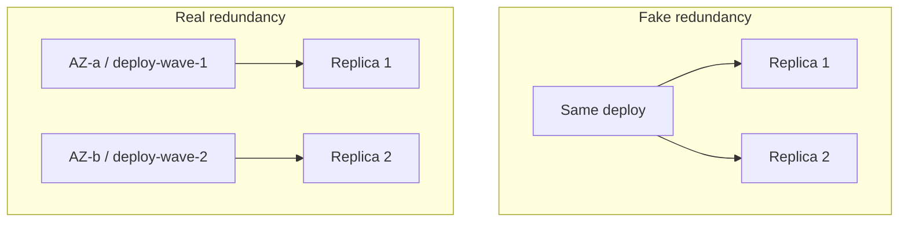
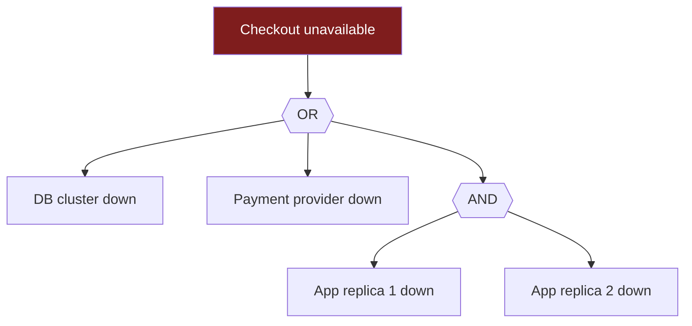

> **What?** The senior view of failure probability is about the assumptions that break the clean arithmetic: **independence is almost always false** (shared dependencies, same deploy, same AZ), the **tail dominates** (rare events carry most of the expected loss, and our estimates of them are worst where it matters most), and "add probabilities" needs care (the **union bound** for "at least one of N"). You reason about *blast radius* as a first-class quantity, not just probability.
>
> **How?** You stop trusting paper reliability and start asking "what is the *shared* failure mode?" You build fault trees and run FMEA to find correlated and single-point failures. You use the union bound to bound the chance that *any* of many rare things bites you. And you allocate effort by where the *tail* expected-loss lives, not where the failures are most frequent.

---

## 1. Why "Five-Nines Components" Don't Give a Five-Nines System

Marketing math says: stack enough reliable parts and the system is reliable. Reality says the opposite, for two compounding reasons.

**Reason 1 — series erosion.** As [middle](middle.md) showed, required components multiply availabilities *down*. Thirty microservices at 99.99% each in a request path:

```
0.9999³⁰ ≈ 0.9970   →  ~99.7%
```

Four-nines parts, three-nines system. Distributed architectures *manufacture* series dependencies.

**Reason 2 — correlated failure.** Redundancy only helps if failures are independent, and they usually aren't. This is the big one.

---

## 2. Correlated Failure: The Independence Lie

The parallel formula `U_system = U₁ × U₂` assumes failures are independent. Decompose each component's failure into:

- an **independent** part `p_ind` (this one replica's own bad luck — a disk, a GC pause), and
- a **common-cause** part `p_cc` (something that takes *all* of them at once — bad deploy, AZ outage, poisoned config, shared dependency).

For two replicas, the real unavailability is roughly:

```
U_system ≈ p_ind² + p_cc
            └────┘   └──┘
         independent   common-cause floor
```

The independent term shrinks quadratically — wonderful. But `p_cc` **doesn't shrink with redundancy at all.** It is a *floor* that adding replicas cannot cross.

**Worked example.** Each replica is 99% available. Suppose 90% of that 1% downtime is independent and 10% is common-cause:

```
p_ind = 0.009,  p_cc = 0.001
Naïve (independent):   U = 0.01² = 0.0001     → 99.99%
With correlation:      U ≈ 0.009² + 0.001
                         = 0.000081 + 0.001
                         = 0.001081            → 99.89%
```

A *tiny* 0.1% common-cause component dragged you from **99.99% down to 99.89%** — you lost most of the benefit of the second replica. **Beyond a point, more replicas buy nothing; the common-cause floor owns your availability.**

### Where correlation comes from (the usual suspects)

| Shared thing | Example | Mitigation |
|---|---|---|
| Same deploy | One bad rollout hits every replica | Canary / staged rollout, bake time |
| Same AZ / rack / power | AZ outage takes all "redundant" nodes | Spread across AZs/regions |
| Same upstream | All depend on one config/DNS/auth service | Diversify, cache, graceful degradation |
| Same code/bug | Same input crashes every instance | N-version is expensive; fuzz + limits |
| Same control plane | Autoscaler/orchestrator failure cascades | Static stability, cell isolation |

> **Design rule:** redundancy is only as good as the *independence* of its copies. Two replicas in the same AZ on the same deploy are barely more reliable than one. Spreading copies across **failure domains** (AZs, regions, deploy waves, dependency stacks) is what converts redundancy into real nines.



---

## 3. The Union Bound: P(at least one of N rare events)

You frequently need "what's the chance *any* of these rare things happens?" The exact answer for independent events is `1 − ∏(1 − pᵢ)`. The **union bound** gives a quick, always-safe upper estimate:

```
P(at least one of A₁..Aₙ) ≤ p₁ + p₂ + ... + pₙ
```

It holds *regardless of dependence* — you never have to know the correlations. For small probabilities it's also a good approximation, since `1 − ∏(1−pᵢ) ≈ Σpᵢ` when each `pᵢ` is tiny.

**Worked example.** A deploy touches 50 services, each with a 0.5% chance of introducing a regression:

```
P(at least one regression) ≤ 50 × 0.005 = 0.25
Exact (independent):        1 − 0.995⁵⁰ ≈ 0.222
```

Roughly a **1-in-4 to 1-in-5 chance** that *some* service in a 50-service deploy goes bad — even though each is 99.5% safe individually. This is the quantitative reason big-bang deploys are dangerous and why you decompose releases. The flip side: across *many* requests, even a one-in-a-million per-request failure becomes near-certain at scale (`p = 10⁻⁶`, `N = 10⁷` requests → `≈ 1`). **Rare per unit becomes common at scale** — every infrequent edge case *will* be hit.

---

## 4. Tail Risk and Fat Tails

Most engineering damage doesn't come from the average failure. It comes from the **tail** — the rare, severe event. Two ideas:

**Fat tails (Taleb).** In many real systems, extreme events are far more likely than a normal-distribution intuition suggests. Outage durations, blast radii, traffic spikes, and incident costs tend to be heavy-tailed: a single event can dwarf the sum of all the small ones. The **mean is dominated by the tail**, so averages mislead. A "typical" incident tells you little about the one that ends your quarter.

**Black Swans (Taleb).** Rare, high-impact, retrospectively-rationalized events — the ones *not* in your risk register precisely because you didn't imagine them. You cannot enumerate them all; you can only build systems that *survive surprise* (margins, graceful degradation, blast-radius limits, the ability to recover from unknown causes).

Practical consequences for a senior engineer:

- **Plan for the P99.9 incident, not the median one.** Capacity, on-call, and recovery must hold under the bad tail.
- **Cap the downside instead of predicting it.** You can't reliably estimate `p_cc` for an unknown failure — so bound the *impact*: limit blast radius (cells, shuffle sharding, quotas), and ensure you can recover *without diagnosing root cause* (rollback, failover, kill switch).
- **Beware "it's never happened" reasoning.** Absence of a rare event isn't evidence it's improbable — it may just be rare. (See [reasoning under uncertainty](../01-reasoning-under-uncertainty/).)

> Antifragile-style framing: don't aim to *predict* the tail event. Aim to make the tail event *cheap when it happens.*

---

## 5. Failure Modes Analysis: FMEA and Fault Trees

To find correlated and single-point failures *before* they bite, two classic reliability tools:

### FMEA — Failure Mode and Effects Analysis

Enumerate, for each component, *how* it can fail, the effect, and score it. The standard metric is **RPN (Risk Priority Number)**:

```
RPN = Severity × Occurrence × Detection
```

(each typically 1–10; high *Detection* means *hard to detect* — that's bad). You sort by RPN and attack the top.

| Component | Failure mode | Sev | Occ | Det | RPN |
|---|---|---:|---:|---:|---:|
| Config service | Pushes bad config to all nodes | 9 | 4 | 7 | **252** |
| Single LB | Hardware death | 8 | 2 | 2 | 32 |
| Cache | Cold start after restart | 4 | 5 | 3 | 60 |

The config-service row screams "common-cause + hard to detect" — exactly the kind of correlated failure that wrecks redundancy. FMEA surfaces it systematically rather than by luck.

### Fault trees (FTA)

Top-down: start from the undesired event and decompose via **AND** gates (all must fail — series-like, *good*: multiplies probabilities down) and **OR** gates (any can cause it — *bad*: union-bound up).



Reading it: checkout dies if the DB dies **OR** payments die **OR** (replica 1 **AND** replica 2 die). The **OR** branches are your single points of failure — they fail the whole system alone. The **AND** branch is your redundancy — but only if the two replicas are independent (back to §2). Fault trees make the OR-gate SPOFs and the independence assumptions *visible*.

---

## 6. Reduce Probability vs. Reduce Blast Radius / MTTR

Senior judgment is knowing which lever to pull. Three distinct dials:

| Dial | What it does | Cost profile |
|---|---|---|
| ↓ **Probability** (MTBF) | Fail less often | Exponentially expensive past a point; hits the `p_cc` floor |
| ↓ **Blast radius** | Each failure hurts fewer users | Architectural: cells, sharding, isolation — moderate, durable |
| ↓ **MTTR** | Recover faster | Usually cheapest: rollback, alerting, automation, runbooks |

The base rate (most outages are change-induced) plus the correlation floor (you can't drive `p_cc` to zero) together imply: **past the first redundancy, spend on blast radius and MTTR, not on chasing probability.** Cellular architecture, shuffle sharding, and fast safe rollback give you more *felt* availability per dollar than another nine of MTBF ever will.

---

## 7. Senior Heuristics

1. **Distrust multiplied unavailabilities.** Always estimate the common-cause floor `p_cc`; it caps your redundancy.
2. **Spread copies across failure domains.** Independence is *designed*, not assumed.
3. **Union-bound the "any of N" questions.** Big deploys and high request volumes make rare things common.
4. **Allocate by tail expected-loss,** not failure frequency. The rare severe event dominates.
5. **Cap the downside you can't predict.** Blast-radius limits + rollback beat root-cause prediction for Black Swans.
6. **Run FMEA / fault trees** to find SPOFs and correlated modes before they find you.

---

## Where this goes next

- [Professional](professional.md): risk registers at org scale, reliability budgets/error budgets, and justifying mitigation spend (vs. theater).
- Practice in [interview.md](interview.md) and [tasks.md](tasks.md).
- Siblings: [reasoning under uncertainty](../01-reasoning-under-uncertainty/), [base rates and expected value](../02-base-rates-and-expected-value/), [estimation under uncertainty](../04-estimation-under-uncertainty/).
- Related: [systems thinking](../../03-systems-thinking/), [evaluating tradeoffs objectively](../../04-critical-thinking/04-evaluating-tradeoffs-objectively/), the [section root](../), and the [Engineering Thinking overview](../../README.md).
