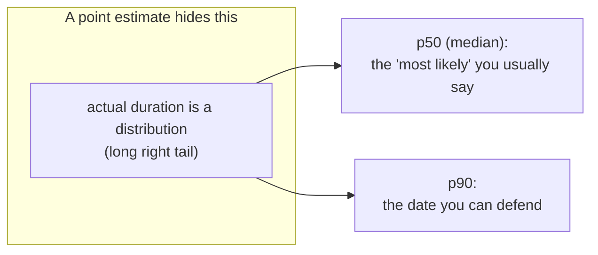
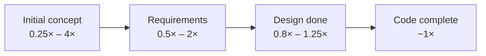

> **What?** Estimation under uncertainty is the discipline of turning a fuzzy "how long / how much" into a quantified prediction whose *uncertainty is part of the answer*. You produce ranges and confidence intervals, derive them with three-point/PERT math, sanity-check capacity questions with Fermi decomposition, and you understand *why* early estimates are wide (the Cone of Uncertainty) and why your gut runs optimistic (the planning fallacy).
>
> **How?** At this level you estimate whole features and small projects, not single tickets. You give an interval and a confidence ("p50 = 3 weeks, p90 = 6 weeks"), you justify the spread, you use the *outside view* (how did similar past work go?) rather than imagining the happy path, and you communicate the estimate so stakeholders don't silently latch onto the optimistic end.

---

## 1. The unit of an estimate is a distribution

A point estimate collapses a *distribution* of possible durations into one number and silently throws away everything you don't know. The professional move is to keep the distribution and report its key percentiles.



- **p50** — the median; half the time you'll be faster, half slower. This is the number your optimism wants to give as *the* answer.
- **p90** — you'll be done by here 9 times out of 10. This is the date to *commit* to a stakeholder.

The gap between p50 and p90 **is the uncertainty.** A wide gap is honest information, not weakness. "p50 = 3 weeks, p90 = 6 weeks" tells a PM exactly what to plan for (6) and hope for (3).

> Real durations have a **long right tail**: tasks finish a little early sometimes but blow up late often. So the mean sits *above* the median, and the p90 sits far above the p50. Symmetric "± a bit" intuition under-weights disaster.

---

## 2. PERT, properly

Three-point estimation gives both a planning number *and* an uncertainty estimate.

```
Expected (mean)     E = (O + 4M + P) / 6
Std deviation       σ = (P − O) / 6
```

The second formula is the one juniors miss: **(P − O)/6 is your spread.** A wide O→P gap means you don't know much yet; that's the signal to spike before committing.

### Worked feature estimate — "real-time notifications"

Decompose into sub-tasks, three-point each, then **sum**:

| Sub-task | O | M | P | E = (O+4M+P)/6 | σ = (P−O)/6 |
|---|---|---|---|---|---|
| WebSocket gateway | 2 | 4 | 9 | 4.5 | 1.17 |
| Fan-out service | 3 | 5 | 12 | 5.8 | 1.50 |
| Client integration | 1 | 3 | 6 | 3.2 | 0.83 |
| Delivery/retry logic | 2 | 4 | 8 | 4.3 | 1.00 |
| **Project (sum E)** | | | | **17.8 days** | |

For *independent* tasks, variances (σ²) add, then take the square root:

```
σ_project = √(1.17² + 1.50² + 0.83² + 1.00²)
          = √(1.37 + 2.25 + 0.69 + 1.00)
          = √5.31 ≈ 2.3 days
```

Now you have a distribution: **E ≈ 18 days, σ ≈ 2.3 days.** Roughly:

- **p50 ≈ 18 days**
- **p90 ≈ E + 1.28σ ≈ 18 + 3 ≈ 21 days**

> Caveat to say out loud: this assumes the sub-tasks are independent and won't all go wrong together. In real projects risks are *correlated* (the same flaky infra hits every task). So treat the PERT σ as a **floor** on uncertainty, then widen. Summing optimistic sub-estimates is exactly how projects ship late.

---

## 3. The Cone of Uncertainty

Steve McConnell, in *Software Estimation: Demystifying the Black Art* (2006), popularized the **Cone of Uncertainty**: at the very start of a project, even a careful estimate can be off by **4× in either direction** (0.25×–4×). The cone narrows as you learn — after requirements it's ~1.5×, after design ~1.25×, and it only reaches 1× when you're basically done.



Two consequences for how you work:

1. **An early estimate is a range *because of where you are*, not because you're bad.** "4 weeks" at kickoff genuinely means "1–16 weeks". Report the cone width honestly.
2. **The cone narrows only if you do work to reduce uncertainty** — spikes, prototypes, breaking down the unknown. It does not narrow just because time passes. McConnell's key nuance: the cone is the *best case*; a chaotic project stays wide.

The practical rule: when pressed for a hard date too early, don't give a fake-precise number — give the *current cone width* and offer to re-estimate after a one-week spike that collapses it.

---

## 4. The outside view (reference-class forecasting)

Your instinct builds an estimate by imagining the steps and adding them up — the **inside view**. This is where the **planning fallacy** lives: you imagine the *successful* path and ignore the base rate of things going sideways. Kahneman & Tversky named it; the fix is the **outside view**, also called **reference-class forecasting** (Flyvbjerg's work on megaprojects).

| | Inside view | Outside view |
|---|---|---|
| Question | "How long will *this* take, step by step?" | "How long did *similar* things actually take?" |
| Failure mode | Systematically optimistic | Hard to argue with — it's data |
| Source | Your imagination | Your history / team's history |

### How to apply it

1. Identify the **reference class**: "features of similar size to this one, that this team has shipped."
2. Pull the **actuals** from your tracker — 8, 11, 6, 14, 9, 22 days.
3. Use that distribution: **median ~10, p90 ~20**. *Then* adjust for what's genuinely different about this one.

The outside view routinely doubles a naive inside-view estimate — and is routinely right. If your inside-view estimate is far below your reference class, the burden of proof is on the inside view. (More on the bias itself: [cognitive biases in code decisions](../../04-critical-thinking/03-cognitive-biases-in-code-decisions/).)

---

## 5. Fermi sanity checks for capacity

Before you size infrastructure, do a 60-second Fermi estimate. The decompose-and-multiply move is **first-principles reasoning** ([reasoning from fundamentals](../../05-first-principles-thinking/01-reasoning-from-fundamentals/)) applied to numbers.

### Worked example — write throughput and storage for an event log

> *"We want to log every user action. 2 million daily active users, ~50 actions each, each event ~1 KB. Sustainable? How much storage per month?"*

**Events per day:**
```
2,000,000 users × 50 actions = 100,000,000 events/day = 10^8/day
```

**Average write QPS:**
```
10^8 / 86,400 s ≈ 10^8 / 8.6×10^4 ≈ 1,160 writes/sec  (~10^3)
```
Peak ≈ 3–5× ⇒ plan for **~5,000 writes/sec**. That's beyond a single naive Postgres instance writing synchronously — you'd batch, use a queue, or a log-structured store. The Fermi number told you the *architecture class* before you wrote a line.

**Storage per month:**
```
10^8 events/day × 1 KB = 10^8 KB/day = 100 GB/day
100 GB/day × 30 ≈ 3 TB/month   (~3×10^12 bytes)
```
**~3 TB/month, ~36 TB/year raw.** Now retention and tiering are real decisions, not afterthoughts — you size hot vs cold storage from this number.

The point here: a back-of-envelope estimate decides the architecture *class*, cheaply, before any commitment is made.

---

## 6. Communicating an estimate so it survives

The estimate is only half the job; the other half is making sure the listener hears the *whole* distribution, not just the optimistic end.

| Anti-pattern | What happens | Fix |
|---|---|---|
| "About 3 weeks" | PM writes "3 weeks" in the plan as a hard date | "p50 3 weeks, **commit to 5**" |
| Padding silently (say 6, plan 4) | You finish early once, they cut next time | Honest range, padding *visible* as the P |
| One number to leadership | Collapses to the floor instantly | Give a range with the assumptions attached |
| No assumptions stated | Estimate "wrong" when scope shifts | "...assuming the vendor API works as documented" |

**Hofstadter's Law** — *"It always takes longer than you expect, even when you take into account Hofstadter's Law"* (Douglas Hofstadter, *Gödel, Escher, Bach*) — is the reason naive padding never quite saves you: you under-correct. The cure isn't a bigger fudge factor; it's the *outside view* plus an explicit p90.

Script that works: **"Most likely 3 weeks. I'd commit to 5 to be safe — the risk is the third-party billing API, which I haven't integrated before. Give me 3 days to spike it and I'll tighten the range."** That hands the stakeholder the median, the commit date, the top risk, and a path to less uncertainty.

---

## 7. Practice & next steps

- The probability foundations under all of this: [reasoning under uncertainty](../01-reasoning-under-uncertainty/) and [base rates and expected value](../02-base-rates-and-expected-value/).
- When an estimate is really a risk question (P(failure) × cost): [risk and failure probabilities](../03-risk-and-failure-probabilities/).
- Section overview: [probabilistic thinking](../) · Up: [engineering thinking roadmap](../../README.md).
- Do the exercises: [tasks](tasks.md). Prep: [interview](interview.md).

### Takeaways

1. Report **percentiles, not a point** — p50 to hope for, p90 to commit to; the gap *is* the uncertainty.
2. PERT gives you both `E = (O+4M+P)/6` and `σ = (P−O)/6`; treat the σ as a floor and widen for correlated risk.
3. The **Cone of Uncertainty** explains why early estimates are 4× wide — and narrows only when you do uncertainty-reducing work.
4. Prefer the **outside view** (reference-class actuals) over the imagined happy path.
5. Use **Fermi capacity estimates** to pick an architecture class before committing.
