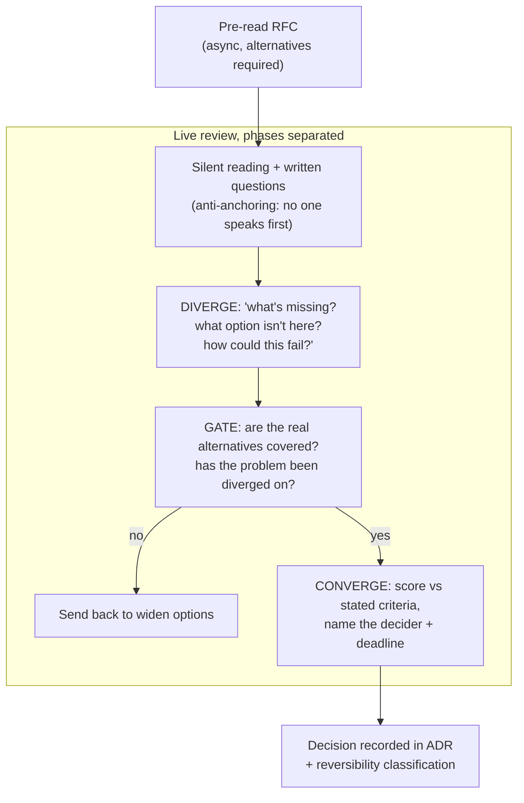

> **What?** At staff/principal level, divergent/convergent thinking becomes *organizational phase design*: you shape the processes, artifacts, and forums by which many engineers and teams generate options and reach decisions — so that the org as a whole diverges enough before it converges, and converges cleanly instead of thrashing. The unit of work is no longer your own thinking but the decision machinery others operate inside.
> **How?** You build the structure that defaults to healthy phase separation — RFC templates that demand alternatives, design reviews run as explicit diverge/converge sessions, decision rights and deadlines made legible, and guardrails against the two org-scale pathologies: premature convergence (the org bandwagons onto one approach) and chronic non-convergence (decisions that never close, reopening forever).

---

## 1. The problem changes shape at scale

When you're an individual contributor, premature convergence costs one engineer a few hours. At org scale the same failure mode costs quarters, because convergence at the organizational level is *expensive to reverse* and *self-reinforcing*:

- An early architectural choice becomes "how we do things here," and every subsequent decision anchors to it. By the time it's questioned, three teams have built on it.
- The most senior voice in an early meeting can converge an entire org direction by accident — a hallway opinion becomes a roadmap.
- Conversely, without clear decision rights and deadlines, decisions *never close*: every design review reopens settled questions, and the org thrashes — high divergence, no convergence, perpetual motion without delivery.

Your leverage is no longer "have the best idea." It's "make the org's default behavior diverge appropriately and then converge cleanly." You are designing the **phase machinery**, not playing inside it.

## 2. RFCs/ADRs as durable phase separation

The RFC (or design doc, or ADR) is the org's primary tool for separating divergence from convergence in writing — *if* it's structured to force both phases. A weak template lets authors converge in their head and present a single pre-baked answer for rubber-stamping.

A template that enforces the phases:

| Section | Phase it enforces | What "good" looks like |
|---------|-------------------|------------------------|
| Problem / context | Problem-divergence then -convergence | The problem stated independently of any solution; "why now" |
| Goals / non-goals | Convergent scoping | Decidable criteria, explicit out-of-scope |
| **Decision criteria** | Pre-commits the convergence basis | Weighted axes written *before* options |
| **Alternatives considered** | Solution-divergence | ≥3 *genuinely different categories*, each with why-not |
| Proposal | Convergent selection | The chosen option, scored against the stated criteria |
| Risks / reversibility | Calibrates phase rigor | One-way vs two-way door named explicitly |

The two load-bearing sections are **Decision criteria** (placed *before* alternatives, so reviewers can't reverse-engineer criteria to fit the favored option) and **Alternatives considered**. Treat an RFC with a single straw-man alternative as a code smell: it's a record of premature convergence dressed up as analysis. As a reviewer, the highest-value question you can ask is often "what option did you *not* write down, and why?"

> A principal's most repeated review comment should be about *flexibility*, not correctness: "these three alternatives are all variations of the same approach — where's the option that doesn't use a queue at all?" You are auditing the divergence, because the org can check the chosen option itself; what it systematically under-produces is the field of options the chosen one beat.

## 3. Running design reviews as explicit phase sessions

Most design reviews fail because they blur the modes: someone presents, people poke holes, an authority figure nods, done — that's convergence with the divergence skipped, anchored on whatever was presented.

Restructure the forum to separate phases in *time*:

Design moves that scale:

- **Silent start.** Begin reviews with silent reading and written comments (Amazon-style). It defeats the anchoring of whoever would otherwise speak first, and it lets quieter or more junior engineers' divergence survive into the room.
- **Diverge before critique.** Explicitly open with "what's missing / what would make this fail / what option isn't here" *before* "should we approve." Front-loading the divergent question prevents the meeting from collapsing into convergence on slide one.
- **Name the decider and the deadline.** Convergence needs an owner and a clock. "Sarah decides by Friday" closes the loop; "let's discuss more" reopens it forever. Clear decision rights are the antidote to chronic non-convergence.

## 4. Preventing premature convergence at org scale

Org-level anchoring is the expensive one. Mechanisms that keep the field open long enough:

- **Bake alternatives into the template** (above) so divergence is non-optional, not dependent on the author's discipline.
- **Separate ideation forums from decision forums.** A "design jam" or architecture-options doc with no decision pressure produces more and more varied options than a meeting where a choice is due — match the forum to the phase.
- **Spread anchoring authority.** When a principal states a preference early, the org converges on it whether or not it's right. Withhold your own option until others have generated theirs; ask questions in the divergent phase, give answers in the convergent one. Your stated preference is an anchor with org-wide blast radius — spend it deliberately.
- **Reversibility-graded rigor (one-way vs two-way doors).** Bezos's framing scales the phase budget: two-way-door (reversible) decisions should converge *fast* with light divergence — pushing them through heavyweight review is its own failure (it teaches the org that all decisions are slow). One-way-door (hard to reverse) decisions earn deep divergence and a high convergence bar. A principal's job is partly to *classify the door* so the org spends its divergence budget where reversal is costly.

| Door | Divergence budget | Convergence bar | Example |
|------|-------------------|-----------------|---------|
| Two-way (reversible) | Light | Fast, low ceremony | Library choice behind an interface, feature-flag rollout |
| One-way (costly to reverse) | Deep, many categories | High, recorded, broadly reviewed | Public API contract, data model, primary datastore, auth model |

## 5. Preventing chronic non-convergence

The opposite org pathology is decisions that never close. Symptoms: the same architectural question relitigated in three consecutive reviews; RFCs open for months; teams blocked waiting on a decision nobody owns. Levers:

- **Decision rights.** Make explicit *who decides* (a DACI/RACI-style owner), so divergence has a defined endpoint. Diffuse ownership is the root cause of thrash.
- **Decision deadlines as first-class.** Cost-of-delay is real; an un-made decision is a decision to keep the status quo, made by default. Put a date on it.
- **"Disagree and commit."** Once converged, the org commits even where individuals dissented — reopening on every objection is non-convergence in disguise. Pair it with an explicit *re-open trigger* ("revisit if p99 exceeds X or the vendor sunsets the API") so commitment isn't permanent denial of new evidence.
- **One-way ratchet on settled decisions.** Settled ADRs are presumed-closed; reopening requires *new information*, not just a new opinion. This converts "endless re-debate" into "debate when the criteria actually changed."

## 6. Culture: divergence needs safety, convergence needs trust

The two phases rest on two different cultural foundations, and a staff engineer maintains both.

- **Divergence needs psychological safety.** Org-wide, engineers only voice unconventional or half-formed options if proposing a "wrong" idea is safe. If RFCs get torn apart on first draft, authors stop writing real alternatives and start writing pre-converged docs they can defend — divergence dies quietly and you never see it die. Model treating early ideas as cheap and disposable; review drafts as a partner, not a gatekeeper.
- **Convergence needs decision trust.** Engineers commit to decisions they didn't prefer only if they trust the decision *process* was fair — criteria stated upfront, alternatives genuinely considered, the decider legitimate. A visible, criteria-first process (section 2) is what makes "disagree and commit" actually hold instead of festering.

This is the cultural through-line: the *same* mechanisms (criteria-first, alternatives-required, transparent rationale) that make divergence safe also make convergence trustworthy. Invest in them once, get both.

## 7. Anti-patterns at staff/principal level

| Anti-pattern | Mechanism | Counter |
|--------------|-----------|---------|
| RFCs with one straw-man alternative | Author converged before writing | Template requires ≥3 categories; reviewer audits divergence |
| Principal's preference converges the org by accident | Authority anchoring, blast radius | Speak last; ask in divergence, answer in convergence |
| Every decision gets heavyweight review | No reversibility grading | Classify the door; fast-track two-way doors |
| Decisions never close | No decider, no deadline | Assign decision rights + dates; disagree-and-commit |
| Settled decisions relitigated forever | No re-open discipline | New-information bar to reopen; explicit re-open triggers |
| Pre-converged docs, no real options | Low psychological safety | Make drafts cheap; review as partner |

## 8. Where this sits

Organizational phase design is the scaled form of the [section's](../) core discipline. The divergence amplifiers — [inversion](../02-inversion-thinking/), [analogical thinking](../03-analogical-thinking/), [constraint-driven creativity](../04-constraint-driven-creativity/) — become facilitation tools you bring to design jams. The convergent half is, organizationally, [evaluating trade-offs objectively](../../04-critical-thinking/04-evaluating-tradeoffs-objectively/) made into process. The wider method lives in [problem-solving](../../02-problem-solving/), and the [roadmap root](../../README.md) situates engineering thinking as a whole.

**Takeaway:** At principal scale you stop optimizing your own diverge/converge cycle and start designing the org's — templates and forums that force genuine option-generation, decision rights and deadlines that close the loop, reversibility-graded rigor so the divergence budget lands where reversal is costly, and the culture (safety for divergence, trust for convergence) that lets both phases actually function.
