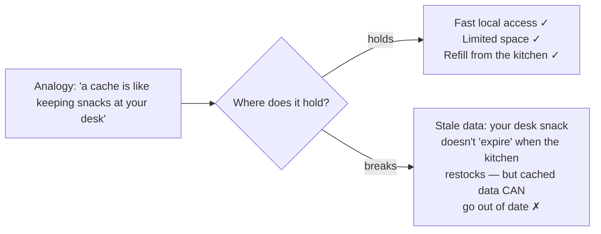

> **What?** Analogical thinking is solving a new problem by borrowing the *structure* of a solution you already understand from another domain — recognizing that "this is like that" and carrying the useful part across. The key word is *structure*: a good analogy maps the relationships between parts, not their surface appearance.
>
> **How?** As a junior, you mostly *consume* analogies: the ones baked into the tools and patterns you use ("a queue is like a line at a checkout", "a circuit breaker trips like the one in your house"). Your job is to use them to learn fast, and to start noticing the moment an analogy stops being true so it doesn't quietly mislead you.

---

## 1. What an analogy actually transfers

When someone says "a database index is like the index at the back of a book", they are not claiming a database is made of paper. They are mapping a *relationship*:

- Book index: term → page number, so you jump straight to the page instead of reading the whole book.
- DB index: value → row location, so the engine jumps straight to the row instead of scanning the whole table.

The surface (paper vs. disk) is irrelevant. The *relational structure* — "a lookup side-table that points you to where the real thing lives, traded for the cost of keeping it updated" — is what carries over. This is the core insight from cognitive scientist Dedre Gentner's **structure-mapping theory**: analogy works by matching relationships, and the best analogies are the ones where deep relations line up even when the things themselves look nothing alike.

| Analogy | What maps (the structure) | What does NOT map (surface) |
|---|---|---|
| DB index ↔ book index | "side-table that points to the real location" | paper, alphabetical order, page numbers |
| Queue ↔ checkout line | "first in, first out; new arrivals wait at the back" | people, groceries, a physical building |
| Cache ↔ keeping snacks at your desk | "a small, fast, local copy of something far away" | the snacks, the fridge, hunger |
| Stack ↔ pile of plates | "last in, first out; you only touch the top" | ceramic, washing up |

When you learn a new concept, ask yourself: *what is the structure being mapped, and what is just decoration?* Getting this right is the difference between an analogy that teaches you and one that fools you.

## 2. Why analogy is everywhere in software

Software is invisible. You can't see a request, hold a process, or watch memory fill up. So engineers reach for things you *can* picture, almost always from the physical world:

```text
plumbing    → "data flows through a pipeline", "backpressure", "the buffer is full"
electrical  → "circuit breaker", "signal", "throttle"
buildings   → "architecture", "foundation", "load-bearing"
postal mail → "message", "envelope", "address", "inbox", "dead-letter queue"
biology     → "spawn a child process", "kill it", "zombie process", "viral"
```

Notice these are so embedded you stopped seeing them as analogies. "Killing a process" is a metaphor borrowed from biology, yet nobody finds it strange. This is normal and good — it's how a complicated craft becomes learnable. The risk only appears when you forget it *was* an analogy and start believing the picture is the reality.

## 3. Productive analogies you'll meet early

A few you should be able to explain in a sentence:

- **Pipeline** (from manufacturing / plumbing): data moves through ordered stages, each doing one job and handing off to the next. `cat file | grep error | sort | uniq -c` is a pipeline. The structure mapped: "stages connected end to end, each consuming the previous one's output."
- **Backpressure** (from fluids/plumbing): if a downstream stage can't keep up, it needs a way to tell upstream "slow down", or the buffer between them overflows. Think of a sink draining slower than the tap fills it — eventually it floods. In software the "flood" is memory exhaustion or dropped messages.
- **Cache** (from "a stash kept close"): keep a fast local copy of slow-to-fetch data. Maps "trade a little staleness and memory for a lot of speed."
- **Circuit breaker** (from household electrics): when a downstream service keeps failing, stop calling it for a while instead of hammering it — like a breaker that trips to protect the wiring rather than letting it overheat. (You'll meet this properly later; popularized for software by Michael Nygard in *Release It!*.)

For each, the move is the same: there's a familiar physical system, and we borrow how its *parts relate* to reason about an invisible software one.

## 4. The junior trap: surface analogies

The most common way analogy hurts a junior is the **surface analogy** — two things look alike on the outside, so you assume they behave alike. They don't.

A classic: *"a database is basically a big spreadsheet."* Surface-wise, yes — rows and columns. But the structure is different in ways that bite:

| You'd expect (spreadsheet) | Reality (database) |
|---|---|
| You can see and edit the whole thing at once | You query slices; the whole thing may be enormous |
| Order is whatever you sorted by | Rows have *no* inherent order unless you ask for one |
| One user, one copy | Many users hitting it at once; concurrency matters |
| Deleting a cell is instant and obvious | Deletes interact with transactions, indexes, constraints |

Another: *"a `Map`/dictionary is like a list with names instead of numbers."* Surface-true, but it hides that a hash map gives near-constant-time lookup *and* has no guaranteed order, whereas a list is ordered but slow to search. Lean on the surface analogy and you'll write a slow loop where a lookup would do.

**Rule of thumb for now:** an analogy is a *guess* about how something works, not a fact. Use it to form a first idea, then check the real behavior — read the docs, run the code, look at the actual semantics.

## 5. Spotting where an analogy breaks

Every analogy is true inside a boundary and false outside it. The skill — even at junior level — is finding that boundary.



Cache invalidation — knowing *when* the local copy is stale — is exactly the part the snack analogy doesn't cover, which is why it's famously one of the hard problems in computing. The analogy got you in the door; the boundary is where the real engineering starts.

A simple habit: after you accept an analogy, finish the sentence **"...but unlike the real-world version, in software ___."** That sentence is where you'll find the bug.

## 6. Using analogy to learn (and to explain)

Analogy is your fastest on-ramp to a new concept, and the fastest way to help a teammate. When you don't understand something, ask: *"is there something I already understand that works like this?"* When you explain something, reach for the listener's existing knowledge: explain a message queue to a non-engineer as "a post office for programs" and you've done more than a paragraph of jargon.

But keep the two jobs separate in your head:

- **Explaining with analogy** (low risk): you're helping someone *picture* it; they'll learn the real details next.
- **Deciding with analogy** (higher risk): "we should do X because it's like Y" is only a *hypothesis*. Don't ship a decision on an analogy alone — verify the structure really matches first. (Your seniors will go deep on this; just plant the flag now.)

This is the bridge to [first-principles thinking](../../05-first-principles-thinking/01-reasoning-from-fundamentals/): analogy says "this is probably like that"; first principles asks "what is actually true here, from the ground up?" Strong engineers use analogy to generate ideas fast, then fall back to fundamentals to check them.

## 7. Start a personal analogy notebook

Begin a running list — a note file is fine — of analogies that helped a concept click, with one line on *where each one breaks*. After six months you'll have a private library of cross-domain patterns you can pull from. Example entries:

```text
PIPELINE  — like an assembly line; stages hand off in order.
            BREAKS: assembly lines can't easily run a stage in parallel; software can.

CACHE     — like snacks at your desk; fast local copy.
            BREAKS: snacks don't go stale when the kitchen restocks (cache invalidation).

RETRY     — like redialing a busy phone number.
            BREAKS: redialing instantly forever can DOS the other side (need backoff).
```

---

## Key takeaways

- An analogy transfers **relational structure**, not surface looks (Gentner's structure-mapping). Always ask "what is the structure, what is decoration?"
- Software is full of analogies (pipeline, cache, circuit breaker, backpressure) because the real thing is invisible — this is helpful, not a flaw.
- The junior trap is the **surface analogy**: "a DB is just a spreadsheet" / "a map is just a named list." Looks alike, behaves differently.
- Every analogy has a **boundary of validity**. Find it with "...but unlike the real version, in software ___."
- Use analogy freely to **learn and explain**; be cautious using it to **decide** — there it's only a hypothesis to be checked against fundamentals.

## See also

- [Inversion thinking](../02-inversion-thinking/) — flipping a problem, another lateral-thinking tool.
- [Divergent vs. convergent thinking](../01-divergent-vs-convergent/) — generating then narrowing ideas.
- [Reasoning from fundamentals](../../05-first-principles-thinking/01-reasoning-from-fundamentals/) — the check on every analogy.
- [Section: Creative & lateral thinking](../) · [Roadmap home](../../README.md)
