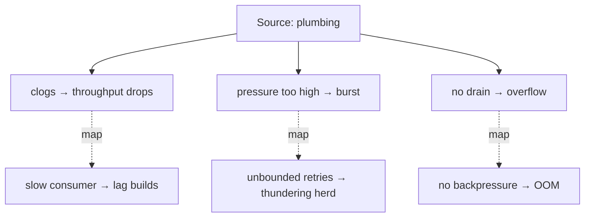

> **What?** Analogical thinking is the deliberate transfer of *relational structure* from a source domain you understand to a target problem you don't. At this level you stop merely consuming analogies and start *wielding* them: choosing them on purpose to design, debug, and communicate — and consciously mapping where each one holds and where it breaks.
>
> **How?** When you hit an unfamiliar problem, you scan your library of cross-domain patterns for one whose *structure* matches, port the solution, then immediately test the mapping for leaks. You treat each analogy as a hypothesis that buys you a fast first draft, not as a finished answer.

---

## 1. Structure-mapping, made operational

Dedre Gentner's **structure-mapping theory** gives us a usable procedure, not just a slogan. An analogy is a *partial mapping* from a source to a target. Good ones obey:

- **Relations over attributes.** Map how parts relate, not what they're made of. "The Sun is hotter than the Earth" (attribute) is a worse basis for analogy than "the Earth orbits the Sun" (relation). In software: map "X protects Y by failing fast", not "X and Y are both red on the dashboard."
- **Systematicity.** Prefer mappings where many relations are connected by higher-order structure (cause, enables, prevents). A deep analogy carries a whole connected *system* across, not one isolated fact. This is why "circuit breaker" is a great analogy — it brings *trip → open → cool down → half-open test → close* as one connected mechanism.
- **One-to-one.** Each source element maps to exactly one target element. When you find yourself mapping one source thing onto two different target things, the analogy is fraying.

Hofstadter & Sander, in *Surfaces and Essences*, push this further: analogy isn't a party trick of cognition, it's arguably the *core* of it — every concept you have is a category you reach by analogy to prior cases. For an engineer the practical upshot is: you are *always* reasoning by analogy whether you admit it or not, so do it consciously and check it.

## 2. A working set of engineering analogies

These are the cross-domain patterns a mid-level engineer should be able to deploy and critique:

| Pattern | Borrowed from | Structure that maps | Boundary — where it breaks |
|---|---|---|---|
| **Pipeline** | Manufacturing | Ordered stages, each transforms and hands off | Real pipelines have fixed throughput; software stages parallelize/branch/fan-out |
| **Backpressure** | Fluid dynamics | Downstream slowness must propagate upstream or buffers overflow | Fluids are continuous; messages are discrete and can be *dropped*, not just slowed |
| **Circuit breaker** | Electrical | Trip to stop calling a failing dependency; cool down; test before resuming | A house breaker protects *one* circuit; a service breaker is per-dependency *and* must guess "healthy again" |
| **Bulkhead** | Ship design | Isolate resources so one failure can't sink the whole vessel | Ships have fixed compartments; software pools must be sized dynamically under load |
| **Gossip / epidemic** | Epidemiology | Each node tells a few peers; info spreads exponentially, eventually consistent | Disease spread is uncontrolled; gossip protocols *tune* fanout and need anti-entropy to converge |
| **Immune system** | Biology | Detect non-self, remember past attacks, respond proportionally | Immune systems also cause autoimmune damage — false positives that attack legit traffic |
| **Supply chain** | Logistics | Your artifact depends on others' artifacts, transitively, with provenance risk | A physical supply chain has inventory buffers; a build has none — one bad dep breaks everything instantly |
| **Actor model** | "People passing letters" | Isolated units, no shared state, communicate only by messages | Real people infer context; actors only know what's in the message — no shared memory at all |

Notice the last column does the real work. Anyone can recite the analogy. The mid-level skill is *naming the boundary*.

## 3. Design patterns are crystallized analogies

The Gang of Four catalog is a library of analogies that paid off so often they got names. "Factory", "Observer", "Visitor", "Adapter", "Proxy" — each is a structural analogy lifted out of a recurring situation:

- **Adapter** ↔ a travel power-plug adapter: it doesn't change the device or the socket, it sits between them and translates the interface.
- **Observer** ↔ a newspaper subscription: subscribers don't poll the publisher; the publisher pushes to a list of subscribers on each new edition.
- **Proxy** ↔ a stand-in / representative: callers talk to the proxy as if it were the real thing; it controls access, adds caching, or defers the real work.

The value of a pattern name is that it transfers a *whole connected structure* (the systematicity from §1) in two words. That's analogical compression. The danger is identical to any analogy: invoking "Observer" doesn't make your design an Observer — you still have to check the structure matches, not just the surface ("we have events, so it's basically pub/sub") — see [structural](../../../code-craft/design-patterns/02-structural) and [behavioral](../../../code-craft/design-patterns/03-behavioral) patterns for the precise shapes.

## 4. Using analogy to debug

Analogy is a debugging accelerator because it lets you *import a known failure mode*. If your message system is misbehaving and you've decided it's "like plumbing", then plumbing failures become hypotheses:



Each mapped failure is a *thing to go check*. That's the legitimate, powerful use: analogy as a **hypothesis generator**. What you must not do is conclude "it's plumbing, therefore it's a clog" without evidence — that's analogy used as proof, which it can never be.

## 5. The three ways analogies mislead

You need to recognize these in your own and others' reasoning:

**(a) Surface analogy.** Things look alike, so you assume they behave alike. "Treat the database like a filesystem — just read and write files." It maps until concurrency, transactions, and indexing show up, at which point you've built a system that corrupts under load. The mapping was on *attributes* (both store bytes) not *relations* (filesystems don't do MVCC).

**(b) Leaky analogy.** Mostly true, but the small false part is exactly the part you depend on. "A REST resource is like an object." Mostly fine — until you assume calling a method is cheap and local, and ship N+1 network round-trips because the analogy hid the wire. The leak is the network. (See the [false analogy fallacy](../../04-critical-thinking/02-logical-fallacies-in-engineering/) for the formal failure mode.)

**(c) Analogy as a debate-ender.** Someone says "microservices are like LEGO bricks — just snap them together" and the room nods and stops thinking. The analogy *replaced* analysis instead of *seeding* it. When an analogy ends a discussion rather than opening one, treat that as a red flag: real LEGO bricks have a fixed, standardized interface and no network between them — three ways the analogy quietly lies.

| Failure | Tell-tale sign | Fix |
|---|---|---|
| Surface | Mapping is about what things *are*, not what they *do* | Re-map on relations; list what behaves differently |
| Leaky | "It's basically like X" — and the difference is load-bearing | Name the leak explicitly; design for it |
| Debate-ender | The analogy *concludes* instead of *suggests* | Demote it to a hypothesis; demand evidence |

## 6. Map the domain of validity, every time

Make this a habit you do out loud or in the design doc. For any analogy you lean on, write a two-column ledger:

```text
Analogy: "Our event log is like a ledger / accounting book."

HOLDS:
  - append-only, never edit past entries        ✓
  - the past is the source of truth             ✓
  - you can replay/audit from the start         ✓

BREAKS:
  - real ledgers are small; ours is unbounded → needs compaction/retention
  - accountants reconcile manually; we need exactly-once or idempotent consumers
  - a ledger has one writer; we have many → ordering/partitioning is now YOUR problem
```

The "breaks" column is your risk list. An analogy you can't poke holes in is an analogy you haven't understood yet.

## 7. Building cross-domain range

The quality of your analogies is bounded by the domains you know. An engineer who only knows software can only borrow from software. Widen the source pool deliberately:

- Read one level into adjacent fields: queueing theory (from operations research), control theory (feedback, damping, overshoot), epidemiology (spread, R0), economics (incentives, supply/demand, tragedy of the commons).
- Keep the analogy notebook from junior level, but now record the *mapping* and the *boundary*, not just the one-liner.
- When you read a postmortem, ask "what real-world system fails like this?" — that's where reusable analogies come from.

---

## Key takeaways

- Make structure-mapping operational: **relations over attributes, systematicity, one-to-one.** A good analogy ports a whole connected mechanism.
- Hold a working set (pipeline, backpressure, circuit breaker, bulkhead, gossip, immune system, supply chain, actor) and know each one's **boundary**, not just its name.
- **Design patterns are crystallized analogies** — invoking the name still requires checking the structure matches.
- Analogy is a superb **hypothesis generator for design and debugging** and a terrible **proof**.
- Watch for the three failures: **surface**, **leaky**, and **debate-ending** analogies — each has a tell and a fix.
- Always write the **holds / breaks** ledger. The breaks column is your risk list.

## See also

- [Reasoning from fundamentals](../../05-first-principles-thinking/01-reasoning-from-fundamentals/) — fall back to first principles when the mapping is in doubt.
- [Logical fallacies in engineering](../../04-critical-thinking/02-logical-fallacies-in-engineering/) — the false-analogy fallacy in detail.
- [Constraint-driven creativity](../04-constraint-driven-creativity/) · [Inversion thinking](../02-inversion-thinking/)
- [Section root](../) · [Roadmap home](../../README.md)
