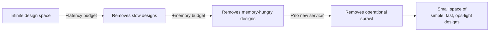

> **What?** Using constraints as a *deliberate design instrument*: tightening a budget (latency, memory, cost, dependencies, time) to force a simpler, more inventive architecture — and learning to separate real constraints you must obey from assumed ones you should attack.
> **How?** Attach an explicit budget to each design ("p99 < 50 ms", "fits in 256 MB", "no new service") and let it veto gold-plating before you write code. When a constraint blocks you, first ask whether it's real; if it is, treat the block as a signal that the design needs to change shape, not that you need more resources.

---

## 1. Constraints as a search-space reducer

A design problem is a search over possible solutions. With no constraints, the space is effectively infinite and you wander. Each constraint is a *cut* that removes huge regions of the space — and a well-chosen constraint removes exactly the bad regions, leaving a small space dense with good answers.



This is why "design anything" is harder than "design X under these three limits." The limits aren't an obstacle to the design — they *are* the spec. A senior reviewer who asks "what's your latency budget?" before "what's your design?" knows this: the budget shapes the design.

## 2. The four budgets you should always make explicit

At this level, the move is to stop letting constraints stay implicit. Name them as numbers, up front.

| Budget | Forces you to | Example target |
|--------|---------------|----------------|
| **Latency** | Cut hops, cache the right thing, choose a data layout | p99 read < 30 ms |
| **Memory / size** | Store the minimum; compute vs. store | Service heap < 512 MB; binary < 20 MB |
| **Cost** | Decompose cost, kill the expensive line | < $X / million requests |
| **Dependencies / complexity** | Own the core; resist import-everything | "No new datastore for v1" |

The discipline: write the number in the design doc *before* you start, and let it act as a veto. If a feature can't fit the budget, that's information — usually that the feature is gold-plating, or that the architecture is wrong-shaped.

### Latency budgets force better architecture

A budget of "p99 < 50 ms end-to-end" is brutal arithmetic. If a cross-region round trip is ~70 ms, the budget *forbids* a synchronous cross-region call — you must move data closer, precompute, or go async. The constraint didn't just rank options; it **eliminated an entire architecture** and pointed at a better one. Without the number, you'd have shipped the slow thing and discovered the problem in production.

## 3. The tight budget kills gold-plating automatically

Gold-plating — building more than the problem needs — thrives where there's slack. A loose budget tolerates the extra config flag, the speculative abstraction, the "might need it later" service. A tight budget can't afford any of it.

```text
Loose memory budget (4 GB):
  "Cache everything, keep full history in memory, add a plugin system."
  → bloated, slow to start, hard to reason about.

Tight memory budget (256 MB):
  Forced questions:
    - What MUST be in memory?  (the hot working set)
    - What can be recomputed?  (cold paths)
    - What can be dropped?     (the speculative plugin system)
  → lean service that does exactly the job.
```

This is the most useful day-to-day application: when a design feels heavy, **lower a budget on purpose** and let it strip the non-essential. The constraint does the saying-no for you, so you don't have to win an argument about every feature.

## 4. Constraints came first in the classics

The historical examples are worth knowing precisely because they show the limit *creating* the technique:

- **Demoscene 64 KB intros.** The 65,536-byte ceiling made *storing* assets impossible, so the scene perfected **procedural generation**: textures, geometry, and music are emitted by code at runtime from tiny parameters. The constraint is the whole reason the technique exists.
- **Memory-constrained games.** Fitting a world into 16–48 KB drove tricks like generating levels from a seed and packing data into individual bits. "Don't store what you can compute" is a direct child of a hard memory cap.
- **Twitter's 140 characters.** Inherited from the 160-char SMS limit minus a 20-char username. The constraint *became the product's identity* and a new writing form. Loosen it and you get a different, blurrier product.
- **Cost ceilings → 10x-cheaper designs.** When a target says "this must cost a tenth as much," you can't shave 10% off the existing design — you must decompose the cost from fundamentals and rebuild. (Tie this to [reasoning from fundamentals](../../05-first-principles-thinking/01-reasoning-from-fundamentals/): you break cost into its physical/economic parts and attack the dominant term.)

Margaret Boden and others who study creativity formalize this; Patricia Stokes' book *Creativity from Constraints* argues directly that constraints *precede and enable* creative breakthroughs rather than hindering them.

## 5. Real vs. assumed: the discipline that makes this safe

Constraints are powerful *only if they're real*. A false constraint gives you all the pain of a tight box and none of the focusing payoff, because you're optimizing within a boundary nobody actually imposed.

| Type | Source | What to do |
|------|--------|------------|
| **Essential** | Physics, money, deadline, law, SLA | Design within it; it's your spec |
| **Assumed** | Habit, precedent, "that's how we do it" | Verify it; attack it; it may not exist |

A quick test: **ask "who imposed this, and what breaks if I violate it?"** If you can't name an owner or a concrete failure, it's probably assumed.

```text
"We can't change the schema."        → Who said? What breaks? Often: nobody, nothing → assumed.
"p99 must be < 50 ms (SLA)."         → Contract with a customer → essential.
"It has to be microservices."        → Resume-driven precedent → assumed.
"Budget is $2k/mo, hard cap."        → Finance signed off on it → essential.
```

The same boundary can be either depending on context — so you check each time. See [questioning assumptions](../../05-first-principles-thinking/02-questioning-assumptions/) for the full method.

## 6. Self-imposed constraints in your own workflow

You can manufacture the focusing effect on demand. These are the moves a strong mid-level engineer reaches for:

- **Timeboxing.** "Spike this in 4 hours, then stop and review." Agile's timeboxing is exactly constraint-driven creativity at the process level: a fixed time forces ruthless scope-cutting.
- **"Build it with no database / no queue / no new service."** Reveals whether the heavy infrastructure is essential or cargo. Often the no-X version is enough to ship.
- **"One screen."** Forces you to find the single most important user action.
- **Artificial budget.** Pretend you have 1/10th the RAM or money and design that; you'll find the fat in the real design.

The key mental shift: **creativity often comes from removing options, not adding them.** Adding tools, services, and abstractions feels productive but widens the search and invites complexity. Removing them narrows the search to where the good, simple answers live.

## 7. A worked mini-example

> *Problem:* "Add full-text search to our app."
> *Unconstrained instinct:* stand up Elasticsearch — new cluster, new ops burden, sync pipeline.

Now impose a self-constraint: **"No new datastore for v1."**

The constraint forces you to look at what you already have. Postgres has built-in full-text search (`tsvector`, GIN index). For the current data size it's more than fast enough. You ship in days, with zero new operational surface, and you keep Elasticsearch as a *real* option for the day a *real* constraint (scale) finally appears.

The constraint didn't cost you the feature. It cost you the gold-plating — and that's the whole point.

---

## See also

- [Reasoning from fundamentals](../../05-first-principles-thinking/01-reasoning-from-fundamentals/) — decompose a cost/latency budget to attack the dominant term.
- [Questioning assumptions](../../05-first-principles-thinking/02-questioning-assumptions/) — separate essential from assumed constraints.
- [Divergent vs. convergent thinking](../01-divergent-vs-convergent/) — a budget sharpens the converge step.
- [Inversion thinking](../02-inversion-thinking/) — pair with constraints: "what would make us *blow* this budget?"
- [Creative and lateral thinking](../) — section overview.
- [Engineering thinking roadmap](../../README.md) — the full map.
