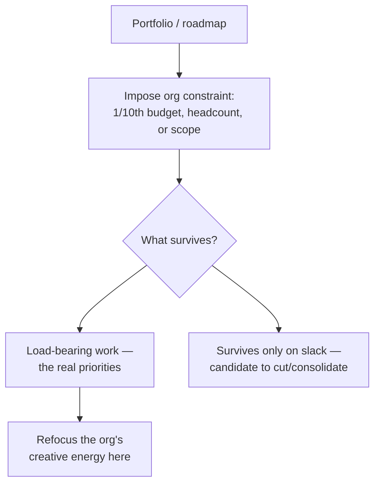

> **What?** Constraint-driven creativity as a **leadership and org-design instrument**. At staff/principal level you deliberately impose budgets, deadlines, and simplicity mandates to force better designs *out of teams*, you distinguish real organizational constraints from imagined ones at scale, and you encode constraints into the artifacts (RFCs, SLOs, budgets, platform limits) that shape what dozens of engineers build.
> **How?** You author constraint-based RFCs that state the budget before the solution; you run "1/10th" provocations across a portfolio; you defend real constraints and dismantle false organizational ones (precedent, fear, org charts masquerading as architecture); and you build the enforcement (SLOs, cost guardrails, dependency policies) that makes a constraint a durable forcing function rather than a one-time exhortation.

---

## 1. Constraints as the highest-leverage thing a leader sets

An individual engineer applies constraints to one design. A staff/principal engineer **sets the constraints that hundreds of designs inherit**. This is leverage of a different order: the budgets, limits, and simplicity mandates you bake into platforms and processes prune the design space for everyone downstream, before any of them start.

> You don't review your way to good architecture across a large org. You *constrain* your way to it.

The corollary: choosing constraints is a primary act of technical leadership, and choosing them wrong is one of the most expensive mistakes available — a false org-wide constraint multiplies its damage by the number of teams obeying it.

## 2. The constraint-based RFC

The most direct lever is to change the *shape of the design document*. A conventional RFC leads with a solution and rationalizes it. A **constraint-based RFC leads with the budget** and makes the solution earn its place inside it.

A constraint-first RFC template:

| Section | Purpose |
|---------|---------|
| **Hard constraints** | The non-negotiable budgets: p99 latency, cost ceiling, blast radius, data-residency, deadline. *Stated as numbers, with owners.* |
| **Derivation** | *Why* each number — decomposed from SLA, finance, physics. Not "we picked 100 ms." |
| **Assumed constraints we are dropping** | Explicitly list the inherited limits this design refuses to obey ("we will change the schema"), with justification. |
| **Design** | The solution, shown to fit inside the hard constraints. |
| **Enforcement** | How each budget becomes durable: an SLO, a CI check, a cost alarm. |

This reorders the whole conversation. The team argues about *budgets* (which are derivable and ownable) before *solutions* (which are taste-laden). It surfaces dropped assumptions explicitly, so a reviewer can challenge them. And it forces the question "how will this stay true?" — which separates a real constraint from theater.

## 3. Imposing budgets to force better designs from a team

A leader's most reliable way to get a simpler, faster design is not to design it themselves — it's to **set the budget and let the team's ingenuity meet it**. The constraint does the saying-no that would otherwise require the leader to win a hundred small arguments.

```text
Weak leadership: "Please keep it simple."  → vague, ignorable, no forcing function.
Strong leadership: "p99 < 50 ms, < $5k/mo, no new datastore, ship in 6 weeks."
                   → concrete, enforceable; the budget rejects the bloat for you.
```

Real-world shape of this:

- A **latency SLO** imposed as a hard gate forces every team touching the path to fit their work into the budget — gold-plating that blows it simply can't merge.
- A **cost guardrail** (a per-service monthly ceiling with an alarm) turns "be cost-conscious" into an enforced constraint that reshapes designs toward efficiency.
- A **dependency/complexity policy** ("new datastores require a principal sign-off") makes the default answer "reuse what we have," which is usually the right, simpler answer.

The art is calibration: a budget too loose does nothing; too tight and you get hacks or revolt. You derive it (so it's defensible) and you leave honest headroom (so it's achievable).

## 4. Real vs. imagined constraints at organizational scale

At small scale, false constraints are local ("we can't change this schema"). At org scale they are structural and far more expensive — and frequently they are **org charts wearing an architecture costume** (Conway's Law in reverse: teams build false technical constraints to match their boundaries).

| Heard across the org | Real or imagined? | Move |
|----------------------|-------------------|------|
| "Customer SLA: 99.95% uptime" | Real (contractual) | Design within it; budget the error budget |
| "We've always used service-per-team" | Imagined (org chart as architecture) | Question whether the split serves users or just teams |
| "We can't deprecate the v1 API" | Usually imagined (fear, no owner) | Build a real migration with a sunset date |
| "Compliance forbids X" | *Verify* — sometimes real, often a game of telephone | Get the actual rule from the actual owner |
| "Budget cap from finance" | Real | Decompose and design within it |

The principal-level discipline is to **audit constraints at scale**: routinely ask, of any limit shaping many teams, "who owns this, what breaks if we violate it, and when was it last verified?" A constraint that no one owns and that nothing concrete enforces is almost always imagined — and dismantling one false org-wide constraint can unlock simplifications across the whole portfolio. This is [questioning assumptions](../../05-first-principles-thinking/02-questioning-assumptions/) wielded organizationally.

A particular trap: **compliance/security/"the platform team said so"** constraints that have degraded into folklore. Trace them to the named owner and the actual rule. Surprisingly often the real rule is narrower than the inherited fear.

## 5. The "1/10th" review across a portfolio

The single-design provocation from the senior level scales into a portfolio tool. Run it across roadmaps:

- **"Which of these initiatives survives at 1/10th the headcount?"** — reveals the truly load-bearing work versus the gold-plating that survives only because resources are slack.
- **"What if the infra budget were cut 10x?"** — forces consolidation, kills zombie services, exposes the real cost drivers via [first-principles cost decomposition](../../05-first-principles-thinking/01-reasoning-from-fundamentals/).
- **"What if every team could ship only one thing this quarter?"** — the ultimate scope-forcing constraint; what's left is the actual priority.



These aren't austerity exercises for their own sake — they're **focus instruments**. Scarcity, imposed thoughtfully, makes an org choose, and choosing is where strategy actually happens.

## 6. Encoding constraints so they endure

A leader's constraint is worthless if it evaporates after the kickoff meeting. The professional move is to **make the constraint structural** so it keeps forcing good design long after you've stopped watching:

| Constraint | Durable enforcement |
|------------|---------------------|
| Latency budget | An SLO + alert + CI perf-regression gate |
| Cost ceiling | A billing alarm + per-team budget dashboard |
| "No new datastore lightly" | A platform policy / paved-road that makes the approved path easiest |
| Simplicity / no-sprawl | A service-creation review gate with a principal sign-off |
| Deadline | A fixed-date, scope-flexible release train (timeboxing at org scale) |

The deepest version is the **paved road**: a platform whose defaults *are* the constraints. When the easy path is the constrained one (the standard datastore, the standard deployment, the standard latency budget baked into the framework), teams get the focusing benefit of constraints without anyone having to police them. That is constraint-driven creativity industrialized.

## 7. Pitfalls at the leadership level

- **Constraint theater.** Imposing budgets you don't enforce or didn't derive. Worse than nothing — it signals that limits are negotiable and trains the org to ignore them.
- **Defending false org constraints.** Clinging to "how we've always done it" because the org chart depends on it. The most expensive false constraints are the ones that protect an org boundary rather than a user outcome.
- **Over-constraining into fragility.** Budgets so tight teams ship hacks, or so numerous nothing can move. Constraints focus creativity; a thicket of them strangles it. Impose the few that matter, derive them, and leave headroom.
- **Constraining outputs you don't understand.** A budget you can't derive is a guess. Decompose first ([reasoning from fundamentals](../../05-first-principles-thinking/01-reasoning-from-fundamentals/)); a derived number leads, a guessed one misleads.

The principal endpoint: you treat constraints as the org's steering wheel. The few you impose — derived, owned, enforced — shape what gets built more than any individual design decision you'll ever make. And the false ones you dismantle free more capacity than any new hire. Stokes' *Creativity from Constraints* at the individual level becomes, at this level, *organizational creativity from organizational constraints* — and the Saint-Exupéry test ("nothing left to take away") becomes a portfolio-level question, not just a code one.

---

## See also

- [Reasoning from fundamentals](../../05-first-principles-thinking/01-reasoning-from-fundamentals/) — derive org budgets from decomposed cost/latency, not vibes.
- [Questioning assumptions](../../05-first-principles-thinking/02-questioning-assumptions/) — audit real vs. imagined constraints at org scale.
- [Inversion thinking](../02-inversion-thinking/) — "what would make us blow this org budget?" as a planning tool.
- [Divergent vs. convergent thinking](../01-divergent-vs-convergent/) — constraints drive a portfolio to converge.
- [Creative and lateral thinking](../) — section overview.
- [Engineering thinking roadmap](../../README.md) — the full map.
