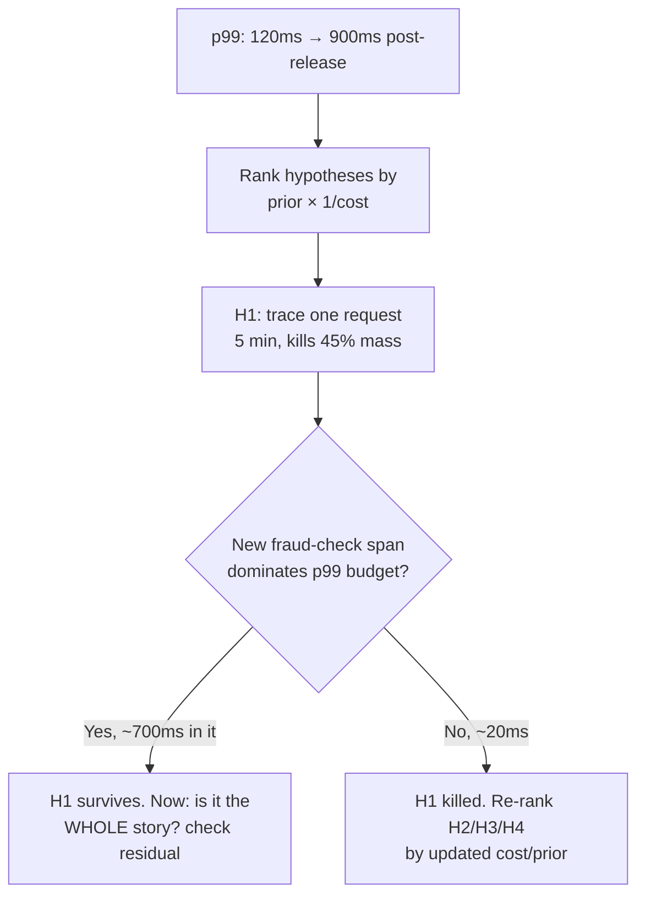
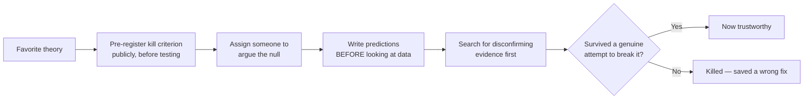

> **What?** Running an investigation — a bug, a perf regression, a capacity question, an architecture bet — as a sequence of falsifiable predictions chosen for *information value under cost and risk*. The senior skill is not just "form a hypothesis" but deciding which experiment to run *given* that experiments cost time, money, and production risk, and given that the cheapest discriminating test is rarely the most obvious one.
>
> **How?** Quantify each hypothesis's prior and the cost of testing it; prefer the experiment with the highest expected information per unit cost. Build *falsifiability into designs and reviews* — every claim in a design doc gets a "how would we know this is wrong" line. Defeat confirmation bias structurally (pre-registered kill criteria, someone assigned to argue the null) rather than relying on willpower.

---

## 1. Information value, not just falsifiability

By now the basics are reflex: hypotheses must be falsifiable (Popper), pick the experiment that excludes the most alternatives (Platt), check the null first. The senior shift is **economic**. Every experiment has a cost — engineer-hours, a risky prod change, a load test that ties up a staging cluster — and the hypotheses have different **prior probabilities** of being true. You should run the test that maximizes *expected information gained per unit of cost*, which is frequently **not** the test for your most-likely hypothesis.

The logic mirrors optimal binary search and decision theory: you want each test to **split the probability mass roughly in half**, weighted by cost.

### A worked prioritization

A payments service shows p99 latency jumping from 120ms to 900ms after a release with several changes. Candidate causes:

| # | Hypothesis | Prior (gut) | Cost to test | Test |
| --- | --- | --- | --- | --- |
| H1 | New synchronous fraud-check call added to the hot path | 0.45 | **5 min** | Read the diff / trace one request's span tree |
| H2 | Connection pool too small for added concurrency | 0.20 | 30 min | Load test with pool size swept |
| H3 | A new index made writes slower | 0.15 | 1 hr | Reproduce write path on a copy |
| H4 | GC pressure from a new allocation-heavy serializer | 0.20 | 45 min | Profile under load, read GC logs |

The naïve move is to chase H1 because it's most likely. The *senior* move agrees here — but **for the right reason**: H1 isn't just most-likely, it's also the **cheapest to falsify** (read a distributed trace; the new span either dominates the p99 budget or it doesn't). High prior × trivial cost = test it first. Five minutes either kills 45% of the probability mass or confirms it.

But flip one number. If H1 cost an hour and H4 cost five minutes, you'd test H4 first *even though it's less likely*, because eliminating it cheaply is worth more per minute. **Cost changes the order, not just the priors.** Juniors order by likelihood; seniors order by expected information per unit cost.

> Note the post-confirmation step at **E**: even when your top hypothesis survives, ask whether it's the *complete* explanation. If the fraud-check adds 700ms but p99 rose by 780ms, there's a residual 80ms — a second, smaller cause. Stopping at the first confirmation is how partial fixes ship.

---

## 2. Falsifiability as a design and review practice

The most leveraged use of this discipline is *not* debugging — it's **before** you build anything. A design doc or RFC is a bundle of predictions about the future ("this will handle 10k RPS," "this cache will have a 90% hit rate," "this queue will absorb the burst"). Most of those predictions are stated unfalsifiably and never checked.

Institute a simple rule on the designs you review: **every load-bearing claim must come with a falsifiable test and a number.**

| Claim as written (unfalsifiable) | Rewritten (falsifiable) |
| --- | --- |
| "This will scale." | "At 10k RPS with this instance type, p99 stays < 250ms; we'll verify with a load test before GA. Kill: if p99 > 250ms at 6k RPS, the design is wrong." |
| "The cache will reduce DB load significantly." | "We expect ≥ 85% hit rate on the top-1000 keys; below 70% the design doesn't pay for its complexity. We'll measure in the spike." |
| "This is more reliable." | "Failure of node A no longer fails requests; we'll prove it with a kill-the-node game-day. Kill: if request error rate spikes when A dies, it isn't." |

This turns a design review from opinion-trading into a list of *bets with explicit kill criteria*. It also front-loads the cheap experiment: most of those numbers can be checked with a [spike or prototype](../04-spikes-and-prototypes/) for a day, *before* committing a quarter to the build. A claim no one is willing to attach a kill criterion to is a claim no one actually believes — surface that in review.

> This is the natural bridge to the [section on experiments](../02-experiments-and-ab-testing/) and to [measure-before-optimize](../03-measure-before-optimize/): an optimization with no falsifiable "this will improve metric M by ≥ X%, and here's how we'll know if it didn't" is a guess wearing a deadline.

---

## 3. Defeating confirmation bias *structurally*

Telling people "be objective" doesn't work — confirmation bias operates below conscious awareness, and it's *strongest* when you're under pressure and emotionally invested in a theory (your own code, a deadline, a design you championed). Seniors don't rely on willpower; they build mechanisms.

### Mechanism 1 — Pre-register the kill criterion

Write down, *before* running the experiment, the exact result that will make you abandon the hypothesis — and commit to it in writing (a ticket comment, the incident channel). This is borrowed from clinical-trial **pre-registration**, which exists precisely because researchers, post-hoc, will rationalize any result as supportive. Once the kill criterion is public and timestamped, you can't quietly relax it when the data is inconvenient.

### Mechanism 2 — Assign the null

In a war room, explicitly assign someone the job: *"Your role is to argue this is coincidence and that our leading theory is wrong. Find the evidence that kills it."* This is a red-team / devil's-advocate role. It converts the social pressure (everyone nodding along with the senior's theory) into structured dissent. Feynman's framing in his 1974 Caltech "Cargo Cult Science" address is the standard to hold here: *"The first principle is that you must not fool yourself — and you are the easiest person to fool."*

### Mechanism 3 — Predict before you peek

Before opening the dashboard / running the query, **write down what each hypothesis predicts you'll see.** If you look first and *then* form the theory, you'll fit a story to whatever noise is there (this is HARKing — Hypothesizing After Results are Known). Prediction-first makes the data able to *surprise* you, which is the only way data can teach you anything.

### Mechanism 4 — Symmetric evidence search

For your favorite theory, force yourself to list the observations that would **disconfirm** it, and go look for those *first*. If you find yourself only running queries that would confirm, that's the tell.

---

## 4. Strong inference on a real performance regression

Let's run the full loop on a concrete case to show the senior cadence.

**Symptom.** Nightly batch job's runtime jumped from 40 min to 3 hours; started ~2 weeks ago, no obvious single deploy.

**Step 1 — Null first.** H0: "The input data grew; the job is fine, there's just more of it." Cheapest possible check: plot input row count over the last 30 days against runtime. *Result:* rows up 8%, runtime up 350%. **H0 killed** — runtime grew wildly super-linearly relative to data, so it's not just volume. (Had the curves matched, we'd have stopped here and provisioned more, not hunted a bug.)

**Step 2 — Shape of the curve discriminates the class of cause.** A super-linear blowup against an 8% data increase is itself a *discriminating observation*: it points at an algorithmic complexity regression (an O(n) path that became O(n²), e.g., a per-row query, a lost index, an accidental nested loop) and *away* from constant-factor causes (slower disk, GC). One observation narrows the whole hypothesis class.

**Step 3 — Bisect the timeline.** "The regression entered somewhere in 14 days of commits" is a hypothesis space. We don't read every commit — we bisect: check out the midpoint, run a *scaled-down* repro (so each test is minutes not hours), ask "is the O(n²) behavior present?" Each run halves the space. ~4 runs localize it to a commit.

**Step 4 — Mechanism + numeric prediction.** The bisected commit added a `.filter()` inside a loop that re-scans a list per row. Hypothesis H_quad: "this nested scan is the cause." Prediction with a number: *if H_quad is true, runtime scales as ~n²; doubling input rows ≈ 4× runtime.* Test on 2× data. *Result:* 3.9×. **H_quad survives a quantitative test** — not just "it looks slow," but "it scales the way the mechanism predicts." That's the difference between a guess and a diagnosis.

The fix (precompute the lookup into a hash set, O(n) total) is now obvious *and* you can predict its effect before shipping: runtime should drop back to ~linear, i.e. ~45 min. If it doesn't, your diagnosis was incomplete — there's a second cause.

---

## 5. Anti-patterns seniors actively police

| Anti-pattern | What it looks like | The discipline that kills it |
| --- | --- | --- |
| **Unfalsifiable closure** | "It was probably a transient blip" closes the ticket | Demand a prediction: "if transient, errors don't recur in 2h; let's confirm." If you can't state one, it's unresolved. |
| **Goalpost drift** | Kill criterion quietly loosened when data disappoints | Pre-register it publicly and timestamped |
| **Confirmation-only search** | Only running queries that would support the pet theory | Assign the null; search disconfirming evidence first |
| **Single-trial fix** | "Passed once, it's fixed" on an intermittent bug | Reject the null only after N trials make luck negligible |
| **Multivariate fix during diagnosis** | Three changes in one deploy "to be safe" | One variable when the goal is attribution |
| **HARKing** | Forming the theory after staring at the data | Predict before you peek |
| **Stopping at first confirmation** | Top hypothesis confirmed → ship, ignore residual | Check the residual: does it explain the *whole* magnitude? |

---

## 6. Takeaways

- Order experiments by **expected information per unit cost**, not by likelihood alone — cost reorders the queue.
- After a hypothesis is confirmed, check whether it explains the **full magnitude**; residuals reveal second causes.
- Make **design docs and RFCs falsifiable**: every load-bearing claim gets a number and a kill criterion, ideally checked by a cheap spike before the big build.
- Defeat confirmation bias with **mechanisms** — pre-registered kill criteria, an assigned null-advocate, predict-before-peek, disconfirming-search-first — not willpower (Feynman: don't fool yourself).
- The **shape** of a symptom (super-linear blowup, error clustering) is itself a discriminating observation; let it narrow the hypothesis class before you test individuals.

The [professional](./professional.md) level scales these from one engineer's investigation to an org's incident-response culture and the killing of zombie projects.

---

### References

- John R. Platt, "Strong Inference," *Science* 146:3642 (1964).
- Karl Popper, *The Logic of Scientific Discovery* (1934); *Conjectures and Refutations* (1963).
- Richard Feynman, "Cargo Cult Science," Caltech commencement address (1974) — "you must not fool yourself."
- Related: [measure before optimize](../03-measure-before-optimize/), [spikes and prototypes](../04-spikes-and-prototypes/), [debugging as problem-solving](../../02-problem-solving/05-debugging-as-problem-solving/), [critical thinking](../../04-critical-thinking/).
