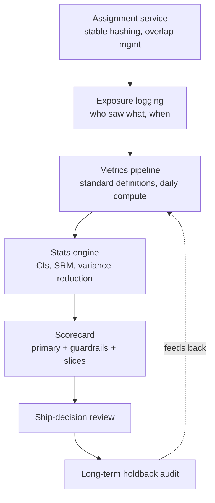

> **What?** Experimentation as an organizational capability: a platform that lets hundreds of engineers run trustworthy tests cheaply, a culture where decisions are made on evidence rather than HiPPO opinion, and the institutional guardrails that keep a thousand concurrent experiments from corrupting each other or the business.
>
> **How?** At staff/principal level you don't run a test — you build the system and the norms that make every test trustworthy by default: standardized metrics, automated validity checks, overlapping-experiment infrastructure, ship-decision review, and a feedback loop that audits whether shipped wins actually held up.

---

## 1. From experiment to experimentation system

A single A/B test is easy. The hard problem is running *thousands per year* without each one needing a statistician. That requires a platform with these layers:

The platform's job is to make the *correct* thing the *default* thing: stable per-experiment hashing, automatic SRM checks, pre-registered primary metrics, CIs not bare p-values, and standardized metric definitions so two teams can't quietly disagree on what "conversion" means. Kohavi, Tang & Xu's *Trustworthy Online Controlled Experiments* (2020) is the canonical reference for how Microsoft/Bing built this; the lesson is that **trust is an engineering property of the platform, not a virtue of individual analysts.**

## 2. Overlapping experiments and interaction effects

At scale you cannot give each experiment its own slice of traffic — you'd run out. Google's "overlapping experiments" model layers tests so a user is simultaneously in many: orthogonal **layers** where independent features (search ranking vs ad layout vs button color) co-experiment, and exclusive **domains** for tests that *would* interact (two competing ranking changes).

The design contract:

- **Independent layers** assume no interaction. Justified because most feature pairs don't interact, and randomization makes the *other* experiments' effects average out across your arms.
- **Exclusion groups** isolate tests known to fight over the same surface or resource.
- **Interaction detection** runs periodically: scan pairs of live experiments for statistically significant interaction effects and alert owners. Real interactions are rare but expensive when missed.

This is what lets a company run thousands of concurrent experiments on the same users. The cost is conceptual discipline: owners must declare whether their test can coexist or needs exclusion.

## 3. The institutional metric set and the OEC

A mature org does not let every team invent metrics. It maintains a **curated, versioned metric library**:

- A small set of **company-level OEC** metrics every experiment is scored on (e.g. sessions, long-term revenue per user, retention).
- **Guardrails** enforced platform-wide: latency, error rate, crash rate, and *ethical/quality* guardrails (unsubscribes, complaints, accessibility regressions).
- **Local** metrics teams add for their own decisions.

The OEC must be chosen to resist gaming. If you reward "engagement," teams will ship dark patterns that boost engagement and harm the OEC's *intent*. Goodhart's law bites here: when a metric becomes a target, it stops measuring what you wanted. The institutional defense is (a) an OEC tied as closely as possible to durable value, (b) guardrails that catch the harm, and (c) human review that can veto a "win" that's technically green but obviously a dark pattern. A long-term **holdback** — a permanent small control kept off all shipped changes — measures whether the *cumulative* effect of a year of "wins" actually moved the OEC, and frequently reveals that the sum of celebrated lifts is far smaller than their parts (or negative).

## 4. Ship decisions as a reviewed process

Who decides ship? Not the experiment owner alone — that invites motivated reasoning. Mature orgs run an **experiment review**:

| Check | Question |
|-------|----------|
| Validity | SRM clean? A/A history clean? Pipeline trusted? |
| Power | Was the test adequately powered for its MDE, or is "flat" just "underpowered"? |
| Primary | Did the **pre-registered** primary clear the **practical** threshold (not just statistical)? |
| Guardrails | All intact? Any borderline? |
| Heterogeneity | Any segment badly harmed even if the average won? |
| Durability | Novelty-adjusted? Steady-state reached? |
| Cost | Maintenance/complexity cost vs the lift — is the win worth carrying? |

A "flat" result is a real and common outcome — and at most companies the *majority* of experiments are flat or negative. (Microsoft, Google, and Bing have all reported that only roughly a third of well-conceived ideas move the OEC positively.) An experimentation culture that punishes flat results trains people to p-hack until something is green. **Celebrate the kill** — a confidently-flat result that prevents shipping a costly no-op is a win for the org.

## 5. Building a trustworthy-experiment culture

Platforms enable trust; culture sustains it. The norms a principal engineer enforces:

- **Hypothesis before data.** Pre-register the primary metric and decision rule; no retrofitting the metric to the result.
- **Twyman's law as reflex.** A surprising result triggers a pipeline audit, not a launch. Most "huge wins" are bugs.
- **No HiPPO override.** Decisions follow the pre-registered rule, not the *Highest-Paid Person's Opinion*. The whole value of experimentation is replacing opinion with evidence; let one exec overrule it on a hunch and the discipline rots.
- **Underpowered means undecided.** Teams must not interpret an underpowered "no significant difference" as "no effect."
- **Replication for big claims.** Surprising, high-stakes wins get re-run before they're treated as fact.
- **A/A and SRM are non-negotiable gates**, run automatically, blocking on failure.

This connects directly to [cognitive biases in code decisions](../../04-critical-thinking/03-cognitive-biases-in-code-decisions/): confirmation bias, the sunk-cost of a long-built feature, and outcome bias all push teams to over-read favorable noise. The platform's automated checks exist precisely because individual judgment is unreliable under these pressures.

## 6. Experiments as an engineering-safety practice

The same machinery governs *operational* risk, not just product metrics:

- **Canary analysis.** Roll new code to 1–5% of traffic; an automated analyzer compares the canary's error rate, latency percentiles, and resource use against the baseline fleet using the *same* statistical machinery as an A/B test (SRM, CIs, guardrails). Auto-rollback on a guardrail breach. Tools like Netflix's Kayenta formalize this.
- **Progressive delivery / flag rollouts.** Ramp 1% → 5% → 25% → 100%, holding at each stage long enough for metrics to stabilize, with automated halt conditions. A flag rollout *is* an experiment whose primary metric is "did we break anything."
- **A/A in production** as a continuous platform-health monitor: a permanent null experiment whose alarm means the experimentation/telemetry pipeline itself has drifted.

The unifying idea: product A/B tests and engineering canaries are the same controlled-experiment pattern with different metrics. Investing in one platform pays off across both.

## 7. Common organizational failure modes

| Failure | Symptom | Institutional fix |
|---------|---------|-------------------|
| Metric sprawl | Every team's "conversion" differs | Central versioned metric library |
| Peeking culture | Dashboards everywhere, early ships | Sequential stats *or* locked horizons; no early-ship without sequential design |
| HiPPO override | Exec ships the losing variant | Pre-registered decision rule; review board |
| Underpowered defaults | Tiny tests called "flat" | Power gate at design time; refuse to launch under-powered |
| Local optima | Many small wins, OEC flat | Long-term holdback audit |
| Interaction blindness | Two tests silently fight | Exclusion groups + interaction scans |
| Trust erosion | Nobody believes results | Automated A/A + SRM gates, public post-mortems on bad reads |

## 8. The audit loop — did the wins hold?

The most-skipped, highest-value practice: **go back and check.** Months after shipping a "+2% revenue" win, compare against the long-term holdback. Frequently the durable effect is half the launch estimate (novelty), or a guardrail you didn't track drifted. A principal builds this audit into the platform so the org learns *which kinds of experiments overstate*, calibrates its own MDEs, and keeps its forecasts honest. An experimentation program with no retrospective accountability slowly fills with phantom wins.

---

## Key takeaways

- **Trust is a platform property:** standardized metrics, automated SRM/A-A gates, CIs by default, stable hashing — make the correct thing the default.
- **Overlapping experiments** (layers + exclusion domains + interaction scans) let thousands run concurrently without contaminating each other.
- Curate a **company OEC + guardrails**; defend against **Goodhart** with review and a **long-term holdback**.
- **Ship decisions are reviewed**, judged on the *pre-registered primary at a practical threshold* with all guardrails — and **flat is a valid, common, celebratable outcome**.
- Enforce a **culture**: hypothesis-first, Twyman's-law reflex, no HiPPO override, underpowered ≠ no-effect, replicate big claims.
- **Canary analysis and progressive rollout** are the same controlled-experiment pattern applied to operational safety.
- **Audit shipped wins against the holdback** — without retrospective accountability the program fills with phantom lifts.

## Where to go next

- [interview.md](./interview.md) — rapid-fire checks on the traps.
- [tasks.md](./tasks.md) — design, debug, and compute exercises.
- [Measure before optimize](../03-measure-before-optimize/) · [Spikes and prototypes](../04-spikes-and-prototypes/)
- [Cognitive biases in code decisions](../../04-critical-thinking/03-cognitive-biases-in-code-decisions/)
- [Section root](../) · [Engineering Thinking roadmap](../../README.md)
