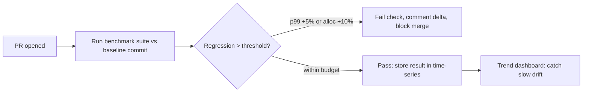
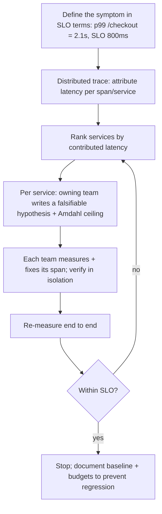

> **What?** At staff/principal level, "measure before optimize" scales from a personal habit into *organizational policy*: continuous performance-regression testing in CI, performance budgets and SLOs enforced as gates, capacity planning driven by measured headroom, and the ability to lead a cross-team performance investigation where the bottleneck spans services owned by people who don't report to you.

> **How?** You institutionalize measurement — automated benchmarks that fail the build on regression, perf budgets in the definition of done, SLO/error-budget governance, capacity models built from real telemetry — and you run major performance investigations as structured, hypothesis-driven programs with an explicit "stop at the requirement" exit.

---

## 1. From habit to policy: continuous performance regression testing

A single profiling session fixes today's bottleneck. The staff problem is *keeping* the win across hundreds of commits by dozens of engineers. The answer is automated, **continuously running** benchmarks whose results are tracked over time.



Two failure modes this catches, which manual profiling never does:

- **Step regressions** — one commit makes a hot path 3× slower; the gate blocks it at PR time, when it's cheap and the author is in context.
- **Slow drift** — 0.5% per week from a hundred innocent commits, invisible per-PR, but a 30% loss over a year. Only a long-running time-series trend exposes it.

Engineering this well is mostly about **noise control**, because a flaky perf gate gets disabled within a week:

- Run on dedicated, pinned hardware (fixed CPU frequency, isolated cores, no shared/noisy-neighbor VMs).
- Report deltas with confidence intervals (e.g. `benchstat`), not raw numbers; gate on the CI of the delta, not a point estimate.
- Set thresholds above the measured noise floor (if run-to-run noise is ±3%, a 2% gate is pure flake).
- Compare against a *moving baseline commit*, re-baselined deliberately, never against "last run."

## 2. Performance budgets as a contract

A **performance budget** is a measured limit, agreed in advance, treated like a quality gate. It converts "make it fast" (unfalsifiable) into "p99 of `/checkout` ≤ 250 ms; JS bundle ≤ 180 KB; allocs/req ≤ 40 KB" (measurable, enforceable).

| Budget type | Example | Enforced where |
|---|---|---|
| Latency budget | p99 `/search` ≤ 200 ms | CI load test + prod SLO |
| Resource budget | ≤ 40 KB allocated/request | Benchmark gate in CI |
| Asset budget | JS bundle ≤ 180 KB gzipped | Build step, fails the build |
| Capacity budget | ≤ 60% CPU at peak | Capacity review / autoscaler |

The budget belongs to the *requirement*, derived from the SLO and the [first-principles latency floor](../../05-first-principles-thinking/01-reasoning-from-fundamentals/), and it doubles as a **stop signal**: once a path is inside budget, optimization there is *not* sanctioned work — it competes with everything else on the roadmap and usually loses. This is Knuth's "forget small efficiencies 97% of the time" turned into an explicit policy: the budget tells the org which 3% is the critical 3%.

## 3. SLOs, error budgets, and "fast enough" as governance

At scale, "fast enough" can't be a personal judgment call — it has to be a documented, organization-level target so teams don't independently over- or under-invest.

- **SLO** — the target: "99% of `/api/orders` responses < 300 ms over 28 days."
- **SLI** — the measured indicator feeding it: the actual p99 latency stream.
- **Error budget** — the allowed shortfall: `100% − 99% = 1%` of requests may exceed 300 ms.

The error budget is the lever that makes "stop optimizing" a *fundable decision*: if you're comfortably within budget, latency work is deprioritized in favor of features; if you're burning budget, latency work gets funded and prioritized. Beware **Goodhart's law** — when a latency target becomes the goal, teams game it (e.g. shedding slow requests to flatter the percentile). Pair SLOs with guardrail metrics (success rate, throughput) so the optimization can't win the number while losing the system.

## 4. Capacity planning is measurement extended into the future

Capacity planning is "measure before optimize" applied to *infrastructure*: measure current headroom and growth, model the future, and provision — rather than guess and over-buy (waste) or under-buy (outage).

A defensible model from telemetry:

```
Measured:   peak = 12,000 req/s at 55% CPU on 20 nodes
Per-node throughput at 100% (extrapolated, validated by load test) ≈ 1,090 req/s
Headroom now: 20 × 1,090 − 12,000 ≈ 9,800 req/s
Growth:     measured +8%/month compounding
Months until 80% (safe ceiling) of current fleet:
  target = 0.8 × 20 × 1090 ≈ 17,440 req/s
  12,000 × 1.08^n = 17,440  →  n = ln(1.454)/ln(1.08) ≈ 4.9 months
```

So you have ~5 months before the current fleet hits its safe ceiling — provision (or optimize per-node cost) on that timeline, not in a panic. The critical discipline: **extrapolate from measured per-node limits validated by an actual load test**, never from a vendor spec sheet or a hopeful linear guess. Non-linear effects (lock contention, GC, connection limits) mean real systems often fall off a cliff well before "100% CPU."

## 5. Leading a cross-team performance investigation

The hardest professional scenario: p99 is blown, and the latency is smeared across services owned by three teams, none reporting to you. Run it as a structured program, not heroics.



Principles that make it work:

- **Trace first, accuse never.** A distributed trace attributes the 2.1 s objectively across spans, so the conversation is data, not blame. Without it, every team insists "it's not us."
- **Amdahl prioritizes the effort.** The span contributing 1.3 s of the 2.1 s (`p ≈ 0.62`) is where the program lives; the 40 ms span is off-limits — its ceiling is `1/(1−0.02) ≈ 2%`, not worth a sprint. State this explicitly so a team doesn't burn a quarter on a low-`p` span.
- **Each team owns a falsifiable hypothesis** for its span, with a predicted number and a kill condition, so progress is verifiable independently and in parallel.
- **One end-to-end metric is the source of truth.** Per-service wins must show up in the *whole-system* p99 (a local optimum can shift load and worsen another service — only the end-to-end number catches it).
- **Stop at the SLO.** When end-to-end p99 < 800 ms, the program ends and converts to *budgets + regression gates* so the win is defended automatically. Declaring victory without that, and the regression returns within two quarters.

## 6. Anti-patterns at organizational scale

- **Vanity benchmarks** — a marketing "10× faster" on a workload no customer runs; representativeness is a governance requirement, not a nicety.
- **Perf gate flakiness → disablement** — a noisy gate gets muted in a week; invest in noise control or don't have a gate.
- **Optimizing without an SLO** — unbounded effort with no definition of "done"; every perf program must name its requirement first.
- **Capacity from spec sheets** — extrapolating linearly past measured limits; real systems hit non-linear cliffs.
- **Goodhart-gamed SLOs** — hitting the latency target by dropping or mis-classifying slow requests; always pair with guardrails.
- **Hero profiling without institutionalization** — one engineer fixes it, no regression test, it silently regresses. The staff deliverable is the *gate*, not the fix.

## 7. The professional's distilled stance

Measurement stops being something you *do* and becomes something the *system enforces*:

1. **Continuous** regression benchmarks gate every merge and trend over time.
2. **Budgets** turn "fast" into measurable, enforced limits tied to the requirement.
3. **SLOs + error budgets** make "fast enough" a funded, governed decision — and the legitimate signal to *stop*.
4. **Capacity planning** extends measurement into the future from validated, real limits.
5. **Cross-team investigations** run as trace-driven, Amdahl-prioritized, hypothesis-per-team programs that end at the requirement.

The throughline from junior to principal is unchanged — *never optimize blind* — but the scope grows: you're no longer just measuring your code, you're building the organizational machinery that guarantees everyone measures before they optimize, and that nobody optimizes past what the business actually needs. See [hypothesis and falsifiability](../01-hypothesis-and-falsifiability/), [experiments and A/B testing](../02-experiments-and-ab-testing/), [spikes and prototypes](../04-spikes-and-prototypes/), and the [engineering-thinking overview](../../README.md) for the broader framework this sits in.
