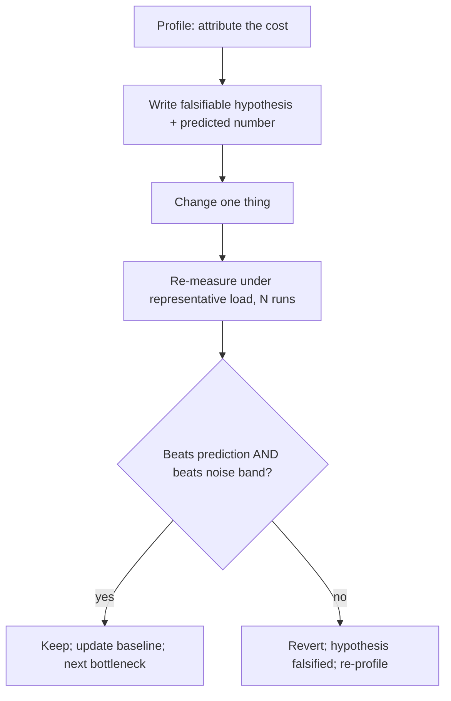
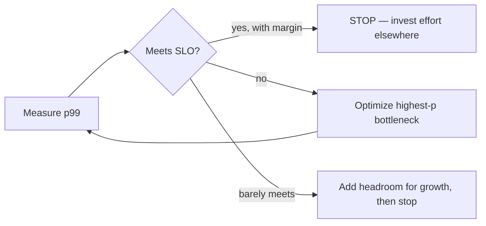

> **What?** At the senior level, "measure before optimize" becomes a rigorous methodology: deriving a *theoretical floor* from first principles, using structured profiling methods (USE, off-CPU analysis) to localize the bottleneck, treating each optimization as a falsifiable hypothesis, distinguishing real wins from measurement noise statistically, and — crucially — knowing when the correct answer is *stop*, because the system already meets its SLO.

> **How?** You start from the physics (what's the latency floor?), use the right structured method to find the constraining resource, form a single falsifiable hypothesis per change, A/B the change under a representative load with significance testing, and gate the whole effort on a requirement so you don't optimize past "fast enough."

---

## 1. Start from the floor, not the code

Before profiling, a senior engineer derives the *theoretical minimum* — the latency or throughput the workload can reach if everything were perfect. This frames every measurement: it tells you whether you're 2× off the floor (worth chasing) or 50× off (something is structurally wrong) or already at it (stop).

Back-of-envelope from physical constants:

```
SSD random read           ≈ 100 µs
Network round trip (same DC) ≈ 500 µs
Network RTT (cross-region) ≈ 70 ms      ← physics; you cannot optimize past it
Sequential memory read 1MB ≈ 100 µs
Main memory reference      ≈ 100 ns
```

If a request *must* make two cross-region round trips, its floor is ~140 ms no matter how perfect your code is. Profiling the JSON parser to shave 2 ms is theater. The only real fix is architectural: cache, co-locate, or remove a round trip. This is [first-principles reasoning](../../05-first-principles-thinking/01-reasoning-from-fundamentals/) applied to performance — derive the floor, then measure your distance from it.

> Measuring tells you *where* the time goes. First-principles tells you *how much of it is removable.* You need both.

## 2. Structured profiling methods

Random profiling wastes time. Use a method that systematically finds the constraint.

### The USE method (Brendan Gregg)

For every resource (CPU, memory, disk, network, locks), check three things:

| | Meaning | Signal |
|---|---|---|
| **U**tilization | % of time the resource is busy | High U → resource is the bottleneck |
| **S**aturation | Queued/waiting work it can't service | Any saturation → demand exceeds capacity |
| **E**rrors | Failed operations | Errors → correctness *and* perf cost |

A CPU at 95% utilization with a deep run queue (saturation) tells you to profile *CPU*. A CPU at 20% with high request latency tells you the bottleneck is **off-CPU** — blocked on I/O, a lock, or the network — and a CPU flame graph will show you *nothing useful*. This is the single most common senior-level misdiagnosis: profiling on-CPU time when the system is waiting.

### On-CPU vs off-CPU

```
On-CPU profile:   "where is the CPU burning cycles?"   → CPU-bound work
Off-CPU profile:  "where is the thread blocked/waiting?" → I/O, locks, sleeps
Wall-clock = on-CPU + off-CPU
```

If p99 latency is 800 ms but CPU profiling accounts for only 40 ms of it, **760 ms is off-CPU** — go find what it's waiting on (lock contention, a slow downstream, GC pauses). Off-CPU flame graphs and tracing reveal it; a `pprof` CPU profile alone will lie by omission.

## 3. Each optimization is a falsifiable hypothesis

Treat performance work as the scientific method, not tinkering. Every change gets a written, falsifiable prediction:

> **Hypothesis:** "Batching the per-row DB calls into one query will cut p99 from 800 ms to under 250 ms, because the profile attributes 620 ms to N sequential round trips."
>
> **Falsifier:** if p99 after the change is still > 600 ms, the hypothesis is wrong — the round trips weren't the cost — and I revert.

This forces three goods: (1) a *mechanism* (why you expect the win), (2) a *quantified prediction* (how much), and (3) a *kill condition* (what disproves it). A change that "felt faster" with no prediction can't be falsified, so it isn't measurement — it's belief. See [hypothesis and falsifiability](../01-hypothesis-and-falsifiability/) for the underlying discipline.



## 4. Is the difference real? Significance, not eyeballing

Benchmarks are noisy. A senior engineer never declares a win from a single before/after number. Run N samples of each and test whether the distributions actually differ.

```
Baseline:  p99 = 305, 298, 312, 301, 309 ms   (mean 305, sd ~5.4)
After:     p99 = 297, 291, 300, 295, 294 ms   (mean 295.4, sd ~3.4)
```

A 3% improvement with these spreads is borderline — run a `t`-test or, better, a tool like `benchstat` that reports the delta *with a confidence interval and a p-value*:

```
name     old p99      new p99      delta
Search   305ms ±2%    295ms ±1%    -3.3%  (p=0.04, n=10)
```

`p=0.04` means the difference is unlikely to be noise. Without this, you'll "confirm" wins that are pure jitter and ship complexity for nothing. Control the environment too: pin CPU frequency (disable turbo/throttling), isolate cores, disable ASLR for micro-benchmarks, and run on quiet hardware — cloud VMs with noisy neighbors can produce ±30% run-to-run swing that swamps any real signal.

## 5. Knowing when to stop: "fast enough" is a valid answer

The most senior skill in this whole topic is **not optimizing.** Performance work has diminishing returns and rising risk (every optimization adds complexity and bug surface). The requirement, not the possibility, sets the finish line.

> If the SLO is p99 < 200 ms and you're at p99 = 150 ms, **you are done.** Driving it to 80 ms spends engineering time and adds risk for a number no user asked for and no contract requires.



This connects back to Knuth's *full* quote: forget the small efficiencies 97% of the time. "Fast enough relative to the requirement" is the disciplined senior answer, and recognizing it prevents the trap of optimizing the wrong 97%. The corollary: define the SLO *first*, so "done" is a measurable state and not a feeling.

## 6. Worked end-to-end investigation

A service shows p99 = 1,200 ms; SLO is 300 ms. Senior approach:

1. **Floor.** The request needs one DB read (~1 ms) and one cache lookup (~0.2 ms). Floor ≈ a few ms. We're ~400× off the floor → something is structurally wrong, not a micro-issue.
2. **USE.** CPU utilization 25% (not CPU-bound). Latency is off-CPU. → profile off-CPU.
3. **Off-CPU profile.** 900 ms of p99 is blocked waiting on a connection-pool semaphore — pool exhaustion under load.
4. **Hypothesis.** "Pool size is 10; concurrency is 40, so 30 requests queue. Raising the pool to 50 should drop the off-CPU wait from 900 ms toward ~0, bringing p99 near 300 ms. Falsifier: if p99 stays > 600 ms, the wait wasn't the pool."
5. **Amdahl sanity check.** The off-CPU wait is `p ≈ 0.75` of p99; removing it caps the win at `1/(1-0.75) = 4×` — enough to reach the SLO. Worth doing.
6. **Change + measure.** Pool → 50. p99 = 280 ms ± 8 over 10 runs; `benchstat` p=0.01.
7. **Stop.** 280 < 300 SLO, with small margin. Add a little headroom (pool 60, validate the DB can take the connections), then **stop**. Do *not* go chase the now-3-ms JSON parser.

Notice what never happened: no CPU micro-optimization, no clever loop rewrites. The constraint was a queue, found by off-CPU profiling, fixed with one config change, and the work *stopped at the requirement.*

## 7. Anti-patterns seniors catch in review

- **Profiling on-CPU when the system is waiting** — the USE method would have said "off-CPU."
- **Optimizing a low-`p` component** — Amdahl ceiling makes the win impossible; reject in design review.
- **No baseline, no variance** — "it's faster" with one run and no confidence interval.
- **Optimizing past the SLO** — added risk for a number nobody needs.
- **Tuning to an unrepresentative load** — great on uniform keys, falls over on production's Zipfian skew.
- **Local optimum, global loss** — a micro-win that worsens cache locality or contention elsewhere; only an end-to-end macro measurement catches it.

**Senior takeaway:** Derive the floor, find the constraining resource with a structured method, write each change as a falsifiable hypothesis with a predicted number, prove the win is statistically real, and — the mark of seniority — *stop the moment the requirement is met.*
