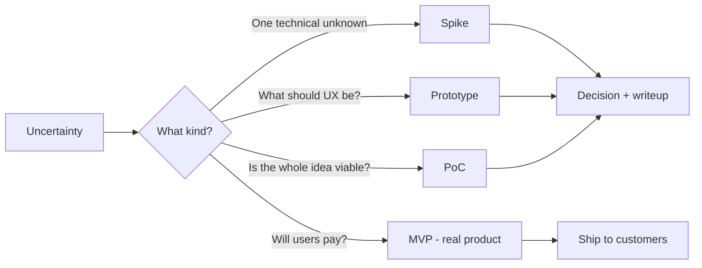

> **What?** A *spike* is a small, time-boxed, throwaway piece of code written to answer **one** technical question you can't answer by thinking or reading docs. The term comes from Extreme Programming (XP). A *prototype* is a deliberately incomplete build used to explore a design. Both buy down uncertainty *before* you commit to real work.
>
> **How?** When you're unsure whether something is possible or how hard it is, stop guessing. Write down the single question, set a timer (e.g. "2 hours"), write the ugliest code that answers it, record the answer, and **delete the code**. The deliverable is a *decision*, not a feature.

---

## 1. The problem spikes solve

You're about to start a task and a voice in your head says *"...but I'm not actually sure this library can do X"* or *"I don't know if this API is fast enough"*. You have two bad options:

- **Guess and start building.** If your guess is wrong, you find out three days in, after you've built scaffolding around a broken assumption.
- **Argue about it in a meeting.** People debate opinions with no evidence. The loudest person wins, not the truth.

A spike is the third option: spend a *fixed, small* amount of time getting a real answer from real code, then decide.

> A spike trades a little time **now** for a lot less wasted time **later**. It's cheaper to learn a design is wrong in 2 hours than in 2 weeks.

---

## 2. What a spike actually is

A spike has four non-negotiable properties. Miss any one and it stops being a spike.

| Property | Meaning | Why it matters |
|---|---|---|
| **One question** | It answers a single, specific technical question. | Vague goals ("explore GraphQL") never finish. |
| **Time-boxed** | You decide the duration *before* you start (1h, half a day, a day). | The point is to *limit* uncertainty cost, not chase it forever. |
| **Throwaway** | The code is meant to be deleted. | You optimize for *learning speed*, not quality. |
| **Produces a decision** | The output is an answer + a short writeup. | A spike with no recorded conclusion was just procrastination. |

### The question must be answerable by code

Good spike questions are concrete and testable:

- "Can the `pdf-lib` package render our invoice template with embedded fonts?"
- "How long does it take to import a 1-million-row CSV with our current insert code?"
- "Does the third-party auth SDK work behind our corporate proxy?"

Bad spike questions are vague or are really design opinions:

- "Look into PDFs." (No question.)
- "Is microservices a good idea for us?" (An architecture debate, not a code question.)

---

## 3. Spike vs prototype vs PoC vs MVP

These four words get used interchangeably. They are **not** the same thing. Knowing the difference makes you sound — and think — like a senior engineer.

| Term | Question it answers | Audience | Throwaway? | Scope |
|---|---|---|---|---|
| **Spike** | "*Can* we / how hard is *this one thing*?" | The team / yourself | **Yes, always** | Tiny — one question |
| **Prototype** | "What should this *look/work* like?" | Designers, users, team | Usually | A flow or interaction |
| **Proof of Concept (PoC)** | "Is this *whole approach* viable at all?" | Stakeholders, leadership | Often | An end-to-end idea, shallow |
| **MVP** | "Will real users *get value*?" | **Real customers** | **No — it's real** | Smallest *shippable* product |

The trap to remember: an **MVP is production software**. A spike and a PoC are **not**. The biggest mistake juniors make is treating spike code as if it were the start of the real product.



---

## 4. The cardinal sin: shipping the spike

Here's the rule you must tattoo on your brain:

> **Spike code is throwaway code. You do not ship it.**

Why people break this rule: the spike *worked*. It's tempting to think "well, it already runs, why throw it away?" Because spike code is, by design, low quality:

- No error handling — you ignored every edge case to go fast.
- No tests — you proved it works *once*, by eye.
- Hardcoded values, secrets in the source, copy-pasted snippets.
- No structure — it's a single 200-line function.

If you "promote" this to production, every shortcut you took on purpose becomes a permanent liability. This is called the **prototype-to-production trap**, and it's one of the most reliable ways to create long-term technical debt. The correct move: take the *knowledge* you gained, delete the code, and write the real thing properly.

### A concrete example

```python
# spike.py — answers: "Can we extract tables from these PDFs reliably?"
# THROWAWAY. Not for prod. No error handling on purpose.
import camelot

tables = camelot.read_pdf("sample_invoice.pdf", pages="all")
print(f"found {len(tables)} tables")
print(tables[0].df)  # eyeball it — do the columns look right?
```

This is *perfect* spike code: 4 lines, answers exactly one question ("does `camelot` extract our invoice tables?"), and you can see the answer with your eyes. You would never ship it — but you now *know* whether to bet your real feature on this library.

---

## 5. When NOT to spike

A spike costs real time, so don't reach for it reflexively. Skip the spike when the answer is **already knowable** without writing code:

- **The docs answer it.** "Does Postgres support JSON columns?" — read the manual, don't spike.
- **Someone on the team already knows.** Ask first. A 5-minute question beats a 2-hour spike.
- **It's a design opinion, not a fact.** "Should this be one service or two?" isn't a spike; it's a design discussion.
- **You can reason it out.** Simple arithmetic ("can we fit 10k records in memory?") is a calculation, not an experiment.

> Rule of thumb: spike only when you genuinely *cannot know* the answer until you run code, **and** the answer changes what you'd build.

This connects to a deeper skill — [questioning your assumptions](../../05-first-principles-thinking/02-questioning-assumptions/). A spike is how you *test* an assumption you've identified but can't yet verify.

---

## 6. The writeup — the part everyone forgets

A spike that ends with you closing your editor and thinking "yeah, that'll work" is a *wasted* spike. The team can't see what you learned, and you'll forget the details in a week. Always finish with a tiny writeup:

```markdown
## Spike: Can `camelot` extract our invoice tables?
**Time-boxed:** 2 hours    **Spent:** 1.5 hours
**Question:** Can we use camelot to pull line-item tables from supplier PDFs?

**Answer:** Yes for digital PDFs, NO for scanned ones (returns empty).
**Evidence:** 8/10 sample PDFs parsed cleanly; the 2 scanned ones failed.
**Decision:** Use camelot, but add a "scanned PDF" detection step + manual fallback.
**Next step:** Real implementation ticket INV-214. Spike code deleted.
```

Five minutes of writing turns a private experiment into team knowledge. This is the same discipline as [stating a hypothesis and a way to falsify it](../01-hypothesis-and-falsifiability/) — you wrote down what you expected, then let reality confirm or deny it.

---

## 7. Mental model to carry forward

- A spike is a **question with a timer and a delete button.**
- Its output is a **decision**, never a feature.
- **Spike ≠ prototype ≠ PoC ≠ MVP** — only the MVP is real, shippable software.
- **Never ship the spike.** The shortcuts you took on purpose become debt.
- Don't spike what you can **read, ask, or calculate.**
- **Write it down.** A spike without a conclusion didn't happen.

Next, [middle](./middle.md) goes deeper into running spikes well, throwaway vs evolutionary prototyping, and the walking-skeleton / tracer-bullet techniques. See also the section root [Scientific & Hypothesis-Driven](../) and the [Engineering Thinking roadmap](../../README.md).
