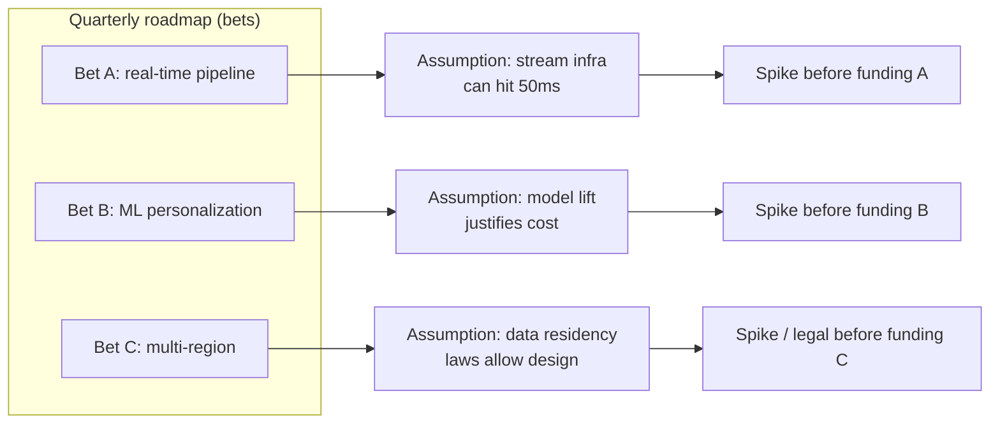
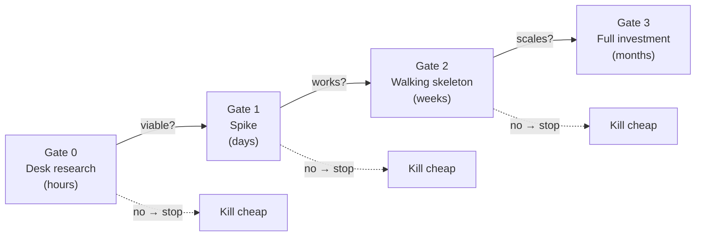

> **What?** At the staff/principal level, spikes are an *organizational instrument for managing uncertainty across a roadmap*. You don't just run a good spike — you decide how much of the organization's capacity goes to de-risking, you sequence spikes so that the riskiest assumptions are tested before large bets are committed, and you build the cultural guardrails that keep throwaway code throwaway and make "we killed it cheaply" a celebrated outcome.
>
> **How?** You allocate an explicit *spike budget*, run *staged de-risking* gates ahead of major investments, govern the throwaway-vs-keep boundary as policy, and use spike evidence to make and unmake roadmap commitments. Your real product is a culture where uncertainty is surfaced early and bought down cheaply, not discovered late and paid for dearly.

---

## 1. Spikes at the altitude of a roadmap

A single spike de-risks a task. A staff engineer's concern is the *aggregate* uncertainty across a quarter or a program: which bets on the roadmap rest on unverified assumptions, and how do we test those assumptions before we've sunk months into them?

The reframing: **a roadmap is a portfolio of bets, and each bet has an embedded set of assumptions. De-risking is the act of testing the assumptions that the most expensive bets depend on, *before* funding them.**



The job is to ensure no large bet gets fully funded while its load-bearing assumption remains untested. That is fundamentally [first-principles thinking](../../05-first-principles-thinking/) at portfolio scale: find the assumption the whole bet stands on, and verify it.

---

## 2. The spike budget

Exploration is not free, and "we'll spike it when we get to it" results in either no spiking (under-investment, late surprises) or unbounded spiking (over-investment, decision paralysis). The fix is an **explicit budget**:

> Allocate a defined fraction of team capacity (commonly **5–15%**) to de-risking work — spikes, prototypes, and exploratory research — as a standing line item, not an afterthought.

Why a budget rather than ad hoc:

| Without a spike budget | With a spike budget |
|---|---|
| Spikes compete with features and lose | De-risking has protected capacity |
| Risk is discovered mid-build (expensive) | Risk is surfaced before commitment |
| "No time to investigate" → guess and pray | Investigation is the plan, not a detour |
| Spikes sprawl (no cap) | Each spike is time-boxed within the budget |

The budget is *capped on both ends*: enough to test real risks, bounded so exploration doesn't crowd out delivery. Spending the entire budget on comfortable, low-risk spikes is a smell — the budget exists to attack the high-impact unknowns.

### Governing where the budget goes

Direct the budget by *expected value of information*: spend on the spike whose answer most changes what the organization would do. A spike whose result wouldn't alter any decision has zero EVI and shouldn't be funded — this is the disciplined form of "when NOT to spike," applied to a portfolio.

---

## 3. Staged de-risking ahead of big bets

For large initiatives, single spikes aren't enough; you want a **gated sequence of escalating-cost experiments**, each gating the next. This is the discipline behind stage-gate R&D and "build the riskiest part first" — fail cheap, fail early.



Each gate costs more than the last and is only entered if the prior gate passed. The principle: **never spend gate-N money until gate-(N−1) has retired the assumption it was there to test.** Most doomed initiatives die at gate 0 or 1 for the cost of a few days — instead of at month 4 for the cost of a team-quarter.

This is the modern, *empirical* reading of Fred Brooks's "plan to throw one away" (see §6): the early stages are *meant* to be discarded — and you stage them so the discarding is cheap and routine.

---

## 4. Governing the throwaway boundary as policy

At scale, "don't ship the spike" can't rely on individual virtue; it needs to be structural. The prototype-to-production trap is an organizational failure mode, and you prevent it with policy, not pleading:

- **Label intent in the artifact.** Spike branches are prefixed (`spike/…`), spike code lives in a `spikes/` or scratch area, and is excluded from the production build. The code's *location* enforces its throwaway status.
- **Make promotion a deliberate act, not a default.** Moving spike learnings into production requires a *fresh* implementation through the normal review/test gates — never `git merge` of the spike branch. The spike informs the rewrite; it does not become it.
- **Tie the budget to deletion.** A spike's "done" includes *code deleted / archived*. An undeleted spike is an open liability.
- **Quality bar follows declared intent.** Throwaway code is allowed to be ugly *because it's labeled and quarantined*; "keep" code (walking skeletons, tracer bullets) goes through full production rigor from line one. The policy removes the dangerous ambiguous middle.

> The organizational lesson: you don't prevent the prod-trap by telling engineers to be careful. You prevent it by making the throwaway path *structurally* unable to leak into production, and the keep path *explicitly* held to production standards.

---

## 5. Making and unmaking commitments on spike evidence

The highest-leverage thing a principal does with spikes is change the roadmap based on what they reveal — including reversing public commitments.

- **Pre-commit decision rules at the portfolio level.** Before funding a bet, write down the spike result that would cancel or reshape it. "If the latency spike shows we can't hit 50ms, Bet A becomes async-batch, not real-time." Recording the rule before the result neutralizes sunk-cost and political pressure when an inconvenient answer arrives.
- **Treat a killed bet as a budget win.** A direction killed at gate 1 returns its remaining funding to the portfolio. Make this visible: "Spikes this quarter killed two bets early, freeing ~1.5 team-quarters." That number is how you justify the spike budget to leadership.
- **Resist the demo-to-mandate pipeline.** A compelling prototype can generate organizational momentum to ship *that prototype* — executives saw it work. Your job is to insist the prototype proved *viability*, not *readiness*, and that real delivery is a separate, properly-scoped effort. This is where the prototype-to-production trap is most dangerous, because it's driven from above.

### Worked: a portfolio-level kill

```markdown
INITIATIVE: On-device LLM inference for the mobile app (proposed flagship bet, ~2 quarters)
Pre-committed gate-1 rule:
  - Spike: run the smallest viable quantized model on target-tier devices.
  - PASS if median inference < 1.5s AND no thermal throttling in a 5-min session.

GATE-1 RESULT (4 engineer-days): median 6s; devices throttled within 90s; battery -18%/session.
DECISION: Bet removed from roadmap this cycle. Re-evaluate when hardware/model sizes shift.
PORTFOLIO EFFECT: ~2 team-quarters returned; redirected to the search-relevance bet.
ARTIFACT: ADR-031 + benchmark data archived; spike code deleted.
```

Four days of spike spend prevented a two-quarter flagship mistake — *and* the pre-committed rule meant nobody had to win a political fight to cancel it.

---

## 6. Intellectual lineage (cite it accurately)

Knowing the sources keeps your reasoning grounded and credible in senior forums:

- **Kent Beck / Extreme Programming** — origin of the *spike* as a throwaway experiment to answer a single technical question and reduce estimation risk. The term and the time-box discipline come from XP.
- **Hunt & Thomas, *The Pragmatic Programmer*** — distinguish **tracer bullets** (kept, real, end-to-end code you build *along*) from **prototypes** (throwaway, built to learn and discard). They are explicit that the two are different practices with different fates.
- **Alistair Cockburn** — the **walking skeleton**: a minimal end-to-end implementation exercising the full architecture, built to be grown.
- **Fred Brooks, *The Mythical Man-Month*** — "**plan to throw one away; you will, anyhow.**" Note the nuance: Brooks himself later (in *No Silver Bullet* / the 20th-anniversary edition) **partially retracted** this, favoring *incremental/iterative* development over building a whole throwaway system. The defensible modern reading is *staged* throwaway: discard small, early, cheap experiments — not an entire first system.

> Citing Brooks's retraction, not just the slogan, is the difference between repeating folklore and understanding it. The principle survives in spikes and gates; the "throw away the *whole* first build" version did not.

---

## 7. Anti-patterns at this altitude

- **Spike theater.** Running spikes that were rigged to succeed (or whose results no one was going to act on) to *look* rigorous. Worse than not spiking, because it manufactures false confidence.
- **Budget capture by comfortable unknowns.** The spike budget drained on low-risk, fun explorations while the scary load-bearing assumption stays untested.
- **The eternal spike.** Exploration with no time box and no decision rule, used to defer a hard commitment indefinitely.
- **Promotion by momentum.** A prototype that impressed a stakeholder becoming the production system by social pressure rather than a quality-gated rebuild.
- **No EVI test.** Spiking things whose answer wouldn't change any decision — busywork dressed as diligence.

---

## 8. Takeaways

- Run de-risking as a **portfolio practice**: no large bet funded while its load-bearing assumption is untested.
- Fund a **bounded spike budget** and direct it by **expected value of information**.
- Use **staged gates** (desk research → spike → skeleton → full build) so doomed bets die cheap and early.
- Govern throwaway-vs-keep **structurally** (location, labels, deliberate promotion) — not by individual willpower.
- **Pre-commit decision rules** and treat **early kills as portfolio wins**; quantify the capacity they free.
- Cite the lineage accurately — including **Brooks's partial retraction** of "throw one away."

Back to the section root: [Scientific & Hypothesis-Driven](../). Related: [hypothesis & falsifiability](../01-hypothesis-and-falsifiability/), [experiments & A/B testing](../02-experiments-and-ab-testing/), [measure before optimize](../03-measure-before-optimize/), and the [Engineering Thinking roadmap](../../README.md).
