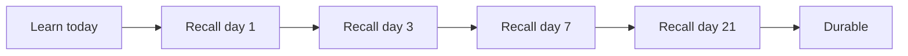

> **What?** Learning how to learn is the meta-skill of acquiring engineering skill *efficiently* — knowing which study methods actually build durable knowledge and which only feel productive.
> **How?** As a junior you use evidence-based techniques (active recall, spacing, the Feynman test) instead of passive re-reading, and you escape "tutorial hell" by building real things from incomplete knowledge.

---

## 1. The Core Problem: Effort vs. Feeling

The single biggest trap for a new engineer is confusing *feeling productive* with *learning*. Re-watching a tutorial, re-reading the docs, and highlighting a blog post all feel smooth and pleasant — and that smoothness is exactly the warning sign. Cognitive psychologists call this **fluency illusion**: when material flows easily, your brain mistakes "this is familiar" for "I know this."

Real learning feels harder. It involves struggling to recall, getting things wrong, and being a little confused. Researchers Roediger and McDaniel call these **desirable difficulties** — effort that slows you down in the moment but makes the memory stick (summarized in their book *Make It Stick*, 2014).

| Feels productive (often isn't) | Actually builds skill (often uncomfortable) |
| --- | --- |
| Re-reading the same chapter | Closing the book and writing what you remember |
| Re-watching a video | Pausing and predicting the next line of code |
| Copying tutorial code line by line | Typing it from memory, then diffing |
| Highlighting | Explaining the concept out loud to nobody |

> **Rule of thumb:** if your study session felt effortless, you probably didn't learn much.

---

## 2. Active Recall: Test Yourself, Don't Re-Read

The most robust finding in all of learning science is the **testing effect** (also called retrieval practice): *the act of pulling information out of your memory strengthens it more than putting information in.*

In a landmark study, Roediger & Karpicke (2006) had students study a passage. One group re-read it; another group read it once then tried to recall it. On a test a week later, the recall group dramatically outperformed the re-readers — even though the re-readers felt more confident.

**What this means for you as a junior:**

- After reading about, say, how a `for` loop works, *close the page* and write the syntax from memory.
- After a tutorial on HTTP, ask yourself: "What are the parts of a request? What does a 404 mean? A 500?" — answer out loud *before* checking.
- Turn documentation into questions: "What's the difference between `==` and `===`? What does `git rebase` do?"

```
# Bad: passive
read docs -> nod -> "makes sense" -> forget by tomorrow

# Good: active recall loop
read docs -> close docs -> "what did that say?" -> struggle -> check -> repeat
```

The struggle to retrieve *is* the learning. If you can't recall it, you never really had it.

---

## 3. Spacing: Spread Study Over Time

The second rock-solid finding is the **spacing effect**: the same total study time produces far more durable memory when *spread across days* instead of crammed into one session.

Cramming the night before works for tomorrow's quiz and is forgotten by next week. Spacing means revisiting a topic after 1 day, then 3 days, then a week. Each time you almost-forget and then recall, the memory gets stronger and the next interval can be longer.



For an engineer this rarely means literal flashcards (more on that in [middle.md](middle.md)). It means: don't try to absorb a whole framework in one weekend. Learn a piece, *use it*, come back tomorrow, use it again. Spaced *practice* beats massed reading.

---

## 4. The Feynman Technique: Explain It Simply

Named after physicist Richard Feynman, this is the fastest way to find the holes in your understanding:

1. Pick a concept (e.g., "what is a REST API?").
2. Explain it in plain words, as if to a smart 12-year-old — out loud or in writing.
3. Wherever you get stuck, stumble, or fall back on jargon you can't unpack — **that's a gap.**
4. Go back to the source, fill the gap, and explain again.

The magic is in step 3. You *cannot* fake your way through a simple explanation. The moment you say "and then it... uses the... protocol thing" you've found exactly what you don't actually understand.

> Try it now: explain "what happens when you type a URL and press Enter" out loud. The places you hand-wave are your study list.

This pairs naturally with [first-principles thinking](../../05-first-principles-thinking/) — both force you down to the level where you genuinely understand the parts.

---

## 5. Escaping Tutorial Hell

**Tutorial hell** is the state where you complete tutorial after tutorial, feel like you're learning, but freeze the moment you face a blank file with no one guiding you. It's a direct consequence of the fluency illusion: following a tutorial is *recognition*, not *recall*.

The cure is to manufacture desirable difficulty:

| Stuck in tutorial hell | Way out |
| --- | --- |
| Following along, all green | Pause, predict each next step before the instructor does |
| Copying the to-do app exactly | Build the *same* app from scratch with the tutorial closed |
| Starting a new tutorial when stuck | Push through the discomfort; Google the *specific* error |
| Tutorial covers everything | Pick a small project the tutorial *didn't* cover and build it |

A good test: **can you build a slightly different version without the tutorial open?** If yes, you learned it. If you need the tutorial open, you were watching, not learning.

```
The goal of a tutorial is not to finish the tutorial.
It is to be able to do something the tutorial did not show you.
```

---

## 6. "Learning Styles" Are a Myth

You will hear that you're a "visual learner" or an "auditory learner" and should study accordingly. **This is not supported by evidence.** A major review by Pashler et al. (2008) found no credible studies showing that matching teaching to a supposed learning style improves outcomes.

What's true instead: the *best* way to learn depends on the **material**, not on you. You learn geometry visually because geometry is visual; you learn pronunciation by listening because sound is auditory. So don't avoid reading because you "aren't a reader" — for code, you must read and write code. Multiple modes (read it, say it, draw it, build it) help everyone, regardless of "style."

---

## 7. Just-In-Time Learning

As a junior you cannot learn everything up front, and you shouldn't try. Prefer **just-in-time** learning: learn the thing *when a real task needs it.* Need to read a config file? Learn just enough about that file format now. You'll remember it because you immediately *used* it — which combines recall, application, and relevance all at once.

This beats trying to memorize the whole language reference "just in case." Save deep, broad study for fundamentals that you'll use constantly (your language's core, version control, how the web works).

---

## 8. A Junior's Weekly Learning Loop

A concrete, low-overhead routine:

1. **Monday:** Pick *one* small concept or skill for the week.
2. **Each day:** Learn a piece → close the source → recall it → *use it in code.*
3. **When stuck:** explain the problem out loud (Feynman). Often you solve it mid-explanation — this is "rubber duck debugging," covered in [debugging your own reasoning](../02-debugging-your-own-reasoning/).
4. **Friday:** Build something tiny that uses the week's concept *without* a guide.
5. **Next week:** Briefly recall last week's concept before starting the new one (spacing).

---

## 9. Key Takeaways

- **Feeling fluent ≠ learning.** Smooth study is a warning sign.
- **Active recall** (test yourself) beats re-reading — this is the strongest result in learning science.
- **Spacing** beats cramming for the same total time.
- **Feynman:** explain it simply; your stumbles are your study list.
- **Escape tutorial hell** by building things the tutorial didn't show you.
- **Learning styles are a myth** — match the method to the material.
- Learn **just in time** for real tasks; you'll remember what you use.

Next, [middle.md](middle.md) goes deeper into spaced repetition tooling, where flashcards help an engineer (and where they don't), and reading code you didn't write.

**See also:** [Deliberate practice](../03-deliberate-practice/) · [Knowing what you don't know](../04-knowing-what-you-dont-know/) · [Section overview](../) · [Roadmap root](../../README.md)
