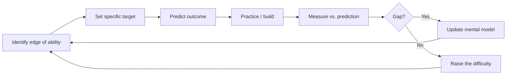

> **What?** At the senior level, learning how to learn is a *managed capability*: deliberate practice with engineered feedback, deliberate cultivation of transfer, and conscious management of the breadth/depth (T-shaped) tradeoff under real delivery constraints.
> **How?** You design practice at the edge of your ability, build feedback loops where the world doesn't give you one for free, exploit transfer to ramp fast on new technologies, and decide *what not to learn* as carefully as what to learn.

---

## 1. Deliberate Practice vs. Mindless Repetition

The most-cited and most-misunderstood idea in skill acquisition is **deliberate practice**, from Anders Ericsson's research (the body of work behind the misquoted "10,000 hours"). His central finding: *experience alone does not produce expertise.* People with 20 years of experience are often no better than people with 5 — because they spent 19 years repeating what they already could do.

Deliberate practice has specific, demanding features:

| Mindless repetition | Deliberate practice |
| --- | --- |
| Comfortable, automatic | At the **edge of your ability** — effortful, error-prone |
| No specific goal | A **specific, measurable** target ("cut this query's p99 in half") |
| No feedback, or delayed | **Immediate, accurate feedback** |
| Whole task, vaguely | **Isolates the weak sub-skill** and drills it |
| Doing your job | Reaching *beyond* your current job |

The brutal corollary: **just doing your job is not deliberate practice.** Shipping features you already know how to ship keeps you on a plateau. Growth requires deliberately taking on the thing you're *not* yet good at — the unfamiliar subsystem, the language you avoid, the design you don't know how to do.

This topic is large enough to have its own treatment — see [deliberate practice](../03-deliberate-practice/). The senior-specific insight is below.

---

## 2. Engineering Feedback Loops (Where the World Won't Give You One)

Ericsson's hardest requirement is **immediate, accurate feedback** — and in real engineering, most feedback is absent, delayed, or noisy. A design decision's consequences may not surface for a year. A "successful" deploy might be hiding a latent bug. Praise in code review is often politeness, not signal.

Senior engineers *manufacture* feedback loops:

- **Tighten the loop in time.** Tests, type checkers, and linters turn a year-long feedback delay into seconds. A fast test suite is a learning instrument, not just a safety net.
- **Predict, then measure.** Before a change, write down your prediction ("this will drop CPU 30%"). Then measure. The *gap* between prediction and reality is your highest-value learning — it directly attacks your mental model's errors. A model that's never tested against reality silently rots.
- **Seek disconfirming feedback.** Ask reviewers "where is this wrong?" not "does this look okay?" Calibrating your own confidence is the subject of [knowing what you don't know](../04-knowing-what-you-dont-know/).
- **Post-mortems as practice.** An incident review with no blame is a feedback loop on your collective mental model of the system. Skipping the "why didn't we see it coming" question wastes the most expensive lesson you'll ever get.
- **Production is the ultimate oracle.** Observability (metrics, traces, logs) is how a senior engineer gets feedback on decisions whose effects are otherwise invisible.

> A senior engineer's superpower isn't more knowledge — it's having built faster, truer feedback loops than everyone around them, so they learn from each cycle while others repeat the same cycle blindly.

---

## 3. Transfer: Why the Second Language Is Faster

Why does learning your second programming language take a fraction of the time of the first? **Transfer** — the carry-over of learning from one domain to another. Cognitive science distinguishes:

- **Near transfer:** between similar situations (Python → Ruby). Reliable and strong.
- **Far transfer:** between dissimilar situations (chess → business strategy). Real but weak and unreliable; don't over-promise it.

What actually transfers in engineering is the **deep structure**, not the surface syntax:

| Surface (doesn't transfer) | Deep structure (transfers strongly) |
| --- | --- |
| `for` loop syntax | The *concept* of iteration |
| `async/await` keywords | Concurrency, blocking vs. non-blocking, shared state |
| A specific ORM's API | Relational modeling, N+1 queries, transactions |
| One message broker's config | At-least-once delivery, idempotency, backpressure |

**Senior implication:** learn the deep structure on purpose, because that's the part that compounds. When you learn Kafka, the durable lesson isn't Kafka's API — it's the *model* of partitions, ordering, and consumer groups, which transfers to Kinesis, Pulsar, and the next thing. When you ramp on a new language, spend your effort on its *model* (memory, concurrency, error handling) and treat syntax as a lookup table. This is why a senior engineer can be productive in an unfamiliar language in days: most of what they "know" was never about the language.

To deliberately build transfer: when you learn something, *abstract the principle.* Ask "what is the general version of this?" and "where else does this pattern appear?" That abstraction step is what makes knowledge portable.

---

## 4. Breadth vs. Depth: Becoming T-Shaped

You cannot be deep in everything; time is finite. The **T-shaped** model resolves this:

```
  breadth: working literacy across many areas
 ┌──────────────────────────────────────────┐
 │  networking  DBs  frontend  security  ... │
 └──────────────────────────────────────────┘
                    │
                    │  depth: genuine
                    │  expertise in one
                    │  (or a few) areas
                    │
```

- The **horizontal bar** is broad literacy: enough about many areas to collaborate, evaluate, and know *when to go deep or pull in an expert*.
- The **vertical bar** is true depth in one area where you're a go-to authority.

Senior engineers manage this portfolio consciously:

- **Depth is what makes you valuable and hard to replace**; it's also where transfer-able deep structure is forged. A weekend in ten frameworks teaches less than truly mastering one.
- **Breadth is what makes you *useful* across a system** and lets you make good cross-cutting decisions. It also tells you *what you don't know*, which is when to defer.
- The bar of the T should **move over a career.** Today's deep specialty becomes tomorrow's breadth as you grow a new spike. Some senior engineers become "Pi-shaped" or "comb-shaped" with multiple spikes.

**The anti-pattern is being all-breadth, no-depth** — able to talk about everything, trusted to own nothing. The opposite anti-pattern (all-depth, no-breadth) makes you brilliant but unable to operate outside a narrow box. Calibrate against your role and team.

---

## 5. Deciding What *Not* to Learn

Under delivery pressure, learning competes with shipping. A senior engineer's scarce resource is attention, so *deliberately not learning things* is a core skill:

- **Half-life test.** How long until this knowledge is obsolete? Foundations (data structures, how networks fail, your domain) have a long half-life; a specific tool's v3 config has a short one. Invest in long-half-life knowledge.
- **Frequency × cost-of-not-knowing.** Learn deeply what you hit often *and* what's expensive to get wrong. The rare-and-cheap quadrant: just look it up.
- **Buy vs. build the knowledge.** Sometimes the right move is to *not* become the expert and instead pull one in, or pick a managed service so the knowledge isn't yours to own.
- **Beware shiny-object learning.** New frameworks are exciting and feel like progress; most won't outlive the hype. A senior filters trends through "does this solve a problem I actually have?"

> Saying "I'm choosing not to learn that deeply right now" is a senior move, not a failure. The junior tries to learn everything; the senior allocates a finite learning budget on purpose.

---

## 6. Learning a Large, Unfamiliar Codebase (Senior Depth)

Beyond the middle-level outside-in approach, a senior treats codebase onboarding as a *systematic investigation*:

1. **Map before you dive.** Build a one-page diagram of the major components and data flows *first*. The map is the schema that everything else hangs on (chunking applied to a system).
2. **Learn the "why," not just the "what."** Read ADRs, design docs, and `git log`/blame on the gnarly files. Code tells you *what*; history tells you *why*, and the *why* is what you actually need to change it safely.
3. **Find the load-bearing walls.** Which modules does everything depend on? Where are the abstractions that, if you misunderstand them, you'll get everything wrong? Identify them early.
4. **Change something small and ship it.** Nothing teaches a codebase like a real (small) change through the full build/test/review/deploy loop. This is just-in-time learning with a real feedback loop attached.
5. **Talk to the humans.** The map in a senior colleague's head is the highest-bandwidth source you have. Ask "what surprised you about this code?" and "what's scary to change?"

---

## 7. The Senior's Meta-Loop



The loop never "completes" — when something becomes comfortable, that's the signal to move the difficulty up, because comfort means you've stopped learning.

---

## 8. Key Takeaways

- **Deliberate practice** (Ericsson): edge of ability + specific goal + immediate feedback. *Doing your job ≠ practicing.*
- Seniors **manufacture feedback loops** where reality is silent — tests, predict-then-measure, post-mortems, observability.
- **Transfer** is real for *deep structure*, weak for surface; learn the model, treat syntax as lookup. This is why your Nth language is fast.
- Be **T-shaped**: broad literacy + real depth; move the bar over time; avoid all-breadth-no-depth.
- **Decide what not to learn** using half-life and frequency × cost; protect a finite learning budget under delivery pressure.
- Onboard a big codebase by **mapping, learning the *why*, and shipping a small change** through the full loop.

Next, [professional.md](professional.md) covers learning at staff/principal scale: ramping on huge unfamiliar systems fast, sustaining learning under pressure, and multiplying learning across a team.

**See also:** [Deliberate practice](../03-deliberate-practice/) · [Knowing what you don't know](../04-knowing-what-you-dont-know/) · [First-principles thinking](../../05-first-principles-thinking/) · [Section overview](../) · [Roadmap root](../../README.md)
