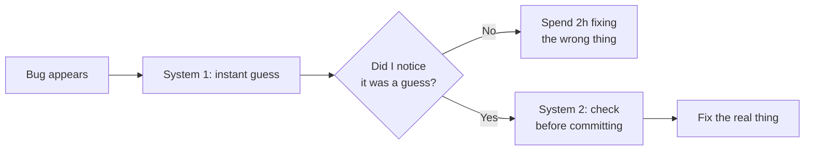
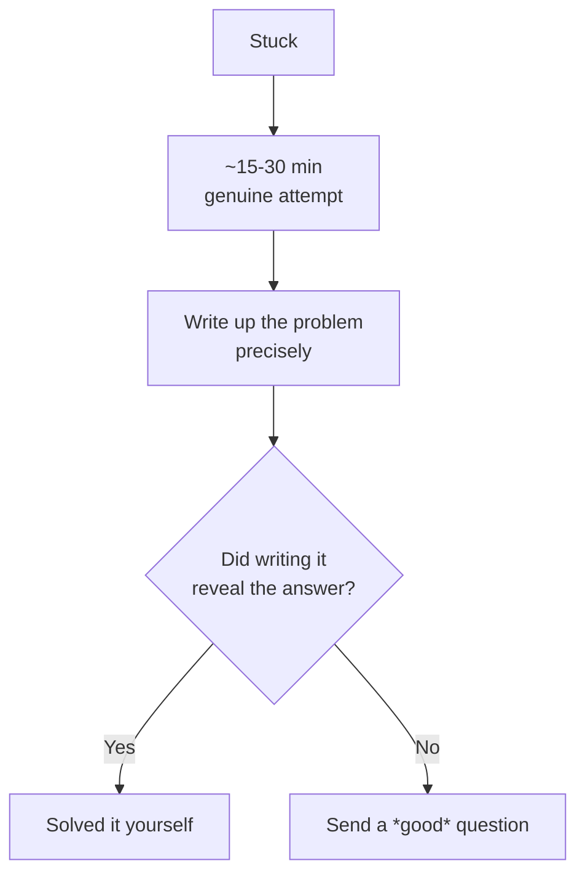

> **What?** Debugging your own reasoning is the habit of treating your *thinking* as a system that has bugs — and inspecting it the same way you inspect code. At the junior level it means one core move: noticing the gap between *feeling sure* and *being right*, and adding a cheap check before you act on a belief.
> **How?** You slow down at the moment you feel certain, articulate your assumption out loud (or to a rubber duck), and ask "what would prove me wrong?" before you spend an hour on a fix that was never going to work.

---

## 1. Your brain runs two systems

Daniel Kahneman (*Thinking, Fast and Slow*, 2011) describes two modes of thinking:

| | **System 1** | **System 2** |
|---|---|---|
| Speed | Instant | Slow |
| Effort | None | Tiring |
| Example | "The bug is in the parser" (gut) | Reading the stack trace line by line |
| Failure mode | Confidently wrong | Lazy (doesn't kick in) |

The trap for new engineers: **System 1 fires first and feels like knowledge.** The thought *"oh, it's obviously the cache"* arrives fully formed, dressed up as a conclusion, when it is really a guess. You don't get a warning label that says "this is a hunch." It just feels true.

The whole skill at this level is learning to *notice* when you're on autopilot and deliberately hand the problem to System 2.



### A concrete tell

If you can finish the sentence "It's *obviously* the..." before you've read the error message, that's System 1 talking. "Obviously" is your signal to stop and verify.

---

## 2. The feeling of certainty is not evidence

You can feel 100% sure and be 100% wrong. Certainty is an *emotion*, not a measurement. Your brain generates it from familiarity and fluency, not from facts.

Try this: explain, out loud, *exactly* how a hash map gives O(1) lookup — the actual mechanism, hashing to a bucket, collisions, resizing. Most juniors who "know how hash maps work" stall halfway through. That stall is the bug.

This is the **illusion of explanatory depth** (Rozenblit & Keil, 2002): people believe they understand things in far more detail than they actually do, and they only discover the gap when forced to explain. You don't know what you don't know *until you try to say it.*

> **Junior rule of thumb:** Before you say "I understand," try to *explain it*. If you can't explain it without hand-waving, you don't understand it yet — and that's fine, you just found the next thing to learn.

---

## 3. Rubber-duck debugging

The classic technique from *The Pragmatic Programmer* (Hunt & Thomas): when stuck, explain your code, line by line, to a rubber duck on your desk. Astonishingly often, you solve the bug *mid-sentence*, before the duck "answers."

Why it works: **silent thinking lets you skip steps; speaking forces you to make every step explicit.** The bug usually hides in a step you were skipping — an assumption you never said out loud because it felt too obvious to mention.

```
You (to duck): "So this function takes the user list, filters
the active ones, and... wait. I'm filtering on `is_active`
but the API field is `active`. That's the bug."
```

You don't need a literal duck. A teammate, a Slack draft you never send, or a comment block you delete afterward all work. The medium doesn't matter; the **forced articulation** does.

### Try it before you ask for help

Half the questions you're about to ask a senior, you'll answer yourself the moment you type them out fully. (More on this in §6.)

---

## 4. Writing reveals the gap

Speaking forces articulation; *writing* forces it even harder, because writing is slower and you can re-read it. The act of writing a clear sentence exposes muddy thinking — if you can't write it clearly, you weren't thinking clearly.

Use this on:

- **Bug reports** — "I expected X, I got Y, here's the minimal repro." Writing the minimal repro often *is* the diagnosis.
- **Questions** — drafting a precise question forces you to gather the context you skipped.
- **PR descriptions** — explaining *why* you made a change reveals when you don't actually have a reason.

> Writing is thinking made visible. A confused paragraph is a confused thought you can now see and fix.

---

## 5. "What would convince me I'm wrong?"

This is the single most valuable reflex to build early. Before acting on a belief, ask: **what's the cheapest experiment that would tell me I'm wrong?**

- *"The bug is in the API."* → Cheapest check: log the raw response. One line. 30 seconds.
- *"This will be slow."* → Cheapest check: time it on real-ish data before optimizing.
- *"Users will love this."* → Cheapest check: ask one user.

This flips you from defending a belief to *testing* it. A scientist who only looks for evidence that confirms them isn't doing science — and neither are you when you only look for proof that your guess was right. (This is **confirmation bias**; see [cognitive biases in code decisions](../../04-critical-thinking/03-cognitive-biases-in-code-decisions/).)

### The disconfirming test first

When debugging, design the check that would *disprove* your theory, not the one that would confirm it. "Print the variable I think is wrong" beats "re-run the thing I think is right."

---

## 6. The 15–30 minute rule

When to ask for help is itself a reasoning skill. A useful default:

> **Struggle on your own for ~15–30 minutes. Then ask — but ask *well*.**

- **Under 15 min:** you haven't tried enough; asking now wastes a senior's time and your own learning.
- **Over ~30 min stuck with no new ideas:** you're now spinning. Continuing isn't grit, it's stubbornness, and you may be burning a whole afternoon on something a teammate solves in a sentence.

The magic part: **stating the problem well often solves it.** When you write up "here's what I tried, here's what I expected, here's what happened," you frequently spot the answer in your own write-up before you hit send. That's rubber-ducking (§3) wearing a different hat. So the help request is never wasted — even if you don't send it.



---

## 7. You reason worse when tired

Your reasoning is not a constant — it degrades. System 2 is metabolically expensive, so when you're tired, hungry, stressed, or it's 6pm on a Friday, your brain quietly falls back to lazy System 1. You make worse calls and *don't notice* you're making them.

Junior-level countermeasures:

- **Don't debug angry or exhausted.** The bug will still be there after a break. A 10-minute walk genuinely beats another hour of staring.
- **Sleep on hard problems.** "I'll figure it out tomorrow morning" is a legitimate engineering strategy, not laziness.
- **Notice when you're guessing because you're tired**, not because you have a theory.

---

## 8. Putting it together: a tiny checklist

Tape this to the inside of your skull:

1. **Did I just guess?** (System 1 fired) → verify before acting.
2. **Could I explain this out loud?** → if not, I don't understand it yet.
3. **What would prove me wrong?** → run *that* check first.
4. **Have I been stuck >30 min?** → write it up; ask if still stuck.
5. **Am I tired/frustrated?** → take a break; don't trust this version of me.

You don't need all of these every time. Pick the one that fits the moment. The goal is simply to insert a *pause* between "I feel sure" and "I act," because that pause is where almost every avoidable mistake gets caught.

---

## Where this goes next

- Building the *habit* of these checks deliberately → [Deliberate practice](../03-deliberate-practice/)
- Mapping the edges of your knowledge → [Knowing what you don't know](../04-knowing-what-you-dont-know/)
- The structured version of all this in debugging → [Debugging as problem-solving](../../02-problem-solving/05-debugging-as-problem-solving/)
- How learning itself works → [Learning how to learn](../01-learning-how-to-learn/)
- Back to [Metacognition & learning](../) · [Engineering Thinking](../../README.md)
