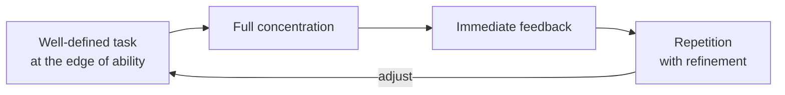
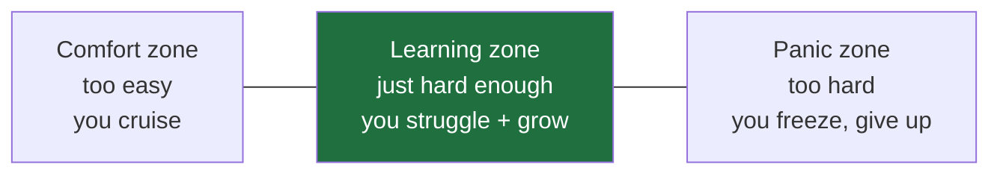

> **What?** Deliberate practice is the specific, effortful, feedback-driven kind of practice that actually builds skill — as opposed to just "doing the job" or "putting in hours." It means working on a narrow, well-defined task that sits just past what you can already do, getting immediate feedback on each attempt, and repeating with small corrections until the new ability sticks.
>
> **How?** As a junior, you pick one concrete weakness, turn it into a small repeatable exercise (a "kata"), do short focused reps with a way to check yourself (tests, a stronger reviewer, a known-correct solution), and refine each time. The goal is not to finish work — it's to get measurably better at one thing.

---

## 1. The trap: hours are not the same as skill

Most people assume that if you do a job for years, you automatically get good at it. You don't. You get good at the parts you repeatedly do *with attention and feedback*, and you plateau on everything else the moment it becomes "good enough."

This is the difference between two engineers who both have "5 years of experience":

| Engineer A | Engineer B |
|---|---|
| Wrote roughly the same kind of CRUD endpoint 500 times | Wrote 100 endpoints, but deliberately learned a new error-handling pattern, a new testing style, profiling, and SQL tuning along the way |
| 5 years of experience | 1 year of experience, repeated 5 times |
| Comfortable, fast at the familiar | Still slow on the familiar sometimes — because they keep reaching past it |

The phrase to remember: **"Ten years of experience is often one year of experience repeated ten times."** The cure is to deliberately keep pushing the edge instead of settling into the comfort of the already-known.

## 2. Where the idea comes from (so you cite it correctly)

The research term is **deliberate practice**, defined by psychologist **K. Anders Ericsson** and colleagues in the 1993 paper *"The Role of Deliberate Practice in the Acquisition of Expert Performance."* Ericsson studied violinists, chess players, athletes, and surgeons, and found that the *top* performers weren't just doing more of the activity — they were doing a particular kind of structured, effortful practice.

You've probably heard **"10,000 hours"** from Malcolm Gladwell's book *Outliers* (2008). That number is a popularization — and a distortion. Ericsson publicly objected to it. The real claim is **not** "anyone who logs 10,000 hours becomes an expert." The real claim is:

- The *amount* of accumulated **deliberate** practice (not just total time) correlates with expertise.
- 10,000 was a rough *average* among elite violinists, not a magic threshold.
- Hours of *unfocused, feedback-poor* activity barely count.

So when someone says "I have 10,000 hours of coding," the right question is: *how many of those hours were deliberate?*

## 3. The four ingredients (Ericsson)

Real deliberate practice has all four. Drop one and it degrades into ordinary "doing stuff."



1. **A well-defined task at the edge of your ability.** Specific, with a clear "did I do it right?" — and slightly *harder* than what you can comfortably do.
2. **Full concentration.** Short and intense beats long and distracted. You cannot deliberately practice while half-watching a video.
3. **Immediate feedback.** You must find out *quickly* whether each attempt was right, ideally per-attempt. No feedback = no improvement.
4. **Repetition with refinement.** Not mindless repetition — each rep tries to fix the specific mistake from the last one.

## 4. Your first kata

A **kata** (borrowed from martial arts; popularized for programming by **Dave Thomas** of *The Pragmatic Programmer*) is a small coding exercise you do repeatedly to drill a skill. The classic one is **FizzBuzz** — print numbers 1 to 100, but "Fizz" for multiples of 3, "Buzz" for multiples of 5, "FizzBuzz" for both.

The point of a kata is **not** to solve it once. It's to solve the *same* problem several times, each time deliberately changing *how*.

```text
Rep 1  — Solve it the obvious way. Time yourself.
Rep 2  — Solve it again from a blank file (no peeking). Faster? Cleaner?
Rep 3  — Solve it with NO if/else (use a lookup, or string building).
Rep 4  — Solve it test-first: write the test, watch it fail, then code.
Rep 5  — Solve it under a constraint: no mutable variables.
```

Each rep gives you immediate feedback (it runs, the test passes or fails) and forces refinement (a new constraint each time). You'll learn more about your language from doing FizzBuzz five different ways than from doing five different toy problems once each.

```python
# Rep 3 — no if/else, immediate feedback via assert
def fizzbuzz(n: int) -> str:
    return ("Fizz" * (n % 3 == 0) + "Buzz" * (n % 5 == 0)) or str(n)

assert fizzbuzz(3) == "Fizz"
assert fizzbuzz(5) == "Buzz"
assert fizzbuzz(15) == "FizzBuzz"
assert fizzbuzz(7) == "7"
print("all passed")  # ← immediate feedback
```

## 5. The three zones: comfort, learning, panic

Skill grows only in the middle zone.



- **Comfort zone:** you already know how. Doing more of it feels productive but teaches nothing. (Re-implementing the same login form you've built ten times.)
- **Learning zone:** hard enough that you make mistakes and have to concentrate, but not so hard you flail. *This is where deliberate practice lives.*
- **Panic zone:** so far beyond you that you can't even tell right from wrong. (A total beginner trying to read a distributed-consensus paper.) You'll get demoralized and learn little, because you can't process the feedback.

A junior's most common mistake is staying in the comfort zone because it *feels* good. Your job is to deliberately step one notch into the learning zone — and step back from the panic zone when you've overreached.

## 6. Why feedback-poor practice doesn't improve you

You can practice the *wrong* thing 1,000 times and only get good at being wrong. Feedback is what turns repetition into improvement. As a junior, your sources of immediate feedback are:

| Feedback source | What it catches | Speed |
|---|---|---|
| **Automated tests** | Wrong behavior, broken edge cases | Seconds |
| **The compiler / type checker** | Type errors, mistakes in API usage | Seconds |
| **A reference solution** | "There was a cleaner way" | Minutes |
| **A code reviewer / mentor** | Style, design, things you can't see yourself | Hours/days |
| **A linter / formatter** | Conventions, smells | Seconds |

The fastest, cheapest feedback loop you control is **tests**. Writing a test *before* you write the code (so you have a clear target and instant pass/fail) is one of the most concrete forms of deliberate practice available to a junior.

## 7. Make it sustainable: small daily reps

You do not need an hour. Deliberate practice is intense, so it's naturally short. A sustainable junior routine:

- **15–20 minutes**, before or after work, on **one** kata or one skill.
- **Same time each day** so it becomes a habit, not a decision.
- **Log it.** A one-line note: *"FizzBuzz, no-if version, 6 min, learned `or` short-circuit trick."*

Twenty focused minutes a day, refined and logged, will outrun three unfocused hours on a weekend.

## 8. A starter regimen (copy this)

```text
Goal for this month: get fluent in writing tests.

Daily (15 min):
  Mon — kata: FizzBuzz, test-first
  Tue — kata: string reverse, test-first, handle empty/unicode
  Wed — re-solve Monday's kata from blank file, faster
  Thu — read one well-tested file in a library, copy its test style
  Fri — kata of choice, but write the test BEFORE the code

Feedback: tests must run; if you can, ask a senior to glance at Friday's.
Log: one line per day — what you tried, what you learned.
```

## 9. Pitfalls to avoid as a junior

- **Mistaking activity for practice.** Watching tutorials and copying along is consumption, not deliberate practice. You must *struggle to produce* the answer yourself.
- **No feedback loop.** If you can't tell whether a rep was good, it isn't deliberate practice.
- **Staying comfortable.** If it feels easy, it's not building skill.
- **Going too big.** "Build a whole app" is a project, not a practice rep. Practice targets *one* narrow skill.
- **Only katas, never real work.** Katas are a gym, not the game (see the senior file on transfer limits).

---

## Where to go next

- [Learning how to learn](../01-learning-how-to-learn/) — the broader skill-acquisition toolkit that deliberate practice fits inside.
- [Knowing what you don't know](../04-knowing-what-you-dont-know/) — how to find the weaknesses worth practicing.
- [Section overview](../) — metacognition and learning.
- [Engineering Thinking root](../../README.md)
