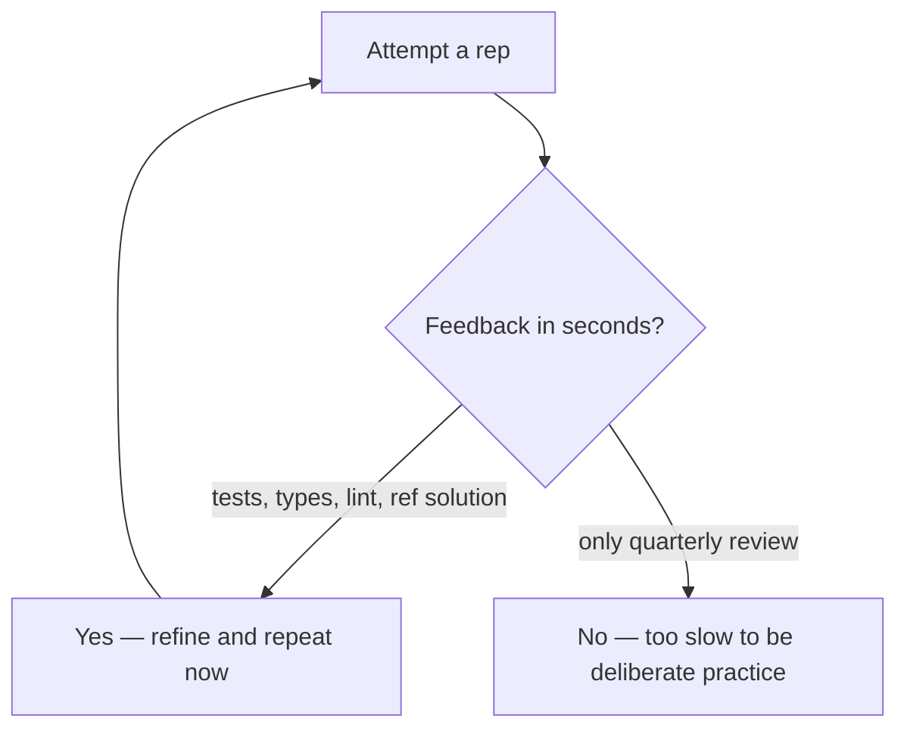

> **What?** Deliberate practice is the deliberate, structured pursuit of a *specific* improvement: you isolate a weakness, design a repeatable exercise that targets it at the edge of your ability, wire in fast feedback, and refine across reps. For a mid-level engineer the key move is going from "I practice by doing my job" to "I have a named skill I'm improving and a loop that proves it's improving."
>
> **How?** You audit your real work for the things you're slow, sloppy, or fearful at; convert each into a drill (rewriting the same problem multiple ways, reimplementing great code, deconstructing expert solutions, constraint practice); attach a feedback source faster than your next performance review; and keep yourself in the learning zone instead of the comfort zone where most mid-level careers quietly stall.

---

## 1. The mid-level plateau is the default outcome

Most engineers improve fast for ~2 years, then flatten. Not because they hit a talent ceiling — because the job stops *forcing* improvement. Once you can ship features without breaking things, you've reached "good enough," and good enough is a comfort zone. Ericsson's research (the 1993 paper, expanded in *Peak*, 2016) is blunt about this: **once a skill becomes automatic and acceptable, ordinary experience stops improving it.** Doctors with 20 years of practice are sometimes *worse* at certain diagnoses than recent graduates, because they've been running on autopilot.

The autopilot test:

> If a task no longer requires concentration, you are no longer learning from it.

Mid-level is exactly the career stage where autopilot sets in. Deliberate practice is how you opt out.

## 2. Auditing your work for practice targets

You can't practice "be a better engineer." That's not a task. Deliberate practice needs a **well-defined** target. Mine your real work:

| Symptom in real work | The skill underneath | Drill it becomes |
|---|---|---|
| You reach for the debugger before reading the code | Reading code, forming hypotheses | Debug-by-reasoning kata (no debugger) |
| Your PRs come back with "can this be simpler?" | Design, decomposition | Re-solve the same feature 3 ways, pick the simplest |
| You're slow writing SQL by hand | Query fluency | Daily query kata against a sample DB |
| Tests feel like a chore you add last | Test design | Test-first reps on small problems |
| You freeze when reading an unfamiliar codebase | Code comprehension | Read + summarize one library module/day |
| Code reviews you give are shallow ("LGTM") | Critical reading | Deconstruct one merged PR per week |

The pattern: **a recurring weakness in real work → a narrow, repeatable drill.** Pair this with [knowing what you don't know](../04-knowing-what-you-dont-know/) to surface blind spots you wouldn't list yourself.

## 3. The core mid-level techniques

### 3.1 Rewrite the same problem multiple ways

Pick one problem; solve it 4–5 times under different constraints. The variation, not the problem, is the teacher.

```text
Problem: parse a CSV line into fields, respecting quotes.

Rep 1 — Naïve split on commas. Watch it break on "a,b","c".
Rep 2 — Hand-rolled state machine, char by char.
Rep 3 — Same, but make illegal states unrepresentable (typed states).
Rep 4 — Streaming version: never hold the whole line in memory.
Rep 5 — Property-test it: round-trip encode(decode(x)) == x.
```

You now understand CSV parsing — and state machines, and streaming, and property testing — far more deeply than someone who imported a library once.

### 3.2 Read great code, then reimplement it

Pick a small, well-regarded piece of code (a stdlib function, a famous library's core). **Read it until you understand it. Close it. Reimplement from memory and intent.** Diff yours against the original.

The diff *is* the feedback. Every place you diverged is a decision the experts made that you didn't — go understand why. This is how you absorb expert judgment, not just expert output.

> Good targets: a small parser, an LRU cache, a `errgroup`/promise-pool, a ring buffer, a debounce/throttle, a retry-with-backoff. Small enough to hold in your head, rich enough to have real design.

### 3.3 Deconstruct expert solutions

When you see code (or a PR, or a system design) that's clearly better than what you'd have written, don't just admire it — **take it apart.** Ask:

- What problem were they actually solving (including the ones I didn't notice)?
- What did they *choose not* to do, and why?
- What would break if I removed each piece?

Write the answer down. This trains design judgment, which no kata gives you directly.

### 3.4 Constraint practice

Constraints force you off your habitual path and into the learning zone:

| Constraint | Skill it forces |
|---|---|
| **No mouse** (keyboard-only) | Editor/IDE fluency, navigation speed |
| **No debugger** | Reasoning about code from reading (see [debugging your own reasoning](../02-debugging-your-own-reasoning/)) |
| **No stdlib** (implement `map`, `sort`) | Understanding what the abstractions actually cost |
| **No autocomplete / no AI** | Real recall of the API, not pattern-matching |
| **Time-boxed** (15 min hard stop) | Decisiveness, MVP thinking |
| **One file, no internet** | Self-sufficiency under pressure (interview-like) |

## 4. Feedback loops a mid-level engineer can actually build

Feedback is the ingredient most people skip, and skipping it is why their practice doesn't compound. Build loops fast enough to correct the *current* rep, not the next quarter.



| Loop | Latency | Build it by |
|---|---|---|
| Tests / property tests | seconds | Write the oracle before the code |
| Reference diff | minutes | Reimplement great code, diff it |
| A stronger reviewer | hours | Ask a senior for *targeted* feedback, not "is this fine?" |
| Recording yourself | minutes | Screen-record a kata, watch where you stalled |
| A coach / pairing | live | Pair with someone better and ask them to call your mistakes |

The most underused mid-level loop is **a stronger reviewer asked a sharp question.** "LGTM?" gives you nothing. "I chose a state machine over regex here — what would you have done and why?" gives you expert feedback aimed exactly at your practice target.

## 5. Staying in the learning zone

The zones (comfort / learning / panic) are a dial you actively manage:

- **Drifted into comfort?** The rep feels easy and you stopped concentrating. → Add a constraint (Section 3.4) or raise the bar.
- **Slipped into panic?** You can't tell good from bad; you're guessing. → Shrink the task, add scaffolding, or pick an easier target until you can process feedback again.

A practical heuristic: **you should fail or struggle on roughly a third of your reps.** All-success means too easy; all-failure means too hard.

## 6. The transfer problem (don't over-trust katas)

Katas are toy problems. Real systems have legacy code, unclear requirements, concurrency, flaky networks, and humans. Skill on katas **transfers partially** — fluency, recall, and pattern vocabulary carry over; large-scale design judgment does not, because katas have none.

So as a mid-level engineer, balance:

- **Gym work (katas, constraints, reimplementation):** builds raw skill fast, safely, repeatably.
- **Game work (deliberate practice *inside* real tasks):** pick one real task this sprint and do it deliberately — try a pattern you don't usually use, ask for targeted review, then reflect on it.

Neither alone is enough. The senior file goes deeper on transfer limits.

## 7. A 4-week mid-level regimen

```text
Theme: become fast and fearless at reading unfamiliar code.

Week 1 — Reimplement: pick a small stdlib function/day, read → reimplement → diff.
Week 2 — Deconstruct: one merged PR/day in your codebase; write WHY for each choice.
Week 3 — Constraint: debug 3 real bugs this week with NO debugger, reasoning only.
Week 4 — Transfer: on one real task, deliberately apply a design you don't normally use;
         ask a senior a SHARP, targeted question about it.

Daily cap: 25 min focused. Log each rep: target, what failed, what you fixed.
Weekly: re-read your log. What's no longer hard? Raise the bar there.
```

## 8. Pitfalls at this level

- **Practicing what you're already good at** because it feels productive. Practice the embarrassing weakness, not the comfortable strength.
- **"Doing the job" and calling it practice.** Real work is mostly comfort-zone execution. Deliberate practice is a *separate, harder* slice with explicit feedback.
- **Vague feedback.** "Looks good" isn't feedback. Demand specifics or build an oracle.
- **Marathon sessions.** Intensity decays. Short, daily, refined beats long and drifting.
- **Kata monoculture.** Only toy problems → you get great at toys. Mix in deliberate reps inside real work.

---

## Where to go next

- [Senior →](./senior.md) — designing practice for real systems and the limits of transfer.
- [Debugging your own reasoning](../02-debugging-your-own-reasoning/) — the skill behind no-debugger practice.
- [First-principles thinking](../../05-first-principles-thinking/) — for constraint practice like "no stdlib."
- [Section overview](../) · [Engineering Thinking root](../../README.md)
